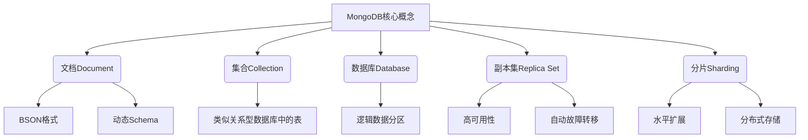
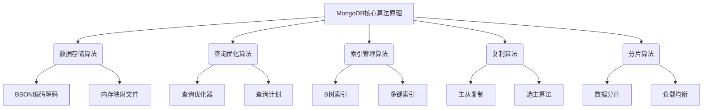

# MongoDB原理与代码实例讲解

## 1. 背景介绍

### 1.1 问题的由来

随着数据量的激增和数据类型的多样化,传统的关系型数据库在存储和处理大规模非结构化数据时遇到了一些挑战。为了更好地应对这些挑战,NoSQL(Not Only SQL)数据库应运而生。MongoDB作为一种领先的NoSQL数据库,凭借其灵活的数据模型、高性能和可扩展性,在各行各业得到了广泛应用。

### 1.2 研究现状  

MongoDB是一种开源的文档型数据库,它使用类似JSON的BSON(Binary JSON)格式来存储数据。与传统关系型数据库不同,MongoDB不需要预先定义数据结构,可以轻松存储各种类型的数据,包括结构化和非结构化数据。这种灵活性使得MongoDB在处理大数据、物联网、内容管理等领域表现出色。

### 1.3 研究意义

深入理解MongoDB的原理和实现细节,对于开发人员来说至关重要。掌握MongoDB的核心概念、数据模型、查询语言、索引机制等,可以帮助开发人员更高效地设计和优化应用程序。同时,通过代码实例,开发人员可以更好地将理论知识付诸实践,加深对MongoDB的理解。

### 1.4 本文结构

本文将从以下几个方面深入探讨MongoDB:

1. 核心概念与联系
2. 核心算法原理与具体操作步骤
3. 数学模型和公式详细讲解与案例分析
4. 项目实践:代码实例和详细解释说明
5. 实际应用场景
6. 工具和资源推荐
7. 总结:未来发展趋势与挑战
8. 附录:常见问题与解答

## 2. 核心概念与联系

MongoDB的核心概念包括文档(Document)、集合(Collection)、数据库(Database)、副本集(Replica Set)和分片(Sharding)。

- **文档(Document)**是MongoDB中的基本数据单元,类似于关系型数据库中的行,但具有更加灵活的数据结构。文档使用类似JSON的BSON格式存储,支持嵌套对象和数组,并且具有动态Schema,允许每个文档拥有不同的字段。
- **集合(Collection)**类似于关系型数据库中的表,用于存储一组相关的文档。集合不需要预先定义Schema,可以直接插入不同结构的文档。
- **数据库(Database)**是MongoDB中逻辑上的数据分区,用于存储一组相关的集合。每个MongoDB实例可以托管多个数据库。
- **副本集(Replica Set)**是MongoDB实现高可用性和数据冗余的关键机制。它由一组MongoDB实例组成,其中一个实例被选举为主节点(Primary),负责处理所有写操作,而其他实例作为从节点(Secondary)进行数据复制,以确保数据的安全性和可用性。当主节点发生故障时,从节点之一会自动被选举为新的主节点,实现自动故障转移。
- **分片(Sharding)**是MongoDB实现水平扩展和分布式存储的关键技术。它通过将数据分散存储在多个分片(Shard)上,每个分片都是一个独立的MongoDB实例或副本集。这种分布式架构可以支持大规模数据存储和高并发查询,实现水平扩展和负载均衡。

这些核心概念相互关联,共同构建了MongoDB的数据模型和系统架构,为开发人员提供了灵活、高性能和可扩展的数据存储和处理解决方案。

## 3. 核心算法原理与具体操作步骤

### 3.1 算法原理概述

MongoDB的核心算法原理涉及多个方面,包括数据存储、查询优化、索引管理、复制和分片等。这些算法共同确保了MongoDB的高性能、可扩展性和数据一致性。

1. **数据存储算法**:MongoDB使用BSON(Binary JSON)格式存储数据,通过高效的BSON编码解码算法实现数据的快速读写。同时,MongoDB采用内存映射文件(Memory-Mapped Files)技术,将数据文件直接映射到内存,减少了数据在内存和磁盘之间的复制开销,提高了数据访问效率。

2. **查询优化算法**:MongoDB的查询优化器(Query Optimizer)负责分析查询语句,选择最优的查询计划(Query Plan)。查询计划描述了如何从磁盘或内存中检索数据,包括使用哪些索引、执行哪些操作等。优化器会评估多种查询计划,并选择成本最低的一种执行。

3. **索引管理算法**:MongoDB支持多种索引类型,如B树索引、多键索引等。索引可以显著提高查询性能,但也会增加写操作的开销。MongoDB的索引管理算法会自动维护和优化索引,确保索引的有效性和效率。

4. **复制算法**:MongoDB的复制算法基于主从架构,主节点(Primary)负责处理所有写操作,从节点(Secondary)通过异步复制从主节点获取数据更新。当主节点发生故障时,MongoDB会自动执行选主算法(Election Algorithm),从从节点中选举出一个新的主节点,确保数据的高可用性。

5. **分片算法**:MongoDB的分片算法将数据分散存储在多个分片(Shard)上,每个分片都是一个独立的MongoDB实例或副本集。分片算法负责数据的分片和路由,确保数据均匀分布在各个分片上,实现水平扩展和负载均衡。

这些核心算法共同确保了MongoDB的高性能、可扩展性和数据一致性,为开发人员提供了强大的数据存储和处理能力。

### 3.2 算法步骤详解

#### 3.2.1 数据存储算法

MongoDB的数据存储算法包括以下几个关键步骤:

1. **BSON编码**:将数据从内存中的对象表示形式转换为BSON格式的二进制数据流。
2. **内存映射**:将BSON数据流写入磁盘文件,并将文件映射到内存中。
3. **数据写入**:将内存中的数据写入到磁盘文件中。
4. **数据读取**:从内存映射的文件中读取数据,并将BSON数据流解码为内存对象。

这种基于内存映射的存储方式可以显著提高数据读写性能,避免了频繁的内存和磁盘之间的数据复制。

#### 3.2.2 查询优化算法

MongoDB的查询优化算法包括以下几个关键步骤:

1. **查询解析**:将查询语句解析为内部查询表示形式。
2. **索引选择**:根据查询条件和可用索引,选择最佳的索引组合。
3. **查询重写**:对查询进行重写,以利用所选索引和其他优化技术。
4. **查询计划生成**:生成多个可能的查询计划。
5. **查询计划评估**:评估每个查询计划的成本,选择成本最低的查询计划执行。
6. **查询执行**:执行选定的查询计划,从磁盘或内存中检索数据。

查询优化器会考虑多种因素,如索引使用情况、数据分布、查询条件等,以生成最优的查询计划,提高查询性能。

#### 3.2.3 索引管理算法

MongoDB的索引管理算法包括以下几个关键步骤:

1. **索引创建**:根据用户指定的字段创建索引,通常使用B树或多键索引。
2. **索引维护**:在数据插入、更新或删除时,自动更新相关索引。
3. **索引优化**:定期检查索引的使用情况,删除不必要的索引,或者重建索引以提高效率。
4. **索引选择**:在查询优化过程中,选择最佳的索引组合用于查询执行。

索引管理算法旨在确保索引的有效性和效率,同时避免过多的索引造成写操作性能下降。

#### 3.2.4 复制算法

MongoDB的复制算法包括以下几个关键步骤:

1. **初始化复制集**:配置一个或多个从节点,与主节点建立复制关系。
2. **主从复制**:主节点接收所有写操作,并将操作日志(Oplog)异步复制到从节点。
3. **故障检测**:从节点定期向主节点发送心跳包,检测主节点是否正常运行。
4. **选主过程**:当主节点发生故障时,从节点之间进行选主过程,选举出新的主节点。
5. **数据同步**:新主节点将数据同步到其他从节点,确保数据一致性。

复制算法确保了MongoDB的高可用性和数据冗余,即使主节点发生故障,也可以快速切换到新的主节点,保证服务的连续性和数据的安全性。

#### 3.2.5 分片算法

MongoDB的分片算法包括以下几个关键步骤:

1. **分片键选择**:根据数据分布和查询模式,选择合适的分片键。
2. **数据分片**:根据分片键将数据划分到不同的分片上。
3. **数据路由**:mongos作为查询路由,将查询请求路由到正确的分片上执行。
4. **负载均衡**:监控各个分片的负载情况,在必要时进行数据迁移,实现负载均衡。
5. **分片扩展**:根据数据增长情况,动态添加新的分片,实现水平扩展。

分片算法使MongoDB能够支持大规模数据存储和高并发查询,通过将数据分散存储在多个分片上,实现了水平扩展和负载均衡。

### 3.3 算法优缺点

#### 优点

1. **高性能**:MongoDB的数据存储算法、查询优化算法和索引管理算法共同确保了高效的数据读写和查询性能。
2. **可扩展性**:复制算法和分片算法使MongoDB具有出色的可扩展性,可以支持大规模数据存储和高并发查询。
3. **高可用性**:复制算法提供了自动故障转移机制,确保了MongoDB的高可用性。
4. **灵活性**:MongoDB的动态Schema设计和BSON数据格式,使其能够灵活存储各种类型的数据。

#### 缺点

1. **数据一致性**:MongoDB默认采用最终一致性模型,在某些场景下可能存在数据不一致的风险。
2. **事务支持有限**:MongoDB的事务支持较为有限,只能在单个文档或集合级别上执行原子操作。
3. **内存占用较高**:MongoDB的内存映射文件技术虽然提高了性能,但也会占用较多的内存资源。
4. **复杂查询效率较低**:对于一些复杂的查询场景,MongoDB的查询优化器可能无法生成最优的查询计划,导致查询效率较低。

### 3.4 算法应用领域

MongoDB的核心算法使其在以下领域有着广泛的应用:

1. **大数据处理**:MongoDB的分片算法和可扩展性使其适合处理大规模数据集。
2. **内容管理系统**:MongoDB的动态Schema和灵活的数据模型非常适合存储各种类型的内容数据。
3. **物联网(IoT)和时序数据**:MongoDB可以高效存储和查询大量的时序数据,适用于物联网和传感器数据处理场景。
4. **电子商务和在线服务**:MongoDB的高性能和可扩展性使其适合构建