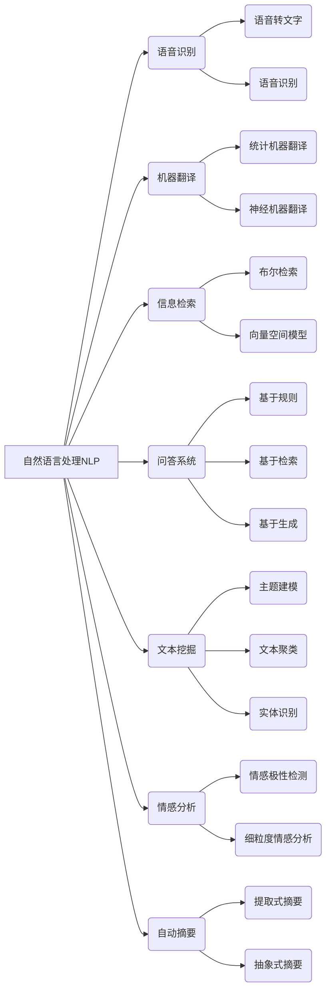

# Natural Language Processing 原理与代码实战案例讲解

## 1. 背景介绍

### 1.1 问题的由来

在当今信息时代,人类与机器之间的交互日益频繁。然而,人类与机器之间存在着语言鸿沟,导致了沟通的障碍。自然语言处理(Natural Language Processing, NLP)应运而生,旨在使计算机能够理解和生成人类自然语言,从而实现人机无障碍交互。

### 1.2 研究现状

近年来,NLP领域取得了长足的进步,尤其是在机器翻译、语音识别、问答系统、情感分析等方面。这些进展很大程度上归功于深度学习技术的快速发展。然而,NLP仍然面临着诸多挑战,如语义理解、上下文把握、常识推理等,这些问题的解决需要更深入的研究。

### 1.3 研究意义

NLP技术的发展将极大地促进人机交互的自然化和智能化,为各行业带来革命性的变革。例如,在客户服务领域,智能对话系统可以提供7x24小时的高效服务;在医疗领域,NLP可以辅助医生快速阅读病历并提供诊断建议;在金融领域,NLP可以自动化处理合同和法律文件等。因此,NLP技术的研究具有重要的理论价值和应用价值。

### 1.4 本文结构

本文将全面介绍NLP的核心概念、算法原理、数学模型、代码实现以及实际应用场景。内容安排如下:首先阐述NLP的基本概念和理论基础;然后详细讲解主流NLP算法的原理和实现步骤;接着构建数学模型并推导公式;之后通过代码示例展示具体的实现过程;最后探讨NLP在各领域的应用,并对未来发展趋势进行展望。

## 2. 核心概念与联系

自然语言处理(NLP)是一门跨学科的研究领域,涉及计算机科学、语言学、认知科学等多个学科。NLP的核心任务是使计算机能够理解和生成人类自然语言。上图展示了NLP的主要分支及其相互关系。

语音识别旨在将人类语音转化为文本,包括语音转文字和语音识别两个子任务。机器翻译则是将一种自然语言翻译成另一种自然语言。信息检索的目标是从大量文本数据中快速找到相关内容。问答系统则是根据用户的自然语言问题,从知识库中检索并返回相关答案。

文本挖掘是从大规模文本数据中发现有价值的信息和知识,包括主题建模、文本聚类和实体识别等任务。情感分析则是识别文本中所蕴含的情感极性和细粒度情感信息。自动摘要则是自动生成文本的摘要,可分为提取式摘要和抽象式摘要两种方式。

上述各个任务相互关联、相辅相成,共同构成了NLP的完整体系。掌握NLP的核心概念有助于我们全面理解这一领域的理论基础和技术路线。

## 3. 核心算法原理 & 具体操作步骤

### 3.1 算法原理概述

NLP领域的核心算法主要包括:

1. **N-gram语言模型**: 基于统计学习的语言模型,用于估计一个词序列的概率。
2. **隐马尔可夫模型(HMM)**: 用于建模隐藏状态和观测序列之间的关系,常用于语音识别和词性标注等任务。
3. **最大熵模型(MaxEnt)**: 基于最大熵原理的判别式模型,常用于序列标注和文本分类等任务。
4. **条件随机场(CRF)**: discriminative undirected graphical model,常用于命名实体识别和词性标注等序列标注任务。
5. **神经网络模型**: 包括前馈神经网络、卷积神经网络(CNN)、循环神经网络(RNN)等,在各种NLP任务中表现卓越。
6. **注意力机制(Attention)**: 用于捕捉输入序列中不同位置的信息,在机器翻译、阅读理解等任务中发挥关键作用。
7. **Transformer**: 全注意力机制的序列到序列模型,在机器翻译、语言模型等任务中取得了state-of-the-art的表现。
8. **BERT**: 基于Transformer的预训练语言模型,在多项NLP任务上创造了新的记录。

上述算法各具特色,在不同的NLP任务中发挥着重要作用。下面将详细介绍其中几种核心算法的原理和实现步骤。

### 3.2 算法步骤详解

#### 3.2.1 N-gram语言模型

N-gram语言模型的基本思想是:在给定前面的n-1个词的情况下,预测第n个词出现的概率。形式化地,N-gram模型定义为:

$$P(w_1, w_2, ..., w_n) = \prod_{i=1}^n P(w_i|w_1, ..., w_{i-1})$$

由于计算复杂度的原因,通常会做马尔可夫假设,即一个词的出现只与前面n-1个词相关:

$$P(w_i|w_1, ..., w_{i-1}) \approx P(w_i|w_{i-n+1}, ..., w_{i-1})$$

基于这一假设,N-gram模型的训练可以通过简单的频数统计来实现。具体步骤如下:

1. 构建语料库,统计所有长度为n的词序列及其出现次数。
2. 将次数除以所有长度为n-1的前缀序列的总次数,得到条件概率估计。
3. 对概率值进行平滑(加法平滑或回退平滑等)。

在测试阶段,对于一个给定的前缀序列,我们可以计算不同候选词的条件概率,选择概率最大的词作为预测结果。

#### 3.2.2 条件随机场(CRF)

条件随机场是一种discriminative undirected graphical model,常用于序列标注任务。其基本思想是:给定输入序列X,学习一个条件概率模型P(Y|X),使得在训练数据上能够最大化联合概率P(Y|X)。

对于线性链条件随机场,定义特征函数f(y_t,y_{t-1},X,t),模型参数为对应的权重向量w。则条件概率为:

$$P(Y|X) = \frac{1}{Z(X)}\exp\left(\sum_t w^Tf(y_t,y_{t-1},X,t)\right)$$

其中,Z(X)为归一化因子。

CRF的训练过程是学习特征函数的权重w,使得在训练数据上最大化对数似然函数:

$$L(w) = \sum_i \log P(Y_i|X_i) - \frac{\lambda}{2}||w||^2$$

可以使用诸如LBFGS等优化算法求解。

在预测时,我们需要对给定的输入序列X,求解全局最优的标记序列Y:

$$Y^* = \arg\max_Y P(Y|X)$$

这可以通过Viterbi等动态规划算法高效地解决。

#### 3.2.3 Transformer

Transformer是一种全注意力机制的序列到序列模型,可以高效地并行计算,在机器翻译、语言模型等任务中表现卓越。

Transformer的核心组件是Multi-Head Attention和前馈神经网络,通过堆叠多个这样的编码器层和解码器层构成整个模型。

具体来说,Multi-Head Attention的计算过程如下:

1. 将查询(Query)、键(Key)和值(Value)通过线性投影得到对应的向量表示。
2. 计算查询与所有键的点积,对其进行缩放并施加掩码,得到注意力分数。
3. 对注意力分数进行softmax归一化,得到注意力权重。
4. 将注意力权重与值向量加权求和,得到注意力输出。
5. 对多个注意力输出进行拼接,再经过线性投影,得到Multi-Head Attention的输出。

前馈神经网络则由两个线性变换和一个ReLU激活函数组成:

$$\text{FFN}(x) = \max(0, xW_1 + b_1)W_2 + b_2$$

通过堆叠编码器层和解码器层,Transformer可以高效地建模输入和输出序列之间的依赖关系,实现序列到序列的转换。

在训练时,我们需要最小化模型在训练数据上的损失函数(如交叉熵损失)。可以使用随机梯度下降等优化算法进行端到端的训练。

### 3.3 算法优缺点

每种算法都有其优缺点,需要根据具体任务进行权衡选择。

- N-gram语言模型简单高效,但只能捕捉局部信息,难以建模长程依赖。
- HMM和CRF能够很好地解决序列标注问题,但需要手工设计特征函数。
- 神经网络模型能够自动学习特征表示,但需要大量数据,并且训练过程较为缓慢。
- Transformer虽然表现优异,但计算代价较高,对GPU资源要求较大。

### 3.4 算法应用领域

不同的NLP算法在不同的应用场景下发挥着重要作用:

- N-gram语言模型常用于拼写检查、自动补全、语音识别等任务。
- HMM和CRF在命名实体识别、词性标注、生物信息挖掘等序列标注任务中表现良好。
- 神经网络模型在机器翻译、文本分类、情感分析等任务中获得了广泛应用。
- Transformer模型在机器翻译、语言模型、阅读理解等任务上创造了新的记录。

总的来说,NLP算法的应用范围广泛且日益扩大,在自然语言理解和生成等各个领域发挥着不可或缺的作用。

## 4. 数学模型和公式 & 详细讲解 & 举例说明

### 4.1 数学模型构建

在NLP领域,数学模型通常用于形式化描述语言现象,并为算法设计提供理论基础。下面将介绍几种常用的数学模型。

#### 4.1.1 n-gram语言模型

n-gram语言模型是基于马尔可夫假设的概率模型,用于估计一个长度为n的词序列的概率。其核心思想是:一个词的出现只与前面n-1个词相关。

形式上,n-gram模型可表示为:

$$P(w_1, w_2, ..., w_n) = \prod_{i=1}^n P(w_i|w_1, ..., w_{i-1})$$

由于计算复杂度的原因,通常会做马尔可夫假设:

$$P(w_i|w_1, ..., w_{i-1}) \approx P(w_i|w_{i-n+1}, ..., w_{i-1})$$

基于这一假设,n-gram模型的训练可以通过简单的频数统计来实现。

#### 4.1.2 隐马尔可夫模型(HMM)

隐马尔可夫模型是一种统计模型,用于描述隐藏状态和观测序列之间的关系。在NLP中,HMM常用于词性标注、命名实体识别等序列标注任务。

HMM由以下三个基本元素组成:

1. 隐藏状态集合S
2. 观测集合O
3. 三个概率分布:
   - 初始状态分布: $\pi = P(q_1)$
   - 状态转移概率: $A = P(q_t|q_{t-1})$
   - 观测概率: $B = P(o_t|q_t)$

在给定模型参数$\lambda =