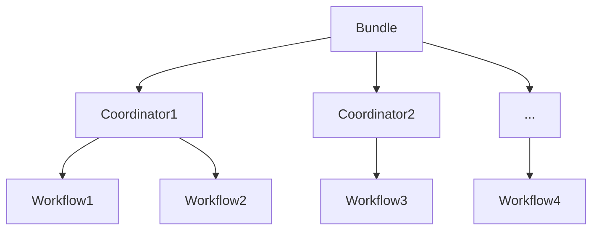

# Oozie Bundle原理与代码实例讲解

关键词：Oozie、Bundle、工作流、调度、大数据

## 1. 背景介绍
### 1.1 问题的由来
随着大数据时代的到来,企业需要处理海量的数据,这就对大数据平台的工作流调度提出了更高的要求。Oozie作为Hadoop生态系统中的重要组件,为用户提供了一个可伸缩、可靠且易于使用的系统来运行和调度Hadoop作业。然而,对于复杂的数据处理流程,单个工作流往往难以满足需求,这时就需要使用Oozie Bundle来编排和调度多个工作流,从而实现更加灵活和强大的任务调度功能。

### 1.2 研究现状
目前,国内外已经有不少团队和学者对Oozie Bundle的原理和应用进行了研究。比如,Hortonworks官方文档对Bundle的概念、语法等进行了详细介绍；《Hadoop权威指南》一书中也专门有一章节讲解Oozie的原理和使用方法；一些互联网公司如阿里、京东等也分享了它们使用Oozie进行任务调度的实践经验。但是,Oozie Bundle涉及的概念和知识点较多,目前还缺乏对其进行系统全面讲解的资料。

### 1.3 研究意义
深入研究Oozie Bundle的原理和应用,一方面有助于我们更好地理解Hadoop生态系统的架构和运作机制,另一方面可以指导我们在实际工作中设计出高效、可靠的任务调度方案,从而最大限度发挥大数据平台的数据处理能力,为企业创造更大价值。同时,本文也可以作为一个系统性的学习资料,帮助更多的开发者和学生快速掌握Oozie Bundle的相关知识。

### 1.4 本文结构
本文将分为9个部分,首先介绍Oozie Bundle的背景和研究意义,然后系统讲解Bundle的核心概念、工作原理、数学模型、代码实现等内容,并给出具体的应用场景和学习资源,最后总结Bundle的发展趋势和面临的挑战。

## 2. 核心概念与联系
在正式介绍Oozie Bundle之前,我们先来了解几个核心概念：
- Oozie：Hadoop的工作流调度系统,支持若干种类型的Hadoop任务并可将它们组合成一个逻辑工作单元(工作流)。 
- 工作流：由一系列可以串行或并行执行的Action节点组成,包含了控制流逻辑。
- Coordinator：定义基于时间和数据的触发条件,周期性地运行工作流。
- Bundle：包含多个Coordinator,用于批量管理和调度Coordinator。

它们之间的关系如下图所示：

可以看出,Bundle位于最顶层,通过统一管理和调度下层的多个Coordinator,而每个Coordinator又可以周期性地触发工作流的运行。这种层次化的设计使得Oozie可以支持非常复杂的任务调度场景。

## 3. 核心算法原理 & 具体操作步骤
### 3.1 算法原理概述
Oozie Bundle的核心是一种有向无环图(DAG)调度算法。Bundle定义了一个Coordinator的DAG,系统会根据这个DAG来调度Coordinator,即一个Coordinator只有在它所依赖的Coordinator都执行成功后才能开始运行。

### 3.2 算法步骤详解
1. 用户提交一个Bundle作业,并指定各个Coordinator的运行时间范围、频率、依赖关系等参数。
2. Oozie解析Bundle XML配置文件,生成Coordinator DAG。
3. 对于DAG中的每个没有前置依赖的Coordinator,Oozie根据其配置的时间范围和频率生成一系列的Coordinator Action。 
4. 这些Coordinator Action会定期检查触发条件(时间或数据),如果满足条件则启动对应的工作流实例。
5. 对于DAG中有前置依赖的Coordinator,Oozie会等待其前置Coordinator的所有Workflow实例都运行成功后,才开始生成该Coordinator的一系列Action。
6. 重复4~5,直到整个Coordinator DAG中的所有Coordinator实例都运行完成。

### 3.3 算法优缺点
优点：
- 可以定义任意复杂的Coordinator依赖关系,实现灵活的任务编排。
- 支持基于时间和数据两种类型的触发条件,适用范围广。
- 自动重试失败的Coordinator,保证作业的可靠性。

缺点：  
- Bundle XML配置比较复杂,学习成本较高。
- Coordinator DAG是静态的,一旦提交后无法修改。
- 不支持条件分支、参数传递等高级控制流特性。

### 3.4 算法应用领域
Oozie Bundle适用于以下业务场景：
- 不同时间粒度数据的周期性处理,如每日、每周、每月的数据聚合。
- 多维度数据的关联分析,如用户行为与订单、物流等数据的关联。  
- 跨部门、跨系统的数据集成与ETL处理。
- 机器学习训练、预测等复杂任务的调度。

## 4. 数学模型和公式 & 详细讲解 & 举例说明
### 4.1 数学模型构建
我们可以用一个三元组 $B=<C,D,T>$ 来抽象表示一个Bundle,其中：
- $C={c_1,c_2,...,c_n}$ 表示Bundle包含的一组Coordinator。
- $D$ 表示Coordinator之间的依赖关系矩阵,如果 $c_i$ 依赖 $c_j$,则 $d_{ij}=1$,否则 $d_{ij}=0$。
- $T={t_1,t_2,...,t_n}$ 表示各个Coordinator配置的时间参数,包括开始时间、结束时间、频率等。

例如,一个包含3个Coordinator的Bundle可以表示为：

$$
C=\{c_1,c_2,c_3\} \\
D=\begin{bmatrix} 
0 & 0 & 0\\ 
1 & 0 & 0\\
1 & 1 & 0
\end{bmatrix} \\  
T=\{(2023-01-01T00:00,2023-01-31T00:00,24h),\\
(2023-01-05T00:00,2023-01-25T00:00,12h),\\ 
(2023-01-10T00:00,2023-01-20T00:00,6h)\}
$$

### 4.2 公式推导过程
根据Bundle的数学模型,我们可以推导出以下几个重要公式：

1. Coordinator的最早开始时间 $s_i$：

$$
s_i=\begin{cases}
t_i.start, & \text{if}\ \sum_{j=1}^n d_{ij}=0 \\
\max_{1 \leq j \leq n}(s_j+p_j), & \text{if}\ \sum_{j=1}^n d_{ij}>0
\end{cases}
$$

其中 $p_j$ 表示 $c_j$ 的运行周期。即如果 $c_i$ 没有前置依赖,则它的最早开始时间就是自身配置的开始时间；否则,它的最早开始时间取决于所有前置Coordinator的最早开始时间+运行周期的最大值。

2. Coordinator的最晚结束时间 $e_i$：

$$
e_i=\begin{cases}
t_i.end, & \text{if}\ \sum_{j=1}^n d_{ji}=0 \\  
\min_{1 \leq j \leq n}(e_j-p_i), & \text{if}\ \sum_{j=1}^n d_{ji}>0
\end{cases}
$$

即如果没有其他Coordinator依赖 $c_i$,则它的最晚结束时间就是自身配置的结束时间；否则,它的最晚结束时间取决于所有后置Coordinator的最晚结束时间-自身的运行周期的最小值。

3. Bundle的总运行时间 $T_B$：

$$
T_B=\max_{1 \leq i \leq n}(e_i)-\min_{1 \leq i \leq n}(s_i)
$$  

即Bundle的总运行时间等于所有Coordinator的最晚结束时间的最大值减去最早开始时间的最小值。

### 4.3 案例分析与讲解
下面我们以一个实际的Bundle作业为例,来说明如何应用上述数学模型和公式。

假设某电商公司需要每天进行以下数据处理：
1. 凌晨1点,导入昨日的用户行为日志。 
2. 凌晨2点,导入昨日的订单交易数据。
3. 凌晨3点,关联分析用户行为与订单数据。
4. 凌晨4点,计算各品类的销售额排名。
5. 凌晨5点,将分析结果写入数据库供业务团队查询。

我们可以为这5个任务分别创建5个Coordinator,并配置它们的依赖关系和时间参数：

$$
C=\{c_1,c_2,c_3,c_4,c_5\} \\
D=\begin{bmatrix}
0 & 0 & 0 & 0 & 0\\
0 & 0 & 0 & 0 & 0\\ 
1 & 1 & 0 & 0 & 0\\
0 & 0 & 1 & 0 & 0\\
0 & 0 & 0 & 1 & 0 
\end{bmatrix} \\
T=\{(2023-01-01T01:00,2023-01-31T01:00,24h),\\
(2023-01-01T02:00,2023-01-31T02:00,24h),\\
(2023-01-01T03:00,2023-01-31T03:00,24h),\\  
(2023-01-01T04:00,2023-01-31T04:00,24h),\\
(2023-01-01T05:00,2023-01-31T05:00,24h)\}
$$

根据Coordinator的最早开始时间公式,我们可以计算出：

$$
s_1=t_1.start=2023-01-01T01:00 \\
s_2=t_2.start=2023-01-01T02:00 \\ 
s_3=\max(s_1+p_1,s_2+p_2)=2023-01-02T02:00 \\
s_4=s_3+p_3=2023-01-02T03:00 \\  
s_5=s_4+p_4=2023-01-02T04:00
$$

由于所有Coordinator的最晚结束时间都等于它们自身配置的结束时间,因此整个Bundle的总运行时间为：

$$
T_B=\max(e_1,e_2,e_3,e_4,e_5)-\min(s_1,s_2,s_3,s_4,s_5) \\
=2023-01-31T05:00-2023-01-01T01:00 \\
=30\ days
$$

可见,虽然每个Coordinator只需要运行1个小时,但由于它们之间存在依赖关系,导致整个Bundle的实际运行时间被拉长到了30天。

### 4.4 常见问题解答
Q: Bundle支持循环依赖吗,比如 A 依赖 B,B 又依赖 A？
A: 不支持。Bundle要求Coordinator之间的依赖关系必须是一个DAG,也就是不允许出现循环依赖,否则Oozie会拒绝接受该Bundle作业。

Q: 如果某个Coordinator运行失败了,整个Bundle会怎样？  
A: 默认情况下,如果一个Coordinator失败,Oozie会自动重试该Coordinator,直到达到最大重试次数。如果重试后依然失败,则整个Bundle作业就会失败。不过用户可以在Bundle配置中设置容错选项,比如忽略某些Coordinator的失败,或者在某个Coordinator失败后接着运行下一个Coordinator等。

Q: Bundle可以指定Coordinator的优先级吗？
A: 可以。Bundle XML中的 `<controls>` 标签允许用户设置Coordinator的优先级,取值范围是[0, 100000],数值越大优先级越高。Oozie会优先运行优先级高的Coordinator。

## 5. 项目实践：代码实例和详细解释说明  
下面我们通过一个具体的代码实例来演示如何使用Oozie Bundle编排多个Coordinator。

### 5.1 开发环境搭建
首先需要搭建Oozie开发环境,主要步骤如下：
1. 安装JDK并配置JAVA_HOME环境变量。
2. 下载Oozie源码并编译打包