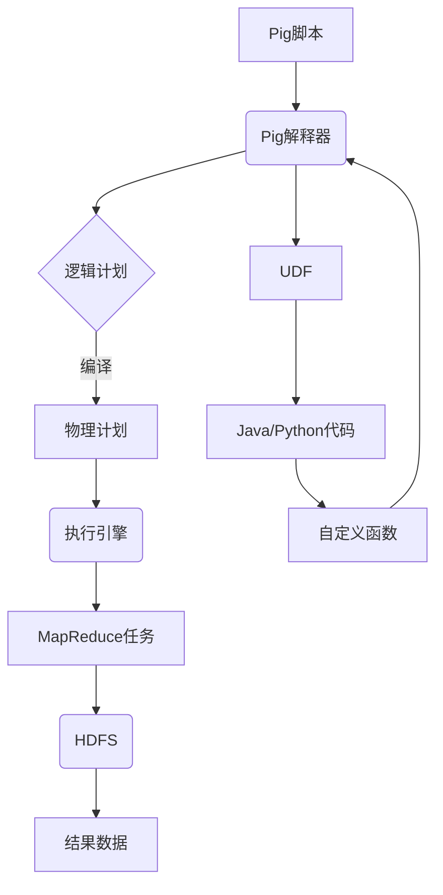

以下是对《Pig UDF原理与代码实例讲解》这一主题的技术博客文章撰写：

# Pig UDF原理与代码实例讲解

## 1. 背景介绍

### 1.1 问题的由来

在大数据处理领域,Apache Pig作为一种高级数据流语言,为并行计算提供了强大的抽象层。Pig的设计理念是将数据处理过程描述为一系列数据转换操作,这些操作通过数据流的方式连接在一起,从而构建复杂的数据分析管道。

然而,Pig内置的操作符虽然功能强大,但在某些特殊场景下可能无法满足用户的需求。为了解决这个问题,Pig提供了用户自定义函数(User Defined Function,UDF)的扩展机制,允许用户使用Java、Python等语言编写自定义函数,从而扩展Pig的功能。

### 1.2 研究现状

目前,Pig UDF已经被广泛应用于各种大数据处理场景,例如数据清洗、数据转换、自定义聚合等。越来越多的开发者开始编写自己的UDF来满足特定的业务需求。但是,由于UDF涉及到Pig内核的交互,其编写和调试过程相对复杂,对开发者的技术要求较高。

### 1.3 研究意义  

深入理解Pig UDF的原理和实现机制,对于提高开发效率、编写高质量UDF代码具有重要意义。本文将从以下几个方面对Pig UDF进行全面讲解:

1. 介绍UDF的核心概念和工作原理
2. 详细分析UDF的实现细节和算法流程  
3. 通过实例代码演示UDF的编写和调用方法
4. 探讨UDF在不同场景下的应用实践
5. 总结UDF的优缺点和未来发展趋势

### 1.4 本文结构

本文共分为9个部分:

1. 背景介绍
2. 核心概念与联系
3. 核心算法原理与具体操作步骤  
4. 数学模型和公式详细讲解与举例说明
5. 项目实践:代码实例和详细解释说明
6. 实际应用场景
7. 工具和资源推荐
8. 总结:未来发展趋势与挑战
9. 附录:常见问题与解答

## 2. 核心概念与联系

在深入探讨Pig UDF的原理之前,我们需要先了解以下几个核心概念:

1. **数据模型(Data Model)**

   Pig数据模型由带模式的数据包(Data Bag)组成,每个数据包由多个元组(Tuple)构成,每个元组包含多个字段(Field)。这种层次结构类似于关系数据库中的表-行-列模型,但更加灵活和动态。

2. **运算符(Operator)**

   Pig提供了一系列内置运算符,用于对数据包执行各种转换操作,如过滤(FILTER)、投影(FOREACH)、连接(JOIN)、分组(GROUP)等。这些运算符可以组合成复杂的数据处理管道。

3. **用户自定义函数(UDF)**

   UDF是Pig的一种扩展机制,允许用户使用Java、Python等语言编写自定义函数,以扩展Pig的功能。UDF可以在Pig脚本中像内置函数一样被调用。

4. **执行框架(Execution Framework)**

   Pig的执行框架负责将Pig脚本编译为物理执行计划,并在底层计算引擎(如Hadoop MapReduce或Tez)上执行。执行框架还负责管理UDF的生命周期和数据传输。

这些核心概念相互关联,共同构建了Pig的数据处理模型。其中,UDF作为一种扩展机制,允许开发者定制化数据转换逻辑,从而满足特定的业务需求。



上图展示了Pig的整体执行流程,以及UDF在其中扮演的角色。Pig脚本经过解释器解析后生成逻辑计划,再编译为物理计划并提交到执行引擎(如MapReduce)运行。在这个过程中,UDF作为扩展代码被集成到执行计划中,并在运行时被调用以执行自定义的数据转换逻辑。

## 3. 核心算法原理与具体操作步骤

### 3.1 算法原理概述

Pig UDF的核心原理是将用户自定义的数据处理逻辑封装为一个函数,并将其集成到Pig的执行框架中。在执行过程中,Pig会根据需要动态加载和调用这些UDF。

UDF的实现遵循了一种面向对象的设计模式,称为"装饰模式"(Decorator Pattern)。这种模式允许在不改变原有对象结构的情况下,动态地给对象添加新的行为。在Pig中,UDF相当于对内置运算符的"装饰",为其增加了额外的功能扩展。

Pig UDF的执行过程可以概括为以下几个步骤:

1. **注册(Register)**:开发者使用Java、Python等语言编写UDF代码,并将其打包为JAR/Python文件。在Pig脚本中,需要先注册这些UDF文件。

2. **加载(Load)**:Pig解释器在执行脚本时,会根据注册的UDF文件动态加载相应的函数类。

3. **实例化(Instantiate)**:对于每个输入数据分片,Pig会创建一个UDF实例。这样可以确保UDF的线程安全性。

4. **初始化(Initialize)**:Pig会调用UDF实例的初始化方法,允许UDF进行一些准备工作,如解析参数、加载资源文件等。

5. **执行(Execute)**:Pig将输入数据分片传递给UDF实例,并调用其核心处理方法(如`eval`方法)执行自定义的数据转换逻辑。

6. **结果收集(Gather Results)**:UDF将处理后的结果数据返回给Pig执行框架,用于后续的数据流操作。

7. **资源释放(Cleanup)**:在所有输入数据分片处理完毕后,Pig会调用UDF实例的清理方法,允许其释放占用的资源。

这种设计模式使得UDF可以无缝地集成到Pig的数据处理流程中,同时保证了良好的可扩展性和并行计算能力。

### 3.2 算法步骤详解

接下来,我们将详细解析Pig UDF执行过程中的每一个步骤。

#### 3.2.1 注册(Register)

在Pig脚本中,使用`REGISTER`语句注册UDF文件:

```pig
REGISTER '/path/to/udf.jar';
```

对于Python UDF,可以使用`REGISTER`指定`.py`文件,或者使用`%DEFAULT_PIG_JARS`环境变量指定Python解释器路径。

#### 3.2.2 加载(Load)

Pig解释器会根据注册的UDF文件,动态加载相应的函数类。Java UDF需要实现特定的接口,如`EvalFunc`、`AccumulatorEvalFunc`等。Python UDF则需要定义特定的函数签名。

例如,对于一个简单的字符串连接UDF,Java代码如下:

```java
import org.apache.pig.EvalFunc;
import org.apache.pig.data.Tuple;

public class ConcatUDF extends EvalFunc<String> {
    public String exec(Tuple input) throws IOException {
        if (input == null || input.size() < 2) {
            return null;
        }
        String str1 = (String) input.get(0);
        String str2 = (String) input.get(1);
        return str1 + str2;
    }
}
```

对应的Python代码如下:

```python
@outputSchema("chararray")
def concat(str1, str2):
    return str1 + str2
```

#### 3.2.3 实例化(Instantiate)

对于每个输入数据分片,Pig会创建一个新的UDF实例。这种实例化机制保证了UDF的线程安全性,避免了多个线程同时修改UDF的内部状态而导致的竞争条件。

#### 3.2.4 初始化(Initialize)

在处理输入数据之前,Pig会调用UDF实例的初始化方法,允许UDF执行一些准备工作。

对于Java UDF,初始化方法是`EvalFunc`接口中的`getArgToFuncMapping`方法。开发者可以在这个方法中解析UDF的参数、加载资源文件等。

对于Python UDF,可以使用`@pandas_udaf_initial`装饰器定义初始化函数。

#### 3.2.5 执行(Execute)

这是UDF的核心步骤,Pig会将输入数据分片传递给UDF实例,并调用其核心处理方法执行自定义的数据转换逻辑。

对于Java UDF,核心处理方法是`EvalFunc`接口中的`exec`方法。对于Python UDF,则是用`@outputSchema`装饰器定义的函数。

在这个步骤中,UDF可以访问和处理输入数据,执行任意自定义逻辑,并将结果返回给Pig执行框架。

#### 3.2.6 结果收集(Gather Results)

Pig会收集UDF实例返回的结果数据,并将其传递给后续的数据流操作。

#### 3.2.7 资源释放(Cleanup)

在所有输入数据分片处理完毕后,Pig会调用UDF实例的清理方法,允许其释放占用的资源,如关闭文件句柄、断开数据库连接等。

对于Java UDF,清理方法是`EvalFunc`接口中的`finish`方法。对于Python UDF,可以使用`@pandas_udaf_final`装饰器定义清理函数。

### 3.3 算法优缺点

Pig UDF的设计具有以下优点:

1. **可扩展性强**:UDF机制允许开发者使用通用编程语言(如Java、Python)编写自定义函数,大大扩展了Pig的功能边界。

2. **并行计算能力**:通过为每个输入数据分片创建单独的UDF实例,Pig能够有效利用分布式计算资源,实现数据并行处理。

3. **生命周期管理**:Pig对UDF实例的生命周期进行了良好的管理,确保了资源的高效利用和线程安全性。

4. **与Pig框架集成紧密**:UDF可以无缝地集成到Pig的执行流程中,并与其他Pig运算符协同工作。

然而,Pig UDF也存在一些缺点和局限性:

1. **性能开销**:由于需要动态加载和实例化UDF,会带来一定的性能开销,尤其是在处理大量小数据分片时更为明显。

2. **调试困难**:由于UDF运行在Pig的分布式执行框架中,调试和错误排查相对比较困难。

3. **语言限制**:虽然Pig支持使用多种语言编写UDF,但对于每种语言,UDF的编写和集成方式都有一些差异和限制。

4. **版本依赖**:UDF需要与特定版本的Pig框架兼容,不同版本之间的API变化可能导致UDF无法正常工作。

### 3.4 算法应用领域

Pig UDF可以应用于各种大数据处理场景,为用户提供了强大的定制化数据转换能力。以下是一些典型的应用领域:

1. **数据清洗**:使用UDF对原始数据进行格式转换、异常值处理、缺失值填充等清洗操作。

2. **数据转换**:通过UDF将数据从一种格式转换为另一种格式,以满足下游应用的需求。

3. **自定义聚合**:利用UDF实现特殊的聚合函数,如计算数据的高阶统计量、编码解码等。

4. **复杂计算**:将一些复杂的数学计算或算法封装为UDF,简化Pig脚本的编写。

5. **数据加解密**:使用UDF对敏感数据进行加密或解密,保护数据安全。

6. **数据验证**:通过UDF对输入数据执行自定义的验证规则,确保数据质量。

7. **数据enrichment**:从外部数据源(如Hbase、数据库等)加载数据,并通过UDF与主数据进行关联或合并。

8. **机器学习**:将一些机器学习算法封装为UDF,在Pig中执行模型训练或预测任务。

总的来说,Pig UDF为大数据处理提供了无限的可能