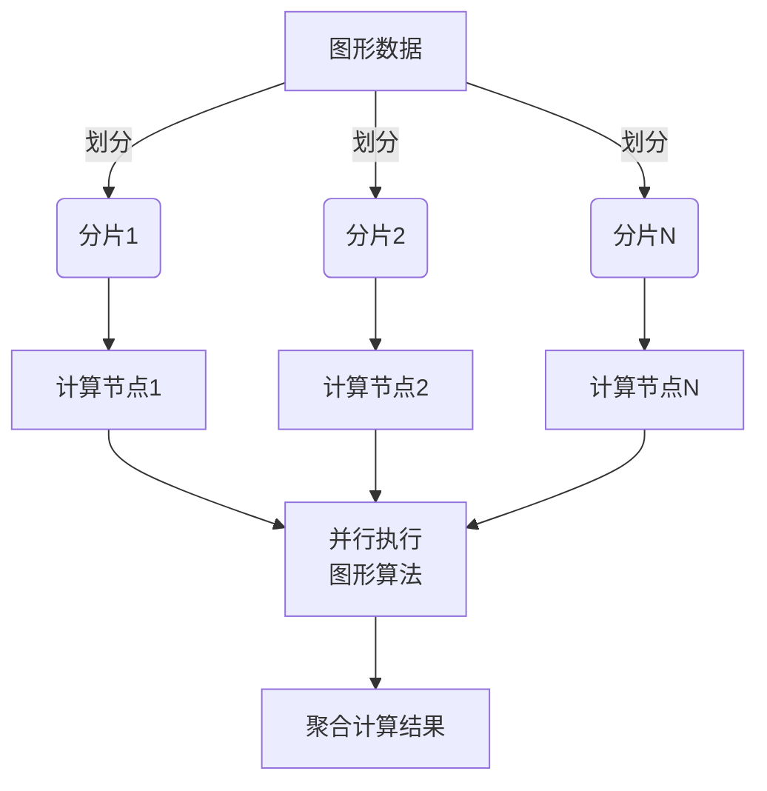
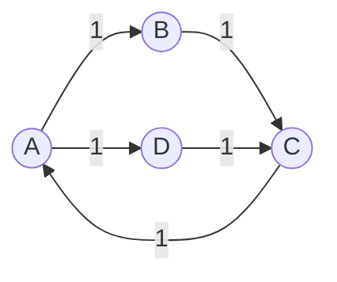

# Pregel原理与代码实例讲解

## 1. 背景介绍

### 1.1 问题的由来

在当今大数据时代，海量的数据被生成和存储。这些数据通常以图形结构的形式体现,例如社交网络、网页链接、基因调控网络等。传统的计算模型难以高效处理这些大规模图形数据。因此,提出了一种新的大规模图形并行计算模型——Pregel,用于解决这一挑战。

### 1.2 研究现状

Pregel是谷歌于2010年提出的一种大规模图形并行计算模型,它受到了学术界和工业界的广泛关注。许多开源实现如Apache Giraph、Spark GraphX等相继问世。Pregel模型已被应用于页面排名(PageRank)、社交网络分析、机器学习等多个领域。

### 1.3 研究意义

理解Pregel原理对于高效处理大规模图形数据至关重要。Pregel提供了一种通用的图形并行计算框架,简化了复杂图形算法的开发。掌握Pregel有助于解决诸多实际问题,如社交网络影响力分析、网络入侵检测等。

### 1.4 本文结构

本文首先介绍Pregel的核心概念和基本原理,然后详细阐述其算法流程和数学模型。接着通过代码实例讲解Pregel的具体实现,并分析其在实际场景中的应用。最后探讨Pregel的发展趋势和面临的挑战。

## 2. 核心概念与联系

Pregel是一种基于批处理的图形并行计算模型,它将图形数据划分为多个分片(Partition),并在集群中的多个计算节点上并行执行图形算法。

Pregel的核心概念包括:

1. **顶点(Vertex)**: 表示图形中的节点,存储节点的值和状态。
2. **边(Edge)**: 连接两个顶点,表示它们之间的关系。
3. **超步(Superstep)**: Pregel计算过程被划分为多个超步,每个超步包含并行计算和消息传递两个阶段。
4. **消息(Message)**: 在超步中,顶点通过发送消息来交换数据和状态。
5. **聚合器(Aggregator)**: 用于在整个图形上进行全局计算和状态汇总。

这些概念共同构成了Pregel的计算模型,支持高效的大规模图形并行处理。



## 3. 核心算法原理 & 具体操作步骤

### 3.1 算法原理概述

Pregel算法基于"顶点并行"的思想,即每个顶点作为一个独立的计算单元,通过迭代的方式并行执行用户定义的图形算法。算法执行过程被划分为多个超步(Superstep),每个超步包含以下三个阶段:

1. **并行计算阶段**: 所有顶点并行执行用户定义的计算逻辑,根据当前数据和状态更新自身值。
2. **消息传递阶段**: 顶点向出边的目标顶点发送消息,传递数据和状态。
3. **消息合并阶段**: 接收到的消息在目标顶点上进行合并。

算法通过不断迭代直至满足用户定义的终止条件。

### 3.2 算法步骤详解

Pregel算法的具体执行步骤如下:

1. **初始化**: 将输入图形数据划分为多个分片,并分配到集群中的计算节点上。每个顶点初始化自身值和状态。
2. **超步迭代**:
   a. **并行计算阶段**: 每个顶点并行执行用户定义的`compute()`函数,根据当前值和状态进行计算和更新。
   b. **消息传递阶段**: 每个顶点调用`sendMessage()`函数向出边的目标顶点发送消息。
   c. **消息合并阶段**: 目标顶点收集所有发送给它的消息,并通过用户定义的`combine()`函数进行合并。
3. **终止条件检查**: 检查是否满足用户定义的终止条件,如果满足则算法结束,否则进入下一个超步继续迭代。
4. **结果收集**: 从所有计算节点收集最终的顶点值和状态,形成计算结果。

### 3.3 算法优缺点

**优点**:

- 高度并行化,能够有效利用集群资源进行大规模图形计算。
- 通用性强,可以用于实现各种图形算法,如PageRank、连通分量等。
- 基于"顶点并行"思想,算法模型简单,易于理解和实现。
- 支持故障恢复机制,具有良好的容错性。

**缺点**:

- 由于采用批处理模式,对于持续更新的图形数据处理效率较低。
- 消息传递和合并过程可能会产生较大的网络开销。
- 对于计算密集型的图形算法,并行效率可能会受到影响。

### 3.4 算法应用领域

Pregel算法广泛应用于以下领域:

- **社交网络分析**: 计算PageRank、社区发现、影响力传播等。
- **Web信息检索**: 网页排名、链接分析等。
- **生物信息学**: 基因调控网络分析、蛋白质互作网络等。
- **推荐系统**: 基于图形的协同过滤推荐算法。
- **网络安全**: 入侵检测、恶意软件传播分析等。

## 4. 数学模型和公式 & 详细讲解 & 举例说明

### 4.1 数学模型构建

为了形式化描述Pregel算法,我们构建一个数学模型。假设有一个有向图$G=(V,E)$,其中$V$是顶点集合,$ E\subseteq V \times V $是边集合。

对于每个顶点$v \in V$,定义:

- $value(v)$: 顶点$v$的值
- $state(v)$: 顶点$v$的状态

在每个超步$t$中,每个顶点$v$执行以下操作:

1. 计算新值和状态:
   $$
   (value'(v), state'(v)) = \mathcal{C}(value(v), state(v), M(v))
   $$
   其中$\mathcal{C}$是用户定义的计算函数,$M(v)$是发送给顶点$v$的消息集合。

2. 发送消息:
   $$
   \forall (v, u) \in E: \text{sendMsg}((v, u), m(v, u))
   $$
   其中$m(v, u)$是顶点$v$发送给顶点$u$的消息。

3. 更新值和状态:
   $$
   value(v) \gets value'(v), \quad state(v) \gets state'(v)
   $$

算法执行直至满足终止条件$\mathcal{T}(G)$。

### 4.2 公式推导过程

我们以经典的PageRank算法为例,推导其在Pregel模型下的实现。

PageRank算法用于计算网页的重要性排名,其核心思想是:一个网页的重要性取决于链接到它的其他网页的重要性。

在Pregel中,每个顶点$v$表示一个网页,其$value(v)$为该网页的PageRank值。在每个超步$t$中,顶点$v$执行以下操作:

1. 计算新的PageRank值:
   $$
   value'(v) = \frac{1-d}{N} + d \sum_{u \in M(v)} \frac{value(u)}{L(u)}
   $$
   其中$d$是阻尼系数(通常取$0.85$),$N$是网页总数,$L(u)$是指向顶点$u$的入边数。

2. 发送消息:
   $$
   \forall (v, u) \in E: \text{sendMsg}((v, u), \frac{value'(v)}{L(v)})
   $$
   即将新计算的PageRank值均分,发送给所有出边的目标顶点。

3. 更新PageRank值:
   $$
   value(v) \gets value'(v)
   $$

算法执行直至PageRank值收敛或达到最大迭代次数。

### 4.3 案例分析与讲解

考虑一个简单的网页链接示例,如下图所示:



假设初始时,每个网页的PageRank值为$1/4$,阻尼系数$d=0.85$。

**第一超步**:

1. 计算新的PageRank值:
   - $value'(A) = \frac{1-0.85}{4} + 0.85 \times (\frac{1}{4} \times \frac{1}{1} + \frac{1}{4} \times \frac{1}{2}) = 0.4375$
   - $value'(B) = \frac{1-0.85}{4} + 0.85 \times \frac{1}{4} \times \frac{1}{1} = 0.2625$
   - $value'(C) = \frac{1-0.85}{4} + 0.85 \times (\frac{1}{4} \times \frac{1}{1} + \frac{1}{4} \times \frac{1}{2}) = 0.4375$
   - $value'(D) = \frac{1-0.85}{4} + 0.85 \times \frac{1}{4} \times \frac{1}{1} = 0.2625$

2. 发送消息:
   - $A \xrightarrow{0.4375/2} B, A \xrightarrow{0.4375/2} D$
   - $B \xrightarrow{0.2625} C$
   - $C \xrightarrow{0.4375/2} A, C \xrightarrow{0.4375/2} D$
   - $D \xrightarrow{0.2625} C$

3. 更新PageRank值:
   - $value(A) = 0.4375, value(B) = 0.2625, value(C) = 0.4375, value(D) = 0.2625$

经过多次迭代,PageRank值将收敛到稳定值。

### 4.4 常见问题解答

**Q: Pregel算法如何处理图形数据的动态变化?**

A: Pregel算法采用批处理模式,对于动态变化的图形数据,需要周期性地重新计算整个图形。一种解决方案是增量计算,即只对变化的部分进行计算,而不是重新计算整个图形。另一种方案是采用流式计算模型,如Google的MillWheel项目。

**Q: Pregel算法如何解决负载不均衡问题?**

A: 由于图形数据的分布可能不均匀,导致不同分片的计算负载不均衡。Pregel通过动态分区和工作迁移等策略来缓解这一问题。具体来说,在计算过程中,会根据分片的计算负载动态调整分区,将过载分片中的部分工作迁移到其他分片。

**Q: Pregel算法的容错机制是如何实现的?**

A: Pregel算法采用检查点(Checkpoint)和重放(Replay)机制实现容错。在每个超步结束时,会将当前的计算状态(包括顶点值、状态和消息)持久化存储,形成一个检查点。如果发生故障,可以从最近的检查点重新启动计算,并重放之后的消息,从而恢复计算状态。

## 5. 项目实践:代码实例和详细解释说明

### 5.1 开发环境搭建

本节将介绍如何搭建Pregel的开发环境。我们将使用Apache Giraph,这是一个流行的开源Pregel实现。

1. **安装Apache Giraph**:
   - 从官方网站下载Giraph发行版: https://giraph.apache.org/releases.html
   - 解压缩下载的文件。

2. **配置Hadoop环境**:
   - Giraph依赖于Hadoop进行分布式计算。
   - 安装并配置Hadoop集群,或使用Pseudo分布式模式。

3. **构建Giraph项目**:
   - 使用Maven或其他构建工具创建一个新的Java项目。
   - 在项目的`pom.xml`文件中添加Giraph依赖。

```xml
<dependency>
    <groupId>org.apache.giraph</groupId>
    <artifactId>giraph