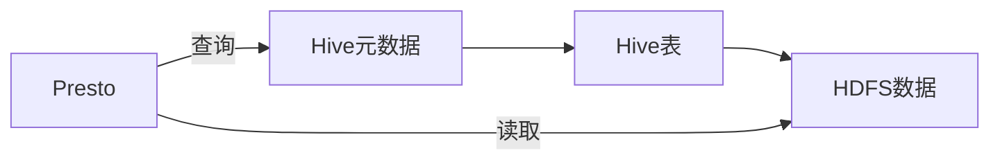

# Presto-Hive整合原理与代码实例讲解

关键词：Presto、Hive、大数据、SQL查询、数据仓库、HDFS、元数据、查询引擎、数据源

## 1. 背景介绍
### 1.1  问题的由来
随着大数据时代的到来,企业需要处理和分析海量数据。Hadoop生态系统中的Hive为大数据分析提供了类SQL的查询能力,但在交互式查询和低延迟方面存在不足。Facebook开源的Presto是一个高性能的分布式SQL查询引擎,能够对Hive等多种数据源进行快速的交互式查询。将Presto与Hive整合,可以发挥两者的优势,实现快速灵活的大数据分析。

### 1.2  研究现状
目前业界已经广泛采用Presto+Hive的架构进行大数据分析。不少公司分享了将Presto接入Hive数据源的实践经验。同时,学术界也对Presto的查询优化、内存管理等进行了研究。但Presto与Hive的整合原理与内部机制的系统性讲解还比较少见。

### 1.3  研究意义
深入剖析Presto与Hive的整合原理,可以帮助我们理解Presto查询引擎的内部工作机制,以及它是如何与Hive无缝连接,实现对Hive数据的快速查询的。通过学习Presto访问Hive数据源的完整流程和核心源码,可以提升我们对大数据查询系统的认知。本文的代码实例也能为实践Presto+Hive架构提供参考。

### 1.4  本文结构
本文将从以下几个方面展开:
- 首先介绍Presto和Hive的基本概念与技术联系
- 然后重点剖析Presto查询引擎的原理,以及对接Hive数据源的流程与机制  
- 接着通过数学建模的方式描述Presto的查询执行过程
- 然后给出Presto查询Hive表的完整代码实例与解读
- 并总结Presto+Hive的典型应用场景
- 最后分享一些学习资源,展望Presto的未来发展

## 2. 核心概念与联系

在详细探讨Presto与Hive的整合原理之前,我们先来了解一下Presto和Hive这两个系统的基本概念和技术联系。

Presto是一个开源的分布式SQL查询引擎,由Facebook开发,用于交互式查询海量数据。它的设计目标是提供低延迟的交互式分析体验。Presto支持标准的ANSI SQL,可以对Hive、Cassandra、关系型数据库等多种数据源进行联邦查询。

Hive是基于Hadoop的数据仓库工具,可以将结构化数据文件映射成一张数据库表,并提供类SQL查询功能,本质上是将SQL语句转换为MapReduce任务运行。Hive适用于离线的批量计算,但不擅长交互式查询。

Presto与Hive都提供了SQL on Hadoop的能力,但因为设计目标不同,两者在查询延迟和适用场景上有很大差异。通过将Presto对接到Hive的元数据(如databases、tables等),Presto可以直接查询Hive管理的海量HDFS数据,既保留了Hive的数据管理功能,又能发挥Presto快速交互式查询的优势。

下面这张Mermaid图描述了Presto与Hive的基本架构关系:



从图中可以看出,Presto通过Hive的元数据获取到Hive表的schema信息,然后根据表的数据存储路径,直接从HDFS上读取数据。Hive与Presto解耦,Presto只是将Hive作为一种数据源。

## 3. 核心算法原理 & 具体操作步骤
### 3.1  算法原理概述
这一节我们来重点剖析Presto查询引擎的原理,以及对接Hive数据源的流程与机制。

Presto的整体架构采用了典型的Master-Slave模式。Presto集群由一个Coordinator节点和多个Worker节点组成。Coordinator负责解析SQL语句,生成执行计划,管理Worker节点。Worker节点负责实际执行查询任务。

当Presto接收到一条用户查询后,基本处理流程如下:
1. Coordinator解析SQL,生成抽象语法树AST
2. Coordinator根据AST生成逻辑执行计划
3. Coordinator将逻辑计划转换为分布式的物理执行计划
4. Coordinator将任务分发给Worker节点执行
5. Worker节点执行本地任务,读取数据源数据并计算  
6. 结果返回给Coordinator节点,Coordinator进行最终结果合并,返回给用户

### 3.2  算法步骤详解
接下来我们详细展开每一步的流程。

#### SQL解析与AST生成
Presto的SQL解析器采用了Antlr框架。首先使用Antlr定义SQL语法文件,然后Antlr根据语法文件生成词法分析器和语法分析器。

词法分析将SQL字符串转换为Token流。语法分析器从Token流构造出抽象语法树AST。AST是一个树形结构,代表了SQL语句的语法结构。

#### 逻辑计划生成
得到AST后,Presto的查询计划生成器(Planner)根据AST生成逻辑查询计划。逻辑计划也是一个树形结构,但它更接近关系代数的表达式,描述了查询的逻辑操作,比如Join、Aggregation、Limit等。

生成逻辑计划的过程中,还会进行基本的查询优化,如谓词下推、常量折叠等。

#### 物理计划生成
逻辑计划生成后,Planner会将其转换为物理执行计划。物理计划是一个分布式的执行计划,描述了具体的数据处理算子和任务的分布。

物理计划中包含3种执行算子:
- Source算子:代表数据源,如TableScan、ExchangeSource等
- Process算子:代表数据处理,如Filter、Project、Aggregation等  
- Sink算子:代表数据输出,如ExchangeSink、LimitSink等

物理计划会尽可能地将计算下推到数据源,以减少数据传输。同时还会考虑数据本地性,尽量将任务分配到存储数据的节点执行。

#### 任务调度与执行
物理计划生成后,Coordinator会根据计划将任务分发给Worker节点执行。Presto采用了Pipeline的执行模型,即一个查询被拆分成多个Stage,每个Stage包含多个任务,任务之间以Pipeline的方式执行。

当Worker节点收到任务后,会启动一系列Operator,每个Operator代表一个物理算子。Operator之间以Pipeline的方式传递数据。每个Operator从上游获取数据,处理后再传递给下游。

#### 结果合并
各个Worker执行完任务后,会将结果发送给Coordinator。Coordinator会等待所有Worker返回结果,然后进行最终的结果合并,将查询结果返回给用户。

### 3.3  算法优缺点
Presto的查询执行引擎有以下优点:
- 支持标准SQL,学习成本低
- 采用Pipeline执行模型,避免不必要的中间结果写入  
- 尽可能下推计算,减少数据传输
- 支持数据本地性,优化任务调度

但Presto也存在一些局限:
- 只能用于分析场景,不支持数据更新
- 对数据源侧的计算下推依赖Connector实现,有些数据源下推能力有限
- 缺少成熟的数据缓存机制,对于重复查询优化不足

### 3.4  算法应用领域  
Presto查询执行引擎主要应用于数据仓库、OLAP分析、即席查询等领域。典型的使用场景包括:
- 交互式数据分析:数据分析师通过Presto进行即席的数据探索与分析
- 数据可视化:BI工具通过Presto快速查询数据,实现报表展示
- ETL:通过Presto进行数据转换与清洗,配合调度系统实现ETL流程
- 数据湖分析:Presto可以对HDFS、对象存储等数据湖存储的原始数据直接进行分析

## 4. 数学模型和公式 & 详细讲解 & 举例说明
### 4.1  数学模型构建
我们可以用数学语言来刻画Presto的查询执行过程。设Presto集群有 $n$ 个Worker节点,每个Worker $i$ 有 $m_i$ 个CPU core,内存大小为 $r_i$。

假设一个查询 $Q$ 需要处理的数据量为 $S$,数据分布在 $k$ 个Worker上。每个Worker $i$ 本地的数据量为 $s_i$,且满足:

$$\sum_{i=1}^k s_i = S$$

查询 $Q$ 的执行时间 $T$ 可以表示为两部分之和:

$$T = T_c + T_p$$

其中 $T_c$ 为计算时间, $T_p$ 为网络传输时间。

$T_c$ 与数据量 $S$ 以及集群的计算并行度相关。若将查询拆分为 $p$ 个并行任务,每个任务处理的数据量为 $S/p$,单个任务的计算时间为 $t_c$,则有:

$$T_c = t_c \cdot \frac{S}{p}$$

$T_p$ 与需要跨节点传输的数据量以及网络带宽相关。设跨节点传输的数据量为 $\delta$,网络带宽为 $\beta$,则有:  

$$T_p = \frac{\delta}{\beta}$$

Presto的查询优化目标就是要最小化 $T$,即最小化查询的端到端延迟。这需要在并行度 $p$ 和数据本地性之间进行权衡。

### 4.2  公式推导过程
上面的数学模型给出了查询执行时间的理论公式,但实际应用中,我们还需要考虑数据倾斜、任务调度开销等因素。

假设每个任务的计算时间服从指数分布,期望为 $t_c$,方差为 $\sigma_c^2$。由于数据倾斜,每个任务处理的数据量不均匀,设第 $i$ 个任务处理的数据量占总数据量的比例为 $\alpha_i$,满足:

$$\sum_{i=1}^p \alpha_i = 1$$

则第 $i$ 个任务的计算时间 $t_{c,i}$ 的期望为:

$$E[t_{c,i}] = \alpha_i \cdot t_c$$

方差为:

$$Var[t_{c,i}] = (\alpha_i \cdot \sigma_c)^2$$

考虑到任务之间相互等待,整个查询的计算时间取决于最慢的任务,因此:

$$T_c = \max_{1 \leq i \leq p} t_{c,i}$$

$T_c$ 的期望为:

$$E[T_c] = t_c \cdot \max_{1 \leq i \leq p} \alpha_i$$

方差为:

$$Var[T_c] = (\max_{1 \leq i \leq p} \alpha_i \cdot \sigma_c)^2$$

可以看出,数据倾斜会导致查询计算时间变长,而且方差变大,执行时间不稳定。因此Presto在调度任务时,会尽量将大任务拆分,保证每个任务处理的数据量均匀。

另一方面,若将所有数据都随机shuffle到不同节点,会增大网络传输延迟 $T_p$。因此Presto会尽量将任务调度到存储数据的本地节点,但也要防止个别节点负载过高。

### 4.3  案例分析与讲解
下面我们用一个简单的例子来说明Presto的查询执行过程。

假设Presto集群有3个Worker节点,每个节点有4个CPU core,内存为32GB。现在有一张Hive表 `user_visits` 存储在HDFS上,数据量为100GB,数据块大小为128MB,该表的结构如下:

```sql
CREATE TABLE user_visits (
  user_id BIGINT,
  visit_date DATE,
  visit_time TIME,
  url STRING,
  ip STRING
)
```

我们要执行一个查