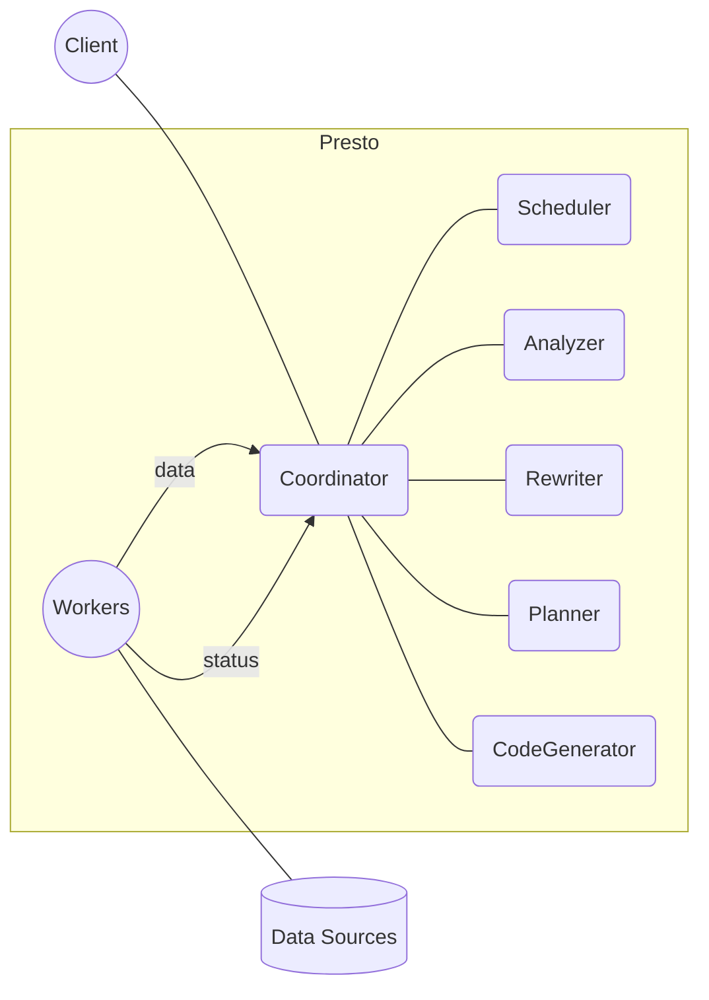

# Presto原理与代码实例讲解

## 1. 背景介绍
### 1.1 问题的由来
随着大数据时代的到来,企业需要处理和分析的数据量呈爆炸式增长。传统的数据仓库和数据处理系统已经无法满足快速查询和分析PB级海量数据的需求。为了应对这一挑战,Facebook推出了Presto - 一个开源的分布式SQL查询引擎,用于交互式查询海量数据。

### 1.2 研究现状
Presto自2013年开源以来,凭借其出色的性能和灵活性,已被包括Facebook、Netflix、Airbnb等众多互联网公司广泛应用,成为了海量数据交互式分析领域的主流工具之一。目前围绕Presto的学术研究主要集中在查询优化、内存管理、容错机制等方面。

### 1.3 研究意义
深入研究Presto的架构原理和实现细节,对于我们理解现代化大规模数据处理系统的设计思想和优化技巧具有重要意义。通过剖析Presto,我们可以学习到诸如DAG执行引擎、动态编译器、数据本地性优化等先进的系统构建理念,这些理念可以被应用到其他异构数据源的联邦查询系统中去。

### 1.4 本文结构
本文将分为9个章节,深入讲解Presto的技术架构、核心算法、关键实现、最佳实践等。内容安排如下:

- 第2节介绍Presto的核心概念与设计原则
- 第3节剖析Presto的核心算法原理与工作流程 
- 第4节讲解Presto所依赖的数学模型与公式
- 第5节通过代码实例演示Presto的开发与调试
- 第6节总结Presto的实际应用场景
- 第7节推荐Presto相关的学习资源与开发工具
- 第8节展望Presto未来的发展趋势与技术挑战
- 第9节附录,解答关于Presto的常见问题

## 2. 核心概念与联系

Presto的架构设计本着"可扩展、高可用、易用性"的原则,其核心概念包括:

- 数据源(Connector):可插拔的异构数据源适配器,支持Hive、MySQL、Kafka、JMX等
- 执行模型(Driver):基于DAG的并行执行引擎,负责任务调度与中间结果传输
- 内存管理(Memory Pools):自适应的内存资源分配与回收机制,避免Out of Memory
- 容错(Fault Tolerance):节点故障检测与任务重试机制,确保查询可靠执行
- 查询优化(Optimizer):基于代价的查询重写与Join重排序优化
- 动态编译(Code Generation):利用动态字节码生成技术,加速查询执行

下图描述了Presto的核心组件与交互关系:



核心流程如下:

1. Client提交SQL查询给Coordinator
2. Analyzer解析SQL语句,生成抽象语法树AST
3. Rewriter对AST进行语义检查和查询重写
4. Planner将优化后的查询转换为执行计划
5. CodeGenerator动态生成执行代码
6. Scheduler将任务分发给Workers执行
7. Workers从数据源并行读取数据,流式传输给Coordinator
8. Coordinator收集结果,返回给Client

## 3. 核心算法原理 & 具体操作步骤

### 3.1 算法原理概述

Presto的核心算法包括代价估算(Cost-Based Optimizer)、动态分区裁剪(Dynamic Partition Pruning)、字节码生成(Bytecode Generation)等。

其中代价估算是指根据数据分布情况,预估执行计划的CPU、内存、网络开销,选择代价最小的Join顺序。如TPC-H Q5:

```sql
SELECT n.name, sum(l.extendedprice * (1 - l.discount)) as revenue 
FROM customer c, orders o, lineitem l, supplier s, nation n, region r
WHERE c.custkey = o.custkey
  AND l.orderkey = o.orderkey
  AND l.suppkey = s.suppkey
  AND c.nationkey = s.nationkey
  AND s.nationkey = n.nationkey
  AND n.regionkey = r.regionkey
  AND r.name = 'ASIA'
  AND o.orderdate >= date '1994-01-01'
  AND o.orderdate < date '1995-01-01'
GROUP BY n.name
ORDER BY revenue desc;
```

优化器根据表的大小、过滤因子等信息,比较`(l join o) join c`和`(l join c) join o`两种不同Join顺序的代价,选择较优方案。

动态分区裁剪是Presto特有的优化技术。传统数据库的分区裁剪发生在查询编译期,而Presto利用DAG执行引擎,可在运行时裁剪分区,大大提升查询性能。如TPC-H Q8:

```sql
SELECT 
  o.orderdate,
  l.extendedprice,
  l.discount
FROM lineitem l
JOIN orders o ON l.orderkey = o.orderkey
JOIN part p ON l.partkey = p.partkey
JOIN supplier s ON l.suppkey = s.suppkey
WHERE p.type = 'ECONOMY ANODIZED STEEL'
  AND s.nation='CHINA';  
```

在Join `lineitem`和`orders`表时,Presto先过滤`orders`表得到一个`orderkey`集合,再用它裁剪`lineitem`表的分区,最后流式Join两表,避免了不必要的IO开销。

### 3.2 算法步骤详解

以动态分区裁剪为例,其算法步骤如下:

1. 扫描被驱动表,根据Join条件过滤出一组关联键
2. 将关联键广播到Join的工作节点
3. 工作节点根据关联键裁剪驱动表分区
4. 被裁剪后的分区并行流式传输到下游节点
5. 下游节点执行Join操作,输出结果

用伪代码表示如下:

```
function dynamicPartitionPruning(build, probe, joinCond, buildKey, probeKey)
  // Step 1: 扫描build表,收集Join键
  buildKeys = scan(build).filter(joinCond).collect(buildKey)
  
  // Step 2: 广播Join键
  broadcast(buildKeys)

  // Step 3: 裁剪probe表分区  
  prunedPartitions = partitionFilter(probe, probeKey in buildKeys)

  // Step 4 & 5: 流式并行Join
  return streamJoin(prunedPartitions, build, joinCond)
```

可见动态分区裁剪巧妙利用了Presto的执行框架,将Join键的收集和分区裁剪下推到数据源,最小化了网络和CPU开销。

### 3.3 算法优缺点

动态分区裁剪的优点包括:

- 延迟物化(Lazy Materialization):直到实际执行Join时才访问数据,减少不必要的IO
- 自适应(Adaptive):根据Join键动态调整数据的访问和传输,提高局部性
- 可并行(Parallelizable):分区裁剪和Join可在不同Worker上并行执行,加速查询  

但它也有一些局限性:

- 内存开销:需要缓存被驱动表的Join键,可能导致OOM
- 网络开销:Join键需要在节点间广播,占用网络带宽
- 非等值Join:对于非等值条件如不等式和Like,分区裁剪效果有限

### 3.4 算法应用领域

动态分区裁剪在MPP数据库和数据湖分析等场景下被广泛应用,可以加速包括:

- 星型模式(Star Schema):事实表与维度表的Join
- 数据立方体(Data Cube):OLAP中的Slice和Dice操作
- 窗口函数(Window Function):OVER从句中的PARTITION BY
- 数据湖(Data Lake):Hive、Iceberg等数据湖表的查询

总之,只要查询涉及到分区表的Join,都可以尝试应用动态分区裁剪进行优化。

## 4. 数学模型和公式 & 详细讲解 & 举例说明

### 4.1 数学模型构建

Presto查询优化器采用基于代价的模型(Cost-Based Model),通过估算物理执行计划的CPU、内存、网络开销,选择代价最小的方案。

假设一个Join操作的输入表为$T_1$和$T_2$,中间结果为$T_3$,则其代价可建模为:

$$ 
Cost = \alpha \cdot (M_1 + M_2 + M_3) + \beta \cdot (C_1 + C_2 + C_3) + \gamma \cdot (N_1 + N_2 + N_3)
$$

其中:

- $\alpha$、$\beta$、$\gamma$分别为内存、CPU、网络的权重系数
- $M_1$、$M_2$、$M_3$为输入表和Join结果占用的内存
- $C_1$、$C_2$、$C_3$为扫描输入表和Join计算消耗的CPU
- $N_1$、$N_2$、$N_3$为读取输入表和传输Join结果消耗的网络带宽

权重系数反映了集群的硬件配置和负载特征,可通过基准测试(Benchmark)得到。

### 4.2 公式推导过程

Join结果的大小估计是优化的关键,Presto采用如下公式:

$$
card(T_1 \bowtie T_2) = \frac{card(T_1) \cdot card(T_2)}{max(ndv(T_1.k), ndv(T_2.k))}
$$

其中:

- $card(T)$表示表$T$的行数
- $ndv(T.k)$表示表$T$Join键$k$的基数(Cardinality),即不同值的个数
- $\bowtie$表示Join操作

该公式假设两个表的Join键是独立的,这在现实中并不总是成立。因此Presto还引入了一个校正因子$\rho$:

$$
card(T_1 \bowtie T_2) = \rho \cdot \frac{card(T_1) \cdot card(T_2)}{max(ndv(T_1.k), ndv(T_2.k))}
$$

$\rho$的取值依赖于Join的类型(Inner、Left、Right、Full Outer)和Join键的相关性,可通过采样估计得到。

### 4.3 案例分析与讲解

以TPC-H Q5为例,假设各表的统计信息如下:

| 表名     | 行数   | custkey基数 | orderkey基数 | suppkey基数 |
|----------|--------|-------------|--------------|-------------|
| lineitem | 600万  | -           | 150万        | 100万       |
| orders   | 150万  | 150万       | 150万        | -           |
| customer | 15万   | 15万        | -            | -           |
| supplier | 100万  | -           | -            | 10万        |
| nation   | 25     | -           | -            | 25          |
| region   | 5      | -           | -            | -           |

假设Join顺序为`(lineitem ⋈ orders) ⋈ customer`,则中间结果的行数为:

$$
card(lineitem \bowtie orders) = \frac{6000000 \cdot 1500000}{1500000} = 6000000
$$

$$
card((lineitem \bowtie orders) \bowtie customer) = \frac{6000000 \cdot 150000}{150000} = 6000000
$$

可见Join `customer`表后,结果集大小并未增加,这是因为`orders`和`customer`的Join键`custkey`具有函数依赖关系:

$$orders.custkey \rightarrow customer.custkey$$

利用该特性,优化器可将`customer`表的属性下推到上层的Join中,减少不必要的扫描和网络传输。

### 4.4 常见问题解答

**Q:** Presto如何处理数据倾斜的Join?

**A:** 当某个Join键值出现的频率远高于其他值时,会导致该键值所在的Worker负载过高,称为"数据倾斜"。Presto通过两种方式缓解数据倾斜:

1. 拆分倾斜键值:将频繁出现的键值按哈希拆分到多个Worker,并行处理
2. 广播小表:如果某个表很小(如维度表),可将其广播到所有Worker,避免数据重分布

**Q:** Presto的查询优化是在单机还是分布式环境下进行?

**A:** Presto的查询优化是在Coordinator节点本地完成的,优化器通过收集Worker上的数据统计信息(如柱状文件的Min/Max值),构建全局的数据分布视图,从而做出更加准确的代价估算。同时,动