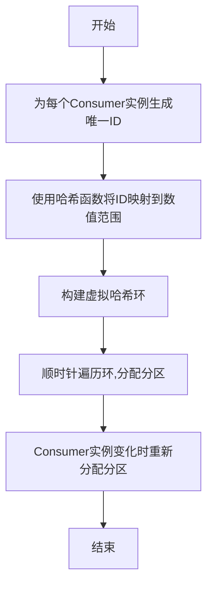
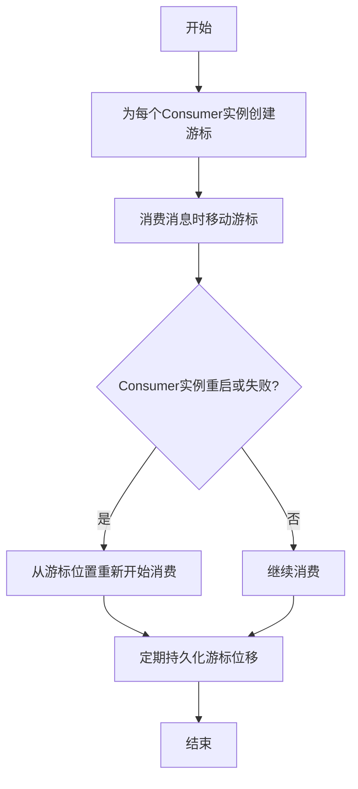
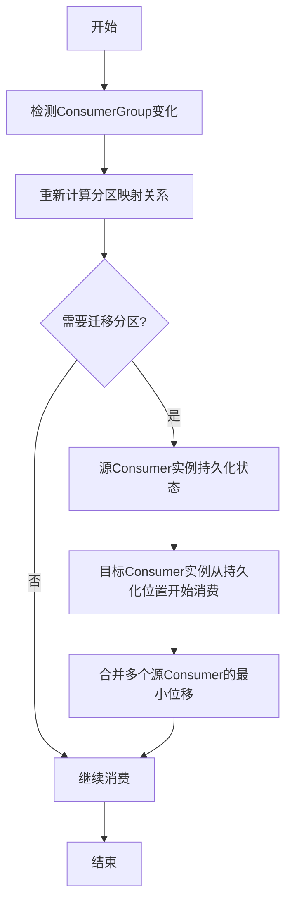
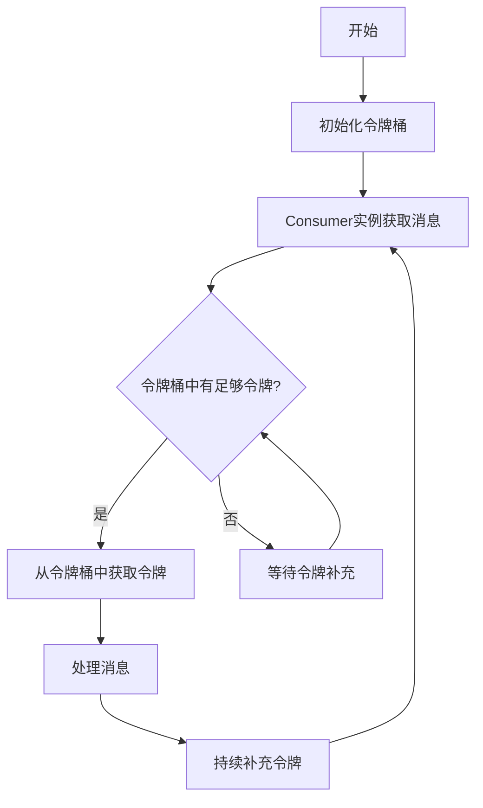

# Pulsar Consumer原理与代码实例讲解

## 1. 背景介绍

### 1.1 问题的由来

在现代分布式系统中，消息队列扮演着至关重要的角色。它们用于在不同的应用程序、服务和组件之间可靠地传递数据,确保了系统的解耦和可扩展性。Apache Pulsar是一个云原生、分布式的开源消息队列系统,它被广泛应用于大数据、流处理和事件驱动架构等领域。

在Pulsar中,Consumer(消费者)是一个关键的概念。它负责从Pulsar集群中消费(读取)消息,并将消息传递给下游应用程序进行处理。Consumer的性能和可靠性直接影响了整个消息传递系统的效率和稳定性。因此,深入理解Pulsar Consumer的原理和实现细节对于构建高效、可靠的分布式系统至关重要。

### 1.2 研究现状

目前,已有一些研究文献和技术博客探讨了Pulsar Consumer的相关概念和实现细节。然而,大多数资料要么过于简单,缺乏深入的技术细节,要么过于专业和晦涩,难以为普通开发者所理解。因此,有必要提供一份全面、深入且通俗易懂的技术文章,系统地介绍Pulsar Consumer的原理和实现。

### 1.3 研究意义

本文旨在为读者提供一个全面的视角,深入探讨Pulsar Consumer的核心概念、算法原理、数学模型、代码实现和实际应用场景。通过对这些关键方面的剖析,读者将能够更好地理解Pulsar Consumer的工作机制,掌握其实现细节,并学会如何在实际项目中高效地使用它。

此外,本文还将介绍一些实用的工具和学习资源,为读者提供进一步学习和开发的途径。最后,本文将对Pulsar Consumer的未来发展趋势和面临的挑战进行展望,为读者提供一个更广阔的视野。

### 1.4 本文结构

本文将按照以下结构进行阐述:

1. 背景介绍
2. 核心概念与联系
3. 核心算法原理与具体操作步骤
4. 数学模型和公式详细讲解与举例说明
5. 项目实践:代码实例和详细解释说明
6. 实际应用场景
7. 工具和资源推荐
8. 总结:未来发展趋势与挑战
9. 附录:常见问题与解答

## 2. 核心概念与联系

在深入探讨Pulsar Consumer的细节之前,我们需要先了解一些核心概念及它们之间的联系。

**Topic(主题)**: 在Pulsar中,Topic是消息的逻辑分类。生产者(Producer)将消息发布到特定的Topic,而消费者(Consumer)则从该Topic中消费(读取)消息。一个Topic可以有多个分区(Partition),每个分区包含该Topic的一部分消息。

**Subscription(订阅)**: Subscription定义了一个或一组Consumer实例如何从Topic中消费消息。Pulsar支持不同类型的Subscription,如Exclusive(独占式)、Shared(共享式)和Key_Shared(按Key共享式)等。

**Consumer(消费者)**: Consumer是从Topic中读取消息的实体。每个Consumer实例都属于一个特定的Subscription,并从该Subscription关联的Topic的一个或多个分区中消费消息。

**ConsumerGroup(消费者组)**: ConsumerGroup是指订阅同一个Topic的一组Consumer实例。这些Consumer实例通过某种方式(如Shared Subscription)协调消息的消费,以实现负载均衡和容错。

**Partitioned Topic(分区Topic)**: 当一个Topic被划分为多个分区时,称为Partitioned Topic。每个分区包含该Topic的一部分消息,由不同的Consumer实例独立消费。分区Topic可以提高消息传递的并行度和吞吐量。

**Consumer Rebalancing(消费者重平衡)**: 当ConsumerGroup中的Consumer实例数量发生变化(如新增或离开)时,Pulsar会自动触发重平衡过程,以确保所有分区都被适当地分配给当前的Consumer实例。这个过程对于维护消费的均衡和容错至关重要。

上述概念相互关联,共同构建了Pulsar消息传递系统的基础架构。Consumer作为其中的关键角色,与Topic、Subscription和ConsumerGroup等概念密切相关,共同确保了消息的可靠传递和高效消费。

## 3. 核心算法原理与具体操作步骤

### 3.1 算法原理概述

Pulsar Consumer的核心算法原理可以概括为以下几个方面:

1. **分区分配**: 对于Partitioned Topic,Pulsar需要合理地将Topic的各个分区分配给不同的Consumer实例,以实现并行消费和负载均衡。

2. **消费位移(Offset)管理**: 每个Consumer实例都需要跟踪自己在分区中的消费位移,以确保消息不会被重复消费或遗漏。

3. **消费重平衡**: 当ConsumerGroup中的Consumer实例数量发生变化时,Pulsar需要重新分配分区,并协调Consumer实例之间的状态迁移,以确保消费的连续性和一致性。

4. **消费流控**: 为了防止Consumer实例被大量消息所淹没,Pulsar采用了流控机制,控制消息的传递速率。

5. **容错与重试**: 在消费过程中,可能会由于各种原因(如网络故障、消费者崩溃等)导致消息消费失败。Pulsar需要提供容错和重试机制,确保消息的最终一致性。

这些核心算法原理共同构建了Pulsar Consumer的工作机制,确保了消息的可靠传递和高效消费。接下来,我们将详细解释每个方面的具体操作步骤。

### 3.2 算法步骤详解

#### 3.2.1 分区分配算法

对于Partitioned Topic,Pulsar采用了一种称为"Consistent Hashing"的分区分配算法。该算法的基本思想是将Topic的所有分区和Consumer实例都映射到一个虚拟的哈希环上,然后根据它们在环上的位置进行分配。具体步骤如下:

1. 为每个Consumer实例生成一个唯一的ID(例如基于主机名和进程ID)。
2. 使用一个哈希函数(如MD5或murmur3)将Consumer ID和分区ID映射到一个大的数值范围(如0~2^128-1)。
3. 将这些数值环形排列,构建一个虚拟的哈希环。
4. 顺时针遍历哈希环,将每个分区分配给第一个遇到的Consumer实例。
5. 如果某个Consumer实例离开了ConsumerGroup,则将它所分配的分区重新分配给下一个遇到的Consumer实例。

这种算法具有以下优点:

- 分区分配均匀,避免了负载不均衡的问题。
- 当Consumer实例数量发生变化时,只需重新分配少量分区,降低了重平衡开销。
- 算法具有良好的扩展性,可以支持大量的分区和Consumer实例。

下面是一个简单的Mermaid流程图,展示了分区分配算法的基本过程:

#### 3.2.2 消费位移管理算法

为了确保消息不会被重复消费或遗漏,每个Consumer实例都需要跟踪自己在分区中的消费位移(Offset)。Pulsar采用了一种基于游标(Cursor)的位移管理机制,具体步骤如下:

1. 为每个Consumer实例在每个分区中创建一个游标(Cursor),用于跟踪消费位移。
2. 当Consumer实例消费一条消息时,它会将游标向前移动一个位移。
3. 如果Consumer实例重启或失败,它可以从游标记录的位置重新开始消费。
4. 定期将游标的位移持久化到Pulsar的元数据存储中,以确保位移信息的持久性。

这种基于游标的位移管理机制具有以下优点:

- 简单高效,只需跟踪一个游标即可管理消费位移。
- 提供了消息消费的精确控制,可以随时重新开始消费。
- 位移信息持久化,确保了消费状态的一致性和可恢复性。

下面是一个简单的Mermaid流程图,展示了消费位移管理算法的基本过程:

#### 3.2.3 消费重平衡算法

当ConsumerGroup中的Consumer实例数量发生变化时,Pulsar需要重新分配分区,并协调Consumer实例之间的状态迁移,以确保消费的连续性和一致性。这个过程称为消费重平衡(Consumer Rebalancing)。具体步骤如下:

1. 检测到ConsumerGroup中的Consumer实例数量发生变化。
2. 使用分区分配算法(如Consistent Hashing)重新计算分区与Consumer实例的映射关系。
3. 对于需要从一个Consumer实例迁移到另一个实例的分区,执行以下操作:
   a. 源Consumer实例将游标位移和其他状态信息持久化。
   b. 目标Consumer实例从持久化的位置开始消费该分区。
4. 对于需要从多个源Consumer实例迁移到一个目标实例的分区,目标实例将从最小的游标位移处开始消费,以确保不会遗漏任何消息。
5. 重平衡完成后,所有Consumer实例都开始从新分配的分区中消费。

这种重平衡算法可以确保消费的连续性和一致性,同时最大限度地减少了重平衡过程中的消息重复消费和遗漏。下面是一个简单的Mermaid流程图,展示了消费重平衡算法的基本过程:

#### 3.2.4 消费流控算法

为了防止Consumer实例被大量消息所淹没,Pulsar采用了一种基于令牌桶(Token Bucket)的流控算法。具体步骤如下:

1. 为每个Consumer实例维护一个令牌桶,初始化时填充一定数量的令牌。
2. 每当Consumer实例从Broker获取消息时,它需要从令牌桶中获取相应数量的令牌。
3. 如果令牌桶中的令牌数量不足,则Consumer实例需要等待,直到有足够的令牌可用。
4. 令牌桶会以一定的速率持续补充新的令牌,这个速率就是Consumer实例的最大消费速率。

这种基于令牌桶的流控算法可以有效地限制Consumer实例的消费速率,防止它被大量消息所淹没。同时,它也允许短时间内的突发流量,提高了系统的灵活性和响应能力。

下面是一个简单的Mermaid流程图,展示了消费流控算法的基本过程:

#### 3.2.5 容错与重试算法

在消费过程中,可能会由于各种原因(如网络故障、消费者崩溃等)导致消息消费失败。Pulsar提供了容错和重试机制,以确保消息的最终一致性。具体步骤如下:

1. 当Consumer实例消费失败时,它会将该消息重新放回到分区中,以便后续