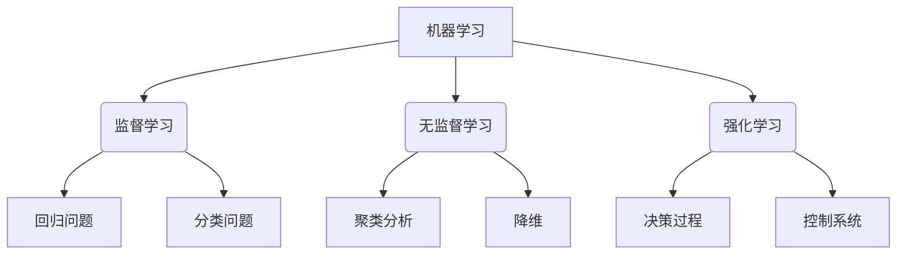

以下是根据您提供的要求和大纲，撰写的技术博客文章正文部分：

# Python机器学习实战：从零开始构建机器学习环境

## 1. 背景介绍

### 1.1 问题的由来

在当今数据时代，机器学习已经成为各行业不可或缺的核心技术。无论是金融、医疗、制造业还是互联网公司，都在积极拥抱机器学习带来的创新和效率提升。然而，要真正掌握机器学习并将其应用到实际项目中,需要具备扎实的理论基础和实践经验。

### 1.2 研究现状  

目前，已经有大量的机器学习教程、课程和书籍面向初学者和专业人士。但是,很多资源要么过于理论化,难以真正理解机器学习算法的实现细节;要么过于实践化,缺乏对基础理论的系统阐述。此外,现有资源往往假设读者已经拥有一定的编程和数学基础,这给完全的初学者带来了一定的入门障碍。

### 1.3 研究意义

本文旨在为读者提供一个全面而实用的机器学习入门教程,帮助初学者从零开始,循序渐进地构建机器学习的理论和实践基础。通过详细的理论解释、数学模型推导、代码实现和案例分析,读者可以全面掌握机器学习的核心概念、算法原理和编程实践。

### 1.4 本文结构

本文首先介绍机器学习的核心概念和常用算法,并详细解释它们的原理和数学模型。接下来,我们将通过实际的代码示例,一步步实现这些算法,并对代码进行解读和分析。最后,本文将探讨机器学习在实际应用中的场景,以及未来的发展趋势和挑战。

## 2. 核心概念与联系

机器学习的核心思想是让计算机从数据中自动分析、获取模式,并利用这些模式对未知数据进行预测或决策。常见的机器学习任务包括:

1. **监督学习(Supervised Learning)**: 根据已知的输入数据和对应的标签(目标输出),训练模型对新数据进行预测或分类。例如,根据房屋面积、卧室数量等特征预测房价(回归问题),或根据电子邮件内容判断是否为垃圾邮件(分类问题)。

2. **无监督学习(Unsupervised Learning)**: 仅利用输入数据,发现其中隐藏的模式或结构。例如,对客户进行聚类分析,将具有相似特征的客户分组。

3. **强化学习(Reinforcement Learning)**: 通过与环境的交互,学习如何获取最大的累积奖励。例如,教会计算机程序玩游戏或控制机器人行走。

这些不同的学习范式紧密相连,有时也会结合使用。例如,在自然语言处理任务中,可以先使用无监督学习对文本进行向量化表示,然后使用监督学习进行文本分类或机器翻译。

## 3. 核心算法原理 & 具体操作步骤

在机器学习中,有许多经典的算法和模型,每一种都有其特定的应用场景和优缺点。接下来,我们将重点介绍几种核心算法的原理和实现步骤。

### 3.1 算法原理概述  

#### 3.1.1 线性回归

线性回归是最基本、最常用的监督学习算法之一。它试图找到一个最佳拟合的线性方程,使输入数据的特征值与目标值之间的残差平方和最小化。线性回归可用于解决回归问题,如房价预测、销量预测等。

#### 3.1.2 逻辑回归  

逻辑回归是一种用于分类问题的监督学习算法。它通过对数几率回归,将输入数据映射到0到1之间的值,并根据设定的阈值(通常为0.5)进行二分类。逻辑回归常用于垃圾邮件分类、疾病诊断等任务。

#### 3.1.3 决策树

决策树是一种树形结构的监督学习模型,通过对特征进行递归分区,将数据划分为不同的子集。决策树易于解释,但也容易过拟合。常见的决策树算法包括ID3、C4.5和CART等。

#### 3.1.4 支持向量机(SVM)

支持向量机是一种有监督的非概率二分类模型。它的基本思想是在特征空间中构建一个超平面,将不同类别的数据点分隔开,并使正负实例与超平面的距离最大化。SVM在高维空间中表现良好,常用于文本分类、图像识别等。

#### 3.1.5 K-均值聚类

K-均值是一种常用的无监督学习算法,用于对数据进行聚类。它通过迭代计算,将数据划分为K个簇,每个数据点被分配到与其最近的聚类中心的簇中。K-均值广泛应用于客户细分、图像压缩等领域。

#### 3.1.6 主成分分析(PCA)

主成分分析是一种常用的无监督学习技术,用于降维和数据可视化。它通过线性变换,将高维数据投影到一个低维子空间中,同时尽量保留原始数据的方差。PCA常用于数据预处理、图像压缩等。

### 3.2 算法步骤详解

以线性回归为例,我们来详细解释其算法步骤:

1. **数据预处理**:对输入数据进行标准化或归一化处理,使不同特征在同一数量级上,避免某些特征对模型的影响过大。

2. **定义代价函数**:线性回归的代价函数通常使用平方误差代价函数,即目标值与预测值之差的平方和。
   $$J(\theta) = \frac{1}{2m}\sum_{i=1}^m(h_\theta(x^{(i)}) - y^{(i)})^2$$
   其中 $m$ 是训练样本数, $x^{(i)}$ 是第 $i$ 个样本的特征向量, $y^{(i)}$ 是对应的目标值, $h_\theta(x)$ 是当前模型的预测值。

3. **梯度下降**:使用梯度下降算法来优化代价函数,找到使代价函数最小的模型参数 $\theta$。
   - 计算代价函数对每个参数的偏导数(梯度):
     $$\frac{\partial J(\theta)}{\partial \theta_j} = \frac{1}{m}\sum_{i=1}^m(h_\theta(x^{(i)}) - y^{(i)})x_j^{(i)}$$
   - 更新参数:
     $$\theta_j := \theta_j - \alpha\frac{\partial J(\theta)}{\partial \theta_j}$$
     其中 $\alpha$ 是学习率,控制每次更新的步长。

4. **迭代优化**:重复执行梯度下降,不断更新参数,直到代价函数收敛或达到停止条件。

5. **模型评估**:在测试集上评估模型的性能,计算均方根误差等指标。

6. **模型调优**:如果模型性能不佳,可以尝试调整正则化参数、特征选择、模型复杂度等,以获得更好的泛化能力。

### 3.3 算法优缺点

每种算法都有其适用场景、优缺点和局限性:

- **线性回归**:简单易懂,训练速度快,但只能学习线性模式,对非线性数据效果不佳。
- **逻辑回归**:可直接对分类问题建模,计算代价低,但对数据的线性可分性假设较强。
- **决策树**:可解释性强,无需特征缩放,但容易过拟合,并且对数据的微小变化敏感。
- **支持向量机**:泛化能力强,适用于高维空间,但计算开销大,对缺失数据敏感。
- **K-均值聚类**:简单高效,易于理解和并行化,但需要预先确定聚类数K,并对异常值敏感。
- **主成分分析**:能够有效降低数据维度,但可能丢失部分有用信息。

在实际应用中,我们通常需要根据具体问题的特点和数据的性质,选择合适的算法或算法组合。

### 3.4 算法应用领域

机器学习算法在诸多领域有着广泛的应用,下面列举了一些典型的应用场景:

- **金融**:信用评分、欺诈检测、风险管理、股市预测。
- **医疗**:疾病诊断、药物开发、医疗图像分析、精准医疗。
- **零售**:用户行为分析、个性化推荐、营销策略优化。
- **制造业**:预测性维护、质量控制、工艺优化。
- **交通**:智能交通系统、路径规划、无人驾驶。
- **自然语言处理**:文本分类、情感分析、机器翻译、对话系统。
- **计算机视觉**:图像分类、目标检测、人脸识别、视频分析。
- **网络安全**:入侵检测、垃圾邮件过滤、恶意软件检测。

随着算力和数据量的不断增长,机器学习的应用前景将更加广阔。

## 4. 数学模型和公式 & 详细讲解 & 举例说明

在机器学习算法的背后,都有着严谨的数学模型和公式作为理论基础。理解这些模型和公式,对于掌握算法的本质原理至关重要。

### 4.1 数学模型构建

以线性回归为例,我们构建如下数学模型:

已知一个数据集 $\mathcal{D} = \{(x^{(1)}, y^{(1)}), (x^{(2)}, y^{(2)}), \ldots, (x^{(m)}, y^{(m)})\}$,其中 $x^{(i)} \in \mathbb{R}^n$ 是一个 $n$ 维特征向量, $y^{(i)} \in \mathbb{R}$ 是对应的目标值(标量)。我们的目标是找到一个假设函数(模型) $h_\theta: \mathbb{R}^n \rightarrow \mathbb{R}$,使其能够很好地拟合训练数据,并对新的输入数据 $x$ 给出准确的预测值 $\hat{y} = h_\theta(x)$。

对于线性回归,我们假设目标值 $y$ 可以被特征 $x$ 的线性组合精确表示,即:

$$h_\theta(x) = \theta_0 + \theta_1x_1 + \theta_2x_2 + \ldots + \theta_nx_n = \theta^Tx$$

其中, $\theta = (\theta_0, \theta_1, \ldots, \theta_n)^T$ 是模型的参数向量,需要通过训练数据来估计得到。

### 4.2 公式推导过程

为了找到最优的参数 $\theta$,我们需要定义一个代价函数(Loss Function) $J(\theta)$,用于衡量模型的预测值与真实值之间的差异。线性回归通常使用平方误差代价函数:

$$J(\theta) = \frac{1}{2m}\sum_{i=1}^m(h_\theta(x^{(i)}) - y^{(i)})^2$$

我们的目标是最小化代价函数,即找到使 $J(\theta)$ 最小的参数 $\theta$。通过对代价函数取偏导数,并使用梯度下降算法,我们可以迭代地更新参数值:

$$\theta_j := \theta_j - \alpha\frac{\partial J(\theta)}{\partial \theta_j}$$

其中,梯度为:

$$\frac{\partial J(\theta)}{\partial \theta_j} = \frac{1}{m}\sum_{i=1}^m(h_\theta(x^{(i)}) - y^{(i)})x_j^{(i)}$$

$\alpha$ 是学习率,控制每次更新的步长。通过不断迭代,直到收敛或达到停止条件,我们就可以得到最优的参数估计值 $\hat{\theta}$。

### 4.3 案例分析与讲解

为了更好地理解线性回归模型,我们来分析一个房价预测的案例。假设我们有一个包含房屋面积(单位:平方