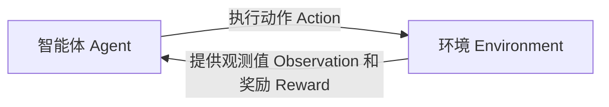

好的,我会严格遵守你提出的约束条件,以专业的技术语言写一篇深入全面的博客文章。下面是正文部分:

# Python机器学习实战：强化学习在游戏AI中的实际应用

## 1. 背景介绍

### 1.1 问题的由来

游戏AI一直是人工智能领域的一个热门研究方向。传统的游戏AI主要依赖于规则库和搜索算法,但这种方法在处理复杂环境时往往表现欠佳。随着深度学习和强化学习技术的不断发展,人工智能技术在游戏AI领域取得了长足进步。

强化学习是机器学习的一个重要分支,它通过与环境的互动来学习如何获取最大化的累积奖励。与监督学习不同,强化学习没有给定的标签数据集,智能体需要通过不断尝试并根据反馈调整策略,逐步获得最优决策序列。这种学习方式与人类在玩游戏时的学习过程非常相似,因此强化学习在游戏AI领域有着广阔的应用前景。

### 1.2 研究现状

近年来,结合深度神经网络的深度强化学习(Deep Reinforcement Learning)技术在游戏AI领域取得了突破性进展。DeepMind公司的AlphaGo在围棋领域战胜人类顶尖高手,就是深度强化学习技术的杰出代表。此外,在Atari视频游戏、星际争霸、Dota等多个游戏领域,深度强化学习也展现出了卓越的表现。

与此同时,开源的Python生态系统中也涌现出了多个优秀的强化学习框架,如OpenAI的Stable-Baselines3、Google的Dopamine、Facebook的Horizon等,极大地推动了强化学习技术在游戏AI领域的实践应用。

### 1.3 研究意义 

将强化学习应用于游戏AI具有重要的理论和实践意义:

- 理论意义:游戏环境提供了一个理想的强化学习测试平台,可以验证和改进各种强化学习算法。游戏AI的研究成果也将推动强化学习理论的发展。

- 实践意义:强化学习游戏AI不仅可以提高游戏的娱乐性和可玩性,还可以为其他复杂决策问题提供借鉴,如机器人控制、自动驾驶、智能调度等。

- 商业价值:优秀的游戏AI可以显著提升游戏的用户体验,从而带来可观的经济收益。同时,游戏AI技术的突破也将为元宇宙等新兴领域插上腾飞的翅膀。

### 1.4 本文结构

本文将全面介绍如何使用Python生态系统中的强化学习框架,开发出卓越的游戏AI。文章首先阐述强化学习在游戏AI中的核心概念,然后深入探讨强化学习算法的原理和实现细节。接下来,我们将通过数学模型和公式,揭示算法的本质。在此基础上,文章将提供完整的代码实例,并对其进行详细的解读和分析。最后,我们将分享一些实际应用场景,并对未来的发展趋势和挑战进行展望。

## 2. 核心概念与联系

在深入探讨强化学习算法之前,我们有必要先了解一些核心概念。强化学习建模了一个智能体(Agent)与环境(Environment)之间的交互过程,如下图所示:

其中:

- **智能体(Agent)**: 也称为决策者,它根据当前的观测值选择一个动作执行。
- **环境(Environment)**: 描述了智能体所处的外部世界,它根据智能体的动作产生新的观测值和奖励信号。
- **状态(State)**: 环境的一个具体实例,通常用一个向量表示。
- **动作(Action)**: 智能体对环境的操作,会导致环境状态的转移。
- **奖励(Reward)**: 环境给予智能体的反馈,指导智能体朝着正确的方向学习。
- **策略(Policy)**: 智能体根据当前状态选择动作的策略,是强化学习要学习的最终目标。

强化学习的目标是通过与环境的交互,学习到一个最优策略,使得智能体在该策略指导下能够获得最大化的累积奖励。这个过程没有监督学习中的标签数据,智能体需要通过不断尝试并根据反馈调整策略,逐步获得最优决策序列。

在游戏AI中,我们可以将游戏视为一个环境,游戏AI就是智能体。游戏AI的目标是学习到一个最优策略,在游戏中获得最高分数(即最大化累积奖励)。游戏的观测值可以是游戏画面、游戏内部状态等;游戏AI的动作则对应于游戏中的操作命令;而游戏分数的变化就是奖励信号。

## 3. 核心算法原理与具体操作步骤

### 3.1 算法原理概述

强化学习算法主要分为两大类:基于价值函数的算法和基于策略的算法。前者先估计出每个状态的价值函数(Value Function),再由价值函数推导出最优策略;后者则直接对策略函数(Policy Function)进行参数化建模,通过策略梯度的方式优化参数。

目前,结合深度神经网络的深度强化学习算法在游戏AI领域取得了卓越的成就,主要有:

- **深度Q网络(Deep Q-Network, DQN)**: 第一个将深度学习应用于强化学习的突破性算法,使用神经网络估计Q值函数。
- **策略梯度算法(Policy Gradient)**: 直接对策略函数进行参数化建模,通过梯度上升的方式优化策略参数。
- **Actor-Critic算法**: 结合价值函数估计和策略梯度的优势,使用Actor网络学习策略,Critic网络估计价值函数。
- **深度确定性策略梯度(Deep Deterministic Policy Gradient, DDPG)**: 适用于连续动作空间的Actor-Critic算法。

这些算法在处理游戏AI问题时,都能达到非常出色的表现。下面我们将以DDPG算法为例,详细阐述其核心原理和具体实现步骤。

### 3.2 算法步骤详解  

DDPG算法的核心思想是同时学习一个确定性的行为策略(Actor)和一个价值函数(Critic),并利用时序差分(Temporal Difference)的思想更新两者的参数。具体来说,DDPG算法包括以下几个主要步骤:

#### 3.2.1 初始化

1. 初始化评估者网络(Critic网络)$Q(s,a|\theta^Q)$和行为网络(Actor网络)$\mu(s|\theta^\mu)$,分别用于估计状态动作值函数和生成确定性策略。
2. 为每个网络复制一个目标网络$Q'$和$\mu'$,用于更新。
3. 初始化经验回放池(Replay Buffer)$\mathcal{D}$,用于存储状态转移样本。

#### 3.2.2 与环境交互

1. 在当前状态$s_t$下,根据行为网络输出的策略$a_t=\mu(s_t|\theta^\mu)$选择动作。
2. 在环境中执行动作$a_t$,观测到新状态$s_{t+1}$和奖励$r_t$。
3. 将状态转移样本$(s_t,a_t,r_t,s_{t+1})$存入经验回放池$\mathcal{D}$。

#### 3.2.3 从经验中学习

1. 从经验回放池$\mathcal{D}$中随机采样一个批次的状态转移样本。
2. 计算目标Q值:
   $$y_t = r_t + \gamma Q'(s_{t+1}, \mu'(s_{t+1}|\theta^{\mu'})|\theta^{Q'})$$
   其中$\gamma$是折现因子,用于权衡当前奖励和未来奖励的重要性。
3. 更新评估者网络$Q$的参数,使其输出的Q值$Q(s_t,a_t|\theta^Q)$逼近目标Q值$y_t$:
   $$\theta^Q \leftarrow \theta^Q - \alpha_Q \nabla_{\theta^Q}(y_t - Q(s_t,a_t|\theta^Q))^2$$
   其中$\alpha_Q$是评估者网络的学习率。
4. 更新行为网络$\mu$的参数,使其输出的动作$a_t=\mu(s_t|\theta^\mu)$最大化$Q(s_t,a_t|\theta^Q)$:
   $$\theta^\mu \leftarrow \theta^\mu + \alpha_\mu \nabla_{\theta^\mu}Q(s_t,\mu(s_t|\theta^\mu)|\theta^Q)$$
   其中$\alpha_\mu$是行为网络的学习率。
5. 更新目标网络$Q'$和$\mu'$的参数,使其缓慢逼近评估者网络和行为网络:
   $$\theta^{Q'} \leftarrow \tau\theta^Q + (1-\tau)\theta^{Q'}$$
   $$\theta^{\mu'} \leftarrow \tau\theta^\mu + (1-\tau)\theta^{\mu'}$$
   其中$\tau$是目标网络的软更新率,是一个较小的常数。

#### 3.2.4 重复学习

重复执行步骤3.2.2和3.2.3,直到策略收敛或达到预定的训练轮次。

通过上述步骤,DDPG算法能够有效地处理连续动作空间的强化学习问题,并在诸多游戏AI任务中取得了优异的表现。

### 3.3 算法优缺点

DDPG算法的主要优点如下:

- 能够直接处理连续动作空间的问题,不需要进行动作空间离散化。
- 利用经验回放池和目标网络稳定了训练过程,提高了算法的收敛性。
- Actor-Critic架构结合了价值函数估计和策略梯度的优势,能够更好地平衡偏差和方差。

但DDPG算法也存在一些不足之处:

- 收敛速度较慢,需要大量的样本数据和训练时间。
- 对超参数(如学习率、折现因子等)的设置比较敏感,需要反复调试。
- 在高维状态空间和动作空间时,性能会受到一定影响。

### 3.4 算法应用领域

DDPG算法及其变体广泛应用于以下领域的连续控制问题:

- 物理控制系统:如机器人控制、无人机控制、自动驾驶等。
- 游戏AI:如物理模拟游戏、赛车游戏、第一人称射击游戏等。
- 金融领域:如做市商自动交易、投资组合优化等。
- 能源系统:如智能电网负载控制、可再生能源发电调度等。

总的来说,DDPG算法为解决实际世界中的连续控制问题提供了一种有效的方法,在游戏AI等领域发挥着重要作用。

## 4. 数学模型和公式详细讲解与举例说明

在上一节中,我们介绍了DDPG算法的核心原理和实现步骤。现在,让我们通过数学模型和公式,深入揭示算法的本质。

### 4.1 数学模型构建

在强化学习中,我们通常将环境建模为一个马尔可夫决策过程(Markov Decision Process, MDP)。MDP可以用一个五元组$(S, A, P, R, \gamma)$来表示,其中:

- $S$是状态空间的集合
- $A$是动作空间的集合  
- $P(s'|s,a)$是状态转移概率,表示在状态$s$执行动作$a$后,转移到状态$s'$的概率
- $R(s,a)$是奖励函数,表示在状态$s$执行动作$a$后获得的即时奖励
- $\gamma \in [0,1)$是折现因子,用于权衡当前奖励和未来奖励的重要性

在MDP中,智能体的目标是学习一个最优策略$\pi^*(a|s)$,使得在该策略指导下,能够获得最大化的期望累积奖励:

$$J(\pi) = \mathbb{E}_\pi\left[\sum_{t=0}^\infty \gamma^t R(s_t, a_t)\right]$$

其中$\mathbb{E}_\pi[\cdot]$表示在策略$\pi$下的期望值。

为了找