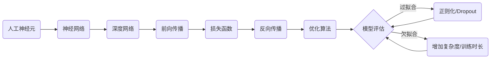

# Python机器学习实战：深度学习入门与TensorFlow应用

作者：禅与计算机程序设计艺术 / Zen and the Art of Computer Programming

## 1. 背景介绍

### 1.1 问题的由来

近年来,随着大数据和计算能力的快速发展,机器学习特别是深度学习技术取得了突飞猛进的进展。深度学习以其强大的特征学习和建模能力,在计算机视觉、语音识别、自然语言处理等多个领域取得了远超传统方法的效果,成为当前人工智能领域最为热门的研究方向之一。

### 1.2 研究现状

目前,深度学习已经在学术界和工业界得到了广泛的应用。在学术界,以 Geoffrey Hinton、Yann LeCun、Yoshua Bengio 为代表的科学家持续推动着深度学习理论的发展和创新。在工业界,Google、Facebook、微软等科技巨头纷纷成立了专门的深度学习研究院,将深度学习应用到了搜索、广告、推荐等核心业务中。

### 1.3 研究意义

尽管深度学习取得了巨大成功,但对于广大开发者和研究者来说,入门深度学习仍然存在不少障碍。首先是理论门槛高,需要掌握机器学习、优化理论、信息论等多个数学分支的知识。其次实践编程难度大,需要熟悉 Python、TensorFlow 等语言和框架,并且调参、调优等经验成本高。因此,系统地介绍深度学习的基本概念、核心算法、编程实践和应用案例,对于普及深度学习知识、培养更多的深度学习人才具有重要意义。

### 1.4 本文结构

本文将以 Python 和 TensorFlow 为基础,系统介绍深度学习的理论和实战。内容涵盖了深度学习的核心概念、主要模型(MLP、CNN、RNN)、经典网络(LeNet、AlexNet、VGGNet、GoogLeNet、ResNet)详解,以及基于 TensorFlow 的模型构建、训练和预测等开发实践。同时还精选了图像分类、文本分类、语音识别、机器翻译等经典案例,便于理解和掌握。

## 2. 核心概念与联系

深度学习源于对人脑神经网络的模拟,其核心是通过构建具有多层结构的人工神经网络,并利用海量数据对网络进行训练,使其能够自动学习数据背后的复杂模式和规律。深度学习中的几个核心概念包括:

- 人工神经元(Artificial Neuron):模拟生物神经元,接收一组输入并产生输出。常用的神经元模型有感知机、Sigmoid、tanh、ReLU 等。
- 神经网络(Neural Network):由多个神经元按一定拓扑结构连接而成。根据网络结构可分为前馈网络、循环网络等。
- 深度网络(Deep Network):具有多个隐藏层的神经网络。相比浅层网络,深度网络具有更强的特征学习和抽象能力。
- 前向传播(Forward Propagation):信息从输入层经隐藏层传递到输出层的过程。
- 反向传播(Backward Propagation):计算损失函数关于每层权重的梯度,并将梯度反向传播更新权重的过程,是训练神经网络的核心算法。
- 损失函数(Loss Function):衡量模型预测值与真实值之间差异的函数。常见的有均方误差、交叉熵等。
- 优化算法(Optimization Algorithm):用于最小化损失函数,更新网络权重。常用的有梯度下降及其变种(BGD、SGD、MBGD)、动量法、Adam 等。
- 过拟合(Overfitting):模型过度拟合训练数据,缺乏泛化能力。解决方法包括增加数据、正则化、Dropout 等。
- 欠拟合(Underfitting):模型拟合能力不足,无法很好地学习数据的内在模式。解决方法包括增加网络复杂度、延长训练时间等。

深度学习中这些核心概念环环相扣,共同构建起理论和方法的基础。

## 3. 核心算法原理 & 具体操作步骤

### 3.1 算法原理概述

反向传播(Backpropagation,简称 BP)是训练神经网络的核心算法,其基本原理是:根据损失函数计算出输出层的梯度,然后递归地将梯度传播到隐藏层和输入层,并利用梯度下降等优化算法更新各层权重,使网络预测值尽可能接近真实值。

### 3.2 算法步骤详解

BP 算法主要分为四个步骤:

(1) 前向传播:根据输入和当前权重计算各神经元的输出,直到得到输出层结果。以一个L层网络为例,第 l 层第 j 个神经元的输出为:

$$a_j^l = \sigma(z_j^l) = \sigma(\sum_i w_{ij}^l a_i^{l-1} + b_j^l)$$

其中 $\sigma$ 为激活函数,$w_{ij}^l$ 为第 l-1 层第 i 个神经元到第 l 层第 j 个神经元的权重,$b_j^l$ 为第 l 层第 j 个神经元的偏置。

(2) 计算损失:用损失函数衡量输出与真实标签之间的差异。以均方误差为例,单个样本的损失为:

$$J = \frac{1}{2}\sum_j (y_j - a_j^L)^2$$

其中 $y_j$ 为真实标签,$a_j^L$ 为输出层第 j 个神经元的输出。

(3) 反向传播:首先计算输出层的梯度,然后逐层反向传播到输入层。第 l 层第 j 个神经元关于其加权输入的梯度为:

$$\delta_j^l = \frac{\partial J}{\partial z_j^l} = 
\begin{cases}
(a_j^L - y_j) \sigma'(z_j^L) & l = L\\
(\sum_k w_{kj}^{l+1} \delta_k^{l+1}) \sigma'(z_j^l) & l < L
\end{cases}$$

(4) 更新权重:利用梯度下降法更新各层权重。第 l 层第 j 个神经元关于第 i 个输入的权重更新公式为:

$$w_{ij}^l := w_{ij}^l - \alpha \frac{\partial J}{\partial w_{ij}^l} = w_{ij}^l - \alpha \delta_j^l a_i^{l-1}$$

其中 $\alpha$ 为学习率。偏置更新公式类似。

重复以上步骤,不断迭代直到损失函数收敛或达到预设的训练轮数。

### 3.3 算法优缺点

BP 算法的主要优点是:
- 可以学习复杂的非线性模式
- 计算高效,适合大规模数据和深度网络
- 容易实现,且可与多种网络结构结合

但也存在一些缺点,如:
- 可能收敛到局部最优而非全局最优 
- 对参数初始化和超参数选择敏感
- 训练时间长,调参难度大

### 3.4 算法应用领域

BP 算法是深度学习的基石,几乎所有深度网络的训练都依赖 BP 算法及其变种。主要应用包括:
- 计算机视觉:图像分类、目标检测、语义分割等
- 语音识别:声学模型训练
- 自然语言处理:词向量、语言模型、机器翻译等
- 推荐系统:用户画像、特征交叉等

## 4. 数学模型和公式 & 详细讲解 & 举例说明

### 4.1 数学模型构建

以一个简单的三层神经网络(输入层、隐藏层、输出层)为例,假设输入向量为 $\boldsymbol{x} = (x_1, x_2, ..., x_n)$,隐藏层有 $m$ 个神经元,输出层有 $p$ 个神经元,对应输出向量 $\boldsymbol{y} = (y_1, y_2, ..., y_p)$。

记隐藏层第 $j$ 个神经元的加权输入为 $z_j^h$,输出为 $a_j^h$,输出层第 $k$ 个神经元的加权输入为 $z_k^o$,输出为 $a_k^o$,则前向传播过程可表示为:

$$z_j^h = \sum_{i=1}^n w_{ij}^h x_i + b_j^h, \quad a_j^h = \sigma(z_j^h) \quad (j=1,2,...,m)$$

$$z_k^o = \sum_{j=1}^m w_{jk}^o a_j^h + b_k^o, \quad a_k^o = \sigma(z_k^o) \quad (k=1,2,...,p)$$

其中 $w_{ij}^h$ 为输入层第 $i$ 个神经元到隐藏层第 $j$ 个神经元的权重,$b_j^h$ 为隐藏层第 $j$ 个神经元的偏置;$w_{jk}^o$ 为隐藏层第 $j$ 个神经元到输出层第 $k$ 个神经元的权重,$b_k^o$ 为输出层第 $k$ 个神经元的偏置。

假设损失函数为均方误差:

$$J = \frac{1}{2} \sum_{k=1}^p (y_k - a_k^o)^2$$

### 4.2 公式推导过程

根据 BP 算法步骤,首先计算输出层神经元的梯度:

$$\delta_k^o = \frac{\partial J}{\partial z_k^o} = (a_k^o - y_k) \sigma'(z_k^o) \quad (k=1,2,...,p)$$

然后计算隐藏层神经元的梯度:

$$\delta_j^h = \frac{\partial J}{\partial z_j^h} = (\sum_{k=1}^p w_{jk}^o \delta_k^o) \sigma'(z_j^h) \quad (j=1,2,...,m)$$

最后更新权重和偏置:

$$w_{jk}^o := w_{jk}^o - \alpha \frac{\partial J}{\partial w_{jk}^o} = w_{jk}^o - \alpha \delta_k^o a_j^h$$

$$b_k^o := b_k^o - \alpha \frac{\partial J}{\partial b_k^o} = b_k^o - \alpha \delta_k^o$$

$$w_{ij}^h := w_{ij}^h - \alpha \frac{\partial J}{\partial w_{ij}^h} = w_{ij}^h - \alpha \delta_j^h x_i$$

$$b_j^h := b_j^h - \alpha \frac{\partial J}{\partial b_j^h} = b_j^h - \alpha \delta_j^h$$

其中 $\alpha$ 为学习率。重复迭代上述过程直到收敛。

### 4.3 案例分析与讲解

下面以一个简单的二分类问题为例,演示 BP 算法的计算过程。假设输入为二维向量 $\boldsymbol{x} = (x_1, x_2)$,隐藏层 2 个神经元,输出层 1 个神经元,激活函数均为 Sigmoid 函数:

$$\sigma(z) = \frac{1}{1 + e^{-z}}$$

并且有一个样本 $(\boldsymbol{x}, y) = ((1, 0), 1)$,即当输入为 $(1, 0)$ 时,期望输出为 $1$。

首先初始化权重和偏置,例如:

$$w_{11}^h = 0.3, w_{21}^h = 0.5, b_1^h = 0.4$$
$$w_{12}^h = -0.1, w_{22}^h = 0.2, b_2^h = -0.3$$  
$$w_{11}^o = 0.2, w_{21}^o = -0.4, b_1^o = 0.1$$

然后进行前向传播:

$$z_1^h = 0.3 \times 1 + 0.5 \times 0 + 0.4 = 0.7, \quad a_1^h = \sigma(0.7) = 0.668$$
$$z_2^h = -0.1 \times 1 + 0.2 \times 0 - 0.3 = -0.4, \quad a_2^h = \