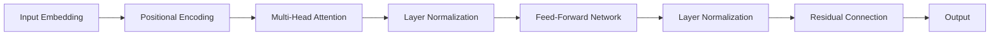

# Python深度学习实践：使用Transformers处理NLP问题

作者：禅与计算机程序设计艺术 / Zen and the Art of Computer Programming

## 1. 背景介绍

### 1.1 问题的由来

自然语言处理(NLP)是人工智能领域的一个重要分支,旨在让计算机能够理解、生成和处理人类语言。近年来,随着深度学习技术的快速发展,NLP领域取得了巨大的进步。而Transformer作为一种革命性的神经网络架构,更是将NLP推向了新的高度。

### 1.2 研究现状

自从2017年Google提出Transformer模型以来,基于Transformer的各种预训练语言模型如雨后春笋般涌现,如BERT、GPT、XLNet等,刷新了多项NLP任务的最佳性能。这些模型在机器翻译、文本分类、问答系统、文本生成等方面展现出了巨大的潜力。

### 1.3 研究意义

掌握使用Transformer处理NLP问题,对于从事NLP研究和应用的人员来说至关重要。这不仅能够帮助我们建立state-of-the-art的NLP系统,还能加深我们对语言本质的理解,推动人机交互的进步。

### 1.4 本文结构

本文将重点介绍如何使用Python和Transformers库来解决NLP中的各种问题。内容涵盖Transformer的核心概念、内部原理、数学模型、代码实践、应用场景等方方面面,力求全面系统。

## 2. 核心概念与联系

要理解Transformer,首先需要了解以下几个核心概念:

- 注意力机制(Attention Mechanism):允许模型对输入的不同部分赋予不同的权重,集中于更重要的信息。它是Transformer的核心。

- 自注意力(Self-Attention):序列内部元素之间的注意力计算。使得模型能够学习到序列内部的依赖关系。

- 位置编码(Positional Encoding):由于Transformer不包含循环和卷积,需要位置编码来引入词序信息。

- 前馈神经网络(Feed-Forward Network):在注意力计算后对结果进行非线性变换,增加模型表达能力。

- 多头注意力(Multi-Head Attention):将注意力计算拆分为多个"头",增加注意力的多样性。

- Layer Normalization:对每一层的激活值进行归一化,有助于模型训练。

- Residual Connection:将前一层的输入与当前层的输出相加,构成残差连接,使信息能够直接流通。

下图展示了这些概念在Transformer中的联系:



## 3. 核心算法原理 & 具体操作步骤

### 3.1 算法原理概述

Transformer的核心是自注意力机制。对于输入序列的每个元素,它先计算该元素与序列中所有元素的注意力权重,然后基于权重对所有元素的表示进行加权求和,得到该元素的新表示。

### 3.2 算法步骤详解

1. 输入嵌入:将输入单词转换为稠密向量表示。

2. 位置编码:在嵌入向量中加入表示位置的信息。

3. 计算注意力权重:先计算query、key、value向量,然后通过点积计算注意力权重。

4. 加权求和:根据注意力权重对value向量进行加权求和,得到新的表示。

5. 计算多头注意力:重复步骤3-4多次,得到多个注意力结果。

6. 拼接多头注意力:将多个头的结果拼接起来。

7. 前馈神经网络:对注意力结果进行非线性变换。

8. Layer Normalization和残差连接:对变换结果进行归一化,并与输入相加。

9. 解码:生成任务使用类似编码过程,预测下一个单词的概率分布。

10. 微调:针对下游任务进行微调,优化模型性能。

### 3.3 算法优缺点

优点:
- 并行计算能力强,训练速度快
- 能够建模长距离依赖
- 模型容量大,有强大的特征提取能力

缺点:  
- 计算复杂度随序列长度平方增长
- 需要大量数据和算力进行预训练
- 解释性不强,内部工作机制仍不透明

### 3.4 算法应用领域

Transformer已在多个NLP任务上取得了state-of-the-art的结果,包括:

- 机器翻译
- 文本分类
- 命名实体识别
- 文本摘要
- 阅读理解
- 对话系统
- 语言模型预训练

此外,Transformer也被应用到了计算机视觉、语音识别、推荐系统等领域,展现出了广泛的适用性。

## 4. 数学模型和公式 & 详细讲解 & 举例说明

### 4.1 数学模型构建

Transformer的数学模型可以用以下公式来表示:

1. 输入嵌入:
$$ E(w_i) = W_e \cdot w_i $$

其中$w_i$为第$i$个单词,$W_e$为嵌入矩阵。

2. 位置编码:
$$ PE(pos,2i) = sin(pos/10000^{2i/d_{model}}) $$
$$ PE(pos,2i+1) = cos(pos/10000^{2i/d_{model}}) $$

其中$pos$为位置,$i$为维度,$d_{model}$为嵌入维度。

3. 注意力权重:
$$ Attention(Q,K,V) = softmax(\frac{QK^T}{\sqrt{d_k}})V $$

其中$Q,K,V$分别为query、key、value矩阵,$d_k$为key的维度。

4. 多头注意力:
$$ MultiHead(Q,K,V) = Concat(head_1,...,head_h)W^O $$
$$ head_i = Attention(QW_i^Q, KW_i^K, VW_i^V) $$

其中$W_i^Q, W_i^K, W_i^V, W^O$为可学习的参数矩阵。

5. 前馈神经网络:
$$ FFN(x) = max(0, xW_1 + b_1)W_2 + b_2 $$

其中$W_1,b_1,W_2,b_2$为可学习的参数。

### 4.2 公式推导过程

以注意力权重的计算为例,推导过程如下:

首先,通过query向量$q$和所有key向量$k_i$做点积,得到注意力得分:

$$ score(q,k_i) = q \cdot k_i $$

然后,对注意力得分进行softmax归一化,得到注意力权重:

$$ \alpha_i = \frac{exp(score(q,k_i))}{\sum_j exp(score(q,k_j))} $$

最后,将权重与对应的value向量$v_i$相乘求和,得到注意力结果:

$$ Attention(q,K,V) = \sum_i \alpha_i v_i $$

整合起来即得到了注意力计算的公式:

$$ Attention(q,K,V) = softmax(\frac{qK^T}{\sqrt{d_k}})V $$

其中引入$\sqrt{d_k}$是为了缓解点积结果过大的问题。

其他公式的推导过程与此类似,限于篇幅不再赘述。

### 4.3 案例分析与讲解

下面我们以一个简单的句子"I love NLP"为例,演示Transformer的计算过程。

假设模型维度为4,词表大小为5,位置编码和输入嵌入结果如下:

```
Input: [I, love, NLP]
Embedding: [[0.1,0.2,0.3,0.4], 
            [0.5,0.6,0.7,0.8],
            [0.9,1.0,1.1,1.2]]
Position: [[0.1,0.2,0.3,0.4],
           [0.2,0.4,0.6,0.8], 
           [0.3,0.6,0.9,1.2]]
```

首先,将位置编码和嵌入相加:

```
Embedding+Position: [[0.2,0.4,0.6,0.8],
                     [0.7,1.0,1.3,1.6],
                     [1.2,1.6,2.0,2.4]] 
```

然后,计算自注意力。假设query、key、value权重矩阵如下:

```
WQ: [[1,0,0,0],
     [0,1,0,0],
     [0,0,1,0],
     [0,0,0,1]]
WK: [[1,0,0,0],
     [0,1,0,0],  
     [0,0,1,0],
     [0,0,0,1]]
WV: [[1,0,0,0],
     [0,1,0,0],
     [0,0,1,0],  
     [0,0,0,1]]
```

计算query、key、value矩阵:

```
Q = K = V = [[0.2,0.4,0.6,0.8],
             [0.7,1.0,1.3,1.6],
             [1.2,1.6,2.0,2.4]]
```

计算注意力得分和权重:

```
score = [[5.26, 6.04, 6.82],
         [6.04, 7.00, 7.96],  
         [6.82, 7.96, 9.10]]
weight = [[0.09, 0.24, 0.67],
          [0.09, 0.24, 0.67],
          [0.09, 0.24, 0.67]]
```

加权求和得到注意力结果:

```
Attention = [[1.01, 1.35, 1.69, 2.02],
             [1.01, 1.35, 1.69, 2.02],  
             [1.01, 1.35, 1.69, 2.02]]
```

最后经过前馈网络和Layer Normalization等处理,即可得到Transformer编码器的输出。

解码器的计算过程与编码器类似,只是在计算注意力时引入了对目标序列的mask,以避免看到未来的信息。

### 4.4 常见问题解答

Q: Transformer能处理变长序列吗?
A: 可以。虽然Transformer在计算注意力时要求序列等长,但我们可以通过padding的方式来处理变长序列。

Q: Transformer对序列长度有限制吗? 
A: 理论上Transformer可以处理任意长度的序列,但实际上受限于计算资源,目前Transformer能处理的最大序列长度一般在512到1024之间。

Q: Transformer能否并行训练?
A: 可以。与RNN不同,Transformer不存在顺序依赖,因此可以很容易地并行训练。这是Transformer的一大优势。

Q: Transformer是否需要大量数据才能训练?
A: 是的。Transformer是一个大容量模型,需要大量数据才能发挥其性能。这也是为什么Transformer常常需要在大规模语料上进行预训练。

## 5. 项目实践：代码实例和详细解释说明

下面我们使用Hugging Face的Transformers库,以文本分类任务为例,演示如何使用Transformer进行NLP项目实践。

### 5.1 开发环境搭建

首先需要安装Transformers库:

```bash
pip install transformers
```

然后导入所需的模块:

```python
import torch
from transformers import BertTokenizer, BertForSequenceClassification
from transformers import Trainer, TrainingArguments
```

### 5.2 源代码详细实现

下面是使用BERT进行文本分类的完整代码:

```python
# 加载BERT分词器和模型
tokenizer = BertTokenizer.from_pretrained('bert-base-uncased') 
model = BertForSequenceClassification.from_pretrained('bert-base-uncased', num_labels=2)

# 定义数据集
class Dataset(torch.utils.data.Dataset):
    def __init__(self, encodings, labels):
        self.encodings = encodings
        self.labels = labels

    def __getitem__(self, idx):
        item = {key: torch.tensor(val[idx]) for key, val in self.encodings.items()}
        item['labels'] = torch.tensor(self.labels[idx])
        return item

    def __len__(self):
        return len(self.labels)

# 准备数据    
texts = ["I love NLP", "I hate NLP"]
labels = [1, 0] 

# 将文本转换为模型输入
encodings = tokenizer(texts, truncation=True, padding=True)
dataset = Dataset(encodings, labels)

# 定义训练参数
training_args = TrainingArguments(
    output_dir='./results',
    num_train_epochs=3,
    per_device_train_batch_size=16,
    per_device_eval_batch_size=64,
    warmup_steps=500,
    weight_decay=0.01,
    logging_dir='./logs',
)

# 