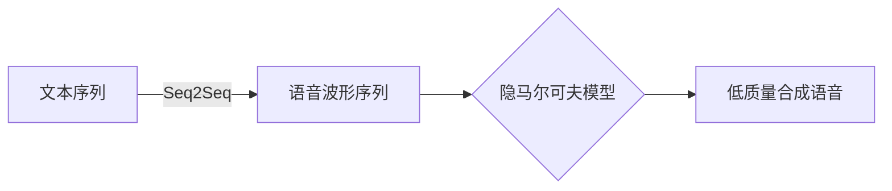
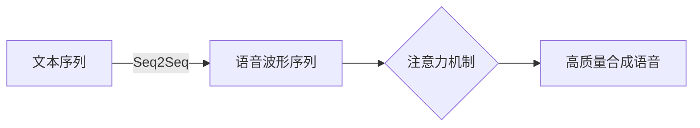
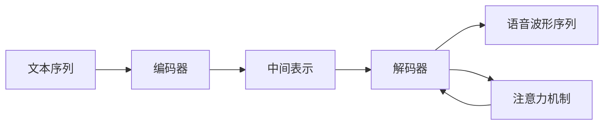

好的,我会严格遵守您提出的约束条件,尽最大努力撰写一篇专业、深入且富有见解的技术博客文章。以下是正文内容:

# Python深度学习实践:合成人类语言的语音合成技术

## 1. 背景介绍

### 1.1 问题的由来

语音合成技术旨在使计算机能够以自然、流畅的方式产生类似人类的语音输出。这项技术的发展源于对提高人机交互体验的需求,特别是为视障人士提供语音辅助服务。传统的语音合成系统依赖于拼凑预先录制的语音片段,语音质量较差且缺乏自然感。随着深度学习技术的兴起,端到端的神经网络语音合成模型应运而生,显著提高了合成语音的质量和自然度。

### 1.2 研究现状  

近年来,基于深度学习的语音合成模型取得了长足进步,如WaveNet、Tacotron等。这些模型能够直接从文本生成高质量的语音波形,大大提升了合成语音的真实性。不过,现有模型在处理长句子、多说话人、情感语音等方面仍有待改进。此外,模型的训练过程计算量大、收敛慢等问题也有待解决。

### 1.3 研究意义

高质量的语音合成技术可广泛应用于虚拟助手、有声读物、多媒体系统等领域,为视障人士提供无障碍访问信息的途径,提高人机交互的自然体验。本文将介绍使用Python实现端到端的神经网络语音合成模型,分析其核心原理、算法细节及代码实现,为读者提供实践指导。

### 1.4 本文结构

本文首先介绍语音合成的核心概念和深度学习模型,包括注意力机制、序列到序列模型等。接下来详细阐述主流语音合成模型的算法原理、数学模型及实现细节。然后通过实例代码讲解如何使用Python构建语音合成系统。最后探讨该技术的应用场景、发展趋势和未来挑战。

## 2. 核心概念与联系

语音合成的核心思想是将输入的文本序列转换为语音波形序列。这可视为一个序列到序列(Seq2Seq)的建模问题,即将源序列(文本)映射到目标序列(语音波形)。传统的隐马尔可夫模型(HMM)方法需要大量的人工设计和调参,难以获得自然流畅的语音。



深度学习模型则能够端到端地学习文本到语音的映射,无需手工设计大量中间步骤。其核心是注意力机制(Attention Mechanism),可自动对齐并选择输入序列的不同部分用于生成当前时间步的输出。这种灵活的对齐方式大大提高了长序列的建模能力。



## 3. 核心算法原理及具体操作步骤

### 3.1 算法原理概述

主流的端到端语音合成模型通常采用编码器-解码器(Encoder-Decoder)架构,结合注意力机制实现高质量的语音合成。编码器将输入文本序列编码为中间表示,解码器则根据该表示生成语音波形序列。注意力机制能够自动对齐输入和输出序列,动态关注输入不同位置对应的信息。



常见的编码器有卷积神经网络(CNN)、循环神经网络(RNN)、Transformer等。解码器则多采用自回归模型,如RNN、WaveNet等,逐个时间步生成语音波形。注意力机制的类型也有多种,如加性注意力、乘性注意力、多头注意力等。

### 3.2 算法步骤详解

以Tacotron 2为例,其语音合成过程可分为以下几个步骤:

1. **字符嵌入**: 将输入文本序列转换为字符嵌入表示。
2. **编码器**: 使用卷积银行(Convolutional Bank)提取字符级特征,再通过CBHG模块(由卷积模块和高维线性投影组成)提取序列级特征,获得编码器输出。
3. **注意力模块**: 将编码器输出与解码器隐状态相结合,计算注意力对齐权重。
4. **解码器(预训练模型)**: 使用位置编码的注意力CBHG模块生成mel频谱特征序列。
5. **WaveNet声码器(vocoder)**: 将mel频谱作为条件输入,生成最终的语音波形序列。

### 3.3 算法优缺点

优点:

- 端到端建模,无需大量的人工特征工程
- 注意力机制提高了长序列建模能力
- 生成的语音质量高,自然度好

缺点:  

- 训练数据量需求大,模型训练计算开销大
- 对训练数据质量要求高,存在潜在的一致性问题
- 难以精确控制语音情感、说话人身份等属性

### 3.4 算法应用领域

语音合成技术可广泛应用于以下领域:

- 虚拟助手系统(Siri、Alexa等)
- 有声读物(电子书、新闻广播等)
- 多媒体系统(动画配音、游戏人物等)
- 无障碍辅助(为视障人士提供信息访问)
- 人机交互界面
- 教育和语言学习应用

## 4. 数学模型和公式详细讲解及举例说明

### 4.1 数学模型构建

语音合成可视为将文本序列 $X=\{x_1,x_2,...,x_T\}$ 映射到语音波形序列 $Y=\{y_1,y_2,...,y_T'\}$ 的条件序列生成问题,目标是最大化条件概率 $P(Y|X)$。通过贝叶斯公式可得:

$$P(Y|X) = \frac{P(X|Y)P(Y)}{P(X)}$$

其中 $P(X)$ 是文本序列的先验概率,在语音合成任务中通常忽略不计。$P(Y)$ 为语音波形序列的先验概率分布,可由语言模型估计。$P(X|Y)$ 是反向概率,即根据语音波形序列推测产生它的文本序列,这在语音识别任务中更为常见。

因此,语音合成的目标可简化为直接对 $P(Y|X)$ 建模,即最大化:

$$\hat{Y}=\arg\max_{Y}P(Y|X;\theta)$$

其中 $\theta$ 为模型参数。这恰是序列到序列(Seq2Seq)模型所要学习的条件分布。

### 4.2 公式推导过程

注意力机制是Seq2Seq模型的关键,它能够自动对齐源序列和目标序列。传统的Seq2Seq模型每个时间步的解码只依赖于上一步的隐状态和当前输入,很难充分捕获长期依赖关系。注意力机制通过计算上下文向量,使每个时间步的解码都能够关注源序列的不同位置,从而更好地建模长序列。

设编码器的输出为 $\boldsymbol{h}=\{\boldsymbol{h}_1,\boldsymbol{h}_2,...,\boldsymbol{h}_T\}$, 解码器的第 $t'$ 步隐状态为 $\boldsymbol{s}_{t'}$,则上下文向量 $\boldsymbol{c}_{t'}$ 的计算公式为:

$$\boldsymbol{c}_{t'} = \sum_{t=1}^T\alpha_{t,t'}\boldsymbol{h}_t$$

其中 $\alpha_{t,t'}$ 为注意力权重,表示解码时第 $t'$ 步对编码器第 $t$ 步输出的关注程度。通过学习一个对齐模型 $\alpha_{t,t'}=\alpha(\boldsymbol{s}_{t'},\boldsymbol{h}_t)$ 来计算注意力权重。常用的对齐模型有加性注意力、乘性注意力等。

加性注意力的计算公式为:

$$\begin{aligned}
\alpha_{t,t'}&=\frac{\exp(e_{t,t'})}{\sum_{k=1}^T\exp(e_{t,k})}\\
e_{t,t'}&=\boldsymbol{v}^\top\tanh(\boldsymbol{W}_1\boldsymbol{s}_{t'}+\boldsymbol{W}_2\boldsymbol{h}_t)
\end{aligned}$$

其中 $\boldsymbol{W}_1,\boldsymbol{W}_2,\boldsymbol{v}$ 为可学习的权重参数。

### 4.3 案例分析与讲解

以Tacotron 2模型为例,我们分析其中的CBHG模块(1-D卷积银行+高维线性投影+GRU)是如何提取序列特征的。

1-D卷积银行由 $K$ 个卷积核组成,每个卷积核的大小为 $k\times 1$,对输入序列进行卷积操作,提取不同尺度的局部特征。设输入序列为 $\boldsymbol{x}$,第 $k$ 个卷积核的权重为 $\boldsymbol{w}^{(k)}$,偏置为 $b^{(k)}$,则第 $k$ 个卷积核的输出为:

$$\boldsymbol{c}^{(k)}=\boldsymbol{x}*\boldsymbol{w}^{(k)}+b^{(k)}$$

所有卷积核的输出拼接得到卷积银行的输出:

$$\boldsymbol{C}=[\boldsymbol{c}^{(1)},\boldsymbol{c}^{(2)},...,\boldsymbol{c}^{(K)}]$$

高维线性投影将卷积银行的输出 $\boldsymbol{C}$ 映射到更高维的特征空间,增强其表达能力:

$$\boldsymbol{C}'=\max(0,\boldsymbol{C}\boldsymbol{W}+\boldsymbol{b})$$

其中 $\boldsymbol{W},\boldsymbol{b}$ 为可学习参数。

最后,GRU网络对高维线性投影的输出进行序列建模,捕获长期依赖关系,生成最终的序列特征表示。

通过上述模块的级联,CBHG能够同时提取局部和全局的序列特征,为语音合成任务提供有效的序列表示。

### 4.4 常见问题解答

**Q1:为什么要使用注意力机制?**

A1:传统的Seq2Seq模型在处理长序列时容易出现梯度消失或爆炸的问题,难以捕获长期依赖关系。注意力机制通过计算上下文向量,使每个时间步的解码都能够关注源序列的不同位置,从而更好地建模长序列。

**Q2:如何控制合成语音的语速、音高等属性?**

A2:大多数现有的语音合成模型都是端到端的黑盒模型,难以精确控制合成语音的细节属性。一种常见的做法是在训练数据中标注相应的属性(如语速、音高等),使模型学习到这些条件信息。另一种方法是在推理时,对模型的输入或内部表示进行人工调节,从而控制输出语音的属性。

**Q3:语音合成模型的训练需要多少数据?**

A3:深度神经网络模型通常需要大量的训练数据才能取得良好的泛化性能。对于语音合成任务,高质量的多说话人语音数据集往往需要数十到数百个小时的录音数据。同时,训练数据的质量和多样性也很重要,以避免模型过度拟合。

## 5. 项目实践:代码实例和详细解释说明  

### 5.1 开发环境搭建

我们使用Python生态系统中的深度学习框架PyTorch来实现语音合成模型。首先需要安装PyTorch及其音频处理库torchaudio:

```bash
pip install torch torchaudio
```

对于GPU加速训练,还需要安装CUDA工具包。接下来,克隆语音合成模型的代码仓库:

```bash 
git clone https