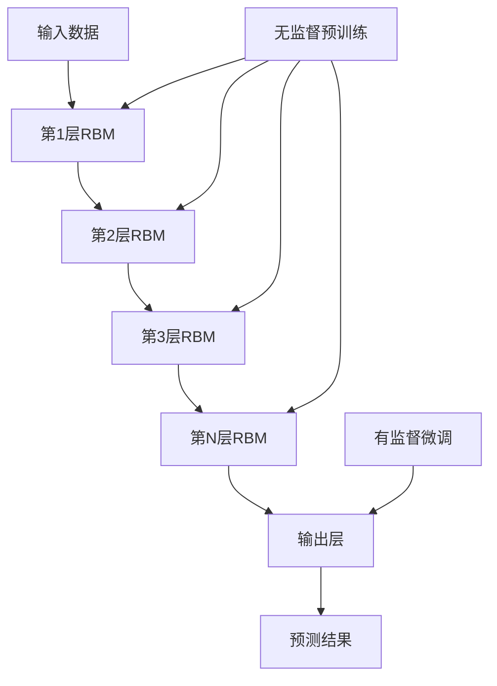

# Python深度学习实践：深度信念网络（DBN）的理论与实践

## 1. 背景介绍
### 1.1 问题的由来
深度学习作为人工智能领域的一个重要分支,在近年来取得了突破性的进展。深度信念网络(Deep Belief Network, DBN)作为深度学习的代表性模型之一,因其出色的特征学习能力和分层结构而备受关注。然而,对于许多刚接触深度学习的学习者和实践者来说,DBN的理论与实践仍然存在一定的门槛。

### 1.2 研究现状
目前,关于DBN的研究主要集中在理论分析、算法改进和应用拓展等方面。在理论研究方面,学者们探讨了DBN的数学原理[1]、收敛性[2]、泛化能力[3]等问题。在算法改进方面,研究人员提出了多种优化策略,如预训练方法[4]、正则化技术[5]等,以提升DBN的性能。在应用领域,DBN已被广泛用于图像识别[6]、语音识别[7]、自然语言处理[8]等任务,取得了良好的效果。

### 1.3 研究意义
尽管DBN取得了诸多进展,但在实际应用中仍面临一些挑战,如参数调优难度大、训练时间长等。因此,有必要对DBN的理论基础进行系统梳理,并结合具体的编程实践,帮助读者全面理解和掌握这一重要的深度学习模型。本文将从理论到实践,深入浅出地介绍DBN的原理和应用,为读者提供一份全面的学习指南。

### 1.4 本文结构
本文将从以下几个方面展开介绍DBN:
- 第2部分介绍DBN的核心概念与基本原理
- 第3部分重点讲解DBN的学习算法和关键步骤
- 第4部分从数学角度推导DBN的模型公式
- 第5部分通过Python代码实例演示DBN的具体实现
- 第6部分讨论DBN在实际场景中的应用案例
- 第7部分推荐DBN相关的学习资源和工具
- 第8部分总结全文,并展望DBN的未来发展方向
- 第9部分列举DBN学习过程中的常见问题及解答

## 2. 核心概念与联系

DBN是一种基于概率图模型的生成式深度神经网络。它由多个受限玻尔兹曼机(Restricted Boltzmann Machine, RBM)组成,通过逐层无监督预训练和有监督微调得到。下面我们对DBN的核心概念进行梳理:

- 受限玻尔兹曼机(RBM):构成DBN的基本组件,由可见层和隐藏层组成的二分图模型。
- 能量函数:刻画了RBM中可见层和隐藏层变量的联合概率分布。
- 对比散度(Contrastive Divergence, CD):一种基于吉布斯采样的RBM快速学习算法。
- 无监督预训练:逐层训练RBM,将前一层RBM的隐藏层作为后一层RBM的可见层,提取数据的层次特征表示。  
- 有监督微调:在预训练的基础上,利用带标签数据对整个网络进行有监督训练,使其适应特定任务。

下图展示了DBN的基本结构和训练流程:

## 3. 核心算法原理 & 具体操作步骤
### 3.1 算法原理概述
DBN的学习过程分为无监督预训练和有监督微调两个阶段。在预训练阶段,DBN通过逐层训练RBM来学习数据的层次特征表示。每一层RBM可以看作是一个特征提取器,将输入数据转化为更高层次的特征。在微调阶段,DBN在预训练得到的权重基础上,利用带标签的数据对整个网络进行有监督训练,使其适应特定的任务。

### 3.2 算法步骤详解
1. 无监督预训练:
   - 将原始数据输入第1层RBM,利用CD算法训练RBM参数
   - 固定第1层RBM参数,将其隐藏层激活值作为第2层RBM的输入,训练第2层RBM
   - 重复上述过程,逐层训练RBM,直到最顶层
2. 有监督微调:
   - 在预训练得到的DBN上添加输出层,构成完整的网络结构
   - 利用带标签的数据,通过反向传播算法微调整个网络的权重参数
   - 不断迭代,直到网络在验证集上的性能指标达到满意的水平

### 3.3 算法优缺点
DBN的主要优点包括:
- 逐层预训练可以有效缓解深层网络的梯度消失问题
- 无监督学习使得DBN可以利用大量无标签数据进行训练
- 层次结构有利于学习数据的高级特征表示

DBN的缺点包括:  
- 训练过程较为复杂,参数调优难度大
- 训练时间相对较长,对计算资源要求较高
- 模型解释性较差,学习到的特征不够直观

### 3.4 算法应用领域
DBN在很多领域都有着广泛的应用,如:
- 计算机视觉:用于图像分类、目标检测、人脸识别等任务
- 语音识别:用于语音特征提取和声学建模
- 自然语言处理:用于词向量学习、情感分析、机器翻译等
- 推荐系统:用于学习用户和物品的隐式特征表示

## 4. 数学模型和公式 & 详细讲解 & 举例说明
### 4.1 数学模型构建
DBN的数学模型建立在RBM的基础之上。假设RBM有$n$个可见层单元和$m$个隐藏层单元,可见层变量为$\mathbf{v}=(v_1,\dots,v_n)$,隐藏层变量为$\mathbf{h}=(h_1,\dots,h_m)$。RBM的能量函数定义为:

$$
E(\mathbf{v},\mathbf{h};\theta) = -\sum_{i=1}^n a_i v_i - \sum_{j=1}^m b_j h_j - \sum_{i=1}^n \sum_{j=1}^m w_{ij} v_i h_j
$$

其中,$\theta=(\mathbf{a},\mathbf{b},\mathbf{W})$为RBM的参数,包括可见层偏置$\mathbf{a}$、隐藏层偏置$\mathbf{b}$和权重矩阵$\mathbf{W}$。

基于能量函数,RBM的联合概率分布为:

$$
P(\mathbf{v},\mathbf{h};\theta) = \frac{1}{Z(\theta)} \exp(-E(\mathbf{v},\mathbf{h};\theta))
$$

其中,$Z(\theta)$是配