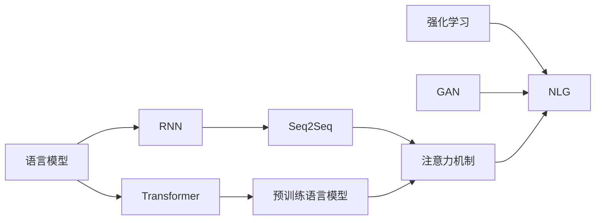

# Python深度学习实践：运用自然语言生成编写故事

作者：禅与计算机程序设计艺术 / Zen and the Art of Computer Programming

## 1. 背景介绍
### 1.1 问题的由来
在人工智能领域，自然语言生成(Natural Language Generation, NLG)一直是一个备受关注的研究方向。NLG旨在让计算机能够像人一样，自动生成流畅、连贯、有意义的文本。近年来，随着深度学习技术的快速发展，尤其是Transformer等模型的出现，NLG取得了突破性进展，在机器翻译、对话生成、文本摘要等任务上展现出了接近甚至超越人类的能力。

然而，如何利用NLG技术自动创作出精彩的故事，仍是一个巨大的挑战。与其他NLG任务不同，编写故事需要模型具备更强的逻辑思维、因果推理、常识知识等能力，能够把握故事的起承转合，塑造个性鲜明的人物，营造吸引人的情节。这对NLG模型提出了更高的要求。

### 1.2 研究现状
目前，运用深度学习进行故事自动生成的研究已经取得了一些进展。一些研究尝试利用序列到序列(Seq2Seq)模型、注意力机制、记忆网络等技术，让模型学习大量故事语料，从而掌握故事写作的基本规律。还有研究探索了如何融入常识知识、因果推理等信息，提升生成故事的合理性和连贯性。

但总的来说，目前的故事生成模型在创意性、逻辑性、可读性等方面还存在不少局限性。生成的故事往往比较简单和模式化，缺乏出人意料的情节发展，人物塑造也不够丰满立体。如何进一步提升NLG模型的"文学创作"能力，让机器也能创作出精彩纷呈的故事，仍是一个开放的研究问题。

### 1.3 研究意义
研究利用NLG技术自动编写故事，具有重要的理论意义和应用价值：

- 有助于探索人类语言智能和创造力的奥秘，推动认知科学和人工智能的发展。
- 可以极大提高文学创作的效率，为人类作家提供灵感和素材，催生出新的创作模式。 
- 自动生成的故事可应用于游戏、虚拟现实、智能教育等领域，带来更加丰富多彩的内容体验。
- 对于理解人类如何构建复杂认知和进行创造性思维具有重要启示意义。

### 1.4 本文结构
本文将重点探讨如何利用Python深度学习框架和自然语言生成技术，实现一个能够自动编写故事的AI系统。内容安排如下：

- 第2部分介绍故事自动生成涉及的一些核心概念和它们之间的联系。 
- 第3部分重点阐述几种主流的故事生成算法原理和具体操作步骤。
- 第4部分给出故事生成背后的数学模型和公式，并通过案例进行详细讲解。
- 第5部分演示如何使用Python代码实现一个基于深度学习的故事生成项目，并解析关键代码。
- 第6部分讨论故事自动生成技术的实际应用场景和未来前景。
- 第7部分推荐一些学习故事自动生成的相关工具和资源。
- 第8部分总结全文，并展望该领域的发展趋势和面临的挑战。

## 2. 核心概念与联系
在利用NLG实现故事自动生成的过程中，有几个核心概念需要了解：

- **语言模型(Language Model)**: 用于刻画自然语言中词语序列的概率分布的统计模型。通过对大规模语料的学习，语言模型能够估计一个句子出现的概率，或者在给定若干词的前提下，预测下一个最可能出现的词语。语言模型是NLG的基础。

- **循环神经网络(Recurrent Neural Network, RNN)**: 一种能够处理序列数据的神经网络结构。RNN通过引入隐藏状态来记忆之前的信息，从而能够建模语言中的长距离依赖关系。LSTM和GRU是两种常用的RNN变体，能够缓解梯度消失问题。RNN是构建语言模型的常用方法。

- **Seq2Seq模型**: 一种用于序列到序列转换的端到端学习框架，由编码器和解码器两部分组成。编码器将输入序列编码为一个固定长度的向量表示，解码器根据该表示生成目标序列。Seq2Seq模型广泛用于机器翻译、对话生成等任务，也可用于故事生成。

- **注意力机制(Attention Mechanism)**: 一种用于提升Seq2Seq模型性能的技术。传统的编码器-解码器框架中，编码器将输入序列压缩为一个固定长度的向量，可能损失了一些重要信息。注意力机制允许解码器在生成每个词时，都能重新聚焦到输入序列中与当前预测最相关的部分，从而更好地利用上下文信息。

- **Transformer**: 一种完全基于注意力机制的序列建模框架，抛弃了RNN结构，通过自注意力和位置编码来学习序列表示。Transformer在并行性、长程依赖建模等方面优于RNN，是目前NLP领域的主流模型。GPT、BERT等预训练语言模型都基于Transformer结构。

- **预训练语言模型**: 在大规模无标注语料上进行自监督预训练，习得通用语言表示的模型。代表模型有GPT、BERT、XLNet等。这些模型蕴含了丰富的语言知识，可以进一步微调用于下游任务。预训练模型为NLG任务提供了更好的初始化，能够生成更加流畅、连贯的文本。

- **强化学习**: 一种让智能体通过与环境的交互来学习最优决策的机器学习范式。将NLG问题建模为一个序列决策过程，并引入奖励机制来优化模型生成的质量，是一个有前景的研究方向。

- **生成对抗网络(Generative Adversarial Network, GAN)**: 一种通过对抗过程来学习生成模型的框架。GAN由一个生成器和一个判别器组成，生成器试图生成以假乱真的样本欺骗判别器，判别器则试图区分真实样本和生成样本。训练过程中两者不断博弈，最终使生成器能够生成接近真实样本分布的数据。SeqGAN等研究尝试将GAN用于文本生成任务。

下图展示了这些概念之间的关系：

可以看出，语言模型是NLG的基础，主要通过RNN或Transformer结构来实现。在此基础上衍生出Seq2Seq、注意力机制、预训练语言模型等技术，共同推动了NLG的发展。此外，强化学习、GAN等思路也被尝试用于NLG任务，为进一步提升生成质量提供了新的可能。

## 3. 核心算法原理 & 具体操作步骤
### 3.1 算法原理概述
自然语言生成的核心是语言模型，即学习自然语言中词语序列的概率分布。传统的n-gram语言模型基于马尔可夫假设，估计一个词出现的概率只与其前面的n-1个词相关。但这种方法难以刻画长距离依赖，且面临数据稀疏问题。

深度学习语言模型克服了这些局限性。通过构建神经网络，将词语映射为连续向量表示，并通过网络结构建模上下文信息，从而学习到更加准确、平滑的概率分布。常见的深度学习语言模型包括：

- RNN语言模型：使用RNN结构顺序处理词语序列，并在每个时间步预测下一个词。隐藏状态起到记忆作用，使模型能够捕捉长距离依赖。
- Transformer语言模型：摒弃RNN结构，完全基于注意力机制来建模上下文。自注意力层能够并行地学习序列中不同位置之间的关联，位置编码则显式地引入词语的位置信息。
- 预训练语言模型：在大规模语料上进行自监督预训练，习得通用语言表示。常见的预训练任务包括自回归语言建模、去噪自编码、上下文词预测等。预训练模型可以进一步微调用于下游任务。

基于语言模型，可以构建Seq2Seq框架来实现故事生成。具体而言，输入为故事的开头或大纲，输出为生成的后续情节。编码器将输入编码为语义表示，解码器根据该表示自回归地生成后续内容。生成过程通常使用Beam Search等策略，每次解码出概率最大的若干个候选，直到生成完整的故事。

此外，一些研究还探索了如何将强化学习、GAN等思路引入到故事生成中：

- 强化学习：将故事生成建模为一个序列决策过程，并设计奖励函数来引导模型生成更加流畅、连贯、有趣的内容。模型通过与环境交互，不断尝试和优化策略，最终学习到最优的生成策略。
- GAN：通过生成器和判别器的对抗博弈来学习生成模型。生成器试图生成以假乱真的故事欺骗判别器，判别器则试图区分真实故事和生成故事。这种对抗过程能够促使生成器不断提升生成质量。

### 3.2 算法步骤详解
下面以基于Transformer的故事生成模型为例，详细阐述算法的具体步骤。

**步骤1：数据准备**
- 收集大量高质量的故事文本作为训练语料，注意内容的多样性和覆盖面。
- 对文本进行清洗和预处理，如去除噪声、分词、大小写归一化等。
- 将词语映射为唯一的数字ID，构建词表。
- 将故事划分为输入(开头或大纲)和输出(后续情节)两部分。

**步骤2：模型构建**
- 定义Transformer的编码器和解码器结构，设置层数、隐藏层大小、注意力头数等超参数。
- 在编码器和解码器中加入位置编码，引入序列中词语的位置信息。
- 使用Masked Self-Attention机制构建解码器，确保当前时间步只能看到之前的信息。
- 在解码器顶层添加线性层和Softmax层，用于生成词语概率分布。

**步骤3：模型训练**
- 将训练数据划分为批次，每个批次包含一定数量的输入-输出故事对。
- 在每个批次上进行前向传播和反向传播，计算损失函数(如交叉熵损失)并更新模型参数。
- 使用Adam等优化器，设置适当的学习率和正则化策略。
- 监控验证集上的性能指标(如困惑度),以判断模型是否过拟合。

**步骤4：故事生成**
- 给定一个故事开头或大纲作为输入，将其编码为词语ID序列。
- 将输入序列传入编码器，得到其语义表示。
- 解码器根据编码器的输出，自回归地生成后续词语。具体而言：
  - 在每个时间步,将之前生成的词语序列传入解码器。
  - 计算解码器顶层的输出概率分布。
  - 选择概率最大的若干个词语作为候选,加入到Beam Search队列中。
  - 重复上述过程,直到生成完整的故事或达到最大长度限制。
- 将生成的词语ID序列映射回实际的词语,得到最终的故事文本。

**步骤5：模型评估与优化**
- 使用BLEU、ROUGE等指标评估生成故事的质量,考察与参考故事的n-gram覆盖度。
- 通过人工评判生成故事的流畅性、连贯性、创意性等主观指标。
- 分析模型生成的错误案例,总结存在的问题和局限性。
- 尝试引入强化学习、GAN等技术进一步优化模