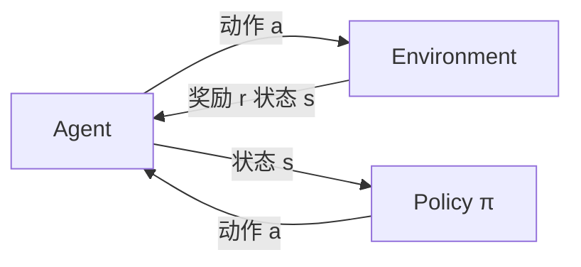

# Q-Learning - 原理与代码实例讲解

## 1. 背景介绍
### 1.1 问题的由来
在人工智能和机器学习领域,强化学习(Reinforcement Learning)是一个非常重要和热门的研究方向。强化学习旨在让智能体(Agent)通过与环境的交互来学习最优策略,以获得最大的累积奖励。在众多强化学习算法中,Q-Learning 以其简单有效而备受关注。
### 1.2 研究现状
自从 Q-Learning 算法被提出以来,国内外学者对其进行了大量的理论研究和应用探索。目前 Q-Learning 已经在机器人控制、自动驾驶、游戏智能体、推荐系统等领域取得了显著成果。但同时,Q-Learning 仍然面临一些挑战,如收敛速度慢、难以处理连续状态空间等问题,仍需进一步改进。
### 1.3 研究意义
深入研究 Q-Learning 算法具有重要意义:
1. 加深对强化学习的理解,掌握其核心思想和内在机理。
2. 为解决实际问题提供新的思路和方案,推动人工智能在各领域的应用。
3. 为后续的强化学习算法研究奠定基础,Q-Learning 的改进版本如 DQN 等都是在其基础上发展而来。
### 1.4 本文结构
本文将全面介绍 Q-Learning 算法,内容安排如下:
- 第2部分介绍 Q-Learning 的核心概念
- 第3部分详细讲解 Q-Learning 的算法原理和步骤
- 第4部分给出 Q-Learning 的数学模型和公式推导
- 第5部分通过代码实例演示 Q-Learning 的具体实现
- 第6部分讨论 Q-Learning 的实际应用场景
- 第7部分推荐 Q-Learning 的学习资源和工具
- 第8部分总结全文,并展望 Q-Learning 的未来发展
- 第9部分附录,解答一些常见问题

## 2. 核心概念与联系
在正式介绍 Q-Learning 算法之前,我们先来了解几个核心概念:
- 智能体(Agent):与环境交互的主体,根据观察到的状态采取行动,并获得奖励反馈。
- 环境(Environment):智能体所处的世界,接收动作,返回下一个状态和奖励。 
- 状态(State):智能体对环境的观察,用 $s$ 表示。
- 动作(Action):智能体根据策略选择的行为,用 $a$ 表示。
- 奖励(Reward):环境对智能体动作的即时反馈,用 $r$ 表示。
- 策略(Policy):智能体的决策函数,基于状态选择动作,用 $\pi$ 表示。
- 价值(Value):衡量状态或状态-动作对的长期累积奖励,分为状态价值 $V(s)$ 和动作价值 $Q(s,a)$。
- 状态转移(Transition):环境从当前状态转移到下一状态的动态变化。

这些概念之间的关系可以用下图表示:



Q-Learning 的核心思想就是学习动作价值函数 $Q(s,a)$,使其收敛到最优值 $Q^*(s,a)$,从而得到最优策略。下面我们具体看看 Q-Learning 是如何实现这一目标的。

## 3. 核心算法原理 & 具体操作步骤
### 3.1 算法原理概述
Q-Learning 是一种异策略时序差分学习算法,也是一种无模型(Model-Free)算法。所谓异策略是指学习最优策略 $\pi^*$ 的同时,智能体采取另一个行为策略与环境交互。Q-Learning 直接学习最优动作价值函数 $Q^*(s,a)$,而无需事先知道环境的状态转移概率和奖励函数,因此是无模型的。

Q-Learning 的核心是价值迭代,通过不断更新动作价值函数来逼近最优值:

$$Q(s_t,a_t) \leftarrow Q(s_t,a_t) + \alpha [r_{t+1} + \gamma \max_a Q(s_{t+1},a) - Q(s_t,a_t)] \tag{1}$$

其中 $\alpha \in (0,1]$ 为学习率, $\gamma \in [0,1]$ 为折扣因子。

### 3.2 算法步骤详解
Q-Learning 的具体步骤如下:
1. 初始化 Q 表,对所有 $s\in \mathcal{S}, a\in \mathcal{A}$,令 $Q(s,a)=0$。
2. 重复以下步骤,直到收敛:
   1. 初始化状态 $s_0$
   2. 对 $t=0,1,2,...$ 循环:
      1. 根据 $\varepsilon$-贪婪策略,以 $\varepsilon$ 的概率随机选择动作 $a_t$,否则选择 $a_t=\arg\max_a Q(s_t,a)$
      2. 执行动作 $a_t$,观察奖励 $r_{t+1}$ 和下一状态 $s_{t+1}$
      3. 更新 Q 值:
         $$Q(s_t,a_t) \leftarrow Q(s_t,a_t) + \alpha [r_{t+1} + \gamma \max_a Q(s_{t+1},a) - Q(s_t,a_t)]$$
      4. $s_t \leftarrow s_{t+1}$
3. 返回 Q 表

其中 $\varepsilon$-贪婪策略在探索(随机选择动作)和利用(选择 Q 值最大的动作)之间进行权衡,以 $\varepsilon$ 的概率探索,以 $1-\varepsilon$ 的概率利用。通常 $\varepsilon$ 会随着训练的进行而逐渐减小。

### 3.3 算法优缺点
Q-Learning 的主要优点有:
1. 简单易实现,对环境的要求较低。
2. 能够在不完全了解环境动力学的情况下学习最优策略。
3. 通过异策略学习和离线更新,可以高效利用经验数据。

但 Q-Learning 也存在一些局限:
1. 难以处理连续状态和动作空间,通常需要离散化。
2. 对大规模问题,Q 表难以存储,更新效率低下。
3. 难以直接从原始高维观察数据中学习,需要人工提取特征。

针对这些问题,研究者提出了一些改进方法,如 DQN 引入深度神经网络来逼近 Q 函数,解决了连续状态和特征提取的问题。此外还有 Double DQN、Dueling DQN、Priority Replay 等改进版本,进一步提升了 Q-Learning 的性能。

### 3.4 算法应用领域
Q-Learning 在许多领域都有广泛应用,例如:
- 机器人控制:如 Atari 游戏、走迷宫等。
- 自动驾驶:如 CARLA 模拟器中的智能体学习驾驶策略。
- 推荐系统:将推荐问题建模为 MDP,通过 Q-Learning 给用户推荐最优商品。
- 资源管理:如数据中心的能耗优化、无线网络的接入控制等。
- 对话系统:通过 Q-Learning 学习对话策略,提高对话质量。

随着强化学习的不断发展,Q-Learning 及其变种在更多领域崭露头角,为现实问题提供了新的解决方案。

## 4. 数学模型和公式 & 详细讲解 & 举例说明
### 4.1 数学模型构建
Q-Learning 可以用马尔可夫决策过程(MDP)来建模,一个 MDP 由以下元素组成:
- 状态空间 $\mathcal{S}$
- 动作空间 $\mathcal{A}$  
- 状态转移概率 $\mathcal{P}_{ss'}^a=P(s'|s,a)$
- 奖励函数 $\mathcal{R}_s^a=E[r|s,a]$
- 折扣因子 $\gamma \in [0,1]$

MDP 的目标是寻找最优策略 $\pi^*$,使得期望累积奖励最大化:

$$\pi^* = \arg\max_{\pi} E[\sum_{t=0}^{\infty} \gamma^t r_t | \pi] \tag{2}$$

为了达到这一目标,我们定义状态价值函数 $V^{\pi}(s)$ 和动作价值函数 $Q^{\pi}(s,a)$:

$$V^{\pi}(s) = E[\sum_{t=0}^{\infty} \gamma^t r_t | s_0=s, \pi] \tag{3}$$

$$Q^{\pi}(s,a) = E[\sum_{t=0}^{\infty} \gamma^t r_t | s_0=s, a_0=a, \pi] \tag{4}$$

它们分别表示从状态 $s$ 开始,采取策略 $\pi$ 能获得的期望累积奖励,以及在状态 $s$ 下采取动作 $a$ 后再采取策略 $\pi$ 能获得的期望累积奖励。

最优价值函数 $V^*(s)$ 和 $Q^*(s,a)$ 定义为:

$$V^*(s) = \max_{\pi} V^{\pi}(s) \tag{5}$$

$$Q^*(s,a) = \max_{\pi} Q^{\pi}(s,a) \tag{6}$$

如果我们能求出 $Q^*(s,a)$,就可以得到最优策略:

$$\pi^*(s) = \arg\max_a Q^*(s,a) \tag{7}$$

这就是 Q-Learning 的目标。

### 4.2 公式推导过程
下面我们推导 Q-Learning 的核心公式(1)。首先,根据 $Q^*$ 的定义,我们有 Bellman 最优方程:

$$Q^*(s,a) = \mathcal{R}_s^a + \gamma \sum_{s' \in \mathcal{S}} \mathcal{P}_{ss'}^a \max_{a'} Q^*(s',a') \tag{8}$$

这个方程表示最优动作价值等于立即奖励加上下一状态的最大 Q 值的折扣。但在 Q-Learning 中,我们无法直接使用这个公式,因为环境动力学 $\mathcal{P}$ 和 $\mathcal{R}$ 未知。

Q-Learning 的思路是通过采样的方式逼近 $Q^*$。假设在状态 $s_t$ 下采取动作 $a_t$,观察到奖励 $r_{t+1}$ 和下一状态 $s_{t+1}$,则可以得到一个 Q 值的样本估计:

$$q_t = r_{t+1} + \gamma \max_a Q(s_{t+1},a) \tag{9}$$

然后用这个估计值去更新 $Q(s_t,a_t)$,使其逐渐逼近 $Q^*(s_t,a_t)$:

$$Q(s_t,a_t) \leftarrow Q(s_t,a_t) + \alpha [q_t - Q(s_t,a_t)] \tag{10}$$

将(9)代入(10),即得到 Q-Learning 的更新公式(1):

$$Q(s_t,a_t) \leftarrow Q(s_t,a_t) + \alpha [r_{t+1} + \gamma \max_a Q(s_{t+1},a) - Q(s_t,a_t)]$$

可以证明,在适当的条件下(如所有状态-动作对无穷次访问),Q 值最终会收敛到 $Q^*$。

### 4.3 案例分析与讲解
下面我们以一个简单的例子来说明 Q-Learning 的工作原理。考虑一个格子世界环境,如下图所示:

```
+---+---+---+
| S |   |   |
+---+---+---+
|   |   | G |
+---+---+---+
```

其中 S 表示起始状态,G 表示目标状态,中间的格子表示普通状态。智能体的目标是从 S 出发,尽快到达 G。可用的动作包括上下左右四个方向,执行动作后智能体会按照指定方向移动一格,如果撞到边界则不移动。到达目标状态 G 后环境终止,并给予奖励 +1,其他状态的即时奖励都为 0。

我们用 Q-Learning 来学习这个环境的最优策略。初始化 Q 表如下:

|   | 左  | 右  | 上  | 下  |
|---|-----|-----|-----|-----|
| S | 0   | 0   | 0   | 0   