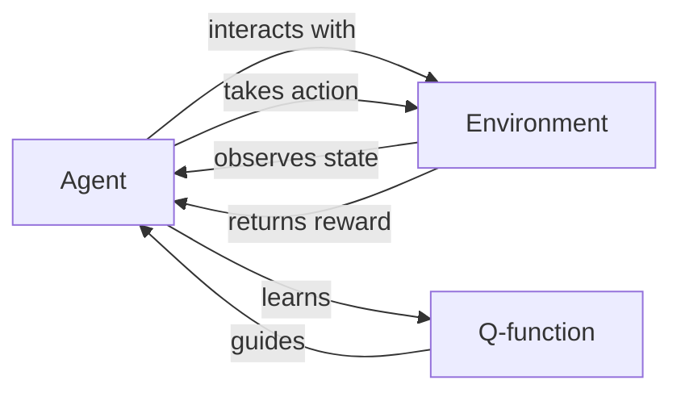

# Q-Learning原理与代码实例讲解

## 1. 背景介绍
### 1.1 问题的由来
在人工智能和机器学习领域,强化学习(Reinforcement Learning)是一个重要的研究方向。它旨在让智能体(Agent)通过与环境的交互,学习如何采取最优的行动策略,以获得最大的累积奖励。Q-Learning作为强化学习的一种经典算法,因其简洁高效而备受关注。

### 1.2 研究现状
自从Q-Learning算法被提出以来,国内外学者对其展开了广泛深入的研究。目前Q-Learning已经在机器人控制、自动驾驶、游戏AI等诸多领域取得了突破性进展。但同时,对于连续状态空间、奖励稀疏等复杂问题,Q-Learning仍面临诸多挑战。

### 1.3 研究意义 
深入研究Q-Learning算法原理,探索其代码实现,对于推动强化学习理论创新和实际应用具有重要意义。一方面,有助于我们更好地理解和掌握强化学习的核心思想。另一方面,对Q-Learning的研究可以为解决实际问题提供新的思路和方法。

### 1.4 本文结构
本文将围绕Q-Learning算法展开系统深入的讨论。第2部分介绍Q-Learning的核心概念。第3部分详细阐述Q-Learning算法原理和步骤。第4部分建立Q-Learning的数学模型并推导相关公式。第5部分给出Q-Learning的代码实例和详解。第6部分探讨Q-Learning的实际应用场景。第7部分推荐Q-Learning相关的学习资源和工具。第8部分总结全文,展望Q-Learning的未来发展趋势和挑战。

## 2. 核心概念与联系
Q-Learning涉及以下几个核心概念:
- 智能体(Agent):与环境交互,根据观察到的状态采取行动,并获得相应的奖励反馈。
- 环境(Environment):智能体所处的世界,给定智能体的行动,环境将反馈下一个状态和奖励。  
- 状态(State):智能体对环境的观察和表征。
- 行动(Action):智能体根据当前状态所采取的动作。
- 奖励(Reward):环境对智能体行动的即时反馈,引导智能体学习最优策略。
- 策略(Policy):将状态映射为行动的函数,即给定状态时智能体应该采取的行动。
- 价值函数(Value Function):评估每个状态或状态-行动对的长期累积奖励。

在Q-Learning中,我们重点关注动作价值函数Q(s,a),它表示在状态s下采取行动a的长期累积奖励。Q-Learning的目标就是学习最优的Q函数,从而得到最优策略。下图展示了Q-Learning涉及的核心概念之间的关系:



## 3. 核心算法原理 & 具体操作步骤
### 3.1 算法原理概述
Q-Learning是一种无模型的异步动态规划算法,通过不断更新状态-行动价值函数Q来逼近最优Q函数。其核心思想可以用贝尔曼最优方程表示:
$$
Q^*(s,a) = \mathbb{E}[R_{t+1} + \gamma \max_{a'}Q^*(S_{t+1},a') | S_t=s, A_t=a]
$$

其中,$Q^*(s,a)$表示在状态s下采取行动a的最优Q值,$R_{t+1}$是即时奖励,$\gamma$是折扣因子,$S_{t+1}$是下一个状态。这个方程表明,最优Q值等于即时奖励加上下一状态的最大Q值(乘以折扣因子)的期望。

### 3.2 算法步骤详解
Q-Learning算法的具体步骤如下:
1. 初始化Q表格Q(s,a),对所有的s∈S,a∈A,令Q(s,a)=0。
2. 重复以下步骤,直到Q收敛或达到一定的训练轮数:
   - 初始化状态s
   - 重复如下步骤,直到s为终止状态:
     - 根据ε-greedy策略,以概率ε随机选择行动a,否则选择Q(s,·)最大的a
     - 执行行动a,观察奖励r和下一状态s'
     - 更新Q(s,a)←Q(s,a)+α[r+γ max_a' Q(s',a')-Q(s,a)]
     - s←s'

其中,α∈(0,1]是学习率,控制每次更新的幅度。ε∈[0,1]控制探索和利用的平衡,ε越大,越倾向于探索。

### 3.3 算法优缺点
Q-Learning的主要优点包括:
- 简单易实现,对环境的转移概率没有要求,适用范围广。
- 能够在有限的训练轮数内收敛到最优策略。
- 通过ε-greedy策略在探索和利用之间取得平衡。

但Q-Learning也存在一些局限性:
- 对于状态和行动空间很大的问题,Q表格难以存储和更新。
- 面对连续状态空间问题时,需要进行离散化,可能损失信息。
- 对于奖励稀疏、延迟的问题,学习效率较低。

### 3.4 算法应用领域
Q-Learning在很多领域都有成功的应用,例如:
- 智能体寻路问题:如机器人导航、迷宫寻路等。
- 博弈问题:如井字棋、围棋等双人对弈游戏。
- 资源管理问题:如电梯调度、库存管理等。
- 推荐系统:根据用户反馈动态调整推荐策略。

## 4. 数学模型和公式 & 详细讲解 & 举例说明
### 4.1 数学模型构建
我们可以用马尔可夫决策过程(MDP)来对Q-Learning建模。一个MDP由以下元素组成:
- 状态空间S
- 行动空间A 
- 转移概率P(s'|s,a):在状态s下采取行动a转移到状态s'的概率
- 奖励函数R(s,a):在状态s下采取行动a获得的即时奖励
- 折扣因子γ∈[0,1]:表示未来奖励的重要程度

Q-Learning的目标是学习最优策略π^*,使得长期累积奖励最大化:
$$
π^* = \arg\max_π \mathbb{E}[\sum_{t=0}^∞ γ^t R(s_t,a_t)|π]
$$

为此,Q-Learning学习最优的状态-行动价值函数:
$$
Q^*(s,a) = \max_π Q^π(s,a)
$$

其中,
$$
Q^π(s,a) = \mathbb{E}[\sum_{k=0}^∞ γ^k R(s_{t+k},a_{t+k})|S_t=s,A_t=a,π]
$$

### 4.2 公式推导过程
我们可以利用贝尔曼方程来推导Q-Learning的更新公式。根据贝尔曼最优方程,我们有:
$$
\begin{aligned}
Q^*(s,a) &= \mathbb{E}[R_{t+1} + γ \max_{a'}Q^*(S_{t+1},a') | S_t=s, A_t=a] \\
&= \sum_{s',r} P(s',r|s,a)[r + γ \max_{a'}Q^*(s',a')]
\end{aligned}
$$

在Q-Learning中,我们用Q(s,a)来逼近Q^*(s,a),因此可以得到更新公式:
$$
Q(s,a) ← Q(s,a) + α[r + γ\max_{a'}Q(s',a') - Q(s,a)]
$$

这个公式可以这样理解:Q(s,a)朝着TD目标$r+γ\max_{a'}Q(s',a')$更新,更新幅度由学习率α控制。

### 4.3 案例分析与讲解
下面我们以一个简单的迷宫寻路问题为例,说明Q-Learning的工作原理。

```
+---+---+---+
| S |   |   |
+---+---+---+
|   |   | X |
+---+---+---+
|   |   | G |
+---+---+---+
```

在这个迷宫中,S表示起点,G表示目标,X表示陷阱。智能体的目标是学习一条从S到G的最短路径,同时避开X。我们可以将这个问题建模为MDP:
- 状态:智能体在迷宫中的位置,共9个状态。
- 行动:上、下、左、右四个方向,在边界状态某些行动可能无效。
- 奖励:到达目标状态G时奖励为+10,进入陷阱X时奖励为-10,其他情况奖励为-1,鼓励智能体尽快到达目标。
- 折扣因子:γ=0.9

我们应用Q-Learning算法,设置学习率α=0.1,ε=0.1,经过训练,最终得到最优策略如下:
```
+---+---+---+
| ↓ | ↓ | ↓ |
+---+---+---+
| → | ↓ | X |
+---+---+---+
| → | → | G |
+---+---+---+
```

可以看出,Q-Learning成功地学习到了最优路径,避开了陷阱。

### 4.4 常见问题解答
Q: Q-Learning能否处理连续状态空间问题?
A: 传统的Q-Learning使用Q表格来存储每个状态-行动对的Q值,因此难以直接处理连续状态空间。常见的解决方法是将连续状态离散化,或者使用函数逼近的方法,如Deep Q-Network(DQN)使用神经网络来逼近Q函数。

Q: Q-Learning的收敛性如何?
A: Q-Learning在适当的条件下(如所有状态-行动对无穷多次被访问)能够收敛到最优Q函数。但在实践中,我们往往在有限的训练轮数内停止算法,此时得到的是近似最优解。

Q: Q-Learning能否处理部分可观察马尔可夫决策过程(POMDP)?
A: 传统的Q-Learning假设环境是完全可观察的,即智能体能够观察到完整的状态信息。对于POMDP问题,需要引入置信状态等概念,可以考虑使用Deep Recurrent Q-Network(DRQN)等算法。

## 5. 项目实践：代码实例和详细解释说明
下面我们用Python实现Q-Learning算法,并应用于上述迷宫寻路问题。

### 5.1 开发环境搭建
我们使用Python 3.x作为开发语言,需要安装Numpy库用于数值计算。可以使用以下命令安装:
```
pip install numpy
```

### 5.2 源代码详细实现
我们首先定义一个`QLearningAgent`类,实现Q-Learning算法:

```python
import numpy as np

class QLearningAgent:
    def __init__(self, state_size, action_size, learning_rate=0.1, discount_factor=0.9, epsilon=0.1):
        self.state_size = state_size
        self.action_size = action_size
        self.learning_rate = learning_rate
        self.discount_factor = discount_factor
        self.epsilon = epsilon
        self.q_table = np.zeros((state_size, action_size))

    def select_action(self, state):
        if np.random.uniform() < self.epsilon:
            action = np.random.choice(self.action_size)
        else:
            action = np.argmax(self.q_table[state])
        return action

    def update_q_table(self, state, action, reward, next_state):
        q_value = self.q_table[state][action]
        max_q_next = np.max(self.q_table[next_state])
        td_target = reward + self.discount_factor * max_q_next
        self.q_table[state][action] += self.learning_rate * (td_target - q_value)
```

这个类包含以下主要方法:
- `__init__`: 初始化智能体,包括状态空间大小、行动空间大小、学习率、折扣因子、探索概率等参数,并初始化Q表格。
- `select_action`: 根据ε-greedy策略选择行动,以概率ε随机探索,否则选择Q值最大的行动。
- `update_q_table`: 根据观察到的转移信息(状态、行动、奖励、下一状态)更新Q表格。

接下来,我们定义一个`MazeEnv`类作为迷宫环境:

```python
class MazeEnv:
    def __init__(self):
        self.maze = np.array([
            [0, 0, 0], 
            [0, -1, 0],