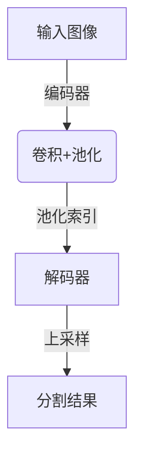

# SegNet原理与代码实例讲解

## 1. 背景介绍

### 1.1 问题的由来

在计算机视觉和图像处理领域中,语义分割是一项重要的基础任务。语义分割旨在为图像中的每个像素分配一个类别标签,从而实现对图像内容的全面理解和精确分割。然而,传统的分割方法通常依赖于手工设计的特征提取和分类器,难以有效捕捉复杂场景中的丰富语义信息。

随着深度学习技术的快速发展,卷积神经网络(Convolutional Neural Networks, CNN)展现出了强大的特征学习能力,在图像分类、目标检测等任务中取得了卓越的成绩。然而,早期的CNN架构主要关注图像级别的分类任务,对于像素级别的密集预测任务(如语义分割)的性能并不理想。

### 1.2 研究现状

为了解决语义分割任务,研究人员提出了一系列基于CNN的语义分割模型,如FCN(Fully Convolutional Networks)、SegNet、U-Net等。其中,SegNet是一种新颖的深度卷积神经网络架构,专门设计用于语义像素级别的分割任务。

SegNet的主要贡献在于提出了一种新颖的解码器(decoder)结构,能够有效地从低分辨率的编码器(encoder)特征图中恢复出高分辨率的分割结果。这种解码器结构利用了池化索引(pooling indices)的信息,在上采样过程中保留了更多的边缘和位置细节,从而提高了分割的精度和质量。

### 1.3 研究意义

SegNet的出现为语义分割任务提供了一种高效且精确的解决方案。相比于传统的分割方法,SegNet具有以下优势:

1. **端到端训练**:SegNet作为一种基于深度学习的方法,可以通过端到端的训练自动学习最优的特征表示,无需手工设计特征。

2. **高分辨率分割**:SegNet的解码器结构能够有效地从低分辨率的特征图中恢复出高分辨率的分割结果,保留了更多的细节信息。

3. **高效内存利用**:SegNet在解码过程中重用了编码器的pooling索引信息,避免了大量的计算和存储开销,具有较高的计算效率。

4. **广泛应用前景**:语义分割是计算机视觉领域的基础任务,SegNet的出现为许多下游应用(如自动驾驶、医学图像分析等)提供了有力支持。

### 1.4 本文结构

本文将全面介绍SegNet的原理、算法细节和实现方式。文章的主要内容包括:

1. 核心概念与联系
2. 核心算法原理与具体操作步骤
3. 数学模型和公式详细讲解与案例分析
4. 项目实践:代码实例和详细解释说明
5. 实际应用场景
6. 工具和资源推荐
7. 总结:未来发展趋势与挑战
8. 附录:常见问题与解答

接下来,我们将逐一探讨SegNet的各个方面。

## 2. 核心概念与联系

在深入探讨SegNet的细节之前,我们需要先了解一些核心概念及其相互关系。

### 2.1 语义分割

语义分割(Semantic Segmentation)是计算机视觉领域的一个基础任务,旨在将图像中的每个像素分配到预定义的语义类别中。与图像分类任务只预测整个图像的类别标签不同,语义分割需要对图像中的每个像素进行精确的分类,从而获得图像内容的细粒度理解。

语义分割在许多实际应用中扮演着重要角色,如自动驾驶(道路、行人、车辆等目标的分割)、医学图像分析(器官、肿瘤等结构的分割)、增强现实(前景和背景的分离)等。

### 2.2 卷积神经网络

卷积神经网络(Convolutional Neural Networks, CNN)是一种深度学习模型,广泛应用于计算机视觉任务。CNN由多个卷积层、池化层和全连接层组成,能够自动从原始图像数据中学习出多层次的特征表示。

CNN在图像分类、目标检测等任务中取得了卓越的成绩,但早期的CNN架构主要关注图像级别的分类任务,对于像素级别的密集预测任务(如语义分割)的性能并不理想。为了解决这个问题,研究人员提出了一系列基于CNN的语义分割模型,如FCN、SegNet、U-Net等。

### 2.3 编码器-解码器架构

编码器-解码器(Encoder-Decoder)架构是许多语义分割模型的基础结构。编码器部分通常由一系列卷积层和下采样层(如池化层)组成,用于从输入图像中提取多尺度的特征表示。解码器部分则负责将编码器的特征图上采样(upsampling)至原始图像分辨率,并生成对应的分割结果。

SegNet采用了这种编码器-解码器架构,但在解码器部分提出了一种新颖的上采样方式,能够更好地保留细节信息,从而提高分割质量。

### 2.4 池化索引

池化索引(Pooling Indices)是SegNet中一个关键的概念。在编码器的池化层中,除了输出池化后的特征图外,还会记录下每个池化窗口中最大值元素的位置索引。这些池化索引在解码器中被重用,用于指导特征图的上采样过程,从而保留更多的边缘和位置细节信息。

通过利用池化索引,SegNet避免了大量的计算和存储开销,同时也提高了分割质量。

### 2.5 Mermaid 流程图

下面的 Mermaid 流程图展示了 SegNet 的整体架构:

在这个流程图中,我们可以清晰地看到 SegNet 的编码器-解码器结构,以及池化索引在解码过程中的作用。接下来,我们将详细探讨 SegNet 的核心算法原理和具体实现细节。

## 3. 核心算法原理与具体操作步骤

### 3.1 算法原理概述

SegNet的核心思想是利用编码器-解码器架构,结合池化索引信息,实现高质量的语义分割。具体来说,SegNet的算法原理可以概括为以下几个关键步骤:

1. **编码器(Encoder)**: 使用一系列卷积层和池化层从输入图像中提取多尺度的特征表示,同时记录下每个池化层的索引信息。

2. **解码器(Decoder)**: 利用编码器的特征图和池化索引信息,进行上采样操作,逐步恢复出高分辨率的分割结果。

3. **池化索引传递(Pooling Indices Transfer)**: 在解码器的上采样过程中,利用编码器保存的池化索引信息,指导特征图的精确上采样,从而保留更多的边缘和位置细节。

4. **像素级分类(Pixel-wise Classification)**: 在解码器的最后一层,使用一个卷积层对上采样后的特征图进行像素级别的分类,生成最终的分割结果。

通过这种设计,SegNet能够有效地从低分辨率的编码器特征图中恢复出高分辨率的分割结果,同时保留了丰富的细节信息。下面,我们将详细介绍SegNet的具体操作步骤。

### 3.2 算法步骤详解

SegNet的算法步骤可以分为以下几个部分:

#### 3.2.1 编码器(Encoder)

编码器部分由一系列卷积层和池化层组成,用于从输入图像中提取多尺度的特征表示。在每个池化层中,除了输出池化后的特征图外,还会记录下每个池化窗口中最大值元素的位置索引。这些池化索引将在解码器中被重用,用于指导特征图的上采样过程。

编码器的具体结构可以根据实际需求进行调整,通常采用类似于VGGNet或ResNet等经典CNN架构的设计。

#### 3.2.2 解码器(Decoder)

解码器部分的主要任务是将编码器的低分辨率特征图上采样至原始图像分辨率,并生成对应的分割结果。SegNet在解码器中提出了一种新颖的上采样方式,利用了编码器保存的池化索引信息。

具体来说,解码器的上采样过程包括以下步骤:

1. 对编码器的特征图进行上采样(例如使用反卷积操作),获得一个粗略的高分辨率特征图。

2. 根据对应的池化索引,将上一步得到的特征图中的最大值元素传播到正确的位置,从而获得一个更精确的高分辨率特征图。

3. 对上一步得到的特征图进行卷积操作,进一步提取特征。

4. 重复上述步骤,直到特征图的分辨率达到原始图像的分辨率。

通过这种方式,SegNet能够在上采样过程中保留更多的边缘和位置细节信息,从而提高分割质量。

#### 3.2.3 像素级分类(Pixel-wise Classification)

在解码器的最后一层,SegNet使用一个卷积层对上采样后的特征图进行像素级别的分类,生成最终的分割结果。这个卷积层的输出通道数等于预定义的语义类别数,每个通道对应一个类别。

对于每个像素位置,SegNet会输出一个向量,其中每个元素表示该像素属于对应类别的概率。通过选择概率最大的类别,即可得到该像素的分割标签。

### 3.3 算法优缺点

SegNet作为一种语义分割模型,具有以下优缺点:

**优点**:

1. **高分辨率分割**: 利用池化索引信息,SegNet能够在解码过程中保留更多的边缘和位置细节,从而获得高质量的高分辨率分割结果。

2. **高效内存利用**: 通过重用编码器的池化索引,SegNet避免了大量的计算和存储开销,具有较高的计算效率。

3. **端到端训练**: SegNet作为一种基于深度学习的方法,可以通过端到端的训练自动学习最优的特征表示,无需手工设计特征。

4. **通用性强**: SegNet的架构设计具有一定的通用性,可以应用于不同的数据集和任务场景。

**缺点**:

1. **分割质量依赖于编码器**: SegNet的分割质量在很大程度上依赖于编码器提取的特征质量。如果编码器无法有效捕捉图像的语义信息,分割结果可能会受到影响。

2. **对小目标敏感**: 由于池化操作会导致一定程度的位置信息丢失,SegNet可能对小目标或细节信息不太敏感。

3. **参数量较大**: 相比于一些轻量级的语义分割模型,SegNet的参数量通常较大,对计算资源的要求也相对较高。

4. **缺乏注意力机制**: SegNet缺乏显式的注意力机制,无法自适应地关注图像中的重要区域,这可能会影响分割性能。

### 3.4 算法应用领域

作为一种高效且精确的语义分割模型,SegNet可以应用于多个领域,包括但不限于:

1. **自动驾驶**: 对道路、行人、车辆等目标进行精确分割,为自动驾驶系统提供关键的环境感知信息。

2. **医学图像分析**: 对医学影像中的器官、肿瘤等结构进行分割,为疾病诊断和治疗提供支持。

3. **遥感图像处理**: 对卫星遥感图像中的建筑物、道路、植被等目标进行分割,用于城市规划、环境监测等应用。

4. **增强现实(AR)**: 对图像中的前景和背景进行分离,为增强现实应用提供基础支持。

5. **机器人视觉**: 对环境中的物体和障碍进行分割,为机器人的导航和操作提供视觉信息。

6. **视频监控**: 对视频流中的人物、车辆等目标进行实时分割和跟踪,用