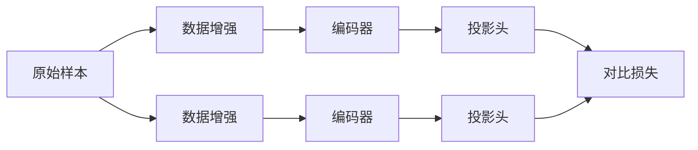

# SimCLR原理与代码实例讲解

## 1. 背景介绍
### 1.1 问题的由来
在深度学习领域,无监督学习一直是一个具有挑战性的课题。传统的深度学习方法大多依赖于大量的有标注数据进行训练,但在很多现实场景中,获取大规模标注数据是非常困难和昂贵的。因此,研究如何利用未标注数据进行有效的表示学习,从而减少对标注数据的依赖,具有重要的理论和实践意义。
### 1.2 研究现状
近年来,自监督学习方法受到了广泛关注。自监督学习通过设计巧妙的预测任务,利用数据本身的信息作为监督信号,从而实现对数据的有效表示。其中,基于对比学习(Contrastive Learning)的方法表现出了优异的性能,如MoCo、SimCLR等。这些方法通过最大化正样本对的相似度,最小化负样本对的相似度,学习到了具有判别性的特征表示。
### 1.3 研究意义 
SimCLR(A Simple Framework for Contrastive Learning of Visual Representations)是谷歌在2020年提出的一种简单而有效的对比学习框架。它在多个视觉任务上取得了当时最先进的结果,展现出了自监督学习的巨大潜力。深入理解和掌握SimCLR的原理和实现,对于研究和应用自监督学习方法具有重要意义。
### 1.4 本文结构
本文将围绕SimCLR展开深入讨论。首先介绍SimCLR的核心概念和关键组件,然后详细阐述其算法原理和具体实现步骤。接着通过数学建模分析SimCLR的理论基础,并给出代码实例详解其关键实现。最后总结SimCLR的优势和局限,展望其未来的研究方向。

## 2. 核心概念与联系
SimCLR的核心思想是通过最大化同一样本不同增强视图之间的一致性,来学习数据的通用表示。其主要由以下几个关键概念组成:

- 数据增强(Data Augmentation):对原始样本进行随机变换,生成不同的增强视图。常见的增强方法包括随机裁剪、颜色失真、高斯模糊等。

- 编码器(Encoder):用于将增强后的样本映射到低维特征空间。编码器通常采用深度卷积神经网络,如ResNet。

- 投影头(Projection Head):在编码器之后添加的非线性变换层,用于将特征映射到对比学习的空间。

- 对比损失(Contrastive Loss):用于度量不同视图之间的一致性。常用的损失函数包括NT-Xent(Normalized Temperature-scaled Cross Entropy)等。

下图展示了SimCLR的整体架构和数据流:

SimCLR通过端到端的训练方式,不断优化编码器和投影头的参数,最终得到具有判别性的特征表示。

## 3. 核心算法原理 & 具体操作步骤
### 3.1 算法原理概述
SimCLR的算法流程可以概括为以下几个关键步骤:

1. 对原始样本进行随机数据增强,生成两个不同视图的增强样本对。

2. 将增强样本对输入编码器,得到对应的特征表示。

3. 对特征表示进行非线性变换,得到投影后的低维向量。

4. 基于投影向量计算对比损失,最大化正样本对(即同一原始样本的不同增强视图)的相似度,最小化负样本对(即不同原始样本的增强视图)的相似度。

5. 通过反向传播优化编码器和投影头的参数,不断迭代直至收敛。

6. 去除投影头,使用训练好的编码器提取特征,用于下游任务。

### 3.2 算法步骤详解

**输入**: 
- 原始样本集 $\mathcal{X}=\{x_1,\dots,x_N\}$
- 批次大小 $N$
- 编码器 $f(\cdot)$ 
- 投影头 $g(\cdot)$
- 对比损失函数 $\ell(\cdot,\cdot)$
- 数据增强变换 $\mathcal{T}$

**过程**:
1. for sampled minibatch $\{x_k\}_{k=1}^N$ do:
2. &emsp;for all $k \in \{1,\dots,N\}$ do:
3. &emsp;&emsp;draw two augmentations $\tilde{x}_{2k-1},\tilde{x}_{2k} \sim \mathcal{T}(x_k)$ 
4. &emsp;&emsp;$z_{2k-1}=g(f(\tilde{x}_{2k-1}))$ and $z_{2k}=g(f(\tilde{x}_{2k}))$
5. &emsp;end for
6. &emsp;define $\mathcal{L}_{NT\text{-}Xent}=-\sum_{k=1}^N[\ell(z_{2k-1},z_{2k})+\ell(z_{2k},z_{2k-1})]$
7. &emsp;update networks $f$ and $g$ to minimize $\mathcal{L}_{NT\text{-}Xent}$
8. end for

其中,对比损失函数 $\ell(z_i,z_j)$ 定义为:

$$
\ell(z_i,z_j)=\log\frac{\exp(\text{sim}(z_i,z_j)/\tau)}{\sum_{k=1}^{2N}\mathbf{1}_{[k\neq i]}\exp(\text{sim}(z_i,z_k)/\tau)}
$$

$\text{sim}(z_i,z_j)$ 表示两个投影向量 $z_i$ 和 $z_j$ 的余弦相似度,即:

$$
\text{sim}(z_i,z_j)=\frac{z_i^\top z_j}{\|z_i\|\|z_j\|}
$$

$\tau$ 是一个温度超参数,用于控制分布的平滑程度。

### 3.3 算法优缺点

**优点**:
- 简单有效,易于实现。SimCLR只需要设计合适的数据增强策略和对比损失函数,就能学习到有效的特征表示。
- 通用性强,可以应用于各种视觉任务。SimCLR学习到的特征在图像分类、目标检测、语义分割等任务上都取得了很好的效果。
- 不依赖负样本对的采样。与一些对比学习方法(如MoCo)不同,SimCLR不需要维护一个动量编码器和特征队列,而是直接在批次内构建正负样本对,减少了计算开销。

**缺点**:
- 对批次大小敏感。SimCLR需要较大的批次(如4096)才能取得良好效果,这对计算资源提出了较高要求。
- 数据增强策略需要仔细设计。不同的任务可能需要不同的数据增强组合,需要花费一定的调参成本。
- 特征的语义一致性有待提高。SimCLR学习的特征对于同一类别的样本可能不够聚集,影响下游任务的性能。

### 3.4 算法应用领域
SimCLR作为一种通用的自监督学习算法,可以应用于多种视觉任务:

- 图像分类:将SimCLR学习到的特征输入线性分类器,可以在ImageNet等数据集上达到很高的分类精度。

- 目标检测:将预训练的SimCLR编码器作为目标检测器(如Faster R-CNN)的主干网络,可以提升检测性能。

- 语义分割:将SimCLR特征用于语义分割网络(如FCN),可以加速收敛和提高分割精度。

- 人脸识别:基于SimCLR训练人脸特征提取器,可以在人脸验证、聚类等任务上取得不错的效果。

- 医学图像分析:利用SimCLR从医学图像(如CT、MRI)中学习鲁棒的特征表示,辅助疾病诊断和预后预测。

## 4. 数学模型和公式 & 详细讲解 & 举例说明
### 4.1 数学模型构建
设原始样本空间为 $\mathcal{X}$,样本 $x\in\mathcal{X}$。定义两个数据增强变换 $t,t'\sim\mathcal{T}$,对 $x$ 进行变换得到一对增强样本 $\tilde{x}=t(x),\tilde{x}'=t'(x)$。SimCLR的目标是学习一个编码函数 $f:\mathcal{X}\to\mathbb{R}^d$,使得同一样本的不同增强 $\tilde{x},\tilde{x}'$ 在特征空间中的表示 $f(\tilde{x}),f(\tilde{x}')$ 尽可能接近,而不同样本 $x_i,x_j$ 的特征表示 $f(\tilde{x}_i),f(\tilde{x}_j')$ 尽可能远离。

形式化地,我们优化以下对比损失函数:

$$
\mathcal{L}=\sum_{i=1}^N\ell(2i-1,2i)
$$

其中 $\ell(i,j)$ 表示第 $i$ 个增强样本和第 $j$ 个增强样本的对比损失:

$$
\ell(i,j)=-\log\frac{\exp(\text{sim}(z_i,z_j)/\tau)}{\sum_{k=1}^{2N}\mathbf{1}_{[k\neq i]}\exp(\text{sim}(z_i,z_k)/\tau)}
$$

$z_i=g(f(\tilde{x}_i))$ 表示增强样本 $\tilde{x}_i$ 的投影向量,$\text{sim}(\cdot,\cdot)$ 表示余弦相似度。

### 4.2 公式推导过程
对于给定的一对增强样本 $(\tilde{x}_i,\tilde{x}_j)$,我们希望最大化它们在投影空间中的相似度 $\text{sim}(z_i,z_j)$,同时最小化 $z_i$ 与其他增强样本投影 $z_k(k\neq i,k\neq j)$ 的相似度。因此,我们可以构造如下softmax型的损失函数:

$$
\ell(i,j)=-\log\frac{\exp(\text{sim}(z_i,z_j)/\tau)}{\sum_{k=1}^{2N}\mathbf{1}_{[k\neq i]}\exp(\text{sim}(z_i,z_k)/\tau)}
$$

其中 $\tau$ 为温度参数。这个损失函数的物理意义是,在给定 $z_i$ 的条件下,$z_j$ 的出现概率应该尽可能大,而其他 $z_k$ 的出现概率应该尽可能小。最小化该损失函数,就可以达到聚集正样本对、排斥负样本对的目的。

考虑到一个批次中包含 $N$ 个原始样本,每个样本生成两个增强视图,共 $2N$ 个增强样本。我们对所有正样本对 $(z_{2i-1},z_{2i}),(z_{2i},z_{2i-1})$ 的损失求和,得到整个批次的损失:

$$
\mathcal{L}=\sum_{i=1}^N[\ell(2i-1,2i)+\ell(2i,2i-1)]
$$

最小化该损失函数,就可以得到具有判别性的特征表示。

### 4.3 案例分析与讲解
下面我们以一个简单的例子来说明SimCLR的工作原理。假设我们有一个包含4张图片的小批次:$\{x_1,x_2,x_3,x_4\}$。对每张图片施加两种不同的增强变换,得到8个增强样本:$\{\tilde{x}_1,\tilde{x}_2,\dots,\tilde{x}_8\}$,其中 $(\tilde{x}_{2i-1},\tilde{x}_{2i})$ 是原始样本 $x_i$ 的两个增强视图。

将增强样本输入编码器和投影头,得到对应的投影向量 $\{z_1,z_2,\dots,z_8\}$。我们希望最大化正样本对 $(z_1,z_2),(z_3,z_4),\dots,(z_7,z_8)$ 的相似度,最小化其他组合 $(z_1,z_3),(z_2,z_4),\dots$ 等的相似度。

以 $(z_1,z_2)$ 为例,