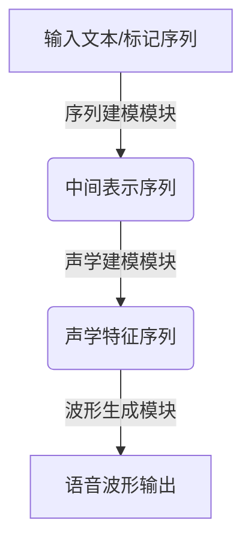

好的，我会严格遵循您提供的约束条件，以"Speech Synthesis原理与代码实例讲解"为主题，撰写一篇专业的技术博客文章。

# Speech Synthesis原理与代码实例讲解

## 1. 背景介绍

### 1.1 问题的由来

语音合成技术旨在让计算机系统能够以人类可理解的方式输出语音信号。这种技术的需求源于多个领域,例如辅助技术、多媒体系统、车载导航系统等。传统的文本到语音(Text-to-Speech, TTS)系统通常基于连接预先录制的语音片段,导致输出语音听起来不自然、单调乏味。随着深度学习技术的发展,基于神经网络的端到端语音合成模型(End-to-End Speech Synthesis)能够直接从文本或其他输入中生成高质量、自然流畅的语音,极大提高了语音合成的真实性和多样性。

### 1.2 研究现状  

近年来,基于序列到序列(Sequence-to-Sequence)模型的端到端语音合成技术取得了长足进步,主要分为三类:

1. **基于WaveNet的模型**: WaveNet是一种自回归生成模型,可直接生成原始波形,语音质量较高但推理速度慢。
2. **基于流式模型的方法**: 将声学特征序列作为中间表示,使用自回归或非自回归模型生成,推理速度较快但音质稍逊。
3. **基于扩散模型的方法**: 利用扩散概率模型直接生成高保真波形,语音质量优秀且推理速度快,是最新的研究热点。

### 1.3 研究意义

高质量语音合成技术在多个领域都有广阔的应用前景:

- 辅助技术: 为视障人士提供无障碍信息访问
- 多媒体娱乐: 虚拟数字人语音、有声书等
- 智能助手: 提升人机交互体验
- 车载导航: 提供语音导航服务
- 教育领域: 智能教学、在线课程等

因此,研究高保真、多样化的语音合成技术,对于促进人机交互和无障碍信息获取具有重要意义。

### 1.4 本文结构

本文将首先介绍端到端语音合成的核心概念和算法原理,包括序列建模、声学建模和波形生成三个模块。接下来详细讲解数学模型,并结合实例进行案例分析。然后通过开源项目代码实践,解读关键实现细节。最后探讨实际应用场景,介绍相关工具和资源,并总结该领域的发展趋势和挑战。

## 2. 核心概念与联系

端到端语音合成系统通常由三个关键模块组成:

1. **序列建模模块**: 将输入文本/标记序列映射为中间表示(如音素/字节序列)。
2. **声学建模模块**: 将中间表示转换为声学特征序列(如mel频谱等)。
3. **波形生成模块**: 根据声学特征序列生成最终的语音波形。

这三个模块通常由编码器(Encoder)、注意力模块(Attention)和解码器(Decoder)等神经网络模型组成。���中编码器将输入序列编码为隐藏表示,解码器则根据隐藏表示自回归地生成目标序列,注意力模块负责捕获输入和输出之间的长程依赖关系。

不同的模型架构在模块内部实现细节上有所差异,但整体框架保持一致。接下来我们将逐一介绍每个模块的核心算法原理。

## 3. 核心算法原理 & 具体操作步骤  

### 3.1 算法原理概述

#### 序列建模模块

该模块的目标是将输入文本/标记序列映射为中间表示序列。常用的序列建模方法有:

1. **基于注意力的Seq2Seq模型**:使用编码器-解码器架构,编码器将输入序列编码为隐藏表示,解码器根据注意力机制自回归地生成中间表示序列。
2. **基于Transformer的模型**:纯注意力架构,通过多头自注意力机制捕获长程依赖关系,编码器和解码器都使用Transformer块。
3. **基于BERT的模型**:利用BERT等预训练语言模型的强大表示能力,通过微调的方式进行序列到序列的映射。

#### 声学建模模块

该模块将中间表示序列(如音素序列)映射为声学特征序列(如mel频谱等)。常见的声学建模方法有:

1. **基于注意力的Seq2Seq模型**:与序列建模模块类似,使用编码器-解码器架构和注意力机制。
2. **基于Transformer的模型**:使用Transformer编码器-解码器结构进行声学建模。
3. **基于卷积神经网络(CNN)的模型**:利用CNN的局部连接和权值共享特性,高效地从中间表示中提取声学特征。
4. **基于循环神经网络(RNN)的模型**:使用RNN(如LSTM、GRU)捕获长期依赖关系。

#### 波形生成模块  

该模块负责根据声学特征序列生成最终的语音波形,主要分为三类方法:

1. **基于WaveNet的自回归模型**:使用堆叠的卷积层和扩张因子,自回归地生成波形样本。
2. **基于流式模型的生成方法**:使用自回归或非自回归模型(如Transformer、GAN等)从声学特征生成波形。
3. **基于扩散概率模型的生成方法**:利用扩散概率模型(如WaveGrad)从噪声中生成高保真语音波形。

### 3.2 算法步骤详解

以Transformer为例,端到端语音合成系统的算法步骤如下:

**输入**:文本/标记序列 $X = (x_1, x_2, ..., x_n)$

**序列建模模块**:
1. 将输入序列 $X$ 通过词嵌入层获得嵌入表示 $E = (e_1, e_2, ..., e_n)$
2. 输入 $E$ 到Transformer编码器,获得输入隐藏表示 $H^{enc} = (h_1^{enc}, h_2^{enc}, ..., h_n^{enc})$
3. 将隐藏表示 $H^{enc}$ 输入到Transformer解码器,自回归地生成中间表示序列 $Y = (y_1, y_2, ..., y_m)$,如音素序列。解码过程使用掩码多头自注意力和编码器-解码器注意力机制。

**声学建模模块**:
4. 将中间表示序列 $Y$ 通过词嵌入层获得嵌入表示 $E^Y = (e_1^Y, e_2^Y, ..., e_m^Y)$ 
5. 输入 $E^Y$ 到另一个Transformer编码器,获得中间表示隐藏态 $H^Y = (h_1^Y, h_2^Y, ..., h_m^Y)$
6. 将 $H^Y$ 输入到Transformer解码器,自回归地生成声学特征序列 $Z = (z_1, z_2, ..., z_l)$,如mel频谱序列。

**波形生成模块**:
7. 将声学特征序列 $Z$ 输入到WaveNet或其他波形生成模型,生成最终的语音波形 $S = (s_1, s_2, ..., s_t)$

其中,Transformer编码器由多个编码器层堆叠而成,每层包含多头自注意力(Multi-Head Attention)和前馈全连接网络(Feed-Forward Network)。解码器结构类似,不同之处在于引入了编码器-解码器注意力(Encoder-Decoder Attention)机制。

### 3.3 算法优缺点

**优点**:

- 端到端架构,避免了传统pipeline系统的错误传播问题
- 基于注意力机制,能够建模长期依赖关系
- 可并行计算,推理速度较快
- 生成的语音质量高,音色丰富、自然流畅

**缺点**:

- 需要大量数据和计算资源进行训练
- 模型结构复杂,训练不稳定,收敛较慢
- 存在一次性计算整个序列的开销
- 自回归生成时,无法完全并行化

### 3.4 算法应用领域

端到端语音合成技术可广泛应用于以下领域:

- 辅助技术:为视障人士提供无障碍信息访问
- 多媒体娱乐:虚拟数字人语音、有声书等
- 智能助手:提升人机交互体验
- 车载导航:提供语音导航服务
- 教育领域:智能教学、在线课程等
- 广告营销:语音广告、虚拟促销员等
- 医疗保健:医疗报告语音化等

## 4. 数学模型和公式 & 详细讲解 & 举例说明

### 4.1 数学模型构建

我们以基于Transformer的端到端语音合成系统为例,介绍其中的关键数学模型。

#### 多头自注意力机制(Multi-Head Attention)

多头自注意力是Transformer的核心组件,能够有效捕获输入序列中的长期依赖关系。对于输入序列 $X = (x_1, x_2, ..., x_n)$,其中每个 $x_i \in \mathbb{R}^{d_{model}}$,多头自注意力的计算过程如下:

$$\begin{aligned}
MultiHead(Q, K, V) &= Concat(head_1, ..., head_h)W^O\\
\text{where } head_i &= Attention(QW_i^Q, KW_i^K, VW_i^V)\\
Attention(Q, K, V) &= softmax(\frac{QK^T}{\sqrt{d_k}})V
\end{aligned}$$

其中 $Q$、$K$、$V$ 分别为 Query、Key 和 Value,通过线性变换得到;$W_i^Q \in \mathbb{R}^{d_{model} \times d_k}$、$W_i^K \in \mathbb{R}^{d_{model} \times d_k}$、$W_i^V \in \mathbb{R}^{d_{model} \times d_v}$ 为可训练参数;$h$ 为头数。

多头注意力机制通过多个并行的自注意力层共享计算,能够关注不同位置的信息,从而提高模型的表示能力。

#### 位置编码(Positional Encoding)

由于自注意力机制没有捕获序列顺序信息的能力,因此需要为序列的每个位置添加位置编码,以引入顺序信息。位置编码可由如下公式计算:

$$\begin{aligned}
PE_{(pos, 2i)} &= sin(pos / 10000^{2i / d_{model}})\\
PE_{(pos, 2i+1)} &= cos(pos / 10000^{2i / d_{model}})
\end{aligned}$$

其中 $pos$ 是序列位置索引,而 $i$ 则是维度索引。位置编码会直接加到输入的嵌入表示上。

#### 前馈全连接网络(Feed-Forward Network)

每个编码器或解码器层中,除了注意力子层,还包含一个前馈全连接网络,用于对每个位置的向量进行非线性变换。其定义如下:

$$FFN(x) = max(0, xW_1 + b_1)W_2 + b_2$$

其中 $W_1 \in \mathbb{R}^{d_{model} \times d_{ff}}$、$W_2 \in \mathbb{R}^{d_{ff} \times d_{model}}$ 为可训练参数,而 $d_{ff}$ 是前馈网络的隐层维度。

#### 损失函数

对于序列到序列的建模任务,通常采用交叉熵损失函数:

$$\mathcal{L} = -\sum_{t=1}^T \log P(y_t|y_{<t}, X)$$

其中 $y_t$ 为目标序列的第 $t$ 个元素, $y_{<t}$ 表示其之前的元素序列,而 $X$ 为输入序列。

### 4.2 公式推导过程

我们以多头自注意力机制为例,推导其数学原理。

单头自注意力的计算公式为:

$$Attention(Q, K, V) = softmax(\frac{QK^T}{\sqrt{d_k}})V$$

其中 $Q$、$K$、$V$ 分别表示 Query、Key 和 Value。我们将输入序列 $X = (