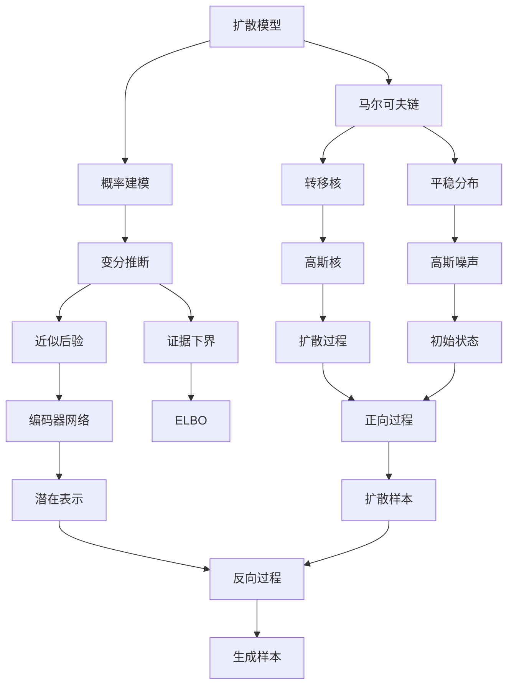

# Stable Diffusion原理与代码实例讲解

## 1. 背景介绍

### 1.1 问题的由来

在过去的几年里,生成式人工智能(Generative AI)技术取得了长足的进步,尤其是在图像生成领域。传统的图像生成方法通常依赖于手工设计的规则或特征,难以捕捉复杂的视觉模式。而基于深度学习的生成模型则能够直接从数据中学习视觉表示,生成逼真且多样化的图像。

然而,早期的生成模型如变分自编码器(VAE)和生成对抗网络(GAN)在训练过程中存在模式崩溃、模式丢失等问题,生成的图像质量仍有待提高。直到2020年,OpenAI提出的DALL-E模型首次展示了通过扩散模型生成高分辨率、语义一致的图像的能力,扩散模型由此成为图像生成领域的新热点。

### 1.2 研究现状  

扩散模型是一种基于马尔可夫链的生成模型,它通过有序的反向扩散过程从高斯噪声中生成图像。相较于GAN,扩散模型在训练时不需要对抗性训练,更加稳定;相较于VAE,扩散模型不需要强制将数据压缩到低维潜在空间,保留了更多细节信息。

2022年8月,CompVis和Runway.ML联合发布了Stable Diffusion模型,这是第一个开源且性能卓越的文本到图像生成扩散模型。Stable Diffusion在训练数据、模型架构和训练策略等多方面进行了创新,大幅提升了生成图像的质量和一致性,同时保持了良好的样本多样性,引发了学术界和工业界的广泛关注。

### 1.3 研究意义

Stable Diffusion作为开源项目,为研究人员提供了一个极佳的基线模型和代码库,有助于推动生成式AI技术的发展。同时,它在文本到图像生成任务上的出色表现,为创意设计、视觉艺术等领域带来了新的可能。研究Stable Diffusion的原理和实现细节,有助于我们深入理解扩散模型的工作机制,把握其优缺点,并为后续的模型改进提供思路。

### 1.4 本文结构

本文将全面介绍Stable Diffusion模型的理论基础、核心算法、数学模型以及实现细节。我们将从背景知识入手,阐述扩散模型的发展历程;深入探讨Stable Diffusion的创新之处,包括条件扩散、注意力模块等;详细讲解其核心算法的原理和公式推导;通过代码实例解析其具体实现;最后总结模型的应用前景和面临的挑战。

## 2. 核心概念与联系

扩散模型(Diffusion Models)是一种基于概率建模和马尔可夫链的生成模型。它通过学习数据的分布,并利用马尔可夫链的性质,实现从简单分布(如高斯噪声)到复杂数据分布(如图像)的转换。

在扩散模型中,核心思想是设计一个可控的正向扩散过程,使得数据样本经过多次扩散后逐渐变为高斯噪声。反过来,如果我们能够学习该正向过程的逆过程,就可以从高斯噪声中重建出原始数据。这个逆过程被称为反向过程或扩散修正过程。

为了学习上述正反向过程,扩散模型通常借助变分推断技术。具体来说,模型定义一个近似后验分布(通过编码器网络获得)来拟合真实的后验分布,并最大化两者之间的证据下界(ELBO)。在这个过程中,需要对正向过程的转移核(通常采用高斯核)和反向过程的近似后验进行参数化建模。

对于条件生成任务(如文本到图像生成),Stable Diffusion引入了条件扩散的思想,将条件信息(如文本描述)融入到扩散过程中,使生成的图像能够匹配给定的条件。此外,Stable Diffusion还采用了自注意力机制来捕捉图像的长程依赖关系。

通过上述创新,Stable Diffusion显著提高了生成图像的质量和一致性,同时保持了良好的多样性,成为目前公认的最佳文本到图像生成模型之一。

## 3. 核心算法原理与具体操作步骤  

### 3.1 算法原理概述

Stable Diffusion的核心算法是基于条件扩散概率模型的采样过程。具体来说,它包含以下几个关键步骤:

1. **正向扩散过程**:将原始图像数据通过多次高斯噪声扩散,逐步转化为纯高斯噪声。
2. **条件编码**:使用一个编码器网络(如CLIP文本编码器)将文本描述映射到一个条件向量。
3. **反向采样过程**:从纯高斯噪声出发,通过多次扩散修正步骤,逐步生成出与给定文本描述相匹配的图像。
4. **注意力机制**:在每个扩散修正步骤中,使用自注意力模块捕捉图像局部特征之间的长程依赖关系。

该算法的关键在于如何参数化建模正向扩散过程和反向采样过程。Stable Diffusion借鉴了 DDPM 模型中的思想,使用一个U-Net作为反向过程的核心,同时引入了一些创新,提高了生成图像的质量和一致性。

### 3.2 算法步骤详解

1. **正向扩散过程**

正向扩散过程的目标是将原始图像数据 $x_0$ 转化为接近高斯噪声的扩散样本 $x_T$。具体来说,给定一个高斯核 $q(x_t|x_{t-1})$,我们定义一个由 $T$ 个步骤组成的离散时间马尔可夫链:

$$
q(x_1,\cdots,x_T|x_0)=\prod_{t=1}^Tq(x_t|x_{t-1})
$$

其中每个转移核 $q(x_t|x_{t-1})$ 都是以均值为 $x_{t-1}$、方差为 $\beta_t$ 的高斯分布。通过选择合适的方差序列 $\{\beta_1,\cdots,\beta_T\}$,我们可以确保 $x_T$ 接近于纯高斯噪声。

2. **条件编码**

我们使用一个编码器网络 $e$ 将文本描述 $y$ 映射到一个条件向量 $c=e(y)$。常用的编码器包括CLIP文本编码器、frozen型号等。

3. **反向采样过程**

反向采样过程的目标是从纯高斯噪声样本 $x_T$ 出发,通过多次扩散修正步骤,生成出与文本描述 $y$ 相匹配的图像样本 $\hat{x}_0$。具体来说,我们定义一个由 $T$ 个步骤组成的反向马尔可夫链:

$$
\begin{aligned}
p_\theta(x_{T-1}|x_T,c)&=\mathcal{N}(x_{T-1};\mu_\theta(x_T,c),\Sigma_\theta)\\
\cdots\\
p_\theta(x_0|x_1,c)&=\mathcal{N}(x_0;\mu_\theta(x_1,c),\Sigma_\theta)
\end{aligned}
$$

其中每个条件转移核 $p_\theta(x_{t-1}|x_t,c)$ 都是一个以均值为 $\mu_\theta(x_t,c)$、方差为 $\Sigma_\theta$ 的高斯分布。$\mu_\theta$ 是一个参数化的神经网络,通常采用 U-Net 结构,它将当前的扩散样本 $x_t$ 和条件向量 $c$ 作为输入,输出下一个时刻的均值 $\mu_\theta(x_t,c)$。

在每个反向步骤中,我们首先从当前的扩散样本 $x_t$ 和条件向量 $c$ 中预测出 $\mu_\theta(x_t,c)$,然后通过重参数技巧从 $p_\theta(x_{t-1}|x_t,c)$ 中采样得到 $x_{t-1}$,作为下一步的输入。重复该过程直至生成出最终的图像样本 $\hat{x}_0$。

4. **注意力机制**

在 U-Net 的编码器和解码器模块中,Stable Diffusion 引入了自注意力(Self-Attention)层。自注意力机制能够捕捉图像局部特征之间的长程依赖关系,有助于生成更加清晰、细节丰富的图像。

具体来说,对于每个位置的特征向量 $x_i$,自注意力层首先计算其与所有其他位置特征向量 $x_j$ 的相似性得分 $e_{ij}$:

$$
e_{ij}=\frac{(Wx_i)(Wx_j)^T}{\sqrt{d}}
$$

其中 $W$ 是一个可学习的线性变换,用于投影特征向量到一个注意力子空间;$d$ 是该子空间的维度。

然后,对于每个位置 $i$,我们通过 softmax 函数对其相似性得分 $e_{ij}$ 进行归一化,得到注意力权重 $\alpha_{ij}$:

$$
\alpha_{ij}=\text{softmax}(e_{ij})=\frac{\exp(e_{ij})}{\sum_k\exp(e_{ik})}
$$

最后,注意力层将所有其他位置的加权特征值 $\sum_j\alpha_{ij}(Vx_j)$ 与当前位置的特征值 $x_i$ 相加,得到注意力增强的特征表示:

$$
x'_i=x_i+\sum_j\alpha_{ij}(Vx_j)
$$

其中 $V$ 也是一个可学习的线性变换,用于将注意力子空间的特征映射回原始特征空间。

通过多个注意力层的叠加,U-Net 能够有效地融合图像的全局和局部信息,生成更加细节丰富、语义一致的图像。

### 3.3 算法优缺点

**优点**:

1. **生成质量高**:Stable Diffusion 生成的图像清晰度高、细节丰富,能较好地匹配给定的文本描述。
2. **样本多样性好**:由于扩散模型的随机性,Stable Diffusion 能够生成多样化的图像样本。
3. **训练稳定**:相较于 GAN,扩散模型在训练时不需要对抗性训练,更加稳定。
4. **语义一致性好**:通过条件编码和注意力机制,生成图像能够很好地捕捉文本描述的语义信息。
5. **开源可解释**:Stable Diffusion 作为开源项目,模型架构和代码都是可解释和可修改的。

**缺点**:

1. **推理速度慢**:生成一张高分辨率图像需要数百次迭代,推理过程计算量大且耗时较长。
2. **内存占用高**:需要将整个 U-Net 模型加载到显存中,对硬件要求较高。
3. **训练数据量大**:Stable Diffusion 使用了大规模的图像-文本对数据集进行预训练,数据集准备成本高。
4. **生成图像细节缺陷**:虽然整体质量较高,但局部细节仍可能存在畸形或模糊。
5. **生成图像偏差**:由于训练数据的偏差,生成图像可能存在性别、种族等方面的偏见。

### 3.4 算法应用领域

Stable Diffusion 作为文本到图像生成领域的开源基线模型,具有广泛的应用前景:

1. **内容创作**:可用于辅助创意设计、概念艺术等创作