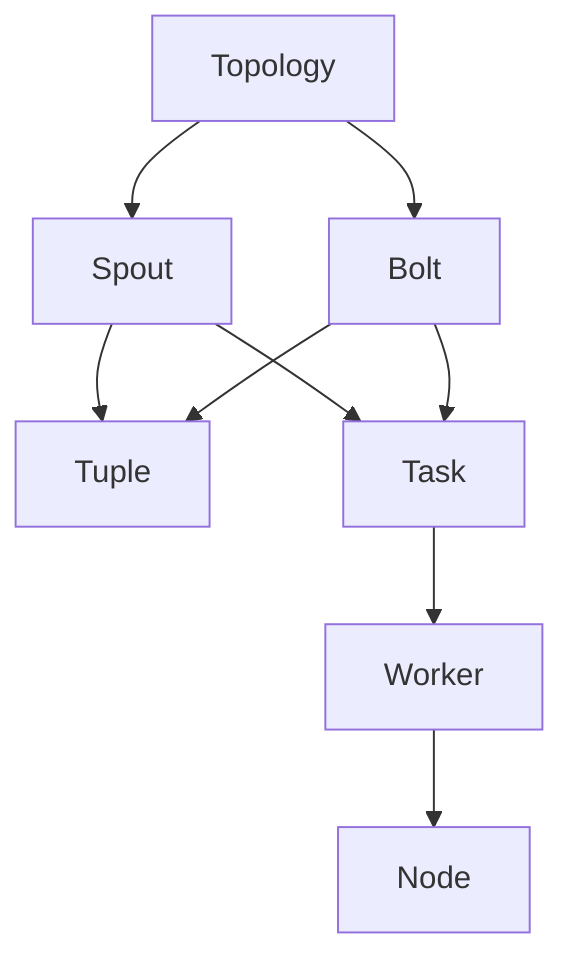

# Storm Spout原理与代码实例讲解

## 1. 背景介绍

### 1.1 问题的由来

在现代大数据时代，实时数据处理已经成为许多企业和组织的关键需求。传统的批处理系统无法满足对实时性的要求,因此需要一种新的数据处理范式来应对这一挑战。Apache Storm作为一个分布式实时计算系统应运而生,它能够实现对大量实时数据流的可靠处理。

Storm的核心设计理念是将实时计算作为一个连续不断的流程序(stream process)来对待。在这种范式下,数据被视为一个无限的流,需要被持续不断地处理。Storm提供了两个核心抽象:Spout和Bolt。Spout充当数据源,从外部系统(如消息队列、数据库等)获取数据流,并将其注入到Storm拓扑(topology)中;而Bolt则充当数据处理单元,对数据流执行各种转换操作。

Spout作为Storm拓扑的入口点,对于整个实时计算流程至关重要。本文将重点探讨Storm Spout的原理和实现,帮助读者深入理解如何构建高效、可靠的实时数据处理管道。

### 1.2 研究现状

目前,Storm Spout的实现方式主要有以下几种:

1. **Reliable Spout**: 这是Storm官方提供的一种Spout实现,它保证了数据的可靠性,即使在发生故障的情况下也不会丢失数据。Reliable Spout通过将数据存储在Zookeeper或其他持久化存储中,并使用acking机制来跟踪元组的处理状态,从而实现了数据的容错和重放。

2. **Kafka Spout**: 这是一种常见的Spout实现,它从Apache Kafka消息队列中读取数据流。Kafka Spout利用了Kafka的高吞吐量和可靠性,能够高效地将数据注入Storm拓扑。

3. **HDFS Spout**: 这种Spout从HDFS中读取数据文件,常用于处理历史数据或批量数据。

4. **自定义Spout**: 除了上述常见实现之外,开发人员还可以根据具体需求,自行实现定制的Spout。例如,从数据库、消息队列、网络流量等各种数据源中获取数据流。

### 1.3 研究意义

深入理解Storm Spout的原理和实现对于构建高效、可靠的实时数据处理管道至关重要。通过本文的学习,读者可以获得以下收获:

1. 掌握Storm Spout的设计理念和核心概念,了解它在整个Storm拓扑中的作用。

2. 学习如何实现自定义Spout,从各种数据源获取数据流,满足特定的业务需求。

3. 了解Reliable Spout和Kafka Spout等常见Spout实现的原理和优缺点,以便在实际项目中做出正确的选择。

4. 掌握Spout的高级特性和最佳实践,如数据重放、故障恢复、反压力控制等,提高实时数据处理系统的健壮性和可靠性。

5. 通过代码实例和详细解释,加深对Spout实现的理解,为将来的实践奠定基础。

### 1.4 本文结构

本文将从以下几个方面全面讨论Storm Spout:

1. 核心概念与联系
2. 核心算法原理与具体操作步骤
3. 数学模型和公式详细讲解与举例说明
4. 项目实践:代码实例和详细解释说明
5. 实际应用场景
6. 工具和资源推荐
7. 总结:未来发展趋势与挑战
8. 附录:常见问题与解答

## 2. 核心概念与联系

在深入探讨Storm Spout的细节之前,我们需要先了解一些核心概念和它们之间的联系。

### 2.1 Spout

Spout是Storm拓扑中的数据源,它从外部系统(如消息队列、数据库等)获取数据流,并将其注入到Storm拓扑中进行处理。每个Spout实例都是一个独立的线程,负责生成数据流中的一部分元组(tuples)。

Spout需要实现以下几个关键方法:

- `nextTuple()`: 这是Spout的核心方法,用于生成新的元组并发射到Storm拓扑中。
- `ack(Object msgId)`: 当一个元组被成功处理时,Storm会调用这个方法来确认该元组已被处理。
- `fail(Object msgId)`: 如果一个元组处理失败,Storm会调用这个方法,以便Spout可以重新发射该元组。

### 2.2 Tuple

Tuple是Storm中表示数据的基本单位。它是一个键值对列表,可以包含任意数量的字段。Tuple在Storm拓扑中流动,被Bolt处理和转换。

### 2.3 Topology

Topology是Storm中表示实时计算流程的核心数据结构。它定义了Spout和Bolt之间的数据流动路径,以及它们之间的并行度。一个Topology可以包含一个或多个Spout和Bolt。

### 2.4 Task

Task是Spout或Bolt的实际执行实例。每个Spout或Bolt都会有一个或多个Task实例在集群的不同工作节点上运行,以实现并行处理。

### 2.5 Worker

Worker是Storm中的一个进程,它运行在集群的某个节点上。一个Worker可以包含一个或多个Spout/Bolt Task,并负责它们之间的数据传输和消息传递。

### 2.6 核心概念关系图

下图使用Mermaid流程图清晰地展示了Storm中各个核心概念之间的关系:



在这个流程图中,我们可以看到:

- Topology包含Spout和Bolt
- Spout和Bolt生成和处理Tuple
- Spout和Bolt都有多个Task实例
- Task实例运行在Worker进程中
- Worker进程运行在集群的节点(Node)上

通过掌握这些核心概念及其关系,我们就能更好地理解Storm Spout在整个实时计算流程中的作用和地位。

## 3. 核心算法原理与具体操作步骤

### 3.1 算法原理概述

Storm Spout的核心算法原理是基于一种称为"可靠的锚点机制"(Reliable Anchor Mechanism)的设计。这种机制保证了即使在发生故障的情况下,Spout也不会丢失或重复发射数据。

可靠的锚点机制的基本思想是:Spout会为每个发射的Tuple分配一个唯一的消息ID(msgId),并将该msgId与Tuple的内容一起持久化存储,例如在Zookeeper或者其他持久化存储系统中。当Storm确认一个Tuple已被成功处理(通过调用`ack(msgId)`方法),Spout就可以安全地从持久化存储中删除该Tuple的msgId。如果一个Tuple处理失败(通过调用`fail(msgId)`方法),Spout就可以使用持久化的msgId重新发射该Tuple。

通过这种机制,Spout能够保证数据的"恰好一次"语义(Exactly-Once Semantics),即每个Tuple要么被成功处理一次,要么根本没有被处理。这种语义对于许多需要严格数据一致性的应用场景(如金融交易、物联网数据采集等)至关重要。

### 3.2 算法步骤详解

Storm Spout的可靠锚点机制可以分为以下几个关键步骤:

1. **发射Tuple**

   在`nextTuple()`方法中,Spout从外部数据源获取数据,并将其封装为Tuple。然后,Spout会为该Tuple分配一个唯一的msgId,并将Tuple和msgId一起持久化存储。最后,Spout调用`emit(tuple, msgId)`方法将Tuple发射到Storm拓扑中。

2. **确认Tuple处理**

   当一个Tuple被成功处理后,Storm会调用Spout的`ack(msgId)`方法。Spout收到这个确认后,就可以安全地从持久化存储中删除该msgId,因为该Tuple已经被成功处理。

3. **重新发射失败Tuple**

   如果一个Tuple处理失败,Storm会调用Spout的`fail(msgId)`方法。Spout收到这个失败通知后,可以使用持久化的msgId从存储中重新获取该Tuple的内容,并重新发射到Storm拓扑中。

4. **定期清理**

   为了防止持久化存储空间被无限制地占用,Spout通常会定期清理已确认或已过期的msgId。这可以通过实现`activate()`和`deactivate()`方法来完成。

下面是Storm Spout可靠锚点机制的流程图:

```mermaid
graph TD
    A[从外部数据源获取数据] --> B[封装为Tuple]
    B --> C[为Tuple分配唯一msgId]
    C --> D[持久化存储Tuple和msgId]
    D --> E[发射Tuple到Storm拓扑]
    E --> F{Tuple处理成功?}
    F -->|是| G[调用ack(msgId)]
    G --> H[从持久化存储删除msgId]
    F -->|否| I[调用fail(msgId)]
    I --> J[从持久化存储获取Tuple]
    J --> K[重新发射Tuple]
    H --> L[定期清理已确认/过期msgId]
```

通过上述步骤,Storm Spout能够实现数据的可靠性和"恰好一次"语义,从而确保实时数据处理的正确性和一致性。

### 3.3 算法优缺点

Storm Spout的可靠锚点机制具有以下优点:

1. **数据可靠性**:即使在发生故障的情况下,也不会丢失或重复处理数据。
2. **"恰好一次"语义**:保证每个Tuple要么被成功处理一次,要么根本没有被处理。
3. **容错性**:能够自动重新发射失败的Tuple,提高系统的容错能力。
4. **可扩展性**:Spout实例可以在多个节点上并行运行,提高系统的吞吐量和处理能力。

然而,这种机制也存在一些缺点和限制:

1. **性能开销**:持久化存储和重放机制会带来一定的性能开销,可能影响系统的吞吐量和延迟。
2. **存储空间占用**:需要持久化存储大量的msgId,可能会占用较大的存储空间。
3. **复杂性**:实现可靠的Spout需要处理许多边缘情况和错误场景,增加了代码的复杂性。
4. **一致性约束**:由于需要保证"恰好一次"语义,Spout无法实现完全无序的处理,这可能会限制某些特定场景的应用。

因此,在实际应用中,需要根据具体的业务需求和性能要求,权衡利弊后选择是否使用可靠的Spout实现。对于一些对数据一致性要求不太严格的场景,使用非可靠的Spout可能会更加高效。

### 3.4 算法应用领域

Storm Spout的可靠锚点机制适用于各种需要实时处理大量数据流的应用场景,特别是对数据一致性和可靠性有较高要求的领域。以下是一些典型的应用领域:

1. **金融服务**:实时处理金融交易数据、检测欺诈行为、进行风险分析等,都需要确保数据的准确性和完整性。

2. **物联网(IoT)数据采集**:从大量的传感器和设备中实时采集数据,用于监控、预测维护等,需要保证数据不会丢失或重复。

3. **在线广告系统**:实时处理用户行为数据,进行个性化广告投放和效果分析,要求数据处理的准确性和一致性。

4. **网络安全监控**:实时分析网络流量数据,检测入侵和异常行为,需要确保每个数据包都被正确处理。

5. **电信运营商数据处理**:实时处理大量的通话记录、上网流量等数据,用于计费、优化网络等,对数据的准确性和完整性有严格要求。

6. **实时日志处理**:从各种应用程序和系统中实时收集和处理日志数据,用于监控、故障排查和分析,需要确保日志数据不会丢失或重复。

总的来说,任何需要实时处理大量数据流,并对数据一致性和可靠性有较高要求的应用场景,都可以考虑使用Storm的可靠Spout机制。

## 