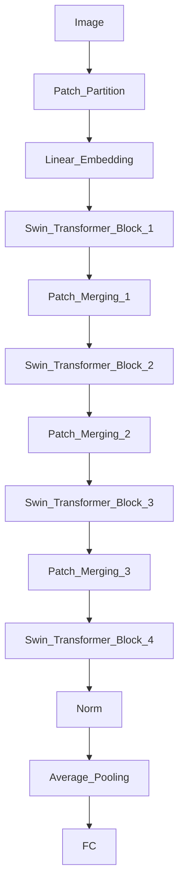
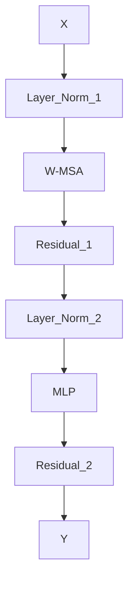

# Swin Transformer原理与代码实例讲解

## 1. 背景介绍
### 1.1 问题的由来
随着深度学习的快速发展,计算机视觉领域取得了巨大的进步。从最初的LeNet、AlexNet到后来的VGGNet、GoogLeNet、ResNet等经典卷积神经网络(CNN)架构,再到近年来Transformer在NLP领域大放异彩,学术界和工业界都在不断探索更优秀的神经网络模型。

传统CNN虽然在图像分类、目标检测、语义分割等任务上表现优异,但仍存在一些局限性,比如CNN的感受野有限,难以捕捉全局信息;此外CNN的计算成本较高,难以应用到高分辨率图像中。为了克服这些问题,微软在2021年提出了Swin Transformer[1],它将Transformer引入视觉领域,并进行了一系列改进,在各项视觉任务上取得了SOTA的性能。

### 1.2 研究现状 
Transformer最初由Vaswani等人[2]在2017年提出,主要应用于机器翻译等NLP任务。它完全基于注意力机制,抛弃了RNN/CNN等结构,通过自注意力捕捉输入序列中不同位置之间的依赖关系。Transformer的并行计算能力强,训练效率高,并在多个NLP任务上取得了SOTA的效果。

受Transformer的启发,研究者开始尝试将其应用到计算机视觉领域。Dosovitskiy等人[3]提出了Vision Transformer(ViT),将图像分割成若干patches,然后将patches序列输入Transformer进行建模。ViT在图像分类任务上取得了不错的效果。此后,陆续有DETR[4]、SETR[5]等工作将Transformer用于目标检测、语义分割等视觉任务。

尽管这些工作取得了一定成果,但它们大多直接将NLP中的Transformer结构拿来应用,没有很好地考虑视觉任务的特点和要求。比如ViT中的patches非常小,导致序列过长,计算量大且缺乏归纳偏置;DETR需要耗时的训练才能收敛;SETR的分辨率有限等。因此,亟需一种专门为视觉任务定制化设计的Transformer模型。

### 1.3 研究意义
Swin Transformer的提出具有重要意义:

1. 它借鉴了CNN中层次化特征提取的思想,通过逐步下采样获得多尺度特征图,克服了ViT中序列过长的问题。

2. 它引入了移位窗口(Shifted Window)的思想,在增大感受野的同时,避免了全局自注意力带来的巨大计算量。

3. 它在主干网络之外设计了用于下游任务的轻量级头部,使得Swin Transformer可以方便地迁移到目标检测、实例分割等密集预测任务中。

4. 它在ImageNet分类、COCO目标检测/实例分割、ADE20K语义分割等多个视觉任务上超越了之前最好的CNN和Transformer模型,展现了广阔的应用前景。

总的来说,Swin Transformer很好地继承了CNN和Transformer两者的优点,为视觉Transformer的发展指明了一个新的方向。研究Swin Transformer的原理和实现,对于理解视觉Transformer的发展脉络,以及探索更优秀的视觉Transformer架构具有重要意义。

### 1.4 本文结构
本文将全面介绍Swin Transformer的原理和代码实现,内容安排如下:

第2部分介绍Swin Transformer中的核心概念,如层次化特征图、移位窗口、相对位置编码等,并分析它们之间的联系。

第3部分详细讲解Swin Transformer的算法原理,包括整体架构、Patch Merging、Window MSA等模块的设计思路和具体实现步骤。

第4部分介绍Swin Transformer用到的数学模型和公式,并结合实例进行推导和讲解。

第5部分给出Swin Transformer的PyTorch代码实现,详细解读核心代码,展示模型的训练和推理流程。

第6部分讨论Swin Transformer在图像分类、目标检测、语义分割等领域的应用,并展望其未来的发展方向。

第7部分推荐一些学习Swin Transformer的资源,包括论文、代码仓库、教程等。

第8部分总结全文,并对Swin Transformer的研究现状、未来趋势、面临的挑战等方面进行展望。

## 2. 核心概念与联系

在详细讲解Swin Transformer的算法原理之前,我们先来了解一下其中的一些核心概念。

**层次化特征图(Hierarchical Feature Maps)**:这是Swin Transformer借鉴CNN而提出的概念。CNN通过逐层下采样(例如stride=2的卷积或池化),可以获得分辨率逐渐降低、感受野逐渐增大的特征层次。Swin Transformer中,通过Patch Merging模块实现特征图的下采样和通道数增加,从而获得类似CNN的特征层次。层次化的多尺度特征有利于视觉任务的学习。

**移位窗口(Shifted Window)**:这是Swin Transformer的一大创新点。传统的Transformer需要在全局范围内计算自注意力,计算量非常大。为了提高效率,Swin Transformer将特征图划分为一个个不重叠的窗口,然后在每个窗口内部计算自注意力。但是这样会损失窗口之间的信息交互。因此,Swin Transformer在连续的两个Transformer Block之间引入移位窗口的机制,即第二个Block的窗口划分相对第一个Block进行了位置的偏移。这样,原先属于同一个窗口的Patches在下一层会进入不同的窗口,增加了信息交融。移位窗口的设计既能增大感受野,又能避免全局自注意力的巨大计算量。

**相对位置编码(Relative Position Bias)**:由于Swin Transformer对特征图进行了窗口划分,导致不同窗口内的Patches缺乏位置信息。为此,Swin Transformer参考BERT中的相对位置编码方式,引入可学习的相对位置编码矩阵B,矩阵中的每个元素表示行Patch和列Patch之间的位置偏置。将位置编码B与注意力矩阵A相加,就得到了具有位置信息的注意力图。相对位置编码能够在一定程度上弥补窗口划分造成的位置信息损失。

这些核心概念环环相扣,共同构建起Swin Transformer的整体框架。层次化特征图使得Swin Transformer能够提取多尺度的语义信息;移位窗口增大了感受野,提升了建模能力;相对位置编码弥补了窗口划分的位置信息损失。三者的巧妙结合,使得Swin Transformer在众多视觉任务上取得了SOTA的效果。

## 3. 核心算法原理 & 具体操作步骤
### 3.1 算法原理概述
Swin Transformer的整体架构如下图所示:

可以看到,Swin Transformer主要由Patch Partition、Linear Embedding、Swin Transformer Block和Patch Merging等模块组成。输入图像首先被划分为一系列不重叠的Patches,然后通过线性变换映射到隐藏层维度,再输入到Swin Transformer Block中进行自注意力计算。Swin Transformer Block的输出经过Patch Merging模块进行下采样和通道数增加,然后再次输入到下一个Stage的Swin Transformer Block中,如此循环下去。网络的最后通过LayerNorm、全局平均池化和全连接层得到分类输出。

接下来,我们对每个模块的算法原理进行详细讲解。

### 3.2 算法步骤详解

**Step1:Patch Partition和Linear Embedding**

首先,将输入图像I∈R^(H×W×3)划分为N个不重叠的Patches,每个Patch的大小为P×P,这样得到的Patches总数N=HW/P^2。然后,将每个Patch展平,并通过线性变换将其映射到隐藏层维度C,得到特征图X∈R^(N×C)。可以将其看作是Patch Embedding。

**Step2:Swin Transformer Block**

Swin Transformer Block是Swin Transformer的核心组件,每个Block包含多个带移位窗口的Multi-head Self-Attention(W-MSA)模块和2层MLP,其结构如下:

其中,Layer Norm是层归一化,用于加速收敛和提高泛化性能;Residual是残差连接,有助于梯度的反向传播。

W-MSA的计算过程如下:
1. 将特征图X∈R^(H×W×C)划分为M×M个不重叠的窗口,每个窗口的大小为W_h×W_w,这里要求H和W都能被W_h和W_w整除。
2. 对每个窗口内的Patches计算Multi-head Self-Attention。假设第i个头的Query、Key、Value矩阵分别为Q_i、K_i、V_i,则注意力计算公式为:

$$ Attention(Q_i,K_i,V_i)=Softmax(\frac{Q_iK_i^T}{\sqrt{d}}+B)V_i $$

其中d是每个头的维度,B∈R^(W_h*W_w×W_h*W_w)是可学习的相对位置编码矩阵。

3. 将各个头的注意力结果拼接,并乘以投影矩阵得到输出。

对于连续的两个Block,第二个Block的窗口划分方式相对第一个Block进行了偏移,即实现了移位窗口。移位步长通常取W_h/2和W_w/2。

MLP包含两层全连接层和GELU激活函数,可以增强特征的表达能力。

**Step3:Patch Merging**

经过Swin Transformer Block后,我们得到了特征图X∈R^(H×W×C)。Patch Merging模块将相邻的2×2个Patches合并为一个Patch,同时将通道数翻倍,从而实现下采样和通道数增加。

具体来说,对于每个2×2的Patch组,将其展平为4C维向量,然后乘以一个线性变换矩阵(可学习),得到2C维的新特征。这样,特征图的分辨率减半,通道数翻倍,形状变为(H/2)×(W/2)×(2C)。

Patch Merging一方面可以降低分辨率、减少计算量,另一方面可以扩大感受野、提取更高层语义特征。此外,通道数的增加也有助于增强模型的表达能力。

**Step4:分类输出**

将最后一个Stage的输出特征图通过Layer Norm进行归一化,然后经过全局平均池化将其压缩为一个D维向量,最后通过全连接层映射到类别数C,得到分类输出。

以上就是Swin Transformer的核心算法步骤。总的来说,Swin Transformer通过Patch Partition将图像划分为Patches,然后通过多个Stage的Swin Transformer Block提取特征,其中每个Stage都通过Patch Merging实现下采样,最后通过分类头得到输出。Swin Transformer巧妙地结合了Transformer的强大建模能力和CNN的归纳偏置,是一种非常优秀的视觉Transformer架构。

### 3.3 算法优缺点

Swin Transformer相比传统CNN和其他视觉Transformer有以下优点:

1. 通过层次化的特征图设计,Swin Transformer能够提取多尺度的特征,这有利于下游视觉任务的学习。
2. 移位窗口的设计使得Swin Transformer能在增大感受野的同时,避免了全局自注意力的巨大计算量,大大提高了计算效率。
3. 