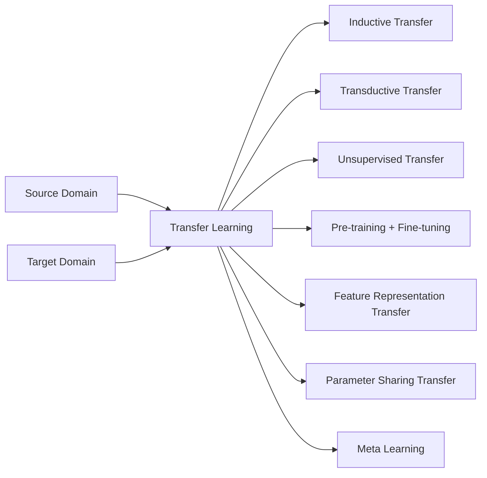

# Transfer Learning 原理与代码实战案例讲解

关键词：迁移学习、深度学习、神经网络、预训练模型、fine-tuning、领域自适应

## 1. 背景介绍
### 1.1 问题的由来
在许多现实世界的机器学习应用中,我们经常面临着标注数据不足的问题。获取大量高质量的标注数据往往需要大量的人力物力,代价高昂。而迁移学习正是解决这一问题的重要方法之一。它通过借鉴已有的知识,实现模型在新任务上的快速适配和精度提升,大大降低了对标注数据的需求。

### 1.2 研究现状
迁移学习近年来受到学术界和工业界的广泛关注。一方面,深度学习的蓬勃发展为迁移学习提供了更加强大的特征提取和表示能力；另一方面,大规模预训练模型如BERT、GPT等在NLP领域取得了巨大成功,展现了迁移学习的威力。目前,迁移学习已经在计算机视觉、自然语言处理、语音识别、推荐系统等诸多领域得到应用。

### 1.3 研究意义
迁移学习能够显著提升模型的泛化能力,加速模型的训练和调优过程,降低对大规模标注数据的依赖。这对于工业应用具有重要意义,尤其是对于数据稀缺的垂直领域和冷启动场景。同时,迁移学习也为构建通用人工智能系统提供了重要思路。

### 1.4 本文结构
本文将全面介绍迁移学习的原理、方法和应用。第2节介绍迁移学习的核心概念；第3节详细讲解几种主要的迁移学习算法；第4节给出迁移学习常用的数学模型；第5节通过代码实例演示如何使用迁移学习进行图像分类；第6节总结迁移学习的实际应用场景；第7节推荐相关的学习资源；第8节对全文进行总结并展望未来。

## 2. 核心概念与联系
迁移学习是指利用已有的知识来学习新的但相关的任务,从而显著提升模型性能、加速训练过程的机器学习方法。其核心是找到源领域(source domain)和目标领域(target domain)之间的相似性,并基于这种相似性进行知识迁移。

根据源领域和目标领域的关系,迁移学习可分为以下三类:
- 归纳式迁移学习(Inductive Transfer Learning):源领域和目标领域的任务不同,需要利用源领域的知识来辅助目标领域的学习。如利用ImageNet预训练模型进行医学图像分类。  
- 直推式迁移学习(Transductive Transfer Learning):源领域和目标领域的任务相同,但数据分布不同。如利用标注的新闻文本来分类未标注的博客文本。
- 无监督迁移学习(Unsupervised Transfer Learning):源领域和目标领域均没有标注数据,需要利用两个领域的数据进行非监督方式的迁移学习。如跨语言的词嵌入对齐。

从模型层面看,迁移学习的主要技术路线包括:
- 预训练+微调(Pre-training + Fine-tuning):在大规模数据集上预训练通用模型,然后在小规模目标数据集上进行微调。这是当前使用最广泛的迁移学习范式。
- 特征表示迁移(Feature Representation Transfer):学习跨领域的共享特征表示,消除领域差异。代表性方法有MMD、CORAL等。
- 参数共享迁移(Parameter Sharing Transfer):构建具有共享参数的联合神经网络模型,同时对源领域和目标领域进行建模。代表性方法有LTN等。
- 元学习(Meta Learning):通过学习如何学习(Learning to Learn)提取通用知识,实现快速适配。代表性方法有MAML等。



## 3. 核心算法原理 & 具体操作步骤
### 3.1 算法原理概述
本节重点介绍预训练+微调这一最主流的迁移学习范式。其基本思路是:先在大规模源领域数据上训练一个通用的深度神经网络模型,学习到鲁棒、泛化性强的特征表示；然后将预训练模型迁移到目标任务,并使用少量目标领域数据进行微调,快速适配新任务。预训练阶段负责知识的积累和融合,微调阶段负责知识的精细化和定制化。

### 3.2 算法步骤详解
预训练+微调的具体步骤如下:
1. 在源领域进行大规模预训练,常见的选择包括:
   - 有监督预训练:在ImageNet等大型分类数据集上训练卷积神经网络
   - 自监督预训练:通过自定义Pretext任务如图像修复、上下文预测等进行预训练
   - 半监督预训练:利用少量标注数据和大量无标注数据联合训练
2. 将预训练模型迁移到目标任务:
   - 特征提取器迁移:固定预训练模型的特征提取部分,替换输出层并随机初始化 
   - 微调:在目标数据集上Fine-tune整个网络或部分网络层的参数
3. 在目标数据集上进行训练和测试,评估迁移学习的效果。根据任务难易程度和数据量选择合适的学习率、batch size、epoch数等超参数。

### 3.3 算法优缺点
预训练+微调的优点在于:
- 充分利用了源领域数据,学习到通用的特征表示,具有很强的泛化能力
- 降低了对目标领域标注数据的需求,在小样本场景下性能优异
- 加速了模型的收敛速度,减少训练时间

其缺点和局限性包括:
- 预训练需要巨大的计算资源,对中小型团队和个人不友好  
- 源领域和目标领域的相关性难以度量,需要进行人工选择
- 对于差异很大的领域,迁移学习的效果有限

### 3.4 算法应用领域
基于深度学习的迁移学习已经在多个领域取得了巨大成功,代表性的应用包括:
- 计算机视觉:利用ImageNet预训练模型进行图像分类、目标检测、语义分割等
- 自然语言处理:利用BERT、GPT等预训练语言模型进行文本分类、命名实体识别、问答等 
- 语音识别:利用LibriSpeech等数据集预训练声学模型,再适配特定语音识别任务
- 推荐系统:利用用户行为数据预训练用户和物品的嵌入表示,实现冷启动和跨域推荐

## 4. 数学模型和公式 & 详细讲解 & 举例说明
### 4.1 数学模型构建
设源领域数据为 $D_s=\{(x_i^s,y_i^s)\}_{i=1}^{n_s}$,目标领域数据为 $D_t=\{(x_j^t,y_j^t)\}_{j=1}^{n_t}$,其中 $x$ 为输入特征, $y$ 为标签, $n_s$ 和 $n_t$ 分别为源领域和目标领域的样本数量。

定义源领域和目标领域的特征空间分别为 $\mathcal{X}_s$ 和 $\mathcal{X}_t$,标签空间分别为 $\mathcal{Y}_s$ 和 $\mathcal{Y}_t$,条件概率分布分别为 $P(Y_s|X_s)$ 和 $P(Y_t|X_t)$。

迁移学习的目标是学习一个目标预测函数 $f:\mathcal{X}_t \rightarrow \mathcal{Y}_t$,使得目标域的预测损失 $\mathcal{L}_t(f)=\mathbb{E}_{(x,y)\sim D_t}[ℓ(f(x),y)]$ 最小化。这里 $ℓ$ 是损失函数,如交叉熵损失等。

### 4.2 公式推导过程
对于预训练+微调方法,我们首先在源领域数据 $D_s$ 上训练一个深度神经网络 $f_s$,其参数为 $\theta_s$,优化目标为最小化源域损失:

$$\min_{\theta_s} \mathcal{L}_s(f_s) = \min_{\theta_s} \mathbb{E}_{(x,y)\sim D_s}[ℓ(f_s(x),y)]$$

得到预训练模型 $f_s$ 后,我们将其迁移到目标任务,并在目标数据 $D_t$ 上进行微调。记微调后的模型为 $f_t$,参数为 $\theta_t$,优化目标为:

$$\min_{\theta_t} \mathcal{L}_t(f_t) = \min_{\theta_t} \mathbb{E}_{(x,y)\sim D_t}[ℓ(f_t(x),y)] + \lambda R(\theta_t)$$

其中 $R(\theta_t)$ 是正则化项,用于控制模型复杂度并防止过拟合, $\lambda$ 为平衡因子。常用的正则化方法包括L2正则化、dropout等。

### 4.3 案例分析与讲解
下面以图像分类任务为例,说明如何使用PyTorch进行预训练+微调。

首先加载预训练模型,这里以ResNet-50为例:

```python
model = torchvision.models.resnet50(pretrained=True) 
```

然后根据目标任务的类别数修改输出层:

```python
num_classes = 10  # 假设目标任务有10个类别
model.fc = nn.Linear(2048, num_classes)
```

接下来定义损失函数和优化器:

```python
criterion = nn.CrossEntropyLoss()
optimizer = optim.SGD(model.parameters(), lr=0.001, momentum=0.9)
```

最后在目标数据集上进行微调训练:

```python
for epoch in range(num_epochs):
    for inputs, labels in dataloaders['train']:
        optimizer.zero_grad()
        outputs = model(inputs)
        loss = criterion(outputs, labels)
        loss.backward()
        optimizer.step()
```

### 4.4 常见问题解答
Q: 预训练模型的选择有什么原则?
A: 一般来说,预训练模型的选择需要考虑以下因素:
- 模型结构:尽量选择在大规模数据集上表现良好的经典模型结构,如ResNet、Inception等
- 数据集相关性:预训练数据集应该与目标任务有一定相关性,如ImageNet用于普适物体分类,而不太适合医学图像
- 模型大小:模型参数量不宜过大,否则会增加计算开销,且更容易过拟合

Q: 微调时需要训练所有层吗?
A: 不一定。当目标数据集比较小时,完全微调可能会导致过拟合,此时可以选择只训练部分高层。一个常见的策略是冻结预训练模型的浅层(如ResNet的前几个stage),只微调深层。但如果目标数据量较大,则可以考虑完全微调。这需要根据具体任务和数据集进行调整。

## 5. 项目实践：代码实例和详细解释说明
下面通过一个完整的代码实例,演示如何使用迁移学习进行图像分类。我们将使用PyTorch框架,并选择在ImageNet上预训练的ResNet-50作为基础模型。

### 5.1 开发环境搭建
首先安装必要的依赖包:
```
pip install torch torchvision
```

### 5.2 源代码详细实现
完整代码如下:

```python
import torch
import torch.nn as nn
import torch.optim as optim
from torchvision import datasets, models, transforms

# 数据预处理和增强
data_transforms = {
    'train': transforms.Compose([
        transforms.RandomResizedCrop(224),
        transforms.RandomHorizontalFlip(),
        transforms.ToTensor(),
        transforms.Normalize([0.485, 0.456, 0.406], [0.229, 0.224, 0.225])
    ]),
    'val': transforms.Compose([
        transforms.Resize(256),
        transforms.CenterCrop(224),
        transforms.ToTensor(),
        transforms.Normalize([0.485, 0.456, 0.406], [0.229, 0.224, 0.225])
    ]),
}

# 加载数据集
data_dir = 'data/hymenoptera_data