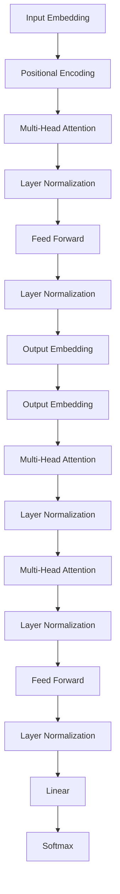

# Transformer 模型 原理与代码实例讲解

作者：禅与计算机程序设计艺术 / Zen and the Art of Computer Programming 

## 1. 背景介绍
### 1.1  问题的由来
自然语言处理(NLP)是人工智能领域的一个重要分支,旨在让计算机能够理解、处理和生成人类语言。传统的NLP方法主要基于循环神经网络(RNN),如LSTM和GRU等。然而,RNN存在难以并行化、梯度消失等问题,限制了模型在处理长序列时的性能。为了克服RNN的局限性,Google于2017年提出了Transformer模型[1]。

### 1.2  研究现状 
Transformer作为一种全新的神经网络架构,引入了自注意力机制和位置编码,实现了高效的并行计算。自提出以来,Transformer在机器翻译、文本摘要、问答系统等NLP任务上取得了显著成果。例如,基于Transformer的BERT[2]和GPT[3]模型在多项NLP基准测试中刷新了记录。目前,Transformer已成为NLP领域的主流模型架构。

### 1.3  研究意义
深入理解Transformer的原理和实现,对于掌握现代NLP技术具有重要意义。一方面,Transformer为复杂NLP任务提供了新的解决思路;另一方面,Transformer的思想也启发了计算机视觉等其他领域的研究。本文将从原理到实践,系统讲解Transformer模型,帮助读者全面把握这一里程碑式的技术创新。

### 1.4  本文结构
本文将分为以下几个部分:第2节介绍Transformer的核心概念;第3节详细阐述Transformer的算法原理;第4节给出Transformer涉及的数学模型和公式;第5节通过代码实例讲解Transformer的实现;第6节讨论Transformer的应用场景;第7节推荐相关的工具和资源;第8节总结全文并展望未来。

## 2. 核心概念与联系

Transformer模型的核心概念包括:

- **Encoder-Decoder结构**: Transformer沿用了传统的Encoder-Decoder结构,由编码器和解码器组成。编码器负责将输入序列映射为隐向量,解码器根据隐向量生成输出序列。

- **自注意力机制(Self-Attention)**: 自注意力让序列中的任意两个位置都能直接建立联系,克服了RNN的距离限制。通过计算Query、Key、Value三个矩阵,自注意力可以动态地确定序列不同位置之间的依赖关系。

- **多头注意力(Multi-Head Attention)**: 多头注意力是自注意力的扩展,通过引入多组参数,让模型从不同子空间学习输入序列的表示。多头注意力增强了模型的表达能力。

- **位置编码(Positional Encoding)**: 由于自注意力没有考虑序列的位置信息,Transformer引入位置编码来标记序列中每个词的位置。位置编码可以是固定的三角函数,也可以随模型一起学习。

- **Layer Normalization**: Transformer使用Layer Normalization来加速训练收敛。与Batch Normalization对整个Batch进行归一化不同,Layer Normalization是在每个样本内部进行归一化。

- **残差连接(Residual Connection)**: 为了缓解深层网络的优化难题,Transformer在每个子层之后添加残差连接。残差连接可以让梯度更顺畅地反向传播。

下图展示了Transformer模型的整体架构和各部分的联系:

## 3. 核心算法原理 & 具体操作步骤
### 3.1  算法原理概述
Transformer的核心是自注意力机制和多头注意力。自注意力通过计算Query、Key、Value三个矩阵,建立序列内部的依赖关系。具体地,对于输入序列的每个位置,自注意力执行以下计算:

1. 将当前位置的向量视为Query
2. 将序列中所有位置的向量视为Key和Value
3. 计算Query与每个Key的相似度得分
4. 对相似度得分进行Softmax归一化,得到注意力权重
5. 将注意力权重与对应的Value相乘并求和,得到当前位置的新表示

多头注意力则将上述过程独立执行多次,并将结果拼接起来。

### 3.2  算法步骤详解
下面以编码器的自注意力为例,详细说明Transformer的计算步骤:

**输入**: 编码器的输入为一个形状为 $(n,d)$ 的矩阵 $X$,其中 $n$ 为序列长度, $d$ 为词向量维度。

**Step 1**: 计算Query、Key、Value矩阵。使用三个不同的权重矩阵 $W^Q, W^K, W^V$,将 $X$ 变换到 $d_k$ 维空间:

$$
\begin{aligned}
Q &= XW^Q \\
K &= XW^K \\
V &= XW^V
\end{aligned}
$$

其中 $Q,K,V$ 的形状均为 $(n,d_k)$。

**Step 2**: 计算注意力权重。将 $Q$ 与 $K$ 的转置相乘并除以 $\sqrt{d_k}$,再经过Softmax归一化:

$$
\text{Attention}(Q,K,V) = \text{softmax}(\frac{QK^T}{\sqrt{d_k}})V
$$

注意力权重矩阵的形状为 $(n,n)$,表示序列中任意两个位置之间的相关性。

**Step 3**: 加权求和。将注意力权重矩阵与 $V$ 相乘,得到输出矩阵 $Z$:

$$
Z = \text{Attention}(Q,K,V)
$$

$Z$ 的形状为 $(n,d_k)$,是输入序列 $X$ 经过自注意力变换后的新表示。

**多头注意力**: 多头注意力重复执行 $h$ 次上述过程,每次使用不同的权重矩阵。最后,将 $h$ 个头的输出拼接起来,并经过一个线性变换得到最终输出。

### 3.3  算法优缺点
Transformer相比RNN的优点包括:
- 并行计算能力强,训练速度快
- 可以建立长距离依赖,捕捉全局信息
- 解决了梯度消失问题,模型更稳定

但Transformer也存在一些局限:
- 计算复杂度随序列长度平方增长,难以处理超长序列
- 位置编码是固定的,缺乏灵活性
- 无法显式建模序列的顺序信息

### 3.4  算法应用领域
Transformer已成为NLP领域的通用模型架构,广泛应用于以下任务:
- 机器翻译:如Google的Neural Machine Translation系统
- 文本分类:如BERT在情感分析、语义匹配等任务上的应用 
- 文本生成:如GPT在对话生成、写作辅助等方面的应用
- 语音识别:如Transformer-Transducer模型
- 知识图谱:如基于Transformer的知识表示学习和知识推理

此外,Transformer的思想也启发了计算机视觉、推荐系统等领域的研究。

## 4. 数学模型和公式 & 详细讲解 & 举例说明
### 4.1  数学模型构建
Transformer的数学模型可以用以下符号表示:

- $X = (x_1,\dots,x_n) \in \mathbb{R}^{n \times d}$: 输入序列,其中 $x_i \in \mathbb{R}^d$ 为第 $i$ 个词的词向量
- $Z = (z_1,\dots,z_n) \in \mathbb{R}^{n \times d}$: 输出序列,其中 $z_i \in \mathbb{R}^d$ 为第 $i$ 个词的新表示
- $W^Q, W^K, W^V \in \mathbb{R}^{d \times d_k}$: 自注意力的三个权重矩阵
- $W^O \in \mathbb{R}^{hd_k \times d}$: 多头注意力的输出权重矩阵
- $\text{Attention}: \mathbb{R}^{n \times d_k} \times \mathbb{R}^{n \times d_k} \times \mathbb{R}^{n \times d_k} \to \mathbb{R}^{n \times d_k}$: 自注意力函数
- $\text{MultiHead}: \mathbb{R}^{n \times d} \to \mathbb{R}^{n \times d}$: 多头注意力函数
- $\text{LayerNorm}: \mathbb{R}^{n \times d} \to \mathbb{R}^{n \times d}$: Layer Normalization函数
- $\text{FFN}: \mathbb{R}^{n \times d} \to \mathbb{R}^{n \times d}$: 前馈神经网络函数

### 4.2  公式推导过程
**自注意力**:
$$
\begin{aligned}
Q &= XW^Q \\
K &= XW^K \\
V &= XW^V \\
\text{Attention}(Q,K,V) &= \text{softmax}(\frac{QK^T}{\sqrt{d_k}})V
\end{aligned}
$$

**多头注意力**:
$$
\begin{aligned}
\text{head}_i &= \text{Attention}(XW_i^Q, XW_i^K, XW_i^V) \\
\text{MultiHead}(X) &= \text{Concat}(\text{head}_1,\dots,\text{head}_h)W^O
\end{aligned}
$$

**Layer Normalization**:
$$
\begin{aligned}
\mu &= \frac{1}{d}\sum_{i=1}^d x_i \\
\sigma^2 &= \frac{1}{d}\sum_{i=1}^d (x_i - \mu)^2 \\
\text{LayerNorm}(x) &= \frac{x-\mu}{\sqrt{\sigma^2 + \epsilon}} * \gamma + \beta
\end{aligned}
$$

其中 $\gamma,\beta \in \mathbb{R}^d$ 为可学习的缩放和偏移参数, $\epsilon$ 为平滑项。

**前馈网络**:
$$
\text{FFN}(x) = \max(0, xW_1 + b_1)W_2 + b_2
$$

其中 $W_1 \in \mathbb{R}^{d \times d_{ff}}, b_1 \in \mathbb{R}^{d_{ff}}$ 为第一层的权重和偏置, $W_2 \in \mathbb{R}^{d_{ff} \times d}, b_2 \in \mathbb{R}^d$ 为第二层的权重和偏置。

### 4.3  案例分析与讲解
考虑一个英译汉的机器翻译任务。输入为英文句子 "I love natural language processing",目标输出为对应的中文翻译 "我爱自然语言处理"。

编码器首先将英文单词映射为词向量序列 $X$:

$$
X = 
\begin{bmatrix}
x_{\text{I}} \\ x_{\text{love}} \\ x_{\text{natural}} \\ x_{\text{language}} \\ x_{\text{processing}}
\end{bmatrix}
$$

然后,编码器通过自注意力和前馈网络,将 $X$ 变换为隐向量序列 $H$:

$$
H = \text{Encoder}(X) = 
\begin{bmatrix}
h_{\text{I}} \\ h_{\text{love}} \\ h_{\text{natural}} \\ h_{\text{language}} \\ h_{\text{processing}}
\end{bmatrix}
$$

解码器以 $H$ 为输入,同时结合之前生成的中文词向量,通过自注意力、编码-解码注意力和前馈网络,逐步生成中文翻译:

$$
\begin{aligned}
y_1 &= \text{Decoder}(H, \text{<start>}) = \text{我} \\
y_2 &= \text{Decoder}(H, [\text{<start>}, \text{我}]) = \text{爱} \\
y_3 &= \text{Decoder}(H, [\text{<start>}, \text{我}, \text{爱}]) = \text{自} \\
y_4 &= \text{Decoder}(H, [\text{<start>}, \text{我}, \text{爱}, \text{自}]) = \text{然} \\
y_5 &= \text{Decoder}(H, [\text{<start>}, \text{我}, \text{