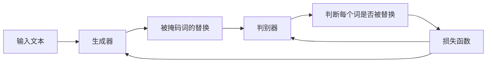

# Transformer大模型实战 ELECTRA 的生成器和判别器

关键词：Transformer、ELECTRA、生成器、判别器、预训练模型、自监督学习、对抗学习

## 1. 背景介绍
### 1.1 问题的由来
随着深度学习技术的飞速发展,尤其是Transformer模型的出现,自然语言处理(NLP)领域取得了突破性进展。从BERT到GPT,各种强大的预训练语言模型相继问世,极大地提升了NLP任务的性能。然而,这些模型在预训练过程中存在一些问题,如计算效率低下、对负样本利用不足等。为了进一步改进预训练模型,2020年,谷歌提出了ELECTRA模型[1],通过引入生成器和判别器的对抗学习机制,在提高训练效率的同时,显著提升了下游任务性能。
### 1.2 研究现状
目前,基于Transformer的预训练语言模型主要分为三类[2]:
1. 基于自回归的生成式模型,如GPT系列
2. 基于自编码的双向模型,如BERT系列 
3. 基于生成-判别对抗学习的模型,如ELECTRA

其中,ELECTRA通过引入生成器和判别器的对抗学习,在多个NLP任务上取得了优于BERT的性能,成为当前最先进的预训练模型之一。许多后续工作在ELECTRA的基础上进行了改进和扩展,如ERNIE-GEN[3]、DeBERTa[4]等。
### 1.3 研究意义
深入研究ELECTRA模型的生成器和判别器机制,对于理解其工作原理和优势具有重要意义。一方面,这有助于我们掌握最新的预训练技术,设计出更加高效、强大的语言模型。另一方面,ELECTRA的思想也为其他领域的对抗学习研究提供了有益启示。此外,基于ELECTRA进行下游任务微调,有望在实际应用中取得更好的效果。
### 1.4 本文结构
本文将围绕ELECTRA的生成器和判别器展开深入探讨。第2部分介绍相关的核心概念。第3部分详细解析ELECTRA的算法原理和训练步骤。第4部分阐述其背后的数学模型和公式推导。第5部分给出ELECTRA的代码实现示例。第6部分讨论其实际应用场景。第7部分推荐相关的学习资源和工具。第8部分总结全文,并展望未来研究方向。第9部分列出常见问题解答。

## 2. 核心概念与联系
- Transformer:一种基于自注意力机制的神经网络模型,广泛应用于NLP领域。
- 预训练模型:在大规模无标注语料上进行自监督预训练,再用于下游任务微调的模型范式。代表模型有BERT、GPT等。
- 生成器:根据输入生成相应输出的模型。在ELECTRA中用于生成被掩码词的替换词。
- 判别器:对输入进行真假判别的模型。在ELECTRA中用于判断每个词是否被替换。
- 对抗学习:生成器和判别器相互博弈,最终使二者性能都得到提升的学习范式。
- MLM:掩码语言模型,通过随机掩码词并预测来学习上下文表征的预训练任务。
- RTD:替换词检测,判别输入文本中的词是否被替换的二分类任务。

下图展示了ELECTRA中生成器和判别器的关系:

## 3. 核心算法原理 & 具体操作步骤 
### 3.1 算法原理概述
ELECTRA的核心思想是通过生成器和判别器的对抗学习,更高效地利用无标注语料进行预训练。具体来说:
1. 生成器G负责根据上下文生成被掩码词的替换词。这可以看作是一个MLM任务。 
2. 判别器D负责判断文本中的每个词是真实词还是生成器的替换词。这可以看作是一个RTD任务。
3. 生成器和判别器采用相同的Transformer编码器结构,共享参数。
4. 通过生成器和判别器的对抗训练,使生成器生成的替换词越来越真实,判别器的判别能力越来越强。最终,判别器编码得到的文本表征将更加准确,有利于下游任务。
### 3.2 算法步骤详解
ELECTRA的训练分为两个阶段:预训练和微调。

预训练阶段的主要步骤如下:
1. 随机掩码。对输入文本进行随机掩码,掩码比例为15%。
2. 生成替换词。生成器G根据上下文,对每个被掩码位置生成替换词。
3. 构造训练样本。将原始文本和生成器替换后的文本拼接,作为判别器D的输入。同时构造标签,原始词标为1,替换词标为0。
4. 判别器预测。判别器D对每个词进行二分类,预测其是否为替换词。
5. 计算损失。对生成器G和判别器D分别计算MLM损失和RTD损失,然后相加得到总损失。
6. 参数更新。基于总损失对G和D的参数进行联合优化,使二者性能同时提升。

微调阶段的主要步骤如下:
1. 舍弃生成器G,只保留判别器D。
2. 在下游任务的标注数据上,将D的输出接入任务特定的输出层。
3. 对D和输出层进行端到端的微调,得到适用于下游任务的模型。
### 3.3 算法优缺点
优点:
- 通过生成式预训练和判别式微调的结合,充分利用了无标注语料和标注数据。
- 判别器损失直接优化下游任务目标,使预训练和微调更加一致。
- 训练效率高,收敛速度快,性能超越同规模的BERT等模型。

缺点:
- 引入生成器增加了模型复杂度,需要更多的计算资源。
- 生成器的采样策略对模型性能影响较大,需要仔细调优。
- 对低资源语言和任务的适应性有待进一步验证。
### 3.4 算法应用领域 
ELECTRA在NLP的各大任务上都取得了良好效果,主要应用包括:
- 文本分类:情感分析、新闻分类、意图识别等。
- 序列标注:命名实体识别、词性标注、语义角色标注等。
- 阅读理解:抽取式问答、多选式问答等。
- 句子关系判断:自然语言推理、语义相似度计算等。

此外,ELECTRA的思想也被用于其他模态的对抗学习,如图像、语音等。

## 4. 数学模型和公式 & 详细讲解 & 举例说明
### 4.1 数学模型构建
首先,我们定义一些符号:
- $x$:长度为$n$的输入文本序列,$x=[x_1,x_2,...,x_n]$
- $m$:掩码向量,$m=[m_1,m_2,...,m_n], m_i \in \{0,1\}$
- $\tilde{x}$:生成器G生成的替换词序列
- $D(\cdot)$:判别器D的打分函数
- $f_{\theta}(\cdot)$:输出层的函数,参数为$\theta$

ELECTRA的数学模型可以表示为:
$$
\begin{aligned}
\mathcal{L}_{\text{MLM}}(x,m) &= -\mathbb{E}_{x \sim \mathcal{X}} \log p_G(x_m|x_{\backslash m}) \\
\mathcal{L}_{\text{RTD}}(x,\tilde{x}) &= -\mathbb{E}_{x \sim \mathcal{X}} \Big[\sum_{i=1}^n m_i \log D(\tilde{x}_i) + (1-m_i) \log (1-D(\tilde{x}_i))\Big] \\
\mathcal{L}_{\text{ELECTRA}} &= \mathcal{L}_{\text{MLM}} + \lambda \mathcal{L}_{\text{RTD}}
\end{aligned}
$$

其中,$\mathcal{X}$表示语料集合,$\lambda$为平衡两个损失的超参数。$\mathcal{L}_{\text{MLM}}$是生成器的掩码语言模型损失,$\mathcal{L}_{\text{RTD}}$是判别器的替换词检测损失。模型通过联合优化这两个损失来实现对抗学习。
### 4.2 公式推导过程
对于生成器G,其目标是最小化给定被掩码词$x_m$的条件概率的负对数似然:
$$
\mathcal{L}_{\text{MLM}}(x,m) = -\mathbb{E}_{x \sim \mathcal{X}} \log p_G(x_m|x_{\backslash m})
$$

展开可得:
$$
\begin{aligned}
\mathcal{L}_{\text{MLM}}(x,m) &= -\mathbb{E}_{x \sim \mathcal{X}} \log \prod_{i:m_i=1} p_G(x_i|x_{\backslash m}) \\
&= -\mathbb{E}_{x \sim \mathcal{X}} \sum_{i:m_i=1} \log p_G(x_i|x_{\backslash m})
\end{aligned}
$$

对于判别器D,其目标是最小化真实词和替换词的交叉熵损失:
$$
\mathcal{L}_{\text{RTD}}(x,\tilde{x}) = -\mathbb{E}_{x \sim \mathcal{X}} \Big[\sum_{i=1}^n m_i \log D(\tilde{x}_i) + (1-m_i) \log (1-D(\tilde{x}_i))\Big]
$$

最终,ELECTRA的总损失为两个损失的加权和:
$$
\mathcal{L}_{\text{ELECTRA}} = \mathcal{L}_{\text{MLM}} + \lambda \mathcal{L}_{\text{RTD}}
$$

通过联合优化$\mathcal{L}_{\text{ELECTRA}}$,可以得到性能优异的生成器G和判别器D。在下游任务微调时,只需优化判别器D和任务特定的输出层:
$$
\min_{\theta} \mathcal{L}_{\text{task}}(f_{\theta}(D(x)), y)
$$

其中,$y$为下游任务的标签。
### 4.3 案例分析与讲解
我们以一个简单的例子来说明ELECTRA的训练过程。假设输入文本为:"The quick brown fox jumps over the lazy dog"。

1. 随机掩码,假设掩码结果为:"The quick [MASK] fox [MASK] over the lazy dog"。
2. 生成器G根据上下文,生成被掩码词的替换,例如:"The quick red fox walked over the lazy dog"。
3. 构造判别器D的输入,即将原始文本和替换文本拼接:"The quick brown fox jumps over the lazy dog [SEP] The quick red fox walked over the lazy dog"。同时构造标签:[1, 1, 1, 1, 1, 1, 1, 1, 1, 0, 0, 0, 0, 1, 1, 1, 1, 1]。
4. 判别器D对每个词进行二分类,预测其是否为替换词。例如,预测结果为:[1, 1, 1, 1, 1, 1, 1, 1, 1, 0, 0, 1, 0, 1, 1, 1, 1, 1]。
5. 计算生成器和判别器的损失,然后相加得到总损失。
6. 基于总损失对G和D的参数进行梯度更新,不断提升二者的性能。

经过多轮迭代,生成器G可以生成与真实文本难以区分的替换词,判别器D可以准确判别每个词是否被替换。这时,判别器D就学习到了高质量的文本表征,可用于下游任务。
### 4.4 常见问题解答
Q:ELECTRA相比BERT有哪些优势?
A:主要优势在于:1)通过对抗学习,更高效地利用无标注语料;2)判别器损失与下游任务更加一致;3)训练速度更快,性能更优。

Q:ELECTRA的生成器采用什么采样策略?  
A:生成器采用的是Gumbel-Softmax采样[5],可以生成离散词的同时允许梯度回传。此外,还引入了采样温度和探索率等超参数进行调控。

Q:ELECTRA是否适用于生成式任务?
A:ELECTRA主要针对判别式任务设计,如分类、匹配等。对于生成式任