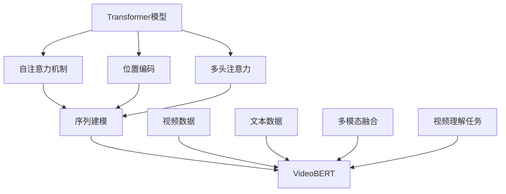
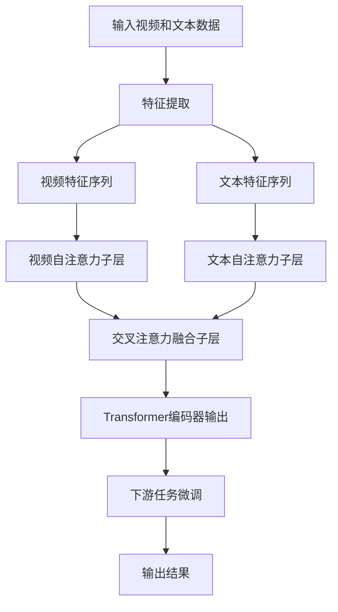

好的,我会严格遵守您提出的约束条件,以"Transformer大模型实战 VideoBERT模型学习语言及视频特征"为主题,撰写一篇深入全面的技术博客文章。

# Transformer大模型实战 VideoBERT模型学习语言及视频特征

## 1. 背景介绍

### 1.1 问题的由来

在当今的数字时代,视频内容在互联网上的传播和消费已成为一种主导趋势。随着视频数据的快速增长,有效理解和处理视频内容成为了一个紧迫的挑战。传统的视频分析方法主要依赖于手工设计的特征提取和模式识别算法,这些方法往往局限于特定场景,难以泛化到更广泛的视频理解任务中。

为了更好地捕捉视频中丰富的语义信息,研究人员开始探索将自然语言处理(NLP)技术与计算机视觉(CV)技术相结合的多模态学习范式。其中,Transformer模型因其强大的序列建模能力而备受关注。VideoBERT便是一种将Transformer编码器应用于视频和文本的多模态预训练模型,旨在同时学习视频和语言的语义表示。

### 1.2 研究现状

近年来,随着深度学习技术的不断发展,多模态学习取得了长足的进步。一些基于Transformer的多模态模型,如ViLBERT、VisualBERT、VideoBERT等,展现出了在视频理解、视频问答、视频描述生成等任务中的优异表现。

然而,现有的多模态模型还存在一些局限性:

1. 大多数模型仅关注于静态图像和文本的融合,忽视了视频的时序动态信息。
2. 一些模型在预训练阶段缺乏足够的视频数据,导致视频表示能力有限。
3. 模型结构和预训练目标的设计存在改进空间,无法充分利用视频和文本的互补信息。

因此,设计一种能够高效学习视频和语言联合表示的Transformer大模型,对于推进视频理解技术具有重要意义。

### 1.3 研究意义

VideoBERT作为一种基于Transformer的视频-文本多模态预训练模型,具有以下重要意义:

1. **丰富的语义表示**:VideoBERT能够同时捕捉视频和文本的语义信息,为下游任务提供更加全面的多模态表示。
2. **泛化能力强**:通过在大规模视频-文本数据集上预训练,VideoBERT可以获得良好的泛化能力,应用于各种视频理解任务。
3. **端到端学习**:VideoBERT采用端到端的方式,无需手工设计特征,能够自动学习视频和文本的最优表示。
4. **技术创新**:VideoBERT的设计融合了Transformer编码器、双流注意力机制等创新技术,推动了多模态学习的发展。

研究VideoBERT不仅有助于提高视频理解的性能,更重要的是探索了Transformer大模型在多模态领域的应用前景,为未来的人工智能系统提供了有价值的借鉴。

### 1.4 本文结构

本文将全面介绍VideoBERT模型的理论基础、核心算法、实现细节和应用案例,内容安排如下:

1. 背景介绍
2. 核心概念与联系
3. 核心算法原理与具体操作步骤
4. 数学模型和公式详细讲解与举例说明
5. 项目实践:代码实例和详细解释说明
6. 实际应用场景
7. 工具和资源推荐
8. 总结:未来发展趋势与挑战
9. 附录:常见问题与解答

## 2. 核心概念与联系

在深入探讨VideoBERT模型之前,我们需要先了解一些核心概念及其相互关系,为后续内容的理解打下基础。

1. **Transformer模型**:Transformer是一种全新的基于自注意力机制的序列到序列模型,在机器翻译、语言模型等NLP任务中表现出色。它的核心组件包括自注意力机制、位置编码和多头注意力机制。

2. **自注意力机制**:自注意力机制允许模型捕捉输入序列中任意两个位置之间的依赖关系,从而更好地建模长期依赖。

3. **位置编码**:由于Transformer没有递归或卷积结构,因此需要位置编码来注入序列的位置信息。

4. **多头注意力**:多头注意力机制可以从不同的表示子空间捕捉不同的注意力模式,提高了模型的表达能力。

5. **序列建模**:Transformer擅长对序列数据(如文本、视频等)进行建模,捕捉其中的时序依赖关系。

6. **VideoBERT**:VideoBERT是一种基于Transformer编码器的视频-文本多模态预训练模型,它将视频数据和文本数据作为输入,通过多模态融合机制学习两者的联合表示。

7. **视频数据**:VideoBERT接受视频数据作为输入,通常将视频分割为多个片段,对每个片段提取视觉特征。

8. **文本数据**:VideoBERT同时接受与视频相关的文本数据(如标题、描述等)作为输入。

9. **多模态融合**:VideoBERT采用特殊的融合机制将视频和文本的表示进行融合,捕捉两种模态之间的交互关系。

10. **视频理解任务**:预训练后的VideoBERT可以被微调(fine-tune)并应用于各种视频理解任务,如视频问答、视频描述生成等。

通过上述核心概念的介绍,我们可以看出VideoBERT是如何巧妙地将Transformer模型的强大序列建模能力与多模态学习相结合,为视频理解任务提供了一种全新的解决方案。

## 3. 核心算法原理与具体操作步骤

### 3.1 算法原理概述

VideoBERT的核心算法原理可以概括为以下三个方面:

1. **Transformer编码器**:VideoBERT采用了标准的Transformer编码器结构,用于对视频和文本序列进行编码和表示学习。

2. **双流自注意力**:为了分别捕捉视频和文本内部的依赖关系,VideoBERT在Transformer编码器中引入了两个独立的自注意力子层,分别对视频特征序列和文本特征序列进行建模。

3. **交叉注意力融合**:为了学习视频和文本之间的交互关系,VideoBERT在Transformer编码器中引入了一个交叉注意力子层,使视频特征序列能够关注文本特征序列,反之亦然。

通过上述三个核心机制的有机结合,VideoBERT能够同时捕捉视频和文本的内部结构,并学习两者之间的关联性,从而获得丰富的多模态表示。

### 3.2 算法步骤详解

VideoBERT算法的具体执行步骤如下:

1. **输入视频和文本数据**:VideoBERT接受原始视频数据和相关文本数据(如标题、描述等)作为输入。

2. **特征提取**:对于视频数据,VideoBERT首先将其分割为多个片段,并使用预训练的视觉模型(如3D卷积网络)提取每个片段的视觉特征;对于文本数据,则使用预训练的词向量模型(如BERT)提取每个词的文本特征。

3. **视频特征序列和文本特征序列**:提取得到的视觉特征和文本特征被分别组织成序列形式,作为VideoBERT模型的输入。

4. **视频自注意力子层**:视频特征序列通过一个自注意力子层,捕捉视频内部的时序依赖关系。

5. **文本自注意力子层**:文本特征序列通过另一个自注意力子层,捕捉文本内部的语义依赖关系。

6. **交叉注意力融合子层**:视频特征序列和文本特征序列被送入一个交叉注意力子层,使两个模态之间的特征能够相互关注和融合。

7. **Transformer编码器输出**:经过上述自注意力和交叉注意力机制的编码,VideoBERT输出融合了视频和文本信息的联合表示。

8. **下游任务微调**:将预训练好的VideoBERT模型微调(fine-tune)到特定的下游视频理解任务上,如视频问答、视频描述生成等。

9. **输出结果**:微调后的VideoBERT模型在给定视频和文本输入的情况下,输出相应任务的预测结果。

需要强调的是,VideoBERT在预训练阶段采用了多种自监督学习目标,如掩码语言模型(Masked Language Modeling)、掩码视频模型(Masked Video Modeling)等,以充分利用大量的视频-文本数据对模型进行预训练,提高其泛化能力。

### 3.3 算法优缺点

**优点:**

1. **强大的表示能力**:VideoBERT能够同时捕捉视频和文本的丰富语义信息,并学习两者之间的交互关系,获得强大的多模态表示能力。

2. **端到端学习**:VideoBERT采用端到端的方式,无需手工设计特征,能够自动学习视频和文本的最优表示。

3. **泛化性强**:通过在大规模视频-文本数据集上预训练,VideoBERT获得了良好的泛化能力,可应用于各种视频理解任务。

4. **技术创新**:VideoBERT融合了Transformer编码器、双流自注意力、交叉注意力融合等创新技术,推动了多模态学习的发展。

**缺点:**

1. **计算复杂度高**:VideoBERT模型结构复杂,在预训练和微调阶段都需要大量的计算资源,对硬件要求较高。

2. **数据需求大**:为了获得良好的泛化性能,VideoBERT需要在海量的视频-文本数据集上进行预训练,对数据的需求量较大。

3. **长视频建模困难**:由于计算资源的限制,VideoBERT通常只能对较短的视频片段进行建模,对于长视频的处理能力有待提高。

4. **解释性不足**:作为一种端到端的黑盒模型,VideoBERT内部的注意力机制和特征融合过程缺乏透明度和可解释性。

### 3.4 算法应用领域

作为一种强大的视频-文本多模态表示学习模型,VideoBERT可以应用于以下领域:

1. **视频问答(Video Question Answering)**:给定一段视频和相关的自然语言问题,VideoBERT可以理解视频内容并生成答案。

2. **视频描述生成(Video Captioning)**:VideoBERT可以观看视频并自动生成描述性的自然语言文本。

3. **视频理解(Video Understanding)**:VideoBERT可用于各种视频理解相关任务,如视频分类、视频检索、视频推理等。

4. **多模态对话系统**:将VideoBERT集成到对话系统中,可实现基于视频和自然语言的多模态人机交互。

5. **视频广告推荐**:利用VideoBERT学习视频和广告文本的语义表示,可为在线视频平台提供个性化的广告推荐服务。

6. **视频内容审核**:VideoBERT可用于自动审核视频内容,识别不当内容或违规行为。

7. **视频辅助教学**:结合VideoBERT的视频理解能力,可开发智能化的视频辅助教学系统。

总的来说,VideoBERT为各种涉及视频和自然语言处理的应用场景提供了强有力的技术支持