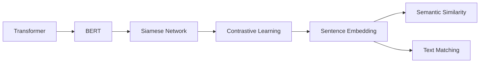

# Transformer大模型实战 了解Sentence-BERT模型

关键词：Transformer、Sentence-BERT、预训练模型、语义相似度、文本匹配

## 1. 背景介绍
### 1.1 问题的由来
随着自然语言处理(NLP)技术的快速发展,预训练语言模型如BERT、GPT等在多个NLP任务上取得了突破性的进展。然而,这些模型在处理句子级别的语义表示和匹配任务时仍然存在一定的局限性。为了更好地捕捉句子的语义信息,研究人员提出了Sentence-BERT(Sentence Bidirectional Encoder Representations from Transformers)模型。

### 1.2 研究现状  
目前,基于Transformer的预训练模型已经成为NLP领域的研究热点。BERT作为其中的代表性模型,通过在大规模无监督语料上进行预训练,可以学习到丰富的语言知识,并在下游任务中进行微调,取得了显著的性能提升。然而,BERT主要关注词级别的表示学习,对句子级别的语义建模能力有限。Sentence-BERT通过引入孪生网络结构和对比学习目标,在BERT的基础上对句子表示进行优化,使其更适合文本匹配和语义相似度计算等任务。

### 1.3 研究意义
Sentence-BERT的研究意义主要体现在以下几个方面:

1. 提升句子表示质量:通过专门针对句子级别的表示学习,Sentence-BERT可以更好地捕捉句子的语义信息,生成更加准确和鲁棒的句子嵌入向量。

2. 加速文本匹配效率:传统的文本匹配方法如BM25、TF-IDF等需要在线计算文本之间的相似度,计算复杂度较高。而Sentence-BERT可以预先计算出句子的嵌入向量,然后通过简单的向量运算(如余弦相似度)快速计算文本相似度,大大提高了匹配效率。

3. 拓展应用场景:基于Sentence-BERT的句子表示可以应用于多个NLP任务,如文本分类、文本聚类、问答系统、信息检索等,为这些任务提供更加优质的语义特征。

### 1.4 本文结构
本文将围绕Sentence-BERT模型展开详细介绍和分析。第2部分阐述Sentence-BERT的核心概念与模型结构。第3部分深入探讨模型的训练算法和优化策略。第4部分给出模型涉及的关键数学公式及其推导过程。第5部分通过代码实例演示如何使用Sentence-BERT进行句子表示和文本匹配。第6部分讨论Sentence-BERT在实际场景中的应用。第7部分推荐相关的学习资源和开发工具。第8部分总结全文,并展望Sentence-BERT的未来发展方向和挑战。第9部分列出常见问题解答。

## 2. 核心概念与联系

Sentence-BERT的核心概念包括:

1. Transformer:一种基于自注意力机制的神经网络结构,可以并行化处理输入序列,捕捉词之间的长距离依赖关系。Transformer是BERT的基础架构。

2. BERT:基于Transformer的双向语言表示模型,通过Masked Language Model和Next Sentence Prediction两个预训练任务学习通用的语言表示。BERT是Sentence-BERT的预训练模型。

3. 孪生网络(Siamese Network):一种用于比较两个输入之间相似度的神经网络结构。它使用两个共享参数的子网络分别处理两个输入,然后计算它们的相似度得分。Sentence-BERT使用孪生BERT网络来学习句子表示。

4. 对比学习(Contrastive Learning):一种无监督表示学习范式,通过最小化正样本对之间的距离,最大化负样本对之间的距离,来学习数据的语义结构。Sentence-BERT采用对比学习目标函数来优化句子嵌入空间。

5. 语义相似度:衡量两个句子在语义层面的相似程度。Sentence-BERT旨在学习语义丰富的句子表示,使得相似的句子在嵌入空间中距离更近。

6. 文本匹配:根据查询文本从候选文本集合中找出与之语义相关的文本。Sentence-BERT可以通过计算查询和候选文本嵌入向量的相似度,实现高效的文本匹配。

下图展示了Sentence-BERT的核心概念之间的联系:

## 3. 核心算法原理 & 具体操作步骤
### 3.1 算法原理概述
Sentence-BERT的核心算法包括两个部分:孪生BERT网络和对比学习目标函数。

孪生BERT网络使用两个共享参数的BERT子网络分别编码两个输入句子,得到它们的嵌入向量表示。这两个嵌入向量通过余弦相似度函数计算相似度得分。

对比学习目标函数旨在优化句子嵌入空间,使得语义相似的句子在嵌入空间中距离更近,而不相似的句子距离更远。具体而言,对比学习目标函数由两部分组成:正样本对的相似度最大化和负样本对的相似度最小化。通过最小化这个目标函数,模型可以学习到语义丰富的句子表示。

### 3.2 算法步骤详解
Sentence-BERT的训练过程可以分为以下几个步骤:

1. 数据准备:构建训练数据集,包括正样本对(语义相似的句子对)和负样本对(语义不相似的句子对)。可以使用现有的标注数据集,如STS-B、SNLI等,也可以使用无监督的方法生成样本对,如随机采样、基于关键词的采样等。

2. 模型初始化:加载预训练的BERT模型作为孪生网络的初始参数。一般使用BERT-base或BERT-large版本。

3. 孪生网络编码:将输入的句子对分别送入两个BERT子网络,得到它们的嵌入向量表示。可以使用BERT的[CLS]标记的输出、所有词嵌入的平均值或最大池化值作为句子嵌入。

4. 相似度计算:使用余弦相似度函数计算两个句子嵌入向量之间的相似度得分。

5. 损失函数计算:根据正负样本对的相似度得分,计算对比学习损失函数的值。常用的损失函数包括交叉熵损失、铰链损失等。

6. 梯度反向传播:根据损失函数的梯度,使用优化算法(如Adam)更新孪生网络的参数,使得正样本对的相似度得分越高,负样本对的相似度得分越低。

7. 迭代训练:重复步骤3-6,直到模型收敛或达到预定的训练轮数。

8. 模型评估:在验证集或测试集上评估训练好的Sentence-BERT模型的性能,如计算Spearman相关系数、Pearson相关系数等。

9. 模型部署:将训练好的Sentence-BERT模型部署到生产环境中,用于文本匹配、语义搜索等下游任务。

### 3.3 算法优缺点
Sentence-BERT算法的优点包括:

1. 语义丰富的句子表示:通过对比学习目标函数的优化,Sentence-BERT可以学习到语义丰富的句子嵌入向量,捕捉句子的语义信息。

2. 高效的文本匹配:预先计算出句子嵌入向量后,文本匹配可以通过简单的向量运算快速完成,避免了在线计算的开销。

3. 通用性强:Sentence-BERT可以应用于多种NLP任务,为下游任务提供高质量的语义特征。

4. 易于训练和调优:Sentence-BERT在BERT的基础上进行训练,可以利用现有的预训练模型和标注数据,训练过程相对简单。

Sentence-BERT算法的缺点包括:

1. 计算资源要求高:训练Sentence-BERT需要大量的计算资源和时间,尤其是使用大规模的预训练模型时。

2. 依赖预训练模型:Sentence-BERT的性能在很大程度上取决于预训练BERT模型的质量,如果预训练模型存在偏差或不适用于特定领域,可能影响Sentence-BERT的表现。

3. 负样本选择困难:对比学习需要合适的负样本来优化目标函数,而选择高质量的负样本并不容易,可能需要领域知识和启发式规则。

### 3.4 算法应用领域
Sentence-BERT算法可以应用于多个NLP任务,包括:

1. 文本匹配:给定查询文本,从候选文本集合中找出语义相关的文本,如问答系统、推荐系统等。

2. 文本聚类:根据文本的语义相似度,将文本划分为不同的簇,如话题发现、用户分群等。

3. 文本分类:将文本分配到预定义的类别中,如情感分析、垃圾邮件检测等。

4. 语义搜索:根据查询文本的语义,从索引库中检索出相关的文档,提高搜索的准确率和召回率。

5. 数据增强:通过在嵌入空间中对句子向量进行插值或扰动,生成语义相似但表达不同的句子,丰富训练数据。

## 4. 数学模型和公式 & 详细讲解 & 举例说明
### 4.1 数学模型构建
Sentence-BERT的数学模型主要包括孪生BERT网络和对比学习目标函数两部分。

孪生BERT网络可以表示为:

$$
\mathbf{e}_1 = \text{BERT}(s_1) \\
\mathbf{e}_2 = \text{BERT}(s_2)
$$

其中,$s_1$和$s_2$是输入的句子对,$\mathbf{e}_1$和$\mathbf{e}_2$是对应的句子嵌入向量,BERT表示BERT编码器。

对比学习目标函数可以表示为:

$$
\mathcal{L} = -\sum_{i=1}^N \log \frac{\exp(\text{sim}(\mathbf{e}_i, \mathbf{e}_i^+)/\tau)}{\exp(\text{sim}(\mathbf{e}_i, \mathbf{e}_i^+)/\tau) + \sum_{j=1}^K \exp(\text{sim}(\mathbf{e}_i, \mathbf{e}_{i,j}^-)/\tau)}
$$

其中,$N$是训练样本数,$\mathbf{e}_i$和$\mathbf{e}_i^+$是第$i$个正样本对的句子嵌入向量,$\mathbf{e}_{i,j}^-$是第$i$个样本的第$j$个负样本的句子嵌入向量,sim表示余弦相似度函数,τ是温度超参数,用于控制softmax分布的平滑程度。

### 4.2 公式推导过程
对比学习目标函数的推导过程如下:

首先,定义正样本对的相似度得分:

$$
\text{score}^+ = \text{sim}(\mathbf{e}_i, \mathbf{e}_i^+)
$$

然后,定义负样本对的相似度得分:

$$
\text{score}^- = \text{sim}(\mathbf{e}_i, \mathbf{e}_{i,j}^-)
$$

接着,使用softmax函数将相似度得分转化为概率分布:

$$
p^+ = \frac{\exp(\text{score}^+/\tau)}{\exp(\text{score}^+/\tau) + \sum_{j=1}^K \exp(\text{score}_j^-/\tau)}
$$

最后,使用交叉熵损失函数计算正样本对的损失:

$$
\mathcal{L}_i = -\log p^+
$$

对所有训练样本求平均,得到最终的对比学习目标函数:

$$
\mathcal{L} = \frac{1}{N} \sum_{i=1}^N \mathcal{L}_i
$$

### 4.3 案例分析与讲解
下面通过一个简单的例子来说明Sentence-BERT的训练过程:

假设我们有以下三对句子作为训练样本:

- 正样本对1: ("The cat sat on the mat", "The feline rested on the rug")
- 正样本对2: ("I love eating pizza", "I enjoy consuming pizza")
- 负样本对: ("The cat sat on the mat", "I love eating pizza")

首先,将这些句子对分别输入