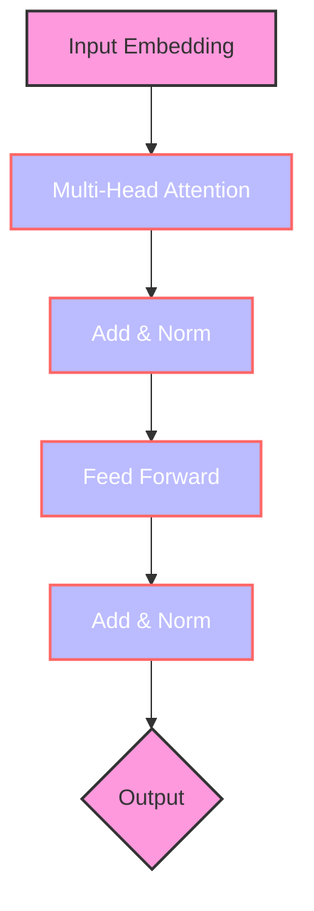

# Transformer大模型实战 使用BERT 模型执行抽象式摘要任务

关键词：Transformer, BERT, 抽象式摘要, 自然语言处理, 深度学习, 预训练模型

## 1. 背景介绍
### 1.1  问题的由来
随着互联网信息量的爆炸式增长,人们每天面对海量的文本信息,急需高效准确的自动文本摘要技术来快速获取文本的核心内容。传统的抽取式摘要方法虽然简单高效,但无法生成流畅自然的摘要语句。近年来,随着深度学习的发展,抽象式摘要逐渐成为自然语言处理领域的研究热点。

### 1.2  研究现状
目前,抽象式摘要的主流方法是基于编码器-解码器(Encoder-Decoder)框架的 Seq2Seq 模型。其中,编码器负责将输入文本编码为语义向量表示,解码器根据语义向量生成摘要。但 Seq2Seq 模型存在长文本表示能力不足、摘要内容重复等问题。2017年,Google 提出了 Transformer 模型[1],引入了自注意力机制,在机器翻译任务上取得了显著效果。此后,各种基于 Transformer 的预训练语言模型如雨后春笋般涌现,如 BERT[2]、GPT 等,极大地推动了自然语言处理的发展。

### 1.3  研究意义
将 Transformer 预训练模型应用到抽象式摘要任务中,有望进一步提升摘要的质量。本文以 BERT 为例,详细介绍如何利用预训练语言模型实现抽象式摘要,为相关研究提供参考。同时,抽象式摘要技术在搜索引擎、新闻推荐、智能助手等领域都有广阔的应用前景。

### 1.4  本文结构
本文后续章节安排如下:第2节介绍 Transformer 和 BERT 的核心概念;第3节详细阐述基于 BERT 的抽象式摘要算法原理与步骤;第4节建立抽象式摘要的数学模型并推导相关公式;第5节给出基于 BERT 实现抽象式摘要的代码实例;第6节讨论抽象式摘要的应用场景;第7节推荐相关学习资源;第8节总结全文并展望未来研究方向。

## 2. 核心概念与联系
Transformer 是一种基于自注意力机制的神经网络模型,摒弃了传统的 RNN/CNN 结构,通过 Attention 建模文本中的长距离依赖关系。其核心是多头自注意力层(Multi-head Self-attention)和前馈神经网络(Feed Forward Network)。

BERT(Bidirectional Encoder Representation from Transformers)是一种基于 Transformer 编码器的预训练语言模型。与传统的单向语言模型不同,BERT 采用掩码语言模型(Masked Language Model,MLM)和 Next Sentence Prediction(NSP)任务进行双向训练,能更好地建模单词和句子级别的语义。预训练后的 BERT 模型可以方便地迁移到下游 NLP 任务,如文本分类、问答、摘要等。

将预训练的 BERT 模型应用到抽象式摘要任务时,可采用微调(Fine-tuning)的方式。具体而言,以 BERT 作为编码器对文本进行编码,然后接入随机初始化的 Transformer 解码器生成摘要。通过端到端的有监督训练,使模型学会根据输入文本生成相应的摘要。

下图展示了 Transformer 模型的总体架构:

## 3. 核心算法原理 & 具体操作步骤
### 3.1  算法原理概述
基于 BERT 的抽象式摘要算法的核心思想是:先用预训练的 BERT 模型对输入文本进行编码,得到语义丰富的文本表示向量;然后将该向量输入随机初始化的 Transformer 解码器,解码生成对应的摘要文本。整个过程通过端到端的有监督训练完成。

### 3.2  算法步骤详解
1. 将输入文本 $X=\{x_1,x_2,...,x_n\}$ 通过 BERT 的 Tokenizer 进行分词和编码,转换为对应的 token ID 序列。

2. 将 token ID 序列输入预训练的 BERT 编码器,经过多层 Transformer Block 的计算,得到最后一层的隐状态(hidden state)作为文本的语义表示 $H^{enc}=\{h_1^{enc}, h_2^{enc},...,h_n^{enc}\}$。

3. 随机初始化一个 Transformer 解码器,将第2步得到的 $H^{enc}$ 作为其输入,通过类似编码器的多层 Transformer Block 计算,得到解码器各层的隐状态 $H^{dec}=\{h_1^{dec}, h_2^{dec},...,h_m^{dec}\}$。

4. 在解码器的每一步,根据当前的隐状态 $h_t^{dec}$ 预测下一个单词的概率分布 $P(y_t|y_{<t},X)$。具体计算公式如下:

$$
\begin{aligned}
h_t^{dec} &= \text{Transformer}(y_{<t}, H^{enc}) \\
P(y_t|y_{<t},X) &= \text{softmax}(W_o \cdot h_t^{dec})
\end{aligned}
$$

其中,$y_{<t}$ 表示已生成的摘要序列,$W_o$ 为输出层的参数矩阵。

5. 重复步骤4,直到生成结束符 `<eos>` 或达到最大长度,即得到生成的摘要序列 $Y=\{y_1,y_2,...,y_m\}$。

6. 计算生成序列 $Y$ 和参考摘要 $Y^*$ 的交叉熵损失:

$$ \mathcal{L} = -\sum_{t=1}^m \log P(y_t^*|y_{<t}^*,X) $$

7. 通过梯度反向传播算法更新模型参数,不断迭代优化,直到模型收敛。

### 3.3  算法优缺点
优点:
- 引入预训练语言模型,充分利用大规模无监督语料,提升模型泛化能力。
- 采用 Transformer 结构,建模长距离文本依赖关系,生成更连贯的摘要。
- 端到端训练,无需人工设计复杂特征,简化了流程。

缺点:  
- 预训练模型参数量巨大,微调和推理的计算开销较高。
- 模型生成的摘要虽然流畅,但可能出现事实错误或过于泛化。
- 生成式模型容易受语料噪声影响,抗噪性有待提高。

### 3.4  算法应用领域
基于 BERT 的抽象式摘要算法可应用于以下领域:
- 搜索引擎:自动生成网页内容摘要,提升搜索结果质量。
- 新闻推荐:为用户推荐个性化的新闻摘要,提高阅读体验。  
- 论文总结:自动生成科技论文的摘要,辅助文献综述。
- 会议记录:自动总结会议讨论要点,提高沟通效率。
- 医疗病例:自动提取病例报告的关键信息,辅助医生诊断。

## 4. 数学模型和公式 & 详细讲解 & 举例说明
### 4.1  数学模型构建
本节我们详细介绍基于 BERT 的抽象式摘要模型的数学形式。

给定输入文本 $X=\{x_1,x_2,...,x_n\}$,目标是生成对应的摘要序列 $Y=\{y_1,y_2,...,y_m\}$。定义生成摘要的条件概率为:

$$ P(Y|X) = \prod_{t=1}^m P(y_t|y_{<t},X) $$

模型的目标是最大化上述条件概率。采用编码器-解码器框架,编码器对 $X$ 进行编码,解码器根据编码结果生成 $Y$。

编码器采用 BERT 模型,其数学形式为:

$$ H^{enc} = \text{BERT}(X) = \{h_1^{enc}, h_2^{enc},...,h_n^{enc}\} $$

其中,$h_i^{enc}$ 表示第 $i$ 个 token 的语义表示向量。

解码器采用 Transformer 结构,数学形式为:

$$ H^{dec} = \text{Transformer}(Y, H^{enc}) = \{h_1^{dec}, h_2^{dec},...,h_m^{dec}\} $$

其中,$h_t^{dec}$ 表示解码第 $t$ 步的隐状态。

定义生成单词 $y_t$ 的概率为:

$$ P(y_t|y_{<t},X) = \text{softmax}(W_o \cdot h_t^{dec}) $$

其中,$W_o$ 为输出层参数矩阵。

模型的损失函数定义为交叉熵:

$$ \mathcal{L} = -\sum_{t=1}^m \log P(y_t^*|y_{<t}^*,X) $$

其中,$y_t^*$ 为参考摘要中第 $t$ 个单词。

模型训练过程即最小化上述损失函数,通过梯度下降法不断更新模型参数,直至收敛。

### 4.2  公式推导过程
本小节我们详细推导生成单词概率 $P(y_t|y_{<t},X)$ 的计算公式。

首先,解码器的隐状态 $h_t^{dec}$ 通过 Transformer Block 计算得到:

$$ h_t^{dec} = \text{Transformer}(y_{<t}, H^{enc}) $$

展开 Transformer 的计算过程,主要包括三个步骤:

(1) 计算自注意力权重:

$$ \alpha_{t,i} = \frac{\exp(q_t \cdot k_i)}{\sum_{j=1}^t \exp(q_t \cdot k_j)} $$

其中,$q_t$ 为当前 query 向量,$k_i$ 为第 $i$ 个 key 向量。

(2) 计算自注意力输出:

$$ a_t = \sum_{i=1}^t \alpha_{t,i} v_i $$

其中,$v_i$ 为第 $i$ 个 value 向量。

(3) 计算前馈神经网络输出:

$$ h_t^{dec} = \text{FFN}(a_t) = \max(0, a_t W_1 + b_1) W_2 + b_2 $$

其中,$W_1,b_1,W_2,b_2$ 为前馈网络的参数。

将 $h_t^{dec}$ 代入 softmax 函数,即可得到生成单词 $y_t$ 的概率分布:

$$ P(y_t|y_{<t},X) = \text{softmax}(W_o \cdot h_t^{dec}) $$

其中,$W_o$ 为输出层参数矩阵。

综上所述,我们推导出了生成单词概率 $P(y_t|y_{<t},X)$ 的完整计算公式。

### 4.3  案例分析与讲解
下面我们以一个简单的例子来说明模型的运作过程。

假设输入文本 $X$ 为:"The cat sat on the mat."

首先,将 $X$ 转换为 token ID 序列:[101, 1109, 4937, 2775, 2006, 1103, 7313, 1012, 102]

然后,将 token ID 序列输入 BERT 编码器,得到语义表示:

$$
H^{enc} = \text{BERT}(X) = 
\begin{bmatrix} 
h_1^{enc} \\ h_2^{enc} \\ \vdots \\ h_9^{enc}
\end{bmatrix}
$$

接着,随机初始化解码器的输入向量 $y_0$,与 $H^{enc}$ 一起输入 Transformer 解码器。

在解码第一步,计算 $h_1^{dec}$:

$$ h_1^{dec} = \text{Transformer}(