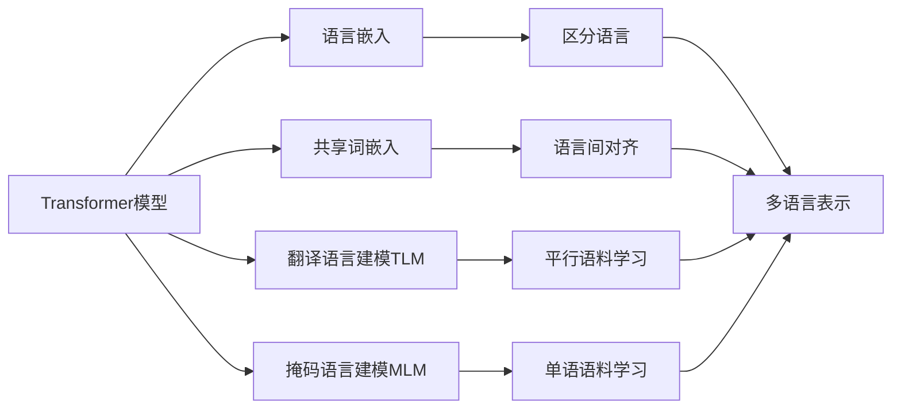

# Transformer大模型实战 对XLM模型的评估

## 1. 背景介绍
### 1.1  问题的由来
近年来,随着深度学习技术的飞速发展,尤其是Transformer模型的出现,自然语言处理(NLP)领域取得了突破性的进展。Transformer模型凭借其强大的并行计算能力和长距离依赖捕捉能力,在机器翻译、文本分类、问答系统等多个NLP任务上取得了state-of-the-art的表现。而随着预训练语言模型如BERT、GPT等的提出,NLP领域进入了预训练-微调的新范式。
 
然而,上述Transformer模型主要针对单一语言进行建模,对于多语言场景缺乏很好的支持。为了让Transformer模型能够处理多语言任务,Facebook于2019年提出了XLM(Cross-lingual Language Model)模型[1]。XLM在标准的Transformer结构基础上,引入了语言嵌入和共享词嵌入等机制,实现了多语言预训练。XLM在多种跨语言任务如XNLI、MLQA等上取得了优异的成绩,展现了其强大的多语言建模能力。

### 1.2  研究现状
XLM模型自提出以来,引起了学术界和工业界的广泛关注。许多后续工作在XLM的基础上进行了改进和扩展。XLM-R[2]通过大幅扩大训练语料的规模和语言覆盖面,进一步提升了模型的多语言表示能力。Unicoder[3]探索了多种跨语言预训练目标,如跨语言词对齐、翻译语言建模等,增强了模型对不同语言之间对齐关系的建模。FILTER[4]提出了基于对比学习的语言无关句子表示方法,可以不依赖于平行语料获得语言中立的句子编码。

除了上述对XLM模型的直接改进,还有许多工作将XLM应用到各类多语言NLP任务中。如Kumar等人[5]利用XLM进行端到端的多语言问答,在多语言SQuAD数据集上取得了良好效果。Hu等人[6]将XLM用于多语言情感分类,通过零样本学习显著提升了低资源语言的分类性能。Lample等人[7]基于XLM实现了无监督的多语言神经机器翻译,仅需单语语料就可训练出优秀的翻译模型。

### 1.3  研究意义
XLM作为多语言预训练模型的代表,对NLP领域的发展具有重要意义:

1. 提升低资源语言的NLP能力。通过在大规模多语料上进行预训练,XLM可以学习到语言普适的表示,从而显著提升低资源语言的建模效果,缓解了低资源语言数据匮乏的问题。

2. 促进跨语言迁移学习。XLM通过共享不同语言的词嵌入空间,增强了不同语言表示之间的可迁移性。在XLM的基础上,可以方便地将一个语言学到的知识迁移到其他语言,实现跨语言的迁移学习。

3. 推动无监督多语言模型的发展。XLM探索了无监督多语言建模的框架,证明了无需平行语料也能学习多语言表示。这为无监督多语言模型的研究指明了方向,促进了相关研究的发展。

4. 支持多语言应用场景。全球化趋势下,多语言NLP应用日益增多。XLM为开发多语言NLP系统提供了有力的工具,助力企业和开发者构建高质量的多语言应用。

### 1.4  本文结构
本文将全面评估XLM模型在多语言NLP任务上的表现,分析其优势和局限性,并探讨未来的改进方向。全文结构如下:

第2节介绍XLM的核心概念和原理。第3节详细阐述XLM的模型结构和训练算法。第4节讨论XLM所基于的数学模型和公式推导。第5节给出XLM的代码实现和详解。第6节总结XLM在各类多语言任务上的应用情况。第7节推荐XLM相关的学习资源和工具。第8节对XLM的研究现状和未来趋势做出总结和展望。

## 2. 核心概念与联系

XLM的核心是利用Transformer模型在大规模多语料上进行预训练,学习多语言的通用语义表示。其关键概念包括:

- Transformer模型:一种基于自注意力机制的序列建模框架,可以高效地处理长距离依赖。XLM基于标准的Transformer编码器结构,通过堆叠自注意力层和前馈层来提取文本特征。

- 语言嵌入(Language Embedding):一个可学习的向量,用于表示输入文本所属的语言种类。在XLM中,语言嵌入与词嵌入拼接,一同输入到Transformer编码器中,使得模型能够区分不同语言。

- 共享词嵌入(Shared Word Embedding):不同语言共享同一个词嵌入矩阵,同义词在不同语言中对应相近的嵌入向量。这种共享机制使得XLM能够捕捉语言之间的语义对齐关系。

- 翻译语言建模(Translation Language Modeling,TLM):一种跨语言预训练任务。随机掩盖平行语料中某些词,让模型根据上下文预测被掩盖词的翻译。TLM利用平行语料学习语言之间的对齐。 

- 掩码语言建模(Masked Language Modeling,MLM):类似BERT的预训练任务,通过随机掩盖词语让模型学习上下文信息。XLM在每个语言的单语语料上执行MLM,学习语言内部的统计规律。

下图展示了XLM的核心概念以及它们之间的关系:

可以看到,Transformer模型是XLM的基础,语言嵌入、共享词嵌入分别帮助模型区分语言和对齐语义,TLM和MLM分别在平行语料和单语语料上训练,最终使得模型学习到多语言的通用表示。这些概念环环相扣,共同构成了XLM的核心原理。

## 3. 核心算法原理 & 具体操作步骤

### 3.1  算法原理概述

XLM的训练分为两个阶段:预训练和微调。在预训练阶段,XLM在大规模多语料上进行自监督学习,掌握语言的通用特征。在微调阶段,XLM在下游任务的监督数据上进行调优,适应具体任务。

预训练的核心是语言建模,包括单语言的MLM和双语言的TLM。MLM可以理解为在单语语料上重建被随机掩盖的词,学习语言内部的统计规律。TLM则在平行语料上重建被掩盖词的翻译,学习语言之间的对齐关系。联合MLM和TLM,XLM可以同时利用单语和双语信息,获得更全面的多语言理解能力。

微调时,XLM在下游任务数据上进行有监督学习,调整参数适应任务目标。对于分类任务,在XLM顶层添加分类器即可;对于生成任务,可以在XLM基础上构建Seq2Seq结构。通过在大规模语料上的预训练,XLM已经习得了语言的一般性知识,因此在小样本下游任务上也能快速适应,展现出优异的few-shot学习能力。

### 3.2  算法步骤详解

**输入表示**

首先将输入文本通过Tokenizer分词,然后转换为词嵌入向量。对于每个token,其嵌入由token embedding、position embedding和language embedding三部分组成,如下所示:

$$\mathbf{H}_0 = \left[\mathbf{E}_{token} + \mathbf{E}_{position} + \mathbf{E}_{language} \right]$$

其中$\mathbf{E}_{token}$是token的嵌入,$\mathbf{E}_{position}$是位置嵌入,$\mathbf{E}_{language}$是语言嵌入。将三部分嵌入相加,即得到输入序列的初始隐藏状态$\mathbf{H}_0$。

**Transformer编码**

XLM采用标准的Transformer编码器结构,通过堆叠自注意力层和前馈层来提取特征。设第$l$层的隐藏状态为$\mathbf{H}_l$,则第$l+1$层的计算过程为:

$$\mathbf{\hat{H}}_l = \mathrm{LayerNorm}(\mathbf{H}_l + \mathrm{MultiHead}(\mathbf{H}_l))$$
$$\mathbf{H}_{l+1} = \mathrm{LayerNorm}(\mathbf{\hat{H}}_l + \mathrm{FFN}(\mathbf{\hat{H}}_l))$$

其中$\mathrm{MultiHead}$是多头自注意力层,$\mathrm{FFN}$是前馈层,$\mathrm{LayerNorm}$是层归一化。自注意力层让序列中的每个位置都能关注到其他位置,捕捉长距离依赖;前馈层进一步提取特征并增加非线性。

**预训练任务**

XLM的预训练同时使用MLM和TLM任务。对于MLM,按照一定概率随机掩盖词语,然后让模型根据上下文预测被掩盖词:

$$\mathcal{L}_{MLM} = -\sum_{i \in \mathcal{M}} \log P(x_i | \mathbf{x}_{\backslash \mathcal{M}})$$

其中$\mathcal{M}$是被掩盖位置的集合,$\mathbf{x}_{\backslash \mathcal{M}}$表示去掉$\mathcal{M}$中词语的输入序列,$x_i$是位置$i$的真实词语。

对于TLM,在双语平行语料中随机掩盖词语,让模型预测被掩盖词的翻译:

$$\mathcal{L}_{TLM} = -\sum_{i \in \mathcal{M}} \log P(y_i | \mathbf{x}, \mathbf{y}_{\backslash \mathcal{M}})$$

其中$\mathbf{x}$和$\mathbf{y}$是源语言和目标语言的句子,$\mathcal{M}$是$\mathbf{y}$中被掩盖位置的集合,$y_i$是位置$i$的真实翻译。

最终的预训练损失是MLM和TLM损失的加权和:

$$\mathcal{L} = \mathcal{L}_{MLM} + \lambda \mathcal{L}_{TLM}$$

其中$\lambda$是TLM损失的权重系数,控制两个任务的相对重要性。

**微调**

在下游任务上微调时,将任务的输入文本喂入预训练好的XLM,然后在XLM的顶层输出上添加任务特定的输出层,端到端地进行有监督学习。以文本分类任务为例,设$\mathbf{h} \in \mathbb{R}^d$是XLM最后一层对[CLS]符号的输出表示,则分类概率为:

$$P(y|\mathbf{x}) = \mathrm{softmax}(\mathbf{W}\mathbf{h} + \mathbf{b})$$

其中$\mathbf{W} \in \mathbb{R}^{K \times d}$和$\mathbf{b} \in \mathbb{R}^K$是分类器的参数,$K$是类别数。微调时,同时更新XLM和分类器参数,最小化交叉熵损失:

$$\mathcal{L} = -\sum_{i=1}^N \log P(y_i|\mathbf{x}_i)$$

其中$(\mathbf{x}_i, y_i)$是第$i$个样本及其标签,$N$是训练样本数。

### 3.3  算法优缺点

XLM的主要优点包括:

1. 可以有效利用单语和双语语料,从多个角度学习语言知识。
2. 通过语言嵌入和共享词嵌入,实现了多语言表示的统一。
3. 基于Transformer结构,具有强大的特征提取和长距离建模能力。
4. 在多种跨语言理解任务上取得了state-of-the-art的表现。
5. 为低资源语言NLP和跨语言