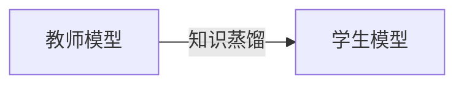

# Transformer大模型实战 知识蒸馏简介

## 1. 背景介绍
### 1.1 问题的由来
近年来，随着深度学习技术的飞速发展，Transformer模型在自然语言处理领域取得了突破性的进展。从BERT到GPT系列模型，Transformer架构展现出了强大的语言理解和生成能力。然而，这些大型语言模型通常包含数亿甚至上千亿的参数，训练和部署成本高昂，难以在资源受限的场景下应用。如何在保持模型性能的同时降低其复杂度，成为了一个亟待解决的问题。

### 1.2 研究现状
知识蒸馏作为一种模型压缩技术，通过让大模型(Teacher)指导小模型(Student)学习，使小模型获得与大模型相近的性能。自Hinton等人于2015年提出知识蒸馏的概念以来，众多研究者对其进行了深入探索。Sanh等人提出了DistilBERT，利用知识蒸馏压缩BERT模型；Jiao等人提出了TinyBERT，通过多阶段蒸馏进一步提升了压缩效果；Wang等人提出了MINILM，在知识蒸馏的基础上引入对比学习，取得了更优的性能。

### 1.3 研究意义
知识蒸馏技术为解决大型语言模型的部署难题提供了新的思路。通过知识蒸馏，我们可以得到参数量大幅减少但性能相当的小模型，降低了模型的存储和计算开销，使其更容易在移动端、IoT等资源受限场景下应用。同时，知识蒸馏的研究也有助于我们更好地理解大型语言模型的工作机制，为后续的模型优化和创新提供启发。

### 1.4 本文结构
本文将围绕Transformer大模型的知识蒸馏展开深入探讨。第2部分介绍知识蒸馏的核心概念；第3部分阐述知识蒸馏算法的原理和步骤；第4部分建立知识蒸馏的数学模型并给出公式推导；第5部分提供知识蒸馏的代码实现；第6部分讨论知识蒸馏的应用场景；第7部分推荐相关工具和资源；第8部分总结全文并展望未来。

## 2. 核心概念与联系
知识蒸馏的核心思想是利用教师模型(Teacher Model)丰富的知识来指导学生模型(Student Model)的学习，使得学生模型在参数量大幅减少的情况下，仍能获得与教师模型相近的性能。

在知识蒸馏过程中，教师模型和学生模型的关系可以用下图表示：



教师模型通常是一个大型的预训练模型，如BERT-large、GPT-2等，拥有强大的特征提取和知识表示能力。学生模型则是一个小型模型，其结构可以是教师模型的压缩版，也可以是一个全新的架构。

知识蒸馏的目标是最小化学生模型和教师模型的输出差异，让学生模型尽可能地模仿教师模型的行为。这种知识转移通常通过两种方式实现：软标签蒸馏和特征蒸馏。

软标签蒸馏利用教师模型输出的软标签(即概率分布)来指导学生模型。与硬标签(0/1标签)相比，软标签包含了更多的类别相似性信息，有助于学生模型更好地学习数据的内在结构。

特征蒸馏则是让学生模型去匹配教师模型的中间层特征表示。通过模仿教师模型的特征激活，学生模型可以学到更加丰富和鲁棒的特征表示，提升模型的泛化能力。

综上，知识蒸馏技术通过软标签蒸馏和特征蒸馏，将教师模型的知识有效地转移到学生模型中，在降低模型复杂度的同时保持较高的性能，为大型语言模型的实际应用提供了新的可能。

## 3. 核心算法原理 & 具体操作步骤
### 3.1 算法原理概述
知识蒸馏算法的核心是利用教师模型的"软标签"输出来指导学生模型的训练。与传统的"硬标签"(0/1标签)监督不同，软标签是一个概率分布向量，包含了更多的类别相关信息。学生模型通过模仿教师模型的软标签输出，可以学习到数据的内在结构和类别之间的相似性，从而获得更好的泛化能力。

### 3.2 算法步骤详解
知识蒸馏算法主要分为以下几个步骤：

1. 训练教师模型：在大规模数据集上训练一个高性能的大型模型作为教师模型，如BERT、GPT等。

2. 准备学生模型：设计一个参数量较少的学生模型，其结构可以是教师模型的压缩版，也可以是一个全新的架构。

3. 生成软标签：使用训练好的教师模型对训练数据进行预测，得到软标签。软标签通常需要经过温度缩放(temperature scaling)来调整概率分布的平滑度。

4. 蒸馏训练：使用教师模型的软标签作为监督信号，训练学生模型。学生模型的目标是最小化其输出与教师模型软标签之间的差异，常用的损失函数包括交叉熵损失和KL散度损失。

5. 评估和微调：在验证集上评估学生模型的性能，必要时可以在特定任务上进行微调。

### 3.3 算法优缺点
知识蒸馏算法的优点包括：
- 有效降低模型复杂度，减少参数量和计算开销。
- 通过软标签蒸馏，学生模型可以学习到数据的内在结构和类别关系。
- 提高了模型的泛化能力和鲁棒性。

知识蒸馏算法的缺点包括：
- 需要额外的计算资源来训练教师模型和生成软标签。
- 学生模型的性能上限受限于教师模型，无法超越教师模型。
- 对教师模型的选择和设计较为敏感，不同的教师模型会影响蒸馏效果。

### 3.4 算法应用领域
知识蒸馏算法已经在多个领域得到了广泛应用，包括：
- 自然语言处理：如BERT模型压缩、语言模型蒸馏等。
- 计算机视觉：如图像分类模型压缩、目标检测模型蒸馏等。
- 语音识别：如声学模型压缩、语言模型蒸馏等。
- 推荐系统：如基于知识蒸馏的协同过滤、跨域推荐等。

## 4. 数学模型和公式 & 详细讲解 & 举例说明
### 4.1 数学模型构建
知识蒸馏可以用以下数学模型来描述：

设教师模型为 $T$，学生模型为 $S$，训练样本为 $(x, y)$，其中 $x$ 为输入特征，$y$ 为真实标签。

教师模型 $T$ 的输出概率分布为：

$$
P_T(y|x) = \text{softmax}(\frac{z_T}{t})
$$

其中 $z_T$ 是教师模型的logits输出，$t$ 是温度参数，用于控制概率分布的平滑度。

学生模型 $S$ 的输出概率分布为：

$$
P_S(y|x) = \text{softmax}(\frac{z_S}{t})
$$

其中 $z_S$ 是学生模型的logits输出。

知识蒸馏的目标是最小化学生模型输出 $P_S(y|x)$ 与教师模型输出 $P_T(y|x)$ 之间的差异，常用的损失函数包括交叉熵损失和KL散度损失。

### 4.2 公式推导过程
以交叉熵损失为例，知识蒸馏的损失函数可以定义为：

$$
\mathcal{L}_{KD} = \alpha \mathcal{L}_{CE}(y, P_S) + (1-\alpha) t^2 \mathcal{L}_{CE}(P_T, P_S)
$$

其中 $\mathcal{L}_{CE}$ 表示交叉熵损失，$\alpha$ 是平衡因子，用于控制硬标签损失和软标签损失的权重，$t$ 是温度参数。

第一项 $\mathcal{L}_{CE}(y, P_S)$ 是学生模型输出与真实标签之间的交叉熵损失，用于学习真实标签信息。

第二项 $\mathcal{L}_{CE}(P_T, P_S)$ 是学生模型输出与教师模型输出之间的交叉熵损失，用于学习教师模型的软标签信息。温度参数 $t$ 的平方用于缩放软标签损失，以平衡两项损失的数量级。

### 4.3 案例分析与讲解
以BERT模型压缩为例，我们可以使用知识蒸馏来得到一个参数量更少的学生模型。

具体步骤如下：
1. 在大规模语料库上预训练一个BERT-large模型作为教师模型。
2. 设计一个结构更简单的学生模型，如BERT-small或TinyBERT。
3. 使用教师模型对训练数据进行预测，得到软标签。
4. 使用软标签作为监督信号，训练学生模型，损失函数采用上述的知识蒸馏损失。
5. 在下游任务上评估学生模型的性能，必要时进行微调。

通过知识蒸馏，我们可以得到一个参数量显著减少(如减少70%)但性能相近(如降低1-2个百分点)的学生模型，满足实际应用的需求。

### 4.4 常见问题解答
1. 问：温度参数 $t$ 的作用是什么？为什么要引入温度？
   答：温度参数 $t$ 用于控制教师模型输出概率分布的平滑度。较高的温度会产生更加平滑的概率分布，使得学生模型更关注类别之间的相对关系，而不是绝对概率值。引入温度可以帮助学生模型更好地学习数据的内在结构。

2. 问：平衡因子 $\alpha$ 是如何影响蒸馏效果的？
   答：平衡因子 $\alpha$ 控制硬标签损失和软标签损失的权重。较大的 $\alpha$ 会使学生模型更关注真实标签信息，较小的 $\alpha$ 会使学生模型更关注教师模型的软标签信息。需要根据任务和数据特点来调节 $\alpha$，以达到最佳的蒸馏效果。

3. 问：如何选择教师模型和学生模型的结构？
   答：教师模型通常选择在大规模数据上预训练的高性能模型，如BERT-large、GPT-2等。学生模型的结构可以是教师模型的压缩版，如BERT-small、TinyBERT等，也可以是一个全新的架构。学生模型的设计需要考虑任务需求、计算资源限制等因素，并通过实验来验证其有效性。

## 5. 项目实践：代码实例和详细解释说明
### 5.1 开发环境搭建
本项目使用PyTorch框架进行开发，需要安装以下依赖：
- Python 3.6+
- PyTorch 1.7+
- Transformers 4.5+
- Datasets 1.6+

可以使用以下命令安装依赖：
```bash
pip install torch transformers datasets
```

### 5.2 源代码详细实现
以下是使用PyTorch实现BERT模型知识蒸馏的核心代码：

```python
import torch
import torch.nn as nn
import torch.nn.functional as F
from transformers import BertModel

class BertTeacher(nn.Module):
    def __init__(self):
        super().__init__()
        self.bert = BertModel.from_pretrained('bert-large-uncased')
        
    def forward(self, input_ids, attention_mask):
        outputs = self.bert(input_ids, attention_mask)
        return outputs.logits

class BertStudent(nn.Module):
    def __init__(self):
        super().__init__()
        self.bert = BertModel.from_pretrained('bert-base-uncased')
        
    def forward(self, input_ids, attention_mask):
        outputs = self.bert(input_ids, attention_mask)
        return outputs.logits

def distillation_loss(student_logits