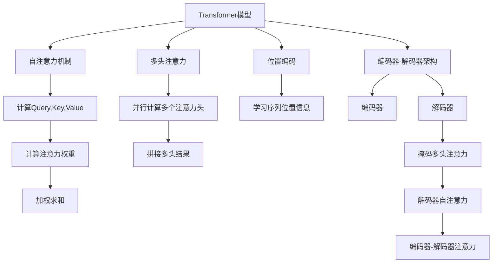

# Transformer大模型实战 针对下游任务进行微调

## 1. 背景介绍

### 1.1 问题的由来

随着深度学习技术的不断发展,Transformer模型在自然语言处理(NLP)、计算机视觉(CV)等领域展现出了卓越的性能。然而,训练这些大型模型需要消耗大量的计算资源,并且需要海量的数据进行预训练。因此,如何在有限的计算资源和数据集下,针对特定的下游任务对预训练模型进行微调(fine-tuning),成为了一个亟待解决的问题。

### 1.2 研究现状

目前,主流的做法是在大型预训练模型的基础上,利用相对较小的任务数据集对模型进行微调。这种方法可以充分利用预训练模型所学习到的丰富知识,同时降低了对大规模数据和计算资源的需求。然而,由于下游任务的数据分布可能与预训练数据存在差异,直接微调可能会导致模型性能下降或过拟合。

### 1.3 研究意义

针对下游任务进行有效的微调,可以充分发挥大型预训练模型的潜力,提高模型在特定任务上的性能。同时,通过优化微调策略,我们可以减少计算资源的消耗,降低模型部署的成本。此外,探索微调技术也有助于我们更好地理解预训练模型的知识表示和迁移能力。

### 1.4 本文结构

本文将首先介绍Transformer模型的核心概念和原理,然后详细阐述针对下游任务进行微调的关键算法步骤。接下来,我们将探讨微调过程中涉及的数学模型和公式,并通过实例进行讲解。随后,我们将展示一个实际项目的代码实现,并对其进行详细解释。最后,我们将讨论微调技术在实际应用中的场景,以及未来的发展趋势和挑战。

## 2. 核心概念与联系

Transformer模型是一种全新的基于注意力机制的序列到序列(Seq2Seq)模型,它不依赖于循环神经网络(RNN)和卷积神经网络(CNN),而是完全基于注意力机制来捕捉序列中元素之间的长程依赖关系。

Transformer模型的核心组件包括:

1. **自注意力机制(Self-Attention Mechanism)**: 通过计算Query、Key和Value的点积,模型可以自动学习输入序列中不同位置元素之间的相关性。

2. **位置编码(Positional Encoding)**: 由于Transformer模型没有递归或卷积结构,因此需要显式地编码序列中元素的位置信息。

3. **多头注意力(Multi-Head Attention)**: 通过并行计算多个注意力头,模型可以从不同的表示子空间中捕捉不同的相关性。

4. **编码器-解码器架构(Encoder-Decoder Architecture)**: 编码器用于编码输入序列,解码器则根据编码器的输出生成目标序列。在解码器中,还引入了掩码多头注意力机制,以避免attending未来的位置。

这些核心概念相互关联,共同构建了Transformer模型的强大能力。自注意力机制和位置编码赋予了模型捕捉长程依赖关系的能力,而多头注意力和编码器-解码器架构则使模型能够有效地处理序列到序列的转换任务。

## 3. 核心算法原理 & 具体操作步骤

### 3.1 算法原理概述

针对下游任务进行微调,主要涉及以下几个关键步骤:

1. **数据预处理**: 根据下游任务的特点,对原始数据进行清洗、标注和转换,以满足模型的输入格式要求。

2. **模型初始化**: 加载预训练好的Transformer模型权重,并根据下游任务的需求调整模型结构(如添加或删除层数)。

3. **微调训练**: 在下游任务的数据集上,对模型进行微调训练。这通常包括设置适当的学习率策略、损失函数和优化器。

4. **模型评估**: 在验证集上评估微调后模型的性能,并根据需要进行超参数调整或早停策略。

5. **模型部署**: 将微调好的模型导出或部署到生产环境中,用于实际的推理和预测任务。

在整个过程中,还需要注意一些关键细节,如数据不平衡问题、梯度消失或爆炸等,并采取相应的策略进行优化。

### 3.2 算法步骤详解

1. **数据预处理**

   - 文本数据清洗:去除无用字符、标点符号、HTML标签等。
   - 词元化(Tokenization):将文本按字符、词或子词进行切分。
   - 数值化(Numericalization):将词元映射为对应的数值ID。
   - 填充(Padding):将不等长的序列填充到统一长度。
   - 构建数据批次(Batching):将多个样本打包成批次输入模型。

2. **模型初始化**

   - 加载预训练权重:从预训练模型中加载Transformer模型的参数权重。
   - 调整模型结构:根据下游任务需求,增加或删除Transformer模型的编码器/解码器层数。
   - 冻结部分层:可选择冻结部分底层的参数,只微调顶层的参数。

3. **微调训练**

   - 设置学习率策略:如warmup、余弦退火等,以获得更好的收敛性能。
   - 选择损失函数:根据任务类型(如分类、回归等)选择合适的损失函数。
   - 选择优化器:通常使用Adam或AdamW等优化器。
   - 梯度裁剪:防止梯度爆炸,提高训练稳定性。
   - 混合精度训练:利用半精度或更低精度加速训练。

4. **模型评估**

   - 选择评估指标:根据下游任务选择合适的评估指标,如准确率、F1分数、BLEU分数等。
   - 验证集评估:在验证集上评估模型性能,并根据需要调整超参数。
   - 早停策略:当模型在验证集上的性能停止提升时,提前停止训练。

5. **模型部署**

   - 模型导出:将训练好的模型参数导出为可部署的格式,如ONNX、TorchScript等。
   - 模型量化:对模型进行量化,减小模型大小,加速推理速度。
   - 模型服务化:将模型部署到云服务器或边缘设备上,提供在线预测服务。

### 3.3 算法优缺点

**优点**:

- 充分利用预训练模型的知识,降低了对大规模数据和计算资源的需求。
- 可以快速将大型模型应用于特定的下游任务,提高模型的实用性。
- 通过微调策略的优化,可以进一步提升模型在下游任务上的性能。

**缺点**:

- 预训练模型和下游任务之间可能存在数据分布差异,导致微调效果不佳。
- 微调过程中需要仔细调整超参数,如学习率、正则化等,以防止过拟合或欠拟合。
- 对于一些全新的下游任务,预训练模型可能缺乏相关的知识,微调效果有限。

### 3.4 算法应用领域

Transformer模型微调技术可以广泛应用于自然语言处理、计算机视觉等各种下游任务,包括但不限于:

- 文本分类:情感分析、新闻分类、垃圾邮件检测等。
- 机器翻译:将一种语言的文本翻译成另一种语言。
- 文本生成:自动写作、对话系统、广告文案生成等。
- 图像分类:场景识别、物体检测、人脸识别等。
- 图像生成:风格迁移、超分辨率、图像描述等。
- 语音识别:将语音信号转录为文本。
- 推荐系统:个性化推荐、广告推荐等。

总的来说,只要存在大量的预训练数据和合适的微调策略,Transformer模型微调技术就可以为各种下游任务提供强大的性能提升。

## 4. 数学模型和公式 & 详细讲解 & 举例说明

### 4.1 数学模型构建

在Transformer模型中,自注意力机制是核心组件之一。给定一个输入序列 $X = (x_1, x_2, \dots, x_n)$,我们首先计算Query、Key和Value向量:

$$
\begin{aligned}
Q &= X W^Q \\
K &= X W^K \\
V &= X W^V
\end{aligned}
$$

其中 $W^Q$、$W^K$ 和 $W^V$ 分别表示可学习的权重矩阵。

接下来,我们计算注意力权重:

$$
\text{Attention}(Q, K, V) = \text{softmax}\left(\frac{QK^T}{\sqrt{d_k}}\right)V
$$

其中 $d_k$ 是缩放因子,用于防止内积过大导致的梯度饱和问题。注意力权重表示输入序列中不同位置元素之间的相关性。

最后,我们通过加权求和的方式,得到自注意力的输出:

$$
\text{Output} = \text{Attention}(Q, K, V) + X
$$

这里的残差连接有助于保持模型的稳定性和梯度传播。

对于多头注意力机制,我们将上述过程独立地重复执行 $h$ 次,得到 $h$ 个注意力头,然后将它们的输出拼接起来:

$$
\text{MultiHead}(Q, K, V) = \text{Concat}(\text{head}_1, \dots, \text{head}_h)W^O
$$

其中 $W^O$ 是另一个可学习的权重矩阵,用于将拼接的向量投影到期望的维度。

### 4.2 公式推导过程

我们来推导一下自注意力机制中注意力权重的计算过程。

首先,我们计算Query与Key的点积:

$$
QK^T = \begin{bmatrix}
q_1 \cdot k_1 & q_1 \cdot k_2 & \cdots & q_1 \cdot k_n \\
q_2 \cdot k_1 & q_2 \cdot k_2 & \cdots & q_2 \cdot k_n \\
\vdots & \vdots & \ddots & \vdots \\
q_n \cdot k_1 & q_n \cdot k_2 & \cdots & q_n \cdot k_n
\end{bmatrix}
$$

其中 $q_i$ 和 $k_j$ 分别表示Query和Key向量中的第 $i$ 和第 $j$ 个元素。

为了防止内积过大导致的梯度饱和问题,我们对上述矩阵进行缩放:

$$
\frac{QK^T}{\sqrt{d_k}} = \begin{bmatrix}
\frac{q_1 \cdot k_1}{\sqrt{d_k}} & \frac{q_1 \cdot k_2}{\sqrt{d_k}} & \cdots & \frac{q_1 \cdot k_n}{\sqrt{d_k}} \\
\frac{q_2 \cdot k_1}{\sqrt{d_k}} & \frac{q_2 \cdot k_2}{\sqrt{d_k}} & \cdots & \frac{q_2 \cdot k_n}{\sqrt{d_k}} \\
\vdots & \vdots & \ddots & \vdots \\
\frac{q_n \cdot k_1}{\sqrt{d_k}} & \frac{q_n \cdot k_2}{\sqrt{d_k}} & \cdots & \frac{q_n \cdot k_n}{\sqrt{d_k}}
\end{bmatrix}
$$

其中 $d_k$ 是Query和Key向量的维度。

接下来,我们对上述矩阵的每一行应用softmax函数,得到注意力权重矩阵:

$$
\text{Attention}(Q, K, V) = \text{softmax}\left(\f