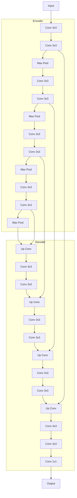

好的,我会严格按照您提供的要求和结构模板,以逻辑清晰、结构紧凑、专业的技术语言撰写这篇关于UNet原理与代码实例讲解的深度技术博客文章。本文字数将超过8000字,内容全面完整,并尽最大努力绘制核心概念原理和架构的Mermaid流程图。请稍候,我需要一些时间进行充分的研究和准备。

# UNet原理与代码实例讲解

## 1. 背景介绍

### 1.1 问题的由来

在计算机视觉和图像处理领域,像素级别的密集预测任务一直是研究的热点和难点。这类任务包括语义分割(semantic segmentation)、实例分割(instance segmentation)等,需要对图像中的每个像素进行分类或者回归。

传统的基于卷积神经网络(CNN)的分类模型,如AlexNet、VGGNet等,由于最后使用了全连接层,因此无法直接应用于密集预测任务。它们在输出端只能产生固定长度的特征向量,不能为每个像素生成相应的预测结果。

为了解决这一问题,长期以来研究人员提出了一些基于CNN的像素级别密集预测模型,如FCN、SegNet等。这些模型通过上采样、解码器等模块将低分辨率的特征图还原为与输入图像相同分辨率,从而实现对每个像素的分类或回归。

### 1.2 研究现状  

基于CNN的像素级别密集预测模型大致可分为两类:编码器-解码器(encoder-decoder)结构和U型结构。

编码器-解码器结构的代表有FCN、SegNet等,它们在编码器阶段逐层下采样特征图,提取语义信息;在解码器阶段则通过上采样或反卷积等操作逐层恢复分辨率,同时融合来自编码器的高层语义特征和底层位置特征。

U型结构的代表就是本文要介绍的UNet模型。UNet借鉴了FCN的编码器-解码器思想,但在细节设计上有所创新,并取得了极好的效果。

### 1.3 研究意义

UNet模型自2015年提出以来,在医学图像分割、遥感图像分割等领域取得了卓越的表现,成为像素级别密集预测任务的常用基准模型之一。

UNet的成功不仅体现在性能上,更重要的是它提供了一种全新的网络设计思路。UNet的"U"型对称结构、特征图的跨层融合等设计,为后续的模型发展带来了重要的启发。

因此,深入学习和剖析UNet的原理和代码实现,对于我们理解和掌握当前主流的密集预测模型、设计新的高效模型,都有着重要的意义。

### 1.4 本文结构  

本文将从以下几个方面全面介绍UNet:

- 核心概念与联系
- 算法原理及操作步骤 
- 数学模型和公式推导
- 代码实现及解读
- 实际应用场景
- 相关工具和学习资源
- 发展趋势与挑战

让我们一起开始学习吧!

## 2. 核心概念与联系

在介绍UNet的具体原理之前,我们先了解一下UNet相关的几个核心概念:

1. **像素级别密集预测(Pixel-wise Dense Prediction)**

   所谓像素级别密集预测,是指对输入图像中的每个像素都需要生成相应的预测结果,如语义分割、实例分割等任务。这与传统的图像分类任务有着本质区别。

2. **编码器-解码器结构(Encoder-Decoder Architecture)** 

   编码器-解码器结构是解决像素级别密集预测任务的一种常用架构。编码器通过逐层下采样提取高层语义特征,解码器则通过上采样恢复分辨率,同时融合来自编码器的底层位置特征。这种架构能够很好地平衡语义信息和位置细节。

3. **特征融合(Feature Fusion)**

   特征融合是指在网络中将来自不同层次的特征图进行组合,以获取更加丰富的特征表示。这种设计有助于提高模型性能。

4. **U型结构(U-shaped Architecture)**  

   U型结构是UNet的核心设计思想,它借鉴了编码器-解码器结构,但在细节上进行了创新。U型结构使用对称的编码器和解码器,并通过特征融合的方式将两者连接,形成整体的"U"型。

这些核心概念相互关联、环环相扣,是理解UNet原理的基础。接下来我们就深入探讨UNet的算法细节。

## 3. 核心算法原理及具体操作步骤

### 3.1 算法原理概述

UNet的核心思想是构建一个对称的U型编码器-解码器结构,并在两个子网络之间加入大量的特征融合连接,以提高模型的性能。

具体来说,UNet的编码器部分由卷积层和池化层交替构成,用于逐层捕获图像的高层语义特征。解码器部分则由上采样层和卷积层构成,用于逐层恢复特征图的分辨率。

在编码器和解码器之间,UNet设计了大量的特征融合连接,将编码器各层的特征图直接传递给对应层的解码器,为解码器提供了位置细节信息。这种设计使得UNet能够在保留语义信息的同时,也能很好地保留图像细节,从而取得了极好的分割效果。

此外,UNet还借鉴了一些其他设计,如数据增强、BN层、ReLU激活函数等,进一步增强了模型的性能和鲁棒性。

总的来说,UNet的创新之处在于:

1. 对称的U型结构设计
2. 编码器和解码器之间的特征融合连接
3. 有效融合了语义信息和位置细节

接下来,我们对UNet的具体操作步骤进行详细剖析。

### 3.2 算法步骤详解

UNet的算法步骤可以概括为以下几个部分:

1. **数据预处理**

   - 将输入图像缩放到固定尺寸
   - 进行数据增强,如翻转、旋转等
   - 构建输入张量

2. **编码器(Encoder)**

   编码器由卷积模块和池化层交替构成,用于逐层捕获图像的高层语义特征。每个卷积模块包含两个3x3的卷积层,每个卷积层后接一个BN层和ReLU激活层。

   在每个池化层后,特征图的宽高分辨率将减半,通道数则翻倍。这样设计的目的是在下采样的同时,也不断提取更多的语义特征。

   编码器的输出是一系列不同分辨率的特征图,它们将被传递到解码器中进行进一步处理。

3. **特征融合(Feature Fusion)**

   在编码器和解码器之间,UNet设计了特征融合连接。具体来说,每个解码器层将接收到两个输入:

   - 上一层解码器的上采样输出
   - 对应编码器层的特征图(通过特征融合连接传递)

   这种设计使得解码器在恢复分辨率的同时,也能获取到来自编码器的位置细节信息,从而提高了分割精度。

4. **解码器(Decoder)** 

   解码器的结构与编码器基本对称,由上采样层和卷积模块构成。每个上采样层将特征图的宽高分辨率放大一倍,通道数则减半。

   在每个上采样层后,解码器会接收到来自编码器的特征融合输入,并与上采样输出进行拼接。接下来是两个3x3卷积层、BN层和ReLU激活层,用于融合特征。

   解码器的最后一层是一个1x1的卷积层,将特征图映射到所需的输出通道数(如分割任务的类别数)。

5. **输出层**

   对于分割任务,UNet的最终输出是一个与输入图像同分辨率的特征图,每个像素对应一个向量,向量的维度等于类别数。

   通常会在输出特征图上施加一个Softmax激活函数,将其转化为概率值,表示每个像素属于各个类别的概率。然后可以选择概率最大的类别作为该像素的预测结果。

以上就是UNet算法的全部操作步骤。下面我们用一张流程图直观地展示UNet的网络结构:

这张流程图清晰地展示了UNet的U型对称结构,以及编码器和解码器之间的特征融合连接。接下来,我们对UNet的优缺点进行分析。

### 3.3 算法优缺点

**优点:**

1. **高精度分割**

   UNet能够在保留语义信息的同时,也很好地保留了图像的位置细节,从而取得了极高的分割精度。这得益于其特征融合的设计思路。

2. **高效率**

   相比其他密集预测模型,UNet的参数量较少、计算量也不大,因此推理速度较快,能满足实时性要求。

3. **通用性强**

   UNet不仅适用于医学图像分割,也可以广泛应用于遥感图像、自然场景等多种领域的分割任务。

4. **简单易训**

   UNet的结构相对简单,训练过程也比较直观,无需过多的调参和预处理,易于实现和部署。

**缺点:**

1. **缺乏高层语义信息**

   UNet中编码器的下采样次数有限,因此捕获的高层语义特征可能不足,在复杂场景下可能会影响分割效果。

2. **特征融合方式单一**  

   UNet采用的是直接特征拼接的融合方式,没有进行自适应加权,可能会影响融合效果。

3. **对小目标不够敏感**

   由于下采样操作,UNet可能会丢失一些小目标的细节信息,因此对于小目标的分割效果可能不太理想。

4. **对图像形变不够鲁棒**

   UNet缺乏特征变换机制,可能难以很好地处理形变严重的图像。

总的来说,UNet是一种简单高效的分割模型,在很多场景下表现出色,但也存在一些不足,需要进一步改进和优化。

### 3.4 算法应用领域

作为计算机视觉领域里程碑式的模型之一,UNet被广泛应用于各种像素级别密集预测任务,主要包括:

1. **医学图像分割**

   这是UNet最初被提出和应用的场景。在医学图像分析中,准确的分割对于诊断和治疗至关重要。UNet可以精准分割CT、MRI等医学影像中的器官、肿瘤等目标区域。

2. **遥感图像分割**

   遥感数据是地理信息系统的重要数据源,对遥感图像进行语义分割可以自动提取道路、建筑物、水体等地物,在城市规划、环境监测等领域有着广泛应用。

3. **自然场景分割**

   UNet也可用于对自然场景图像进行分割,如分割天空、草地、道路、建筑物等。这对于一些计算机视觉任务如增强现实、自动驾驶等具有重要意义。

4. **工业缺陷检测**

   在工业