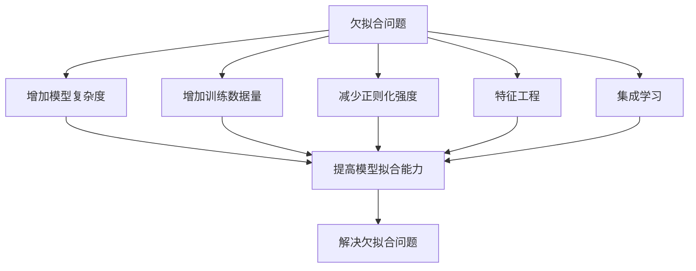

好的，我会严格按照您提供的要求和结构来撰写这篇技术博客文章。以下是正文内容：

# Underfitting 原理与代码实战案例讲解

## 1. 背景介绍

### 1.1 问题的由来

在机器学习和深度学习领域中,模型的训练过程是一个非常关键的环节。我们希望训练出的模型能够很好地拟合训练数据,并具有良好的泛化能力,在新的测试数据上也有不错的表现。然而,在实际操作中,我们常常会遇到模型的欠拟合(Underfitting)或过拟合(Overfitting)问题,这会导致模型的性能下降。

欠拟合指的是模型无法很好地学习到数据中的规律和特征,无法对训练数据进行有效拟合。这种情况下,模型的训练误差和测试误差都较高,泛化能力较差。造成欠拟合的主要原因包括:模型复杂度不够、训练数据量不足、正则化过多等。

### 1.2 研究现状  

目前,学术界和工业界对于欠拟合问题都有着广泛的关注和研究。一些常见的解决欠拟合问题的方法包括:增加模型复杂度、增加训练数据量、减少正则化强度等。但具体如何平衡模型复杂度、训练数据量和正则化强度,仍然是一个值得探讨的问题。

此外,一些新兴的深度学习模型和训练技巧,如注意力机制、迁移学习等,也被认为可以在一定程度上缓解欠拟合问题。但它们的具体作用机制和应用场景还有待进一步研究和探索。

### 1.3 研究意义

解决欠拟合问题,对于提高机器学习和深度学习模型的性能至关重要。通过深入理解欠拟合的原理和影响因素,我们可以更好地构建和优化模型,提高模型的泛化能力。同时,研究欠拟合问题也有助于我们更好地理解机器学习算法的本质,为相关理论的发展做出贡献。

此外,欠拟合问题的研究不仅局限于机器学习和深度学习领域,在其他数据驱动的领域也有广泛的应用前景,如计算机视觉、自然语言处理、推荐系统等。

### 1.4 本文结构

本文将从以下几个方面全面介绍欠拟合问题:

1. 核心概念与联系
2. 核心算法原理及具体操作步骤  
3. 数学模型和公式详细讲解及案例分析
4. 项目实践:代码实例和详细解释
5. 实际应用场景
6. 工具和资源推荐
7. 总结:未来发展趋势与挑战
8. 附录:常见问题与解答

## 2. 核心概念与联系

欠拟合问题涉及了机器学习和深度学习中的一些核心概念,如偏差(Bias)、方差(Variance)、模型复杂度、训练数据量、正则化等。我们有必要对这些概念有一个全面的理解,才能更好地分析和解决欠拟合问题。

### 2.1 偏差与方差

偏差(Bias)指的是模型的预测值与真实值之间的系统性偏差,反映了模型本身的拟合能力。方差(Variance)则描述了模型对于不同的训练数据集的敏感程度,反映了模型的稳定性。

一般来说,偏差过高会导致欠拟合,因为模型无法很好地捕捉到数据中的规律;而方差过高则可能导致过拟合,因为模型过于专注于训练数据的细节,缺乏泛化能力。

我们需要在偏差和方差之间寻找一个平衡点,使得模型既能很好地拟合训练数据,又具有良好的泛化能力。这就需要合理控制模型的复杂度。

### 2.2 模型复杂度

模型复杂度描述了模型的表达能力和灵活性。一般来说,复杂度较低的模型(如线性模型)拟合能力较弱,容易发生欠拟合;而复杂度较高的模型(如深度神经网络)拟合能力较强,但也更容易过拟合。

因此,选择合适的模型复杂度对于避免欠拟合和过拟合至关重要。我们需要根据具体的问题和数据集来权衡模型复杂度,既不能过于简单,也不能过于复杂。

### 2.3 训练数据量

训练数据的数量也会影响模型的拟合能力。当训练数据量较少时,模型很容易发生欠拟合,因为数据无法充分反映出潜在的规律和特征。而当训练数据量足够多时,模型就有更多的机会学习到数据中的规律,从而提高拟合能力。

然而,过多的训练数据也可能导致过拟合问题,因为模型会过于专注于训练数据的细节,缺乏泛化能力。因此,我们需要根据具体情况选择合适的训练数据量。

### 2.4 正则化

正则化是一种用于防止过拟合的技术,它通过在模型的损失函数中加入惩罚项,来限制模型的复杂度。常见的正则化方法包括L1正则化(Lasso回归)、L2正则化(Ridge回归)等。

适当的正则化可以有效防止过拟合,但如果正则化过多,也可能导致欠拟合问题。因此,我们需要谨慎选择正则化的强度,使得模型既不会过度拟合,也不会欠拟合。

### 2.5 核心概念之间的联系

上述这些核心概念之间是相互关联的。例如,模型复杂度过高可能导致过拟合,但如果训练数据量足够多,并采用适当的正则化,就可以缓解过拟合问题。同时,如果模型复杂度过低,即使训练数据量足够多,也可能导致欠拟合。

因此,我们需要全面考虑这些因素,并在它们之间寻找一个平衡点,才能有效避免欠拟合和过拟合问题,构建出性能良好的机器学习和深度学习模型。

## 3. 核心算法原理及具体操作步骤

### 3.1 算法原理概述

为了解决欠拟合问题,我们需要采取一些具体的策略和算法。常见的策略包括:

1. **增加模型复杂度**:通过增加模型的参数数量或层数,提高模型的表达能力和拟合能力。
2. **增加训练数据量**:通过增加训练数据的数量,使模型能够学习到更多的特征和规律。
3. **减少正则化强度**:适当减少正则化的强度,放宽对模型复杂度的限制。
4. **特征工程**:通过特征工程技术,构造出更有意义的特征,提高模型的表达能力。
5. **集成学习**:将多个基础模型集成在一起,提高整体的拟合能力和泛化能力。

这些策略都有各自的优缺点,我们需要根据具体的问题和数据集来选择合适的策略。下面我们将详细介绍其中的一些核心算法原理和操作步骤。

### 3.2 算法步骤详解

#### 3.2.1 增加模型复杂度

增加模型复杂度是解决欠拟合问题的一种常见方法。具体操作步骤如下:

1. **评估当前模型的复杂度**:通过观察模型的结构和参数数量,判断模型的复杂度是否足够高。
2. **选择合适的模型结构**:根据问题的特点和数据集的复杂程度,选择合适的模型结构,如深度神经网络、卷积神经网络等。
3. **增加模型参数数量**:通过增加模型的层数、节点数量或卷积核数量等方式,增加模型的参数数量。
4. **训练新模型**:使用增加复杂度后的新模型,在训练数据集上进行训练。
5. **评估新模型的性能**:在验证集或测试集上评估新模型的性能,判断是否解决了欠拟合问题。
6. **调整模型复杂度**:如果新模型仍然存在欠拟合问题,可以继续适当增加模型复杂度;如果出现过拟合问题,则需要减小模型复杂度。

需要注意的是,过度增加模型复杂度可能会导致过拟合问题,因此我们需要谨慎操作,并结合其他策略综合考虑。

#### 3.2.2 增加训练数据量

增加训练数据量也是解决欠拟合问题的一种有效方法。具体操作步骤如下:

1. **评估当前训练数据量**:观察当前训练数据集的大小,判断是否足够大。
2. **收集更多训练数据**:如果当前训练数据量不足,则需要从其他渠道收集更多的训练数据。
3. **数据清洗和预处理**:对新收集的训练数据进行清洗和预处理,确保数据的质量和一致性。
4. **合并训练数据集**:将新收集的训练数据与原有的训练数据集合并,形成一个更大的训练数据集。
5. **训练新模型**:使用合并后的大型训练数据集,在原有模型或增加复杂度后的新模型上进行训练。
6. **评估新模型的性能**:在验证集或测试集上评估新模型的性能,判断是否解决了欠拟合问题。
7. **调整训练数据量**:如果新模型仍然存在欠拟合问题,可以继续增加训练数据量;如果出现过拟合问题,则需要减小训练数据量或采取其他策略。

增加训练数据量的同时,也需要注意数据质量和数据分布的一致性,以避免引入新的偏差或噪声。

#### 3.2.3 减少正则化强度

适当减少正则化强度也可以缓解欠拟合问题。具体操作步骤如下:

1. **评估当前正则化强度**:观察当前模型中使用的正则化方法和强度,判断是否过于严格。
2. **选择合适的正则化方法**:根据问题的特点和数据集的复杂程度,选择合适的正则化方法,如L1正则化、L2正则化、Dropout等。
3. **减小正则化强度**:适当减小正则化方法的强度参数,放宽对模型复杂度的限制。
4. **训练新模型**:使用减小正则化强度后的新模型,在训练数据集上进行训练。
5. **评估新模型的性能**:在验证集或测试集上评估新模型的性能,判断是否解决了欠拟合问题。
6. **调整正则化强度**:如果新模型仍然存在欠拟合问题,可以继续适当减小正则化强度;如果出现过拟合问题,则需要增加正则化强度。

需要注意的是,过度减小正则化强度可能会导致过拟合问题,因此我们需要谨慎操作,并结合其他策略综合考虑。

### 3.3 算法优缺点

上述三种算法都有各自的优缺点,我们需要根据具体情况进行权衡和选择。

**增加模型复杂度**的优点是可以直接提高模型的拟合能力,但缺点是过度增加复杂度可能导致过拟合,同时也会增加计算开销和内存占用。

**增加训练数据量**的优点是可以让模型学习到更多的特征和规律,但缺点是收集和处理大量训练数据的成本较高,同时也可能引入新的噪声和偏差。

**减少正则化强度**的优点是操作相对简单,但缺点是正则化强度过低可能导致过拟合,同时也可能无法彻底解决欠拟合问题。

因此,在实际应用中,我们通常需要综合运用这些策略,并根据具体情况进行调整和