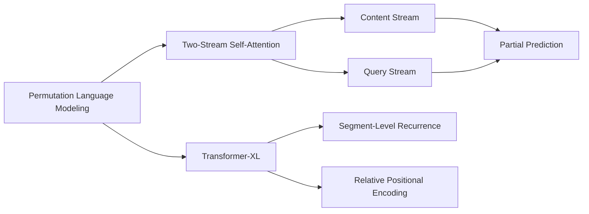

# XLNet原理与代码实例讲解

## 1. 背景介绍

### 1.1 问题的由来

自然语言处理(NLP)是人工智能的一个重要分支,旨在让计算机理解和生成人类语言。近年来,随着深度学习技术的发展,NLP领域取得了长足的进步。从早期的词袋模型、N-gram模型,到后来的 RNN、LSTM 等神经网络模型,再到如今大放异彩的 Transformer 模型,NLP 技术不断突破,应用日益广泛。

然而,现有的 NLP 模型仍然存在一些局限性。比如,传统的语言模型通常是单向的,只能从左到右或从右到左建模文本,无法同时捕捉双向的上下文信息。此外,预训练语言模型虽然取得了不错的效果,但在下游任务微调时,往往需要引入特定的任务相关架构,不够灵活。

### 1.2 研究现状

为了克服上述局限性,CMU 和 Google Brain 的研究者在 2019 年提出了 XLNet[1],这是一种 generalized autoregressive pretraining 方法,能够学习 bidirectional contexts 并且不引入噪声。XLNet 在多个 NLP 任务上取得了 SOTA 的结果,展现出了强大的建模能力。

此后,XLNet 引起了学术界和工业界的广泛关注。许多研究者在 XLNet 的基础上进行了改进和扩展,如 ERNIE 2.0[2]、ELECTRA[3] 等。同时,XLNet 也被应用到了问答、文本分类、序列标注等实际任务中,取得了不错的效果。

### 1.3 研究意义

XLNet 的提出具有重要的研究意义:

1. 它探索了一种新的预训练范式,通过 permutation language modeling 同时捕捉双向上下文信息,克服了传统语言模型的局限性。

2. 它在预训练阶段就考虑了下游任务的需求,引入了 Two-Stream Self-Attention 机制,增强了模型的泛化能力。

3. 它在多个 NLP 基准测试中取得了 SOTA 的结果,证明了 generalized autoregressive pretraining 的有效性。

4. 它为后续的预训练语言模型研究指明了方向,推动了 NLP 技术的发展。

### 1.4 本文结构

本文将全面介绍 XLNet 的原理和代码实现。第2部分阐述 XLNet 的核心概念;第3部分详细讲解 XLNet 的算法原理;第4部分给出 XLNet 的数学模型和公式推导;第5部分提供 XLNet 的代码实例;第6部分讨论 XLNet 的应用场景;第7部分推荐 XLNet 的相关资源;第8部分总结全文,展望 XLNet 的未来发展。

## 2. 核心概念与联系

XLNet 的核心概念包括:

- Permutation Language Modeling(PLM):通过随机 permutation 来 factorize 概率分布,从而 capture 双向上下文信息。
- Two-Stream Self-Attention:引入 content stream 和 query stream 两个 self-attention,分别编码内容和 predict target。
- Transformer-XL:基于 segment-level recurrence mechanism 和 relative positional encoding 的 Transformer 变体。
- Partial Prediction:随机 mask 掉一部分 token,只预测被 mask 的 token。

下图展示了这些概念之间的联系:



## 3. 核心算法原理 & 具体操作步骤

### 3.1 算法原理概述

XLNet 的核心是 Permutation Language Modeling(PLM),通过 factorize 所有可能的 permutation 序列的概率分布,来学习双向上下文信息。形式化地,给定一个长度为 T 的文本序列 $\mathbf{x} = [x_1, \cdots, x_T]$,PLM 的目标是最大化 likelihood:

$$\max_{\theta} \mathop{\mathbb{E}}_{z \sim \mathcal{Z}_T} \left[ \sum_{t=1}^T \log p_{\theta}(x_{z_t} | x_{z_{<t}}) \right]$$

其中 $\mathcal{Z}_T$ 是长度 T 的所有可能 permutation 的集合,$z$ 是从 $\mathcal{Z}_T$ 中随机采样的一个 permutation。

### 3.2 算法步骤详解

XLNet 的训练分为两个阶段:预训练阶段和微调阶段。

预训练阶段的主要步骤如下:

1. 语料预处理:对大规模无标注语料进行 tokenization,然后根据需要做 masking(如 dynamic masking)。

2. Permutation 采样:从 $\mathcal{Z}_T$ 中随机采样 permutation。为了提高采样效率,XLNet 只采样部分而非全部的 permutation。

3. 特征提取:将 token 序列输入 Transformer-XL 的 embedding 层,提取词向量特征。

4. Two-Stream Self-Attention:将词向量分别输入 content stream 和 query stream,计算 self-attention,得到内容编码和 query 编码。

5. 预测:将 query 编码输入 output layer,预测被 mask 的 token。

6. 损失计算:基于预测结果和真实标签计算 cross entropy loss。

7. 参数更新:基于损失反向传播,用 AdamW 优化器更新模型参数。

微调阶段步骤与预训练类似,区别在于输入的是下游任务的数据,并根据任务对模型做了一定修改,如加入 start/end token 用于 span 提取。

### 3.3 算法优缺点

XLNet 的主要优点有:

- 通过 permutation language modeling,同时学习双向上下文信息,克服了 BERT 的 mask 噪声问题。
- 引入 Two-Stream Self-Attention 和 Partial Prediction,提高了预训练和下游任务的融合度。
- 基于 Transformer-XL,可以建模更长距离的依赖关系。

XLNet 的主要缺点包括:

- 训练复杂度高,对计算资源要求大。采样所有 permutation 开销太大,因此 XLNet 只能采样部分 permutation。
- 推理速度慢。由于 XLNet 是 autoregressive 的,推理只能串行进行。

### 3.4 算法应用领域

XLNet 可以应用于大多数 NLP 任务,如:

- 文本分类:情感分析、新闻分类等。
- 序列标注:命名实体识别、词性标注等。
- 问答:阅读理解、开放域问答等。
- 文本生成:摘要、翻译、对话等。

此外,XLNet 还可以作为 backbone,嵌入到更大的系统中,如对话系统、知识图谱等。

## 4. 数学模型和公式 & 详细讲解 & 举例说明

### 4.1 数学模型构建

XLNet 的数学模型可以分为三个部分:

1. Permutation Language Modeling

对于一个长度为 T 的序列 $\mathbf{x}$,其 likelihood 可以表示为:

$$p(\mathbf{x}) = \sum_{z \in \mathcal{Z}_T} p(\mathbf{z}) \prod_{t=1}^T p(x_{z_t} | \mathbf{x}_{z_{<t}})$$

其中 $\mathcal{Z}_T$ 是所有可能的 permutation,$p(\mathbf{z})$ 是 permutation $\mathbf{z}$ 的概率(通常假设服从均匀分布)。

2. Two-Stream Self-Attention

XLNet 的 self-attention 分为 content stream 和 query stream 两部分。Content stream 负责编码上下文信息:

$$\mathbf{h}^{(m)}_{z_t} = \text{Attention}(\mathbf{Q}^{(m)}, \mathbf{K}^{(m)}_{\le z_t}, \mathbf{V}^{(m)}_{\le z_t})$$

其中 $\mathbf{Q}^{(m)}, \mathbf{K}^{(m)}, \mathbf{V}^{(m)}$ 分别是 query, key, value 矩阵。

Query stream 负责编码 target 信息:

$$\mathbf{g}^{(m)}_{z_t} = \text{Attention}(\mathbf{Q}^{(m)}_{z_t}, \mathbf{K}^{(m)}_{\le z_t}, \mathbf{V}^{(m)}_{\le z_t})$$

3. Transformer-XL

XLNet 的 Transformer 块基于 Transformer-XL,引入了 segment-level recurrence 和 relative positional encoding:

$$\mathbf{h}^{(m)}_{z_t} = \text{Transformer-XL}(\mathbf{Q}^{(m)}, \mathbf{K}^{(m)}_{\le z_t}, \mathbf{V}^{(m)}_{\le z_t})$$

### 4.2 公式推导过程

以 permutation language modeling 的公式为例,推导如下:

$$\begin{aligned}
p(\mathbf{x}) &= \sum_{\mathbf{z} \in \mathcal{Z}_T} p(\mathbf{z}) p(\mathbf{x} | \mathbf{z}) \\
&= \sum_{\mathbf{z} \in \mathcal{Z}_T} p(\mathbf{z}) \prod_{t=1}^T p(x_{z_t} | \mathbf{x}_{z_{<t}}, \mathbf{z}) \\
&= \mathop{\mathbb{E}}_{\mathbf{z} \sim \mathcal{Z}_T} \left[ \prod_{t=1}^T p(x_{z_t} | \mathbf{x}_{z_{<t}}) \right]
\end{aligned}$$

第一步是概率公式的基本性质;第二步是 chain rule;第三步利用了 permutation 的性质。

Two-Stream Self-Attention 和 Transformer-XL 的公式可类似推导,此处略。

### 4.3 案例分析与讲解

下面我们以一个简单的例子来说明 XLNet 的 permutation language modeling。

假设我们有一个序列:"I like this movie"。首先对其进行 tokenization,得到:"I","like","this","movie"。

然后随机采样一个 permutation,例如 $\mathbf{z} = [3, 2, 4, 1]$,即序列被 shuffle 为:"this","like","movie","I"。

接下来,我们 factorize permutation 的概率:

$$p(x_3, x_2, x_4, x_1) = p(x_3) p(x_2 | x_3) p(x_4 | x_3, x_2) p(x_1 | x_3, x_2, x_4)$$

XLNet 的目标就是最大化上述 likelihood,从而学习到序列的双向上下文表示。

### 4.4 常见问题解答

Q:XLNet 相比 BERT 有哪些优势?

A:主要有三点:1)通过 permutation language modeling 避免了 mask 带来的噪声;2)引入了 Two-Stream Self-Attention,增强了任务融合度;3)基于 Transformer-XL,可以建模更长距离依赖。

Q:XLNet 的训练开销有多大?

A:XLNet 的训练开销确实比较大,这主要是因为:1)模型参数量大,超过 BERT;2)要对序列做 permutation,增加了数据处理开销;3)要采样多个 permutation,增加了训练 step 数。不过通过一些优化,如 Transformer-XL 层共享参数、只采样部分 permutation 等,可以一定程度缓解。

## 5. 项目实践：代码实例和详细解释说明

### 5.1 开发环境搭建

XLNet 的官方实现是基于 TensorFlow 的,不过也有第三方的 PyTorch 实现。这里我们以 PyTorch 版本为例。

首先安装依赖:

```bash
pip install torch transformers
```

然后 import 相关的库:

```python
import torch
from transformers import XLNetTokenizer, XLNetModel
```

### 5.2 源代码详细实现

下面我们用 XLNet 来做一个简单的文本分类任务。

首先加载预训练模型和 tokenizer:

```python
model = XLNetModel.from_pretrained('xlnet-base-cased')
tokenizer = XLNetTokenizer.from_pretrained('xlnet-base-cased')
```

然后定义微调的网络结构:

```python
class XLNetForSequenceClassification(torch.nn.Module):
    def __init__(self):
        super().__init__()
        self.xlnet = XLNetModel.from_pretrained('xlnet-base-cased')
        self.classifier = torch.nn.Linear(768, num_labels)

    def forwar