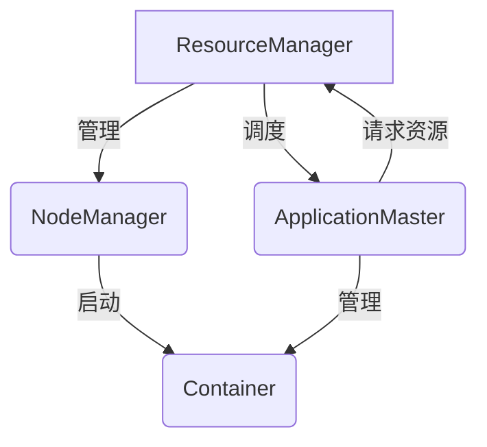

# Yarn原理与代码实例讲解

## 1. 背景介绍

### 1.1 问题的由来

在大数据时代,分布式计算框架的重要性日益凸显。Apache Hadoop作为开源的分布式计算框架,在业界广受欢迎和应用。然而,Hadoop的资源调度器存在一些缺陷,例如资源利用率低、应用启动延迟高等,这严重影响了集群的计算效率。为了解决这些问题,Apache Hadoop社区推出了新一代资源调度器Yarn(Yet Another Resource Negotiator)。

### 1.2 研究现状 

Yarn的出现彻底改变了Hadoop的架构,将资源管理和作业调度/监控两个主要功能解耦,提高了系统的伸缩性和可用性。目前,Yarn已成为Apache Hadoop生态系统中不可或缺的核心组件,受到了学术界和工业界的广泛关注。越来越多的公司和组织开始采用Yarn作为其大数据平台的资源调度和管理框架。

### 1.3 研究意义

深入理解Yarn的原理和实现对于高效利用大数据集群资源、提高分布式计算效率至关重要。本文将全面剖析Yarn的设计思想、核心概念、关键算法以及实现细节,并结合代码示例进行讲解,旨在帮助读者掌握Yarn的本质,为开发和优化大数据应用提供理论和实践指导。

### 1.4 本文结构

本文共分为9个部分:第1部分介绍研究背景;第2部分阐述Yarn的核心概念;第3部分详细解析Yarn的核心算法原理和具体步骤;第4部分构建数学模型并推导公式;第5部分提供代码实例并进行解读;第6部分探讨Yarn的应用场景;第7部分推荐相关工具和学习资源;第8部分总结研究成果并展望未来;第9部分列出常见问题解答。

## 2. 核心概念与联系

在深入讲解Yarn的核心算法之前,我们需要先了解Yarn的核心概念及它们之间的联系。Yarn的设计思想是将资源管理和作业调度/监控相分离,从而提高系统的伸缩性和可用性。

如上图所示,Yarn主要由以下四个核心组件组成:

1. **ResourceManager(RM)**: 整个Yarn集群的资源管理和调度总控制器,负责接收应用程序的资源请求、监控节点资源使用情况、调度各节点的资源并分配给各应用程序。

2. **NodeManager(NM)**: 运行在每个节点上的资源和任务管理器,负责管理本节点的资源使用情况,并根据RM的指令启动或停止容器(Container)。

3. **ApplicationMaster(AM)**: 每个应用程序对应一个AM实例,负责向RM申请资源,并与NM协作启动任务运行在容器中。

4. **Container**: 封装了CPU、内存等多种资源的抽象单元,是应用程序任务运行的载体。

上述四个组件通过合理分工并协同工作,实现了资源的高效管理和应用程序的弹性执行。接下来我们将详细剖析Yarn的核心算法原理。

## 3. 核心算法原理 & 具体操作步骤   

Yarn的核心算法主要包括资源管理算法和任务调度算法两个部分。

### 3.1 算法原理概述

#### 3.1.1 资源管理算法

资源管理算法由ResourceManager实现,主要包括以下几个步骤:

1. **资源请求**:ApplicationMaster向ResourceManager申请运行任务所需的资源(CPU、内存等)。

2. **资源分配**:ResourceManager根据集群的资源使用情况,以及内置的资源调度策略(如FairScheduler、CapacityScheduler等),为ApplicationMaster分配合适的资源。

3. **资源分布**:ResourceManager将分配的资源信息发送给相应的NodeManager。

4. **资源使用**:NodeManager根据ResourceManager的指令在本节点上启动相应数量的Container,并将Container分配给ApplicationMaster使用。

5. **资源释放**:应用程序运行完成后,ApplicationMaster向ResourceManager发送指令释放占用的资源。

#### 3.1.2 任务调度算法  

任务调度算法由ApplicationMaster实现,其核心思想是尽可能将任务均匀地分布到不同节点的Container中执行,以充分利用集群资源,提高并行度。具体步骤如下:

1. **任务拆分**:将应用程序拆分为多个并行的任务。

2. **资源请求**:根据任务数量,ApplicationMaster向ResourceManager申请运行所需的资源。

3. **资源分配**:ResourceManager按照内置策略为ApplicationMaster分配资源。

4. **任务分发**:ApplicationMaster将任务均匀分发到不同节点的Container中运行。

5. **进度监控**:ApplicationMaster持续监控各任务的运行进度。

6. **动态调整**:根据监控结果,ApplicationMaster可动态申请或释放资源,以确保应用程序高效运行。

7. **结果收集**:所有任务运行完成后,ApplicationMaster收集整理结果。

上述算法的核心在于将资源管理和任务调度相分离,ResourceManager只负责资源的分配,而ApplicationMaster负责具体的任务调度,使得整个系统具有更好的伸缩性和容错性。

### 3.2 算法步骤详解

为了更好地理解Yarn的工作原理,我们来详细解析资源管理算法和任务调度算法的具体实现步骤。

#### 3.2.1 资源管理算法步骤

1. **ApplicationMaster向ResourceManager发送资源请求**

   应用程序启动时,会启动一个ApplicationMaster进程,它将向ResourceManager发送资源请求,包括CPU、内存等资源需求。

2. **ResourceManager根据现有资源情况做出响应决策**

   ResourceManager根据整个集群的资源使用情况,以及内置的资源调度策略(如FairScheduler、CapacityScheduler等),决定是满足请求、拒绝请求,还是暂时挂起请求。

3. **ResourceManager将决策指令下发给NodeManager**

   一旦做出分配资源的决策,ResourceManager将把相应的资源分配指令下发给管理相应节点资源的NodeManager。

4. **NodeManager在本节点上启动Container**

   NodeManager根据ResourceManager的指令,在本节点上启动相应数量的Container,并将这些Container的具体信息(如内存地址等)汇报给ResourceManager。

5. **ResourceManager将Container信息发送给ApplicationMaster**

   ResourceManager将新启动的Container具体信息发送给ApplicationMaster。

6. **ApplicationMaster在Container中运行任务**

   ApplicationMaster收到Container信息后,将为这些Container分配任务运行。如果资源不足以运行所有任务,ApplicationMaster将持续向ResourceManager发送资源请求。

7. **ApplicationMaster向ResourceManager发送指令释放资源**

   所有任务运行完成后,ApplicationMaster向ResourceManager发送指令,释放之前占用的资源。

上述步骤展示了Yarn中ApplicationMaster、ResourceManager和NodeManager三者是如何协同工作,高效管理和调度集群资源的。

#### 3.2.2 任务调度算法步骤  

1. **拆分应用程序为多个Task**

   ApplicationMaster将应用程序拆分为多个并行的Task。

2. **确定资源需求,向ResourceManager发送请求**

   根据Task的数量和每个Task所需资源,ApplicationMaster向ResourceManager发送资源请求。

3. **ResourceManager分配资源,返回Container信息**

   ResourceManager按照内置策略为ApplicationMaster分配资源,并返回新启动Container的具体信息。

4. **ApplicationMaster将Task分发到多个Container中运行**  

   ApplicationMaster收到Container信息后,将Task尽可能均匀地分发到这些Container中并行运行。

5. **监控Task运行进度,动态调整资源**

   ApplicationMaster持续监控各Task的运行进度,根据监控结果动态向ResourceManager申请或释放资源,以确保应用程序高效运行。

6. **所有Task运行完成,收集整理结果**

   当所有Task运行完成后,ApplicationMaster收集并整理运行结果。

7. **释放占用资源,向ResourceManager发送指令**

   ApplicationMaster向ResourceManager发送指令,释放之前占用的资源。

可以看出,ApplicationMaster在任务调度算法中扮演着至关重要的角色,它不仅负责将应用程序拆分为多个并行Task,还要合理分发Task到各Container中运行,并根据实时进度做出动态资源调整,最大限度地利用集群资源,提高应用程序的执行效率。

### 3.3 算法优缺点

#### 3.3.1 优点

1. **高伸缩性**:Yarn将资源管理和任务调度相分离,使得整个系统具备很好的伸缩性,能够支持上万节点的超大规模集群。

2. **高可用性**:Yarn采用了主备热备份机制,当某个核心组件(如ResourceManager)发生故障时,可以快速切换到备用节点,提高了系统的容错能力。

3. **资源利用率高**:Yarn支持细粒度的资源分配和调度,可以充分利用集群中的资源,避免资源浪费。

4. **多应用程序共存**:Yarn支持在同一个集群上运行多个应用程序,并为它们公平分配资源,提高了集群的资源利用效率。

5. **跨平台兼容性好**:Yarn不仅可以运行MapReduce作业,还可以支持其他类型的分布式应用程序,如Spark、Flink等。

#### 3.3.2 缺点

1. **资源分配策略欠缺灵活性**:目前Yarn中的资源分配策略(如FairScheduler、CapacityScheduler)相对比较简单,无法针对不同应用程序特点做出更加精细的资源分配。

2. **资源利用率仍有提升空间**:尽管Yarn相较于旧的Hadoop已经提高了资源利用率,但仍存在一些浪费,如容器资源利用不足等。

3. **调度开销较大**:Yarn中存在大量的资源协商过程,会产生一定的调度开销,影响系统整体性能。

4. **安全性能待加强**:目前Yarn在安全性和隔离性方面还有待加强,不同应用程序之间可能会相互影响。

5. **缺乏实时性支持**:Yarn主要面向离线批处理作业,对于需要低延迟的实时作业支持较弱。

总的来说,Yarn算法在提高资源利用率、支持多租户等方面表现优异,但在资源分配策略、调度开销、安全性等方面还有待进一步改进和优化。

### 3.4 算法应用领域

Yarn作为Apache Hadoop生态系统中的核心组件,其资源管理和任务调度算法被广泛应用于以下领域:

1. **大数据处理**:Hadoop生态圈中的大数据处理工具如MapReduce、Spark、Flink等,都可以运行在Yarn之上,高效利用集群资源。

2. **机器学习**:分布式机器学习框架(如TensorFlow、Pytorch等)可以借助Yarn实现大规模数据集的高性能训练。

3. **实时计算**:一些支持实时计算的发行版(如Hadoop 3.x)通过Yarn实现了低延迟的流式计算。

4. **云计算**:Yarn可以与云计算平台(如OpenStack、AWS等)无缝集成,为云上的分布式应用程序提供资源管理。

5. **大数据基础设施构建**:许多公司和组织使用Yarn搭建其大数据基础架构,用于数据处理、分析等应用场景。

6. **科学计算**:一些科学计算领域(如基因组学、天体物理学等)利用Yarn的资源调度能力,高效运行科学计算作业。

可见,Yarn及其资源管理和任务调度算法在大数据、机器学习、实时计算等诸多领域发挥着重要作用,是构建分布式计算平台的核心基础。

## 4. 数学模型和公式 & 详细讲解 & 举例说明

为了更好地理解和优化Yarn的资源调度算法,我们需要构建相应的数学模型并推导公式。在这一部分,我们将介绍常用的数学模型、公式推导过程,并结合具体案例进行讲解。

### 4.1 数学模型构建  

在Yarn中,资源调度可以抽象为一个约束优化问题。我们的目标是在满足各种约束条件