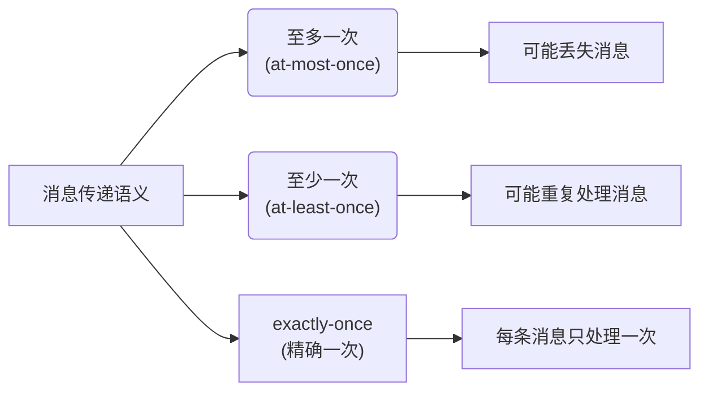
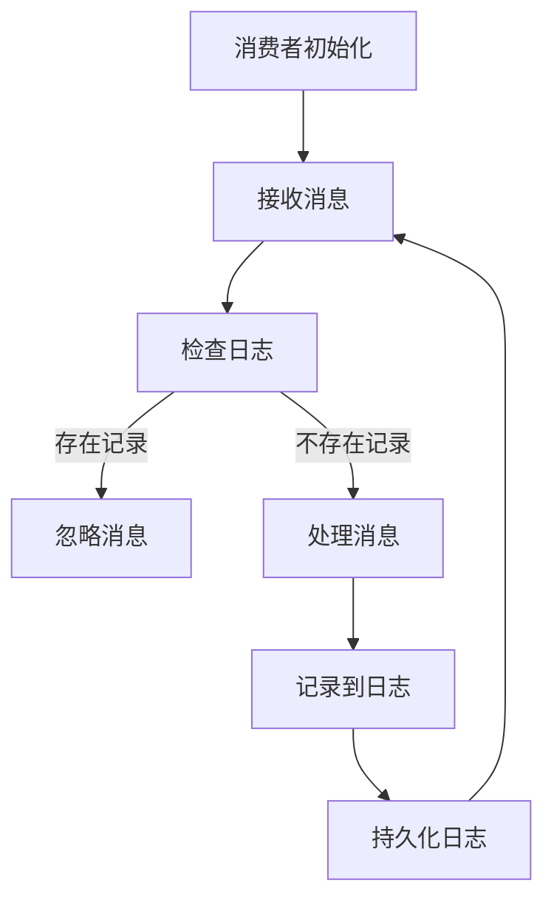
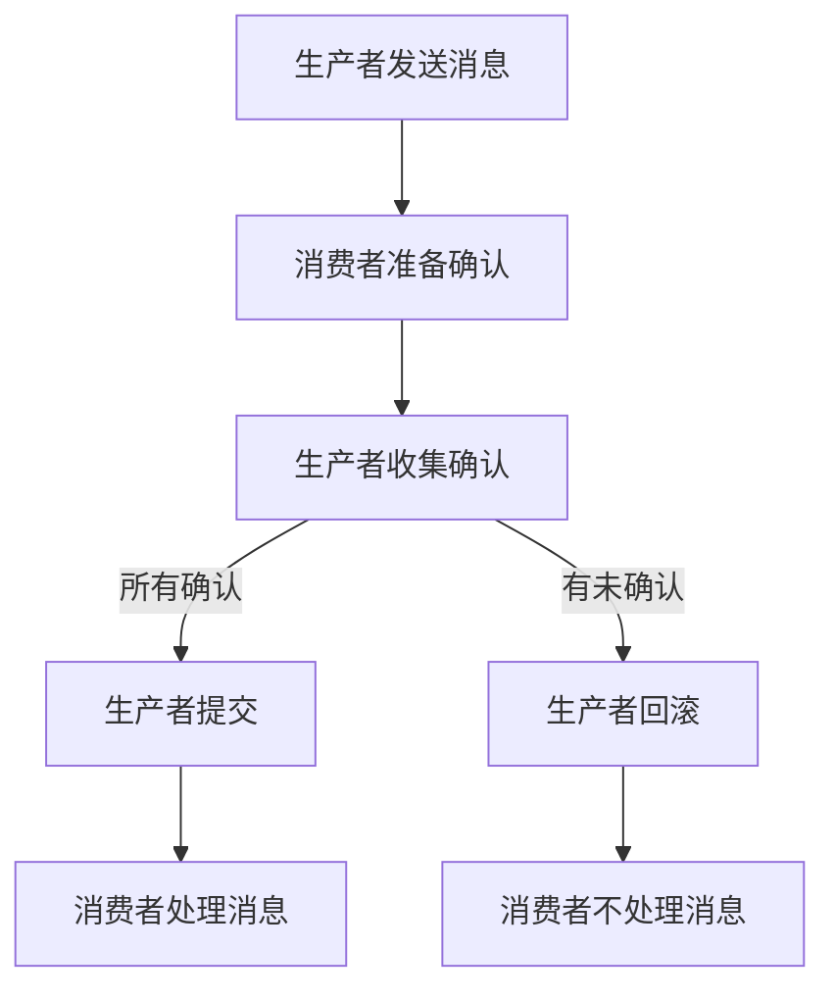

# exactly-once语义 原理与代码实例讲解

## 1. 背景介绍

### 1.1 问题的由来

在分布式系统中，确保消息传递的可靠性和一致性是一个长期存在的挑战。传统的消息传递系统通常采用"至多一次"(at-most-once)或"至少一次"(at-least-once)语义来处理消息传递。然而，这两种语义都存在一定的缺陷和局限性。

"至多一次"语义确保消息不会被重复处理,但存在消息丢失的风险。而"至少一次"语义则可以保证消息最终会被处理,但可能会导致重复处理的问题。对于某些应用场景,如金融交易、库存管理等,重复处理或消息丢失都可能导致严重的后果。

为了解决这一问题,exactly-once语义(精确一次语义)应运而生。它旨在确保每条消息只被处理一次,不会出现重复处理或丢失的情况,从而提供更高的可靠性和一致性保证。

### 1.2 研究现状

exactly-once语义在分布式系统中备受关注,已有多种实现方案被提出和探讨。其中,基于日志的方案是最常见的一种。这种方案通过在消费者端维护一个持久化日志来记录已处理的消息,从而避免重复处理。另一种常见的方案是基于两阶段提交(Two-Phase Commit,2PC)协议,它通过协调生产者和消费者之间的状态来确保exactly-once语义。

除了上述方案,还有一些其他的实现思路,如基于幂等性(idempotent)操作、基于事务等。每种方案都有其优缺点,需要根据具体的应用场景和系统要求进行权衡选择。

### 1.3 研究意义

实现exactly-once语义对于构建可靠的分布式系统至关重要。它可以确保数据的一致性和完整性,避免由于重复处理或消息丢失而导致的数据不一致或者资源浪费等问题。在金融、电子商务、物流等领域,exactly-once语义可以为关键业务流程提供可靠的保证,提高系统的健壮性和用户体验。

此外,exactly-once语义的研究也推动了分布式系统理论和实践的发展,促进了新型算法、协议和架构的探索和创新。

### 1.4 本文结构

本文将全面介绍exactly-once语义的原理、实现方法和实际应用。首先,我们将探讨exactly-once语义的核心概念及其与其他消息传递语义的关系。接下来,详细阐述实现exactly-once语义的核心算法原理和具体操作步骤,包括基于日志、两阶段提交等经典方案。然后,我们将介绍相关的数学模型和公式,并通过案例分析加深理解。

此外,本文还将提供一个完整的代码实例,详细解释其实现过程和关键点,并展示运行结果。最后,我们将探讨exactly-once语义在实际应用场景中的应用,分享相关的学习资源和工具,总结未来的发展趋势和挑战。

## 2. 核心概念与联系

exactly-once语义是指在分布式系统中,确保每条消息只被处理一次,不会出现重复处理或丢失的情况。它位于"至多一次"(at-most-once)和"至少一次"(at-least-once)两种语义之间,旨在提供更高的可靠性和一致性保证。

- **至多一次(at-most-once)**:确保消息不会被重复处理,但存在消息丢失的风险。
- **至少一次(at-least-once)**:确保消息最终会被处理,但可能会导致重复处理的问题。
- **exactly-once(精确一次)**:确保每条消息只被处理一次,不会出现重复处理或丢失的情况。

exactly-once语义通常需要在生产者(Producer)和消费者(Consumer)之间建立一种协调机制,以确保消息的可靠传递和处理。常见的实现方案包括:

1. **基于日志(Log-based)**:在消费者端维护一个持久化日志,记录已处理的消息。
2. **两阶段提交(Two-Phase Commit, 2PC)**:通过协调生产者和消费者之间的状态,确保exactly-once语义。
3. **基于幂等性(Idempotent)**:设计幂等操作,确保重复执行相同的操作不会产生副作用。
4. **基于事务(Transactional)**:利用事务机制,将消息发送和处理视为一个原子操作。

实现exactly-once语义需要权衡可靠性、一致性、性能和复杂性等因素。不同的方案各有优缺点,需要根据具体的应用场景和系统要求进行选择和设计。

## 3. 核心算法原理 & 具体操作步骤

### 3.1 算法原理概述

实现exactly-once语义的核心算法原理是在生产者和消费者之间建立一种协调机制,确保消息的可靠传递和处理。常见的实现方案包括基于日志(Log-based)和两阶段提交(Two-Phase Commit, 2PC)等。

**基于日志(Log-based)方案**的基本思路是:在消费者端维护一个持久化日志,记录已处理的消息。当消费者接收到一条新消息时,它首先检查日志中是否存在该消息的记录。如果存在,则表示该消息已经被处理过,直接忽略;如果不存在,则处理该消息,并将其记录到日志中。

**两阶段提交(2PC)方案**则通过协调生产者和消费者之间的状态来确保exactly-once语义。在第一阶段(准备阶段),消费者向生产者发送准备确认,表示已准备好处理消息。生产者收到所有消费者的准备确认后,进入第二阶段(提交阶段),向所有消费者发送提交指令,消费者收到提交指令后,开始处理消息。如果在任何阶段出现故障,则会触发回滚操作,确保消息不会被重复处理或丢失。

### 3.2 算法步骤详解

#### 3.2.1 基于日志(Log-based)方案

1. **消费者初始化**:消费者启动时,从持久化日志中加载已处理的消息记录。
2. **接收消息**:消费者接收到一条新消息。
3. **检查日志**:消费者检查日志中是否存在该消息的记录。
4. **处理消息**:
   - 如果日志中不存在该消息的记录,则处理该消息,并将其记录到日志中。
   - 如果日志中已存在该消息的记录,则忽略该消息,不进行处理。
5. **持久化日志**:确保日志记录持久化,以防止消费者崩溃导致数据丢失。

#### 3.2.2 两阶段提交(2PC)方案

1. **生产者发送消息**:生产者向所有消费者发送消息。
2. **消费者准备确认**:每个消费者向生产者发送准备确认,表示已准备好处理消息。
3. **生产者收集确认**:生产者收集所有消费者的准备确认。
4. **生产者提交/回滚**:
   - 如果收到所有消费者的准备确认,则向所有消费者发送提交指令。
   - 如果有任何消费者未发送准备确认或发生故障,则向所有消费者发送回滚指令。
5. **消费者处理消息**:收到提交指令后,消费者处理消息;收到回滚指令后,消费者不处理消息。

### 3.3 算法优缺点

#### 3.3.1 基于日志(Log-based)方案

**优点**:
- 实现相对简单,易于理解和维护。
- 只需要在消费者端维护日志,不需要生产者参与协调。
- 具有良好的扩展性和容错性,消费者之间相互独立。

**缺点**:
- 需要持久化日志,存在一定的性能开销。
- 日志的大小会随着时间增长,需要定期清理或压缩。
- 无法保证消息的顺序性,可能导致消息乱序处理。

#### 3.3.2 两阶段提交(2PC)方案

**优点**:
- 可以确保消息的顺序性,避免消息乱序处理。
- 提供了更强的一致性保证,确保所有消费者都处理或不处理消息。

**缺点**:
- 实现较为复杂,需要协调生产者和消费者之间的状态。
- 存在单点故障问题,如果协调者(生产者)发生故障,整个系统可能陷入阻塞状态。
- 在准备阶段,所有消费者都需要保持阻塞状态,直到收到提交或回滚指令,可能导致性能下降。

### 3.4 算法应用领域

exactly-once语义在以下领域具有广泛的应用:

1. **金融交易系统**:确保每笔交易只被处理一次,避免重复扣款或漏单等问题。
2. **电子商务订单系统**:保证每个订单只被处理一次,防止重复下单或丢单。
3. **物流跟踪系统**:准确记录每个包裹的运输路径,避免重复或丢失记录。
4. **消息队列系统**:确保消息只被消费一次,提高系统的可靠性和一致性。
5. **数据流处理系统**:保证每条数据只被处理一次,确保计算结果的准确性。
6. **分布式事务处理**:在分布式环境中实现事务的原子性和一致性。

总的来说,对于那些需要确保数据完整性和一致性的关键业务系统,实现exactly-once语义是非常重要的。

## 4. 数学模型和公式 & 详细讲解 & 举例说明

### 4.1 数学模型构建

为了更好地理解和分析exactly-once语义的实现,我们可以构建一个数学模型。假设有一个分布式系统,包含一个生产者(Producer)和多个消费者(Consumer)。生产者向消费者发送消息,消费者需要确保每条消息只被处理一次。

我们使用以下符号表示:

- $P$: 生产者
- $C_i$: 第 $i$ 个消费者,其中 $i = 1, 2, \dots, n$
- $M_j$: 第 $j$ 条消息,其中 $j = 1, 2, \dots, m$
- $\mathcal{P}(M_j)$: 消息 $M_j$ 被处理的概率
- $\mathcal{R}(M_j)$: 消息 $M_j$ 被重复处理的概率
- $\mathcal{L}(M_j)$: 消息 $M_j$ 被丢失的概率

我们的目标是最大化 $\mathcal{P}(M_j)$,同时最小化 $\mathcal{R}(M_j)$ 和 $\mathcal{L}(M_j)$,以实现exactly-once语义。

### 4.2 公式推导过程

为了实现exactly-once语义,我们需要确保每条消息只被处理一次,即:

$$
\mathcal{P}(M_j) = 1 - \mathcal{R}(M_j) - \mathcal{L}(M_j)
$$

其中:

- $\mathcal{P}(M_j) = 1$: 表示消息 $M_j$ 被处理的概率为 1,即一定被处理。
- $\mathcal{R}(M_j) = 0$: 表示消息 $M_j$ 