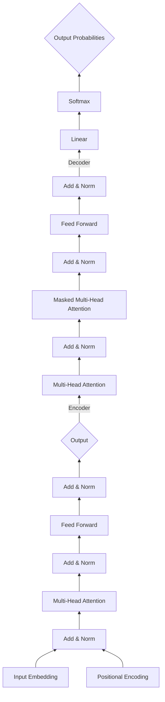

# Transformer架构(Transformer Architecture)原理与代码实战案例讲解

关键词：Transformer, 注意力机制, 自然语言处理, 神经网络, 编码器-解码器

## 1. 背景介绍

### 1.1 问题的由来

自然语言处理(NLP)是人工智能的一个重要分支,旨在让计算机能够理解、生成和处理人类语言。传统的NLP方法主要基于规则和统计,难以处理语言的复杂性和多样性。近年来,深度学习技术的发展为NLP带来了革命性的变化,其中Transformer架构更是引领了这一变革浪潮。

### 1.2 研究现状

自从2017年Google提出Transformer架构以来,它迅速成为NLP领域的研究热点。Transformer摒弃了此前广泛使用的循环神经网络(RNN)和卷积神经网络(CNN),转而采用自注意力机制(Self-Attention)来建模文本序列。这一创新不仅大幅提升了模型的并行计算能力,而且在机器翻译、文本摘要、问答系统等任务上取得了突破性进展。如今,从BERT到GPT-3,众多NLP领域的里程碑式成果都建立在Transformer架构之上。

### 1.3 研究意义

深入研究Transformer架构,对于推动NLP技术的发展具有重要意义:

1. 理论意义:有助于加深对自然语言理解和生成机理的认识,为认知科学和人工智能的发展提供新的视角。

2. 应用价值:Transformer已被广泛应用于机器翻译、智能问答、舆情分析等领域,深入研究有助于开发出更加智能、高效的NLP系统,服务于人机交互、知识管理等实际应用。

3. 技术创新:Transformer开创了NLP的新范式,但仍存在诸多局限和挑战,如模型的可解释性、鲁棒性等。深入研究有助于突破瓶颈,推动NLP技术的持续创新。

### 1.4 本文结构

本文将从以下几个方面对Transformer架构进行深入探讨:

- 第2部分介绍Transformer的核心概念和内在联系
- 第3部分阐述Transformer的算法原理和操作步骤
- 第4部分建立Transformer的数学模型,并结合实例进行公式推导和详解
- 第5部分给出Transformer的代码实现,并进行逐行解读
- 第6部分讨论Transformer在实际中的应用场景和未来展望
- 第7部分推荐Transformer相关的学习资源和开发工具
- 第8部分总结全文,并展望Transformer未来的发展趋势和挑战
- 第9部分列出一些常见问题,并给出解答

## 2. 核心概念与联系

Transformer的核心概念包括:

- Encoder-Decoder架构:Transformer沿用了传统的编码器-解码器框架,但其内部结构发生了根本性变化。编码器负责将输入序列映射为隐空间表示,解码器则根据隐表示和之前的输出,逐步生成目标序列。

- 自注意力机制(Self-Attention):这是Transformer的核心创新。与RNN按时间步顺序处理不同,Self-Attention允许序列中任意两个位置直接建立依赖关系。具体而言,它通过Query、Key、Value三个向量来计算当前位置与其他位置的相关性,并生成加权求和的新表示。自注意力使得模型能够高效并行,更好地捕捉长距离依赖。

- 多头注意力(Multi-Head Attention):这是自注意力的扩展。它将输入线性投影到多个子空间,并行执行多个Self-Attention,再将结果拼接。这种机制增强了模型的表达能力,使其能关注不同位置的不同语义。 

- 前馈神经网络(Feed-Forward Networks):在Self-Attention之后,Transformer的每一层还包含两个前馈全连接层。它们对位置进行独立变换,增加了模型的非线性和深度。

- 位置编码(Positional Encoding):由于Self-Attention是位置无关的,Transformer需要额外编码位置信息。它采用了基于Sin/Cos函数的位置编码,将位置映射为固定维度的稠密向量,与词嵌入相加作为输入。

- 层标准化与残差连接:Transformer在每个子层之后都使用了层标准化(Layer Normalization)和残差连接(Residual Connection)。前者有助于稳定训练,后者则使信息能够直接传递,避免梯度消失。

下图展示了Transformer架构的整体结构和各部分的内在联系:

可以看出,Transformer的编码器和解码器都由多个相同的层堆叠而成,层内包含了Self-Attention、前馈网络等子结构,并用残差连接和层标准化将它们有机地串联在一起。这种结构赋予了Transformer强大的建模能力和并行效率。

## 3. 核心算法原理 & 具体操作步骤

### 3.1 算法原理概述

Transformer的核心是自注意力机制和多头注意力。对于长度为$n$的输入序列$\mathbf{x}=(x_1,\dots,x_n)$,Transformer首先将其转换为$d$维的嵌入向量$\mathbf{E}=(\mathbf{e}_1,\dots,\mathbf{e}_n)$,再与位置编码相加得到最终输入$\mathbf{H}^0=(\mathbf{h}_1^0,\dots,\mathbf{h}_n^0)$。

然后通过堆叠$L$个相同的层对$\mathbf{H}^0$进行变换,第$l$层的计算过程为:

$$
\begin{aligned}
\mathbf{Z}^l &= \text{LayerNorm}(\mathbf{H}^{l-1}) \\
\mathbf{A}^l &= \text{SelfAttention}(\mathbf{Z}^l) \\
\mathbf{H}^l &= \text{LayerNorm}(\mathbf{Z}^l + \mathbf{A}^l) \\
\mathbf{F}^l &= \max(0, \mathbf{H}^l\mathbf{W}_1^l+\mathbf{b}_1^l)\mathbf{W}_2^l+\mathbf{b}_2^l \\
\mathbf{H}^l &= \text{LayerNorm}(\mathbf{H}^l+\mathbf{F}^l)
\end{aligned}
$$

其中$\mathbf{W}_1^l,\mathbf{W}_2^l,\mathbf{b}_1^l,\mathbf{b}_2^l$是前馈网络的参数,$\text{SelfAttention}$则是多头自注意力:

$$
\begin{aligned}
\mathbf{Q}_i,\mathbf{K}_i,\mathbf{V}_i &= \mathbf{Z}\mathbf{W}_i^Q,\mathbf{Z}\mathbf{W}_i^K,\mathbf{Z}\mathbf{W}_i^V \\
\text{head}_i &= \text{softmax}\left(\frac{\mathbf{Q}_i\mathbf{K}_i^\top}{\sqrt{d}}\right)\mathbf{V}_i \\
\text{SelfAttention}(\mathbf{Z}) &= \text{Concat}(\text{head}_1,\dots,\text{head}_h)\mathbf{W}^O
\end{aligned}
$$

$\mathbf{W}_i^Q,\mathbf{W}_i^K,\mathbf{W}_i^V$是第$i$个头的投影矩阵,$\mathbf{W}^O$用于整合多头的结果。自注意力的本质是将序列$\mathbf{Z}$与自身的Query、Key、Value做注意力加权,以建模任意两个位置间的依赖。

经过$L$层变换,Transformer最终将输入$\mathbf{x}$编码为$\mathbf{H}^L$。解码过程与编码类似,但在Self-Attention中引入了Mask以避免看到未来信息。此外,解码的每一步还会参考编码结果$\mathbf{H}^L$来生成输出。

### 3.2 算法步骤详解

下面以编码器为例,详细说明Transformer的计算步骤:

1. 输入嵌入:将离散的输入token $x_i$映射为连续向量$\mathbf{e}_i\in\mathbb{R}^d$。

2. 位置编码:生成位置向量$\mathbf{p}_i\in\mathbb{R}^d$,与$\mathbf{e}_i$相加得到最终输入$\mathbf{h}_i^0=\mathbf{e}_i+\mathbf{p}_i$。位置编码通常采用正余弦函数:

$$
\begin{aligned}
p_{i,2j} &= \sin\left(\frac{i}{10000^{2j/d}}\right) \\
p_{i,2j+1} &= \cos\left(\frac{i}{10000^{2j/d}}\right)
\end{aligned}
$$

3. 自注意力:将$\mathbf{h}_i^{l-1}$线性变换为Query、Key、Value向量:

$$
\begin{aligned}
\mathbf{q}_{i,k}^l &= \mathbf{h}_i^{l-1}\mathbf{W}_k^{Q,l} \\
\mathbf{k}_{i,k}^l &= \mathbf{h}_i^{l-1}\mathbf{W}_k^{K,l} \\ 
\mathbf{v}_{i,k}^l &= \mathbf{h}_i^{l-1}\mathbf{W}_k^{V,l}
\end{aligned}
$$

然后计算第$k$个头的注意力权重和输出:

$$
\begin{aligned}
\alpha_{ij,k}^l &= \frac{\exp(\mathbf{q}_{i,k}^l\cdot\mathbf{k}_{j,k}^l/\sqrt{d})}{\sum_{j=1}^n\exp(\mathbf{q}_{i,k}^l\cdot\mathbf{k}_{j,k}^l/\sqrt{d})} \\
\mathbf{z}_{i,k}^l &= \sum_{j=1}^n\alpha_{ij,k}^l\mathbf{v}_{j,k}^l
\end{aligned}
$$

最后将所有头的结果拼接并变换:

$$
\mathbf{a}_i^l = \mathbf{W}^{O,l}\text{Concat}(\mathbf{z}_{i,1}^l,\dots,\mathbf{z}_{i,h}^l)
$$

4. 残差连接与层标准化:

$$
\begin{aligned}
\mathbf{h}_i^{'l} &= \text{LayerNorm}(\mathbf{h}_i^{l-1}+\mathbf{a}_i^l) \\
\mathbf{h}_i^l &= \text{LayerNorm}(\mathbf{h}_i^{'l}+\text{FFN}(\mathbf{h}_i^{'l}))
\end{aligned}
$$

其中$\text{FFN}$是前馈网络:

$$
\text{FFN}(\mathbf{x})=\max(0,\mathbf{x}\mathbf{W}_1+\mathbf{b}_1)\mathbf{W}_2+\mathbf{b}_2
$$

以上步骤重复$L$次,即可得到最终的编码表示$\mathbf{H}^L=(\mathbf{h}_1^L,\dots,\mathbf{h}_n^L)$。解码过程与此类似,区别在于:

- 解码是自回归的,即每个时间步只能看到之前的输出。因此在计算Self-Attention时需要对$\alpha_{ij,k}^l$进行Mask,只保留$j\leq i$的部分。

- 除了Self-Attention外,解码的每一层还多了一个"Encoder-Decoder Attention",用于关注编码结果$\mathbf{H}^L$。其Query来自解码的上一层,而Key和Value来自$\mathbf{H}^L$。

- 解码的最后一层接上线性层+Softmax层,以生成下一个token的概率分布。

### 3.3 算法优缺点

Transformer相比RNN/CNN有以下优点:

- 并行性强:Self-Attention可以高度并行化,计算复杂度为$O(n^2d)$,优于RNN的$O(nd^2)$。

- 长程依赖:Self-Attention直接将任意两个位置联系起来,无需像