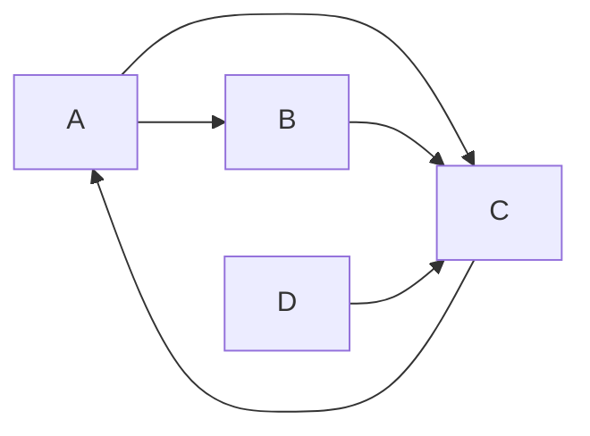

# 【AI大数据计算原理与代码实例讲解】PageRank

关键词：PageRank算法、网页排名、马尔可夫链、幂法迭代、Python实现

## 1. 背景介绍
### 1.1 问题的由来
在互联网飞速发展的今天,搜索引擎已经成为人们获取信息的主要途径。而搜索结果的质量很大程度上取决于网页排名算法的优劣。早期的网页排名算法主要依赖于网页内容本身的相关性,无法很好地反映网页的重要程度。为了解决这一问题,Google公司创始人佩奇和布林在上世纪90年代末提出了革命性的PageRank算法。

### 1.2 研究现状
PageRank算法自提出以来,经过学术界和工业界的不断改进和优化,已经成为搜索引擎排名的核心算法之一。目前,PageRank思想不仅应用于网页排序,还被广泛用于社交网络、推荐系统、生物信息等诸多领域。各大公司也都围绕PageRank展开了大量的研究,并取得了丰硕的成果。

### 1.3 研究意义 
深入理解和掌握PageRank算法,对于我们研究现代搜索引擎的内在机理、提升搜索质量具有重要意义。同时,PageRank蕴含的思想对于大数据时代下的许多复杂网络分析问题也有很好的借鉴作用。因此,系统地学习PageRank算法的原理和实现,有助于我们建立对大规模网络数据挖掘的整体认知。

### 1.4 本文结构
本文将从以下几个方面对PageRank展开详细讨论：首先介绍PageRank的核心概念和数学基础；然后阐述PageRank的计算原理和具体算法步骤；接着从理论和实践的角度对PageRank的数学模型进行分析；最后通过Python代码实例演示PageRank的工程实现。同时,本文还就PageRank的应用场景、发展趋势等问题提出了自己的见解。

## 2. 核心概念与联系
PageRank算法的核心思想是通过网页之间的链接关系来评估网页的重要性。如果一个网页被很多其他网页链接到的话,说明这个网页比较重要,它的PageRank值就会比较高；反之,如果一个网页没有其他任何网页链接,那么它的重要性就会比较低。 

这里的链接关系可以用一张有向图来表示,图中的节点代表网页,有向边代表网页之间的链接。网页的PageRank值经过多轮迭代计算后会收敛到一个稳定值,代表了该网页的重要程度。

PageRank计算还用到了马尔可夫链的知识。整个网页链接图可以看作一个马尔可夫链,每个网页是状态空间中的一个状态。当前网页的PageRank值可以通过其他网页的PageRank值线性加权得到。

## 3. 核心算法原理 & 具体操作步骤
### 3.1 算法原理概述
PageRank的基本思路是通过网页之间的链接关系,计算每个网页的重要性得分,作为网页排序的依据。具体来说,PageRank值的计算分为两个步骤:

1. 初始化:假设所有网页的初始PageRank值相同,都为1/N(N为网页总数)。

2. 迭代计算:每一轮迭代,网页A的PageRank值等于所有链接到A的网页的PageRank值的加权和。权重为链接网页的PageRank值除以它的出链数。不断迭代直到PageRank值收敛。

可以用下面的公式表示PageRank值的计算过程:

$$PR(p_i)=\frac{1-d}{N}+d\sum_{p_j\in M(p_i)}\frac{PR(p_j)}{L(p_j)}$$

其中,$PR(p_i)$表示网页$p_i$的PageRank值,$M(p_i)$表示所有链接到$p_i$的网页集合,$L(p_j)$表示网页$p_j$的出链数,$N$为网页总数,$d$为阻尼系数,一般取0.85。

### 3.2 算法步骤详解
下面以一个具体的例子来说明PageRank的计算步骤。假设有4个网页A、B、C、D,它们之间的链接关系如下图所示:



1. 初始化:假设所有网页的初始PageRank值为0.25。

2. 迭代计算:
- 第一轮迭代:
    - A的PageRank值=0.15/4+0.85×0.25=0.2625
    - B的PageRank值=0.15/4+0.85×0.25=0.2625
    - C的PageRank值=0.15/4+0.85×(0.25+0.25+0.25)/2=0.4875
    - D的PageRank值=0.15/4+0.85×0=0.0375
- 第二轮迭代:
    - A的PageRank值=0.15/4+0.85×0.4875=0.452875
    - B的PageRank值=0.15/4+0.85×0.2625=0.261125
    - C的PageRank值=0.15/4+0.85×(0.261125+0.261125+0.0375)/2=0.298919
    - D的PageRank值=0.15/4+0.85×0=0.0375
- 后面的迭代步骤同上,直到PageRank值收敛。

### 3.3 算法优缺点
PageRank算法的主要优点有:
1. 能够很好地反映网页的重要程度,对网页进行合理的排序。
2. 计算简单,容易实现。
3. 对网页内容的变化不敏感,排名比较稳定。

PageRank算法的主要缺点有:  
1. 旧网页的PageRank值会比较高,排名靠前,新网页即使质量很高也很难获得高排名。
2. 容易受到刷链接作弊的影响。
3. 没有考虑链接的质量,实际上不同网页的链接质量是不一样的。

### 3.4 算法应用领域
PageRank思想在学术界和工业界得到了广泛应用,主要应用领域包括:
1. 搜索引擎:如Google、百度等搜索引擎都采用了PageRank算法作为其排名的核心算法之一。
2. 社交网络:可以用PageRank计算社交网络中节点的重要性,如影响力、声望等。
3. 推荐系统:通过PageRank找出物品关联网络、用户兴趣网络中的重要节点,给用户做个性化推荐。
4. 自然语言处理:用PageRank对文本语料库建图,可以用于关键词提取、文本摘要等任务。
5. 生物信息学:通过基因调控网络、蛋白质相互作用网络等计算重要的基因、蛋白质。

## 4. 数学模型和公式 & 详细讲解 & 举例说明
### 4.1 数学模型构建
PageRank的数学模型可以用马尔可夫链来刻画。将网页看作马尔可夫链的状态,链接关系看作状态之间的转移。任何时刻,访问者访问一个网页后有两种选择:

1. 以概率$d$选择一个链出的网页访问,链出网页被访问的概率由链接权重决定,即每个链接被选中的概率为$1/L(p)$。

2. 以概率$1-d$随机平均地选择一个网页访问。

以上过程不断重复,形成一个状态转移序列。可以用状态转移矩阵$M$描述这个马尔可夫链:

$$M=
\begin{bmatrix} 
\frac{1-d}{N}+d\frac{L(p_1,p_1)}{L(p_1)} & \frac{1-d}{N}+d\frac{L(p_1,p_2)}{L(p_1)} & ... & \frac{1-d}{N}+d\frac{L(p_1,p_N)}{L(p_1)}\\
\frac{1-d}{N}+d\frac{L(p_2,p_1)}{L(p_2)} & \frac{1-d}{N}+d\frac{L(p_2,p_2)}{L(p_2)} & ... & \frac{1-d}{N}+d\frac{L(p_2,p_N)}{L(p_2)}\\
... & ... & ... & ...\\  
\frac{1-d}{N}+d\frac{L(p_N,p_1)}{L(p_N)} & \frac{1-d}{N}+d\frac{L(p_N,p_2)}{L(p_N)} & ... & \frac{1-d}{N}+d\frac{L(p_N,p_N)}{L(p_N)}
\end{bmatrix}
$$

其中,$L(p_i,p_j)$表示网页$p_i$到$p_j$的链接数。

### 4.2 公式推导过程
PageRank值实际上就是以上马尔可夫链的平稳分布。根据马尔可夫链的性质,平稳分布满足:

$$\pi=\pi M$$

其中,$\pi$是一个$1\times N$的向量,表示每个页面的PageRank值。将$M$代入上式,整理后可得:

$$\pi_j=\sum_{i=1}^N\left(\frac{1-d}{N}+d\frac{L(p_i,p_j)}{L(p_i)}\right)\pi_i$$

上式写成分量形式即为:

$$PR(p_i)=\frac{1-d}{N}+d\sum_{p_j\in M(p_i)}\frac{PR(p_j)}{L(p_j)}$$

这就是PageRank的计算公式。求解该方程组可以得到每个网页的PageRank值。

### 4.3 案例分析与讲解
下面我们用一个具体的例子来讲解PageRank的计算过程。沿用上一节的4个网页的例子,我们构造状态转移矩阵$M$如下:

$$M=
\begin{bmatrix}
0.0375 & 0.0375 & 0.4625 & 0.0375\\
0.4625 & 0.0375 & 0.4625 & 0.0375\\
0.4625 & 0.4625 & 0.0375 & 0.0375\\
0.0375 & 0.0375 & 0.8875 & 0.0375
\end{bmatrix}
$$

初始化$\pi^{(0)}=[0.25,0.25,0.25,0.25]$,不断迭代直到收敛:

$$
\pi^{(1)}=\pi^{(0)}M=[0.2625,0.2625,0.4875,0.0375]\\
\pi^{(2)}=\pi^{(1)}M=[0.452875,0.261125,0.298919,0.0375]\\
...\\
\pi^{(\infty)}=[0.3577,0.1934,0.4116,0.0373]
$$

最终得到的$\pi^{(\infty)}$就是每个网页的PageRank值。可以看出,网页C的PageRank值最高,其次是网页A,再次是网页B,网页D的PageRank值最低。这和我们直观上判断的网页重要程度是一致的。

### 4.4 常见问题解答
**Q:** 如何加快PageRank的收敛速度?

**A:** 可以采用以下几种方法:
1. 调整阻尼系数$d$的值,一般取$0.8\sim0.9$。
2. 采用随机游走的思路,引入随机跳转因子,避免陷入孤立的网页。
3. 使用幂法等数值计算方法加速迭代过程。

**Q:** 如何处理PageRank值为0的网页?

**A:** 可以采取以下措施:
1. 在计算PageRank时,给所有网页赋予一个较小的初始值。
2. 在状态转移矩阵$M$每一行加上一个很小的正数$\epsilon$,再对矩阵$M$进行归一化。
3. 采用随机游走思路,引入随机跳转因子,一定概率访问到每个网页。

## 5. 项目实践：代码实例和详细解释说明
### 5.1 开发环境搭建
本项目使用Python语言编写,需要安装以下第三方库:
- NumPy:数值计算库
- Matplotlib:数据可视化库
- NetworkX:复杂网络分析库

可以使用pip命令安装:

```bash
pip install numpy matplotlib networkx
```

### 5.2 源代码详细实现
下面是PageRank算法的Python实现代码:

```python
import numpy as np
import networkx as nx
import matplotlib.pyplot as plt

def pagerank(G, alpha=0.85, max_iter=100, tol=1e-6):
    