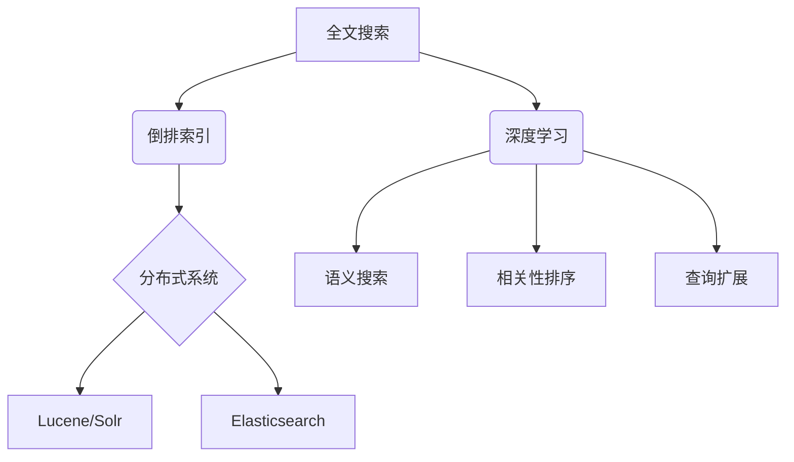
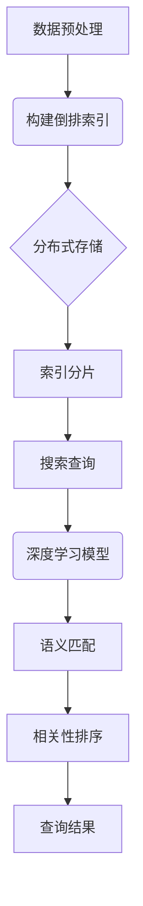

好的,我会严格遵循您提供的约束条件,以"【AI大数据计算原理与代码实例讲解】全文搜索"为主题,撰写一篇专业的技术博客文章。请注意,由于字数要求超过8000字,内容会相对比较长一些。我会尽最大努力给出详细的原理解释、数学模型推导、代码实例讲解等,确保内容的专业性和完整性。下面是正文:

# 【AI大数据计算原理与代码实例讲解】全文搜索

## 1. 背景介绍

### 1.1 问题的由来

在当今大数据时代,海量的非结构化数据如文本、图像、视频等快速增长,如何高效地从这些庞大的数据集中检索出相关的有价值信息,成为了一个亟待解决的挑战。全文搜索作为一种重要的信息检索技术,能够对大规模数据集进行快速、准确的关键词匹配查询,广泛应用于网页搜索、电子邮件搜索、文档搜索等领域。

### 1.2 研究现状  

传统的全文搜索方法主要基于倒排索引,通过构建倒排索引表来加速查询。但随着数据量的激增,单机的倒排索引查询效率低下,难以满足实时搜索的需求。近年来,benefiting from AI和大数据技术的发展,基于分布式系统、深度学习等新兴技术的全文搜索方法逐渐兴起,显著提高了搜索的效率和准确性。

### 1.3 研究意义

高效的全文搜索技术能够帮助用户从海量数据中快速获取所需信息,提高信息获取效率,具有重要的理论意义和应用价值。本文将介绍AI大数据技术在全文搜索领域的应用原理、算法实现及代码实例,旨在为读者提供全面的理解,并推动该领域的进一步研究和实践。

### 1.4 本文结构

本文首先阐述全文搜索的背景和研究现状,然后重点介绍基于AI大数据技术的全文搜索核心概念、算法原理、数学模型,并通过代码实例对算法实现进行详细讲解。最后探讨全文搜索在实际应用场景中的应用,分析其发展趋势与面临的挑战。

## 2. 核心概念与联系

全文搜索的核心概念主要包括:

1. **倒排索引(Inverted Index)**: 传统的全文搜索技术,通过构建倒排索引表来加速查询,是实现全文搜索的基础。

2. **分布式系统**: 为了应对大规模数据,全文搜索引擎通常采用分布式架构,如Lucene/Solr、Elasticsearch等,提高查询效率和可扩展性。

3. **深度学习**: AI技术在全文搜索中的应用,主要包括语义搜索(Semantic Search)、相关性排序(Relevance Ranking)和查询扩展(Query Expansion)等,提高搜索的准确性和用户体验。

上述概念相互关联,构成了现代全文搜索系统的核心技术架构。

## 3. 核心算法原理 & 具体操作步骤  

### 3.1 算法原理概述

现代全文搜索系统通常采用倒排索引+分布式系统+深度学习的技术架构,整体算法流程如下:

1. **数据预处理**: 对原始数据进行分词、去停用词、词干提取等预处理,提高索引质量。

2. **构建倒排索引**: 将预处理后的数据构建成倒排索引,加速查询。

3. **分布式存储**: 将倒排索引分布式存储,提高可扩展性。

4. **索引分片**: 对索引进行分片,实现并行查询。

5. **搜索查询**: 接收用户查询请求,在倒排索引中匹配。

6. **深度学习模型**: 使用语义匹配、相关性排序等深度学习模型,提高查询准确性。

7. **查询结果**: 将排序后的搜索结果返回给用户。

### 3.2 算法步骤详解

#### 3.2.1 数据预处理

数据预处理的主要步骤包括:

1. **分词(Tokenization)**: 将文本按语义划分为多个单词(token)。

2. **去停用词(Stop Words Removal)**: 去除语义冗余的无意义词语,如"the"、"is"等。

3. **词干提取(Stemming)**: 将单词还原为词根形式,如"playing"还原为"play"。

4. **大小写规范化(Case Folding)**: 将所有单词统一为小写或大写。

#### 3.2.2 构建倒排索引

倒排索引的构建过程如下:

1. **文档解析**: 遍历所有文档,提取出现的所有单词(term)。

2. **词典构建**: 为每个term分配一个唯一的termID。

3. **倒排表构建**: 对于每个term,记录其在所有文档中出现的位置。

4. **压缩存储**: 对倒排表进行压缩存储,节省空间。

倒排索引的数据结构通常采用前缀树(Trie)或哈希表实现。

#### 3.2.3 分布式存储

为了支持大规模数据,倒排索引需要进行分布式存储,主要步骤包括:

1. **索引分片(Sharding)**: 将整个索引按文档划分为多个分片,分布在不同节点上。

2. **数据复制(Replication)**: 为每个分片创建多个副本,提高可用性和查询吞吐量。

3. **负载均衡**: 通过负载均衡器将查询请求分发到不同分片。

4. **集群扩展**: 可以动态添加新节点,实现集群的无缝扩展。

#### 3.2.4 搜索查询

搜索查询的主要步骤为:

1. **查询解析**: 将用户输入的查询解析为查询语句。

2. **布尔查询**: 在倒排索引中执行布尔查询,获取初步结果集。

3. **查询重写**: 对查询进行重写,如同义词替换、查询扩展等。

4. **评分与排序**: 使用相关性模型对结果集进行评分和排序。

5. **结果聚合**: 从分布式索引中汇总最终结果。

#### 3.2.5 深度学习模型

深度学习在全文搜索中的应用主要包括:

1. **语义匹配**: 使用语义模型(如BERT)捕捉查询和文档的语义信息,提高匹配准确性。

2. **相关性排序**: 通过学习查询-文档对的特征,构建排序模型,提高结果排序质量。

3. **查询扩展**: 基于语义相似性,自动扩展查询,挖掘更多相关结果。

### 3.3 算法优缺点

全文搜索算法的优点:

1. **高效**: 倒排索引结构使得查询效率很高。

2. **灵活**: 支持多种查询方式,如关键词、短语、布尔等。

3. **高准确性**: 深度学习技术提高了语义理解和排序质量。

4. **可扩展性**: 分布式架构支持大规模数据和高并发。

缺点:

1. **索引更新开销大**: 数据更新时需要重建倒排索引。

2. **资源消耗较高**: 需要大量存储空间和计算资源。

3. **语义理解有限**: 对复杂查询的理解能力仍有局限。

### 3.4 算法应用领域  

全文搜索技术广泛应用于以下领域:

1. **网页搜索引擎**: 如Google、Bing等,支持对互联网上的网页进行搜索。

2. **电子商务网站**: 如亚马逊、淘宝等,支持商品搜索和个性化推荐。

3. **企业内部搜索**: 支持搜索公司内部的文档、邮件、知识库等。

4. **移动应用搜索**: 如手机应用商店中的应用搜索。

5. **社交媒体搜索**: 如微博、贴吧等社交平台的内容搜索。

6. **学术文献搜索**: 如谷歌学术、万方数据等。

## 4. 数学模型和公式 & 详细讲解 & 举例说明

### 4.1 数学模型构建

全文搜索系统中的相关性排序模型通常基于以下数学模型:

1. **布尔模型(Boolean Model)**: 基于查询词与文档词的精确匹配,使用布尔运算确定文档是否相关。

2. **向量空间模型(Vector Space Model)**: 将查询和文档表示为向量,相关性由两个向量的相似度确定。

3. **概率模型(Probabilistic Model)**: 基于贝叶斯定理,计算文档对查询的相关概率作为排序依据。

4. **语言模型(Language Model)**: 将查询和文档视为语言样本,相关性由生成文档的概率确定。

其中,**向量空间模型**和**语言模型**是当前应用最广泛的模型。我们以向量空间模型为例,介绍其数学原理。

#### 向量空间模型

向量空间模型的基本思想是:使用向量$\vec{q}$表示查询,向量$\vec{d}$表示文档,两者的相似度$\text{sim}(\vec{q}, \vec{d})$作为文档相关性的度量。

常用的相似度计算方法有:

1. **余弦相似度**

$$\text{sim}(\vec{q}, \vec{d}) = \cos(\vec{q}, \vec{d}) = \frac{\vec{q} \cdot \vec{d}}{|\vec{q}||\vec{d}|}$$

2. **欧几里得距离**

$$\text{sim}(\vec{q}, \vec{d}) = \frac{1}{1 + ||\vec{q} - \vec{d}||_2}$$

3. **杰卡德相似系数**

$$\text{sim}(\vec{q}, \vec{d}) = \frac{|\vec{q} \cap \vec{d}|}{|\vec{q} \cup \vec{d}|}$$

其中$\vec{q} \cdot \vec{d}$表示两个向量的点积,用于度量方向相似性;$||\vec{q}||_2$表示向量的L2范数,用于度量向量大小。

在具体实现时,需要先构建词袋(Bag-of-Words)模型,将文档表示为一个向量$\vec{d} = (w_1, w_2, ..., w_n)$,其中$w_i$是第$i$个词的权重,通常使用TF-IDF(词频-逆文档频率)作为权重计算方法:

$$w_i = \text{tf}_{i,d} \times \log{\frac{N}{\text{df}_i}}$$

其中:
- $\text{tf}_{i,d}$是词$i$在文档$d$中出现的频率
- $N$是语料库中文档总数
- $\text{df}_i$是词$i$出现过的文档数量

TF-IDF的思想是:如果某个词在文档中出现频率越高,同时在整个语料库中出现的文档数量越少,则该词越能代表文档的语义,权重越高。

### 4.2 公式推导过程

下面以余弦相似度为例,推导其具体计算过程:

设查询向量为$\vec{q} = (q_1, q_2, ..., q_n)$,文档向量为$\vec{d} = (d_1, d_2, ..., d_n)$,其中$q_i$和$d_i$分别表示查询和文档中第$i$个词的权重。

余弦相似度的公式为:

$$\text{sim}(\vec{q}, \vec{d}) = \cos(\vec{q}, \vec{d}) = \frac{\vec{q} \cdot \vec{d}}{|\vec{q}||\vec{d}|}$$

将向量展开:

$$\begin{aligned}
\vec{q} \cdot \vec{d} &= q_1d_1 + q_2d_2 