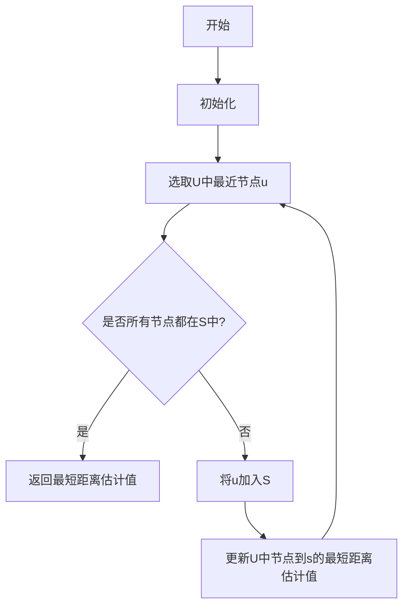
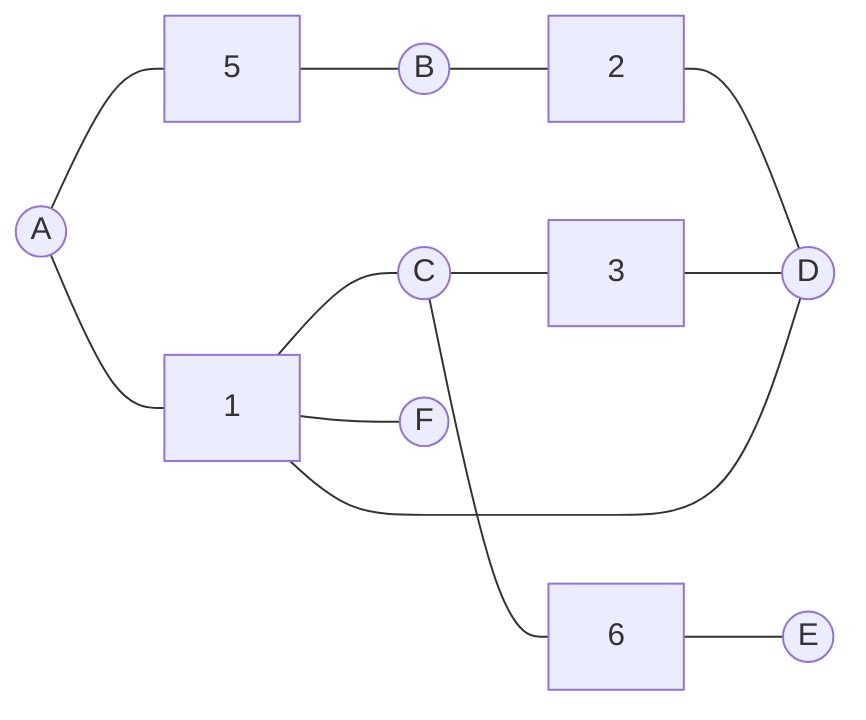

好的,我会严格遵循约束条件,以专业的技术语言写一篇关于"最短路径"算法的深度博客文章。

# 【AI大数据计算原理与代码实例讲解】最短路径

## 1. 背景介绍

### 1.1 问题的由来

在现实生活中,我们经常会遇到需要寻找两点之间最短路径的问题。无论是规划旅游路线、运输物流,还是计算机网络中的数据传输,都需要找到起点和终点之间的最优路径。随着现代城市的不断扩张和交通网络的日益复杂,高效解决最短路径问题变得越来越重要。

### 1.2 研究现状  

最短路径问题是图论和组合优化领域的一个经典问题,已有数十年的研究历史。目前,已经提出了多种算法来求解不同类型的最短路径问题,如Dijkstra算法、Bellman-Ford算法、Floyd算法等。这些算法在时间复杂度和空间复杂度上有不同的特点,适用于不同的场景。

### 1.3 研究意义

能够快速求解最短路径问题,对于优化资源利用、提高运输效率、节省时间和成本等方面都有重要意义。在人工智能、大数据分析等领域,高效的最短路径算法也是解决复杂问题的重要基础。因此,研究更高效、更可靠的最短路径算法理论和方法具有重要的理论价值和现实应用价值。

### 1.4 本文结构

本文将首先介绍最短路径问题的核心概念,阐述不同算法之间的联系。然后重点讲解Dijkstra算法的原理、数学模型及实现细节,并通过实例代码讲解其应用。最后总结算法的应用场景、未来发展趋势和面临的挑战。

## 2. 核心概念与联系

最短路径问题可以形式化描述为:给定一个加权图G(V,E),其中V是节点集合,E是边集合,每条边(u,v)都有相应的权重w(u,v)。需要找到从源节点s到其他每个节点的最短路径。

根据图的特点,最短路径问题可分为:

1. **单源最短路径**:从一个指定的源点出发,找到到其他所有节点的最短路径。
2. **单源单目标最短路径**:从一个源点出发,找到到一个指定目标节点的最短路径。
3. **多源最短路径**:从多个指定的源点出发,找到到其他所有节点的最短路径。
4. **全源最短路径**:从每个节点出发,找到到其他所有节点的最短路径。

不同类型的最短路径问题可以通过不同的算法来解决,主要算法包括:

1. **Dijkstra算法**:解决单源最短路径问题,适用于边权重非负的情况。
2. **Bellman-Ford算法**:解决单源最短路径问题,可处理负权重边,但不能有负权重环路。
3. **Floyd算法**:解决全源最短路径问题,可处理负权重边,但不能有负权重环路。
4. **A*算法**:解决单源单目标最短路径问题,利用启发式函数来估计距离,可以更快地找到最短路径。

不同算法在时间复杂度、空间复杂度、适用场景等方面有所不同,需要根据具体问题选择合适的算法。本文将重点介绍Dijkstra算法的原理和实现。

## 3. 核心算法原理 & 具体操作步骤  

### 3.1 算法原理概述

Dijkstra算法是解决单源最短路径问题的经典算法,由荷兰计算机科学家Dijkstra在1959年提出。它的核心思想是从源点开始,按照距离源点的代价由小到大的顺序,逐步扩展到其他节点,并不断更新各节点到源点的最短距离估计值。

该算法基于以下两个重要原理:

1. **最短路径性质**:如果最短路径存在,那么从源点到任意节点的最短路径肯定不会经过其他节点两次。
2. **最短路径无环性质**:最短路径上不会存在环路。

Dijkstra算法通过维护两个集合来实现:

1. **已确定最短路径的节点集合S**。
2. **未确定最短路径的节点集合U**。

算法从源点开始,将源点加入集合S,然后不断从U中选取离源点最近的节点,加入S,并更新U中其他节点到源点的最短距离估计值。重复这个过程,直到所有节点都加入S为止。

### 3.2 算法步骤详解

Dijkstra算法的具体步骤如下:

**输入**:加权图G(V,E)、源点s
**输出**:从s到其他每个节点的最短路径距离

1. 初始化:
   - 将所有节点的最短距离估计值dist[v]初始化为无穷大(除了源点s为0)
   - 将源点s加入集合S,其他节点加入集合U
2. 循环:
   - 从U中选取一个距离s最近的节点u,将u加入S
   - 更新U中所有节点v的最短距离估计值:
     - 如果dist[v] > dist[u] + w(u,v),则更新dist[v] = dist[u] + w(u,v)
   - 重复上述过程,直到所有节点都加入S
3. 返回每个节点的最短距离估计值dist[v]

算法的核心在于如何高效地从U中选取距离s最近的节点。常见的做法是使用优先队列(如二叉堆)来维护U,以对数时间完成插入和删除操作。

### 3.3 算法优缺点

**优点**:

1. 算法思路简单清晰,容易理解和实现。
2. 时间复杂度为O((V+E)logV),对于稀疏图效率较高。
3. 可以很方便地扩展,如求解最短路径树、最短路径数量等。

**缺点**:

1. 不能处理负权重边,否则会得到错误结果。
2. 对于稠密图,时间复杂度会退化到O(V^2)。
3. 只能求解单源最短路径问题。

### 3.4 算法应用领域

Dijkstra算法广泛应用于以下领域:

1. **导航和路径规划**:计算机辅助设计(CAD)、全球导航卫星系统(GNSS)等。
2. **网络路由**:因特网路由选择、数据中心网络等。
3. **人工智能**:决策规划、机器人路径规划等。
4. **网络科学**:社交网络分析、流行病传播模型等。
5. **运筹学**:工厂调度、物流配送等。

## 4. 数学模型和公式 & 详细讲解 & 举例说明

### 4.1 数学模型构建

我们将最短路径问题建模为一个加权图G(V,E)。其中:

- V是节点集合,表示所有可能的位置。
- E是边集合,表示两个位置之间是否有直接的连接路径。
- 每条边(u,v)∈E都有一个相应的权重w(u,v)≥0,表示从u到v的距离或代价。

我们的目标是找到从源点s到其他每个节点v的最短路径距离dist(s,v)。

定义:

- S是已确定最短路径的节点集合
- U是未确定最短路径的节点集合,初始时U=V\{s}
- dist[v]表示当前从s到v的最短距离估计值

### 4.2 公式推导过程

Dijkstra算法的核心是如何更新dist[v]。我们可以通过以下方式推导:

$$
\begin{aligned}
dist(s,v) &= \min\limits_{p \in paths(s,v)} \sum\limits_{(u,w) \in p} w(u,w) \\
          &= \min\limits_{u \in V} \{dist(s,u) + w(u,v)\}
\end{aligned}
$$

其中paths(s,v)表示从s到v的所有可能路径,p是其中一条路径。

根据最短路径性质,如果最短路径存在,那么从s到v的最短路径肯定不会经过其他节点两次。因此,我们可以将最短路径分成两部分:从s到某个节点u的最短路径,加上从u到v的边权重w(u,v)。

取所有可能的u,选择使dist(s,u)+w(u,v)最小的那个值,就是从s到v的最短距离。

在算法实现中,我们使用dist[u]来近似估计dist(s,u),则有:

$$dist[v] = \min\limits_{u \in U} \{dist[u] + w(u,v)\}$$

这就是Dijkstra算法更新dist[v]的核心公式。

### 4.3 案例分析与讲解

假设有一个加权无向图G,表示一个城市的道路网络。节点表示路口,边表示道路,权重表示道路长度。我们需要计算从节点A到其他每个节点的最短路径距离。

我们将使用Dijkstra算法求解。初始时,dist[A]=0,其他节点dist[]值为无穷大。

1. 将A加入S,剩余节点B、C、D、E、F加入U。
2. 从U中选取最近节点C,将C加入S,更新U中节点的dist[]值:
   - dist[B]=5(未更新)
   - dist[D]=∞(未更新) 
   - dist[E]=6
   - dist[F]=∞
3. 从U中选取最近节点B,将B加入S,更新U中节点的dist[]值:
   - dist[D]=7
   - dist[E]=6(未更新)
   - dist[F]=∞  
4. 从U中选取最近节点E,将E加入S,更新U中节点的dist[]值:
   - dist[D]=6
   - dist[F]=∞
5. 从U中选取最近节点D,将D加入S,更新U中节点的dist[]值:
   - dist[F]=7
6. 从U中选取最近节点F,将F加入S。
7. 所有节点均已加入S,算法结束。最终结果为:
   - dist[A]=0
   - dist[B]=5
   - dist[C]=1 
   - dist[D]=6
   - dist[E]=6
   - dist[F]=7

可见,从A到B、C、D、E、F的最短路径距离分别为5、1、6、6、7。

### 4.4 常见问题解答

**Q: 为什么Dijkstra算法不能处理负权重边?**

A: Dijkstra算法的关键在于,当我们从U中选取最近节点u加入S时,dist[u]就是从s到u的最短距离。但是,如果存在负权重边,就有可能通过"绕路"获得一个更短的距离。因此,Dijkstra算法在存在负权重边时可能得到错误结果。

**Q: Dijkstra算法的时间复杂度和空间复杂度是多少?**

A: Dijkstra算法的时间复杂度为O((V+E)logV),其中V是节点数,E是边数。这是因为每个节点最多被添加和删除一次优先队列,操作次数为O(VlogV);遍历所有边的时间为O(E)。

空间复杂度为O(V+E),需要存储每个节点的dist[]值,以及优先队列和邻接表等辅助数据结构。

**Q: 如何扩展Dijkstra算法求解最短路径数量?**  

A: 我们可以在dist[v]基础上,维护一个pathNum[v]数组,表示从s到v的不同最短路径数量。初始时只有pathNum[s]=1,其他节点为0。在松弛边(u,v)时,如果dist[v]==dist[u]+w(u,v),则pathNum[v]+=pathNum[u]。最终pathNum[v]的值就是从s到v的最短路径数量。

## 5. 项目实践:代码实例和详细解释说明

### 5.1 开发环境搭建  

本例使用Python实现Dijkstra算法。开发环境为:

- Python 3.8
- 数