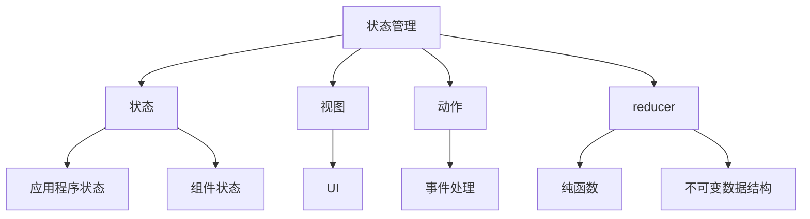
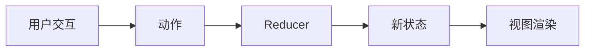

# 【AI大数据计算原理与代码实例讲解】状态管理

## 1. 背景介绍

### 1.1 问题的由来

在现代软件开发中，管理应用程序的状态是一个至关重要的挑战。状态指的是系统在某个时间点的数据和信息的集合。随着应用程序复杂性的增加和用户交互的增多,有效地管理状态变得越来越困难。

传统的状态管理方式通常依赖于手动跟踪和更新状态,这种方式容易出现错误、代码重复和可维护性差的问题。此外,在大规模分布式系统和微服务架构中,跨多个组件共享和同步状态更加棘手。

### 1.2 研究现状  

为了解决状态管理的挑战,近年来出现了许多新的状态管理库和模式,如Redux、MobX、Vuex等。它们提供了可预测的状态管理、单向数据流、中心化存储等特性,简化了状态管理的复杂性。

此外,函数式编程和不可变数据结构的概念也被广泛应用于状态管理中,以提高代码的可维护性和可预测性。

### 1.3 研究意义

有效的状态管理对于构建可靠、高性能和可维护的应用程序至关重要。良好的状态管理实践可以带来以下好处:

1. **代码可维护性**: 通过将状态管理与UI分离,可以提高代码的模块化和可重用性。
2. **可预测性**: 使用单向数据流和不可变数据结构,可以使应用程序的状态变化更加可预测和易于推理。
3. **调试和测试**: 集中式状态管理使得调试和测试变得更加容易,因为状态的变化是可追踪和可重现的。
4. **性能优化**: 通过优化状态更新和渲染,可以提高应用程序的性能。
5. **团队协作**: 统一的状态管理模式有助于团队成员之间的协作和代码共享。

### 1.4 本文结构

本文将深入探讨状态管理的核心概念、算法原理和实现细节。我们将介绍状态管理的背景、常见模式和库,并详细解释其工作原理和数学模型。此外,我们还将提供实际的代码示例和应用场景,以及未来发展趋势和挑战。

通过本文,读者将能够全面了解状态管理的重要性,掌握核心概念和实现技术,并能够在实际项目中有效地应用状态管理模式。

## 2. 核心概念与联系

在深入探讨状态管理的细节之前,我们先来了解一些核心概念及其相互关系。



1. **状态(State)**: 状态是应用程序在某个时间点的数据和信息的集合。它可以分为应用程序级别的状态和组件级别的状态。

2. **视图(View)**: 视图是应用程序的用户界面,它根据当前的状态进行渲染和更新。

3. **动作(Action)**: 动作描述了对状态进行修改的意图,通常由用户交互或其他事件触发。

4. **Reducer**: Reducer是一个纯函数,它接收当前的状态和动作作为输入,并返回新的状态。Reducer负责计算和生成新的状态。

5. **不可变数据结构(Immutable Data Structure)**: 状态管理中通常使用不可变数据结构来存储和操作状态,以确保状态的可预测性和高效性。

6. **单向数据流(Unidirectional Data Flow)**: 状态管理通常遵循单向数据流的模式,即状态的变化只能由动作触发,视图只能根据状态进行渲染,而不能直接修改状态。

这些核心概念共同构建了状态管理的基础架构,它们相互协作,确保了应用程序状态的可预测性和可维护性。

## 3. 核心算法原理 & 具体操作步骤

### 3.1 算法原理概述

状态管理的核心算法原理基于**单向数据流**和**不可变数据结构**的概念。单向数据流确保了状态的变化只能通过明确定义的动作和reducer函数来进行,而不可变数据结构则保证了状态的可预测性和高效性。



1. **用户交互**: 用户与应用程序的交互会触发相应的动作。

2. **动作(Action)**: 动作描述了对状态进行修改的意图,通常包含一个类型和相关数据。

3. **Reducer**: Reducer是一个纯函数,它接收当前的状态和动作作为输入,并根据动作的类型和数据计算出新的状态。

4. **新状态(New State)**: Reducer返回的新状态是不可变的,它代表了应用程序的最新状态。

5. **视图渲染(View Rendering)**: 一旦状态发生变化,视图就会根据新的状态进行重新渲染。

这个过程确保了状态的变化是可预测和可追踪的,同时也提高了代码的可维护性和可测试性。

### 3.2 算法步骤详解

让我们更详细地了解状态管理算法的具体步骤:

1. **初始化状态(Initialize State)**: 在应用程序启动时,需要初始化一个初始状态。这个初始状态可以是一个空对象,也可以是一个包含默认数据的对象。

2. **创建Reducer(Create Reducer)**: Reducer是一个纯函数,它接收当前的状态和动作作为输入,并返回新的状态。Reducer通常使用switch语句或对象字面量的形式来处理不同类型的动作。

```javascript
function reducer(state, action) {
  switch (action.type) {
    case 'INCREMENT':
      return { ...state, count: state.count + 1 };
    case 'DECREMENT':
      return { ...state, count: state.count - 1 };
    default:
      return state;
  }
}
```

3. **创建Store(Create Store)**: Store是一个对象,它管理应用程序的状态。Store通常包含以下几个方法:
   - `getState()`: 获取当前的状态。
   - `dispatch(action)`: 分发一个动作,触发状态的更新。
   - `subscribe(listener)`: 订阅状态的变化,当状态发生变化时,会调用传入的监听函数。

4. **视图订阅状态变化(Subscribe to State Changes)**: 视图需要订阅Store中状态的变化,当状态发生变化时,视图会重新渲染。

5. **分发动作(Dispatch Action)**: 当用户交互或其他事件发生时,需要分发一个动作到Store中。Store会调用Reducer函数计算出新的状态。

6. **状态更新(Update State)**: Store会用Reducer返回的新状态替换当前的状态。

7. **通知视图(Notify Views)**: 一旦状态发生变化,Store会通知所有订阅了状态变化的视图,这些视图会根据新的状态进行重新渲染。

8. **渲染视图(Render Views)**: 视图根据新的状态进行重新渲染,展示最新的UI。

这个过程循环往复,直到应用程序退出。通过这种方式,状态的变化是可预测和可追踪的,同时也提高了代码的可维护性和可测试性。

### 3.3 算法优缺点

状态管理算法具有以下优点:

1. **可预测性**: 由于状态的变化只能通过明确定义的动作和reducer函数进行,因此状态的变化是可预测和可追踪的。

2. **可维护性**: 将状态管理与UI分离,使得代码更加模块化和可重用。

3. **可测试性**: 由于reducer是纯函数,因此可以很容易地对其进行单元测试。

4. **性能优化**: 通过优化状态更新和渲染,可以提高应用程序的性能。

5. **开发者工具**: 许多状态管理库都提供了开发者工具,方便调试和时间旅行。

然而,状态管理算法也存在一些缺点:

1. **学习曲线**: 对于初学者来说,状态管理的概念和模式可能需要一些时间来掌握。

2. **样板代码**: 在一些情况下,状态管理可能会引入一些样板代码,增加了开发的复杂性。

3. **过度使用**: 对于一些简单的应用程序,使用状态管理可能会引入不必要的复杂性。

4. **性能开销**: 虽然状态管理可以提高性能,但在某些情况下,它也可能带来一些性能开销。

5. **不适合所有场景**: 状态管理更适合于复杂的、大规模的应用程序,对于一些小型项目,它可能会显得过于繁重。

### 3.4 算法应用领域

状态管理算法广泛应用于各种类型的应用程序开发,尤其是在以下领域:

1. **单页面应用程序(SPA)**: 在单页面应用程序中,有效的状态管理是必不可少的,因为应用程序的整个状态都存在于浏览器中。

2. **React、Vue、Angular等前端框架**: 许多现代前端框架都提供了状态管理解决方案,如Redux、Vuex、NgRx等。

3. **移动应用程序开发**: 在移动应用程序开发中,状态管理也扮演着重要的角色,确保了应用程序的可维护性和可预测性。

4. **服务器端渲染(SSR)**: 在服务器端渲染的场景下,状态管理可以帮助同步客户端和服务器端的状态。

5. **GraphQL和REST API**: 在与后端API交互时,状态管理可以帮助管理数据的获取、缓存和更新。

6. **游戏开发**: 在游戏开发中,状态管理可以用于管理游戏的状态,如玩家位置、分数等。

7. **物联网(IoT)和实时数据处理**: 在处理实时数据流时,状态管理可以帮助管理和同步设备的状态。

总的来说,无论是在前端、后端还是其他领域,只要涉及到管理复杂的应用程序状态,状态管理算法都可以发挥重要作用。

## 4. 数学模型和公式 & 详细讲解 & 举例说明

在状态管理中,数学模型和公式可以帮助我们更好地理解和分析算法的工作原理。在这一节中,我们将介绍一些常见的数学模型和公式,并通过具体的例子进行详细讲解。

### 4.1 数学模型构建

让我们首先定义一些基本概念和符号:

- $S$: 表示应用程序的状态集合
- $s \in S$: 表示应用程序的某个特定状态
- $A$: 表示可能的动作集合
- $a \in A$: 表示某个特定的动作
- $f: S \times A \rightarrow S$: 表示reducer函数,它接收当前状态和动作作为输入,并返回新的状态

我们可以将状态管理算法建模为一个状态转移系统,其中:

$$
s' = f(s, a)
$$

其中$s'$表示基于当前状态$s$和动作$a$计算得到的新状态。

在实际应用中,状态通常是一个复杂的数据结构,如对象或数组。因此,我们可以将状态表示为一个向量:

$$
s = (s_1, s_2, \ldots, s_n)
$$

其中$s_i$表示状态的第$i$个组成部分。

相应地,reducer函数可以表示为:

$$
f(s, a) = (f_1(s, a), f_2(s, a), \ldots, f_n(s, a))
$$

其中$f_i$表示用于计算第$i$个状态组成部分的reducer函数。

### 4.2 公式推导过程

在状态管理中,我们通常希望确保状态的变化是可预测和可追踪的。为了实现这一点,我们可以引入一些约束条件。

首先,我们要求reducer函数是纯函数,即对于相同的输入,它总是返回相同的输出。这可以用数学语言表示为:

$$
\forall s \in S, \forall a \in A: f(s, a) = f