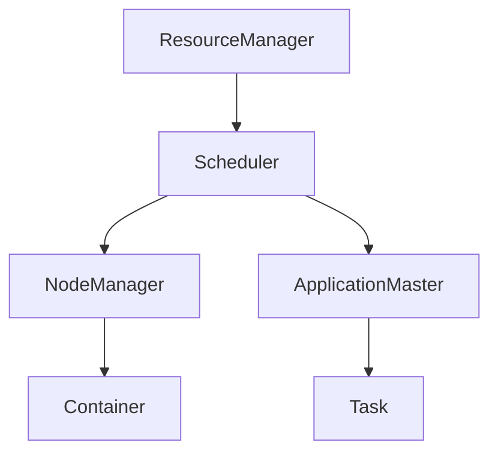

# 【AI大数据计算原理与代码实例讲解】调度器

## 1. 背景介绍

### 1.1 问题的由来

在当今的大数据时代，海量的数据需要被高效地处理和计算。传统的单机计算架构已经无法满足日益增长的计算需求。因此，分布式计算框架应运而生，它能够将计算任务分配到多个计算节点上并行执行，极大地提高了计算效率。然而，如何有效地管理和调度这些分布在不同节点上的任务,以充分利用集群资源、避免资源浪费、保证任务的高效执行,成为了一个亟待解决的关键问题。

### 1.2 研究现状

目前,已有多种调度器算法和框架被提出和应用,例如Apache Hadoop的YARN、Apache Spark的Standalone Scheduler、Apache Mesos等。这些调度器通过不同的策略来管理和分配集群资源,并调度任务的执行。然而,由于应用场景的复杂性和多样性,现有的调度器往往在某些特定场景下表现出色,但在其他场景下可能就效率低下。因此,设计一种通用的、高效的调度算法和框架,仍然是当前研究的热点和难点。

### 1.3 研究意义

高效的调度器对于充分利用集群资源、提高任务执行效率至关重要。合理的调度策略不仅可以最大化集群资源的利用率,而且能够根据任务的优先级、资源需求等因素,为关键任务分配更多资源,确保其高效运行。此外,调度器还需要具备良好的容错能力和扩展性,以应对节点故障和集群规模变化等情况。因此,研究和设计高效、可靠、通用的调度算法和框架,对于构建高性能的大数据计算平台具有重要意义。

### 1.4 本文结构

本文将首先介绍调度器的核心概念,并分析其与其他系统组件之间的关系。接下来,将深入探讨调度器的核心算法原理,包括算法的基本思想、具体操作步骤、优缺点分析等。然后,将构建调度器的数学模型,并推导相关公式,辅以案例分析加深理解。此外,还将提供一个基于开源框架的项目实践,包括开发环境搭建、源代码实现、代码解读等内容。最后,将讨论调度器的实际应用场景、未来发展趋势和面临的挑战。

## 2. 核心概念与联系

调度器(Scheduler)是大数据计算框架中的核心组件之一,它负责管理和调度整个集群的资源,并将计算任务分配到合适的计算节点上执行。调度器与其他组件的关系如下所示:

- **ResourceManager**: 整个集群资源的管理者,它维护了集群的整体资源视图,并与调度器协作完成资源分配。
- **NodeManager**: 每个计算节点上的资源管理代理,它向ResourceManager汇报本节点的资源使用情况,并根据调度器的指令启动或终止容器(Container)。
- **ApplicationMaster**: 每个计算应用程序的管理者,它负责向调度器申请资源,并将任务(Task)分配到获取的容器中执行。
- **Container**: 计算节点上的资源容器,封装了一定数量的CPU、内存等资源,用于运行任务。
- **Task**: 具体的计算任务,由ApplicationMaster分配到容器中执行。

调度器扮演着集群资源管理和任务调度的重要角色。它一方面要根据集群的整体资源状况,合理地将资源分配给不同的应用程序;另一方面,还需要考虑应用程序的优先级、任务之间的依赖关系等因素,将任务灵活调度到合适的计算节点上,以充分利用集群资源、提高任务执行效率。

## 3. 核心算法原理 & 具体操作步骤

### 3.1 算法原理概述

调度器的核心算法主要包括两个部分:资源分配算法和任务调度算法。

**资源分配算法**的主要目标是根据集群的整体资源状况和应用程序的资源需求,合理地将资源分配给不同的应用程序。常见的资源分配策略包括:

- 公平调度(Fair Scheduling): 根据应用程序的权重,按比例分配资源,确保资源的公平使用。
- 容量调度(Capacity Scheduling): 将集群资源划分为多个队列,每个队列被分配一定的资源容量,应用程序按队列提交。
- 优先级调度(Priority Scheduling): 根据应用程序的优先级高低,优先为高优先级应用程序分配资源。

**任务调度算法**的主要目标是将任务调度到合适的计算节点上执行,以充分利用集群资源、缩短任务执行时间。常见的任务调度策略包括:

- 数据本地化(Data Locality): 将任务调度到存储着所需数据的节点上,以减少数据传输开销。
- 负载均衡(Load Balancing): 将任务均匀分配到不同节点,避免某些节点过载而其他节点空闲。
- 任务并行(Task Parallelism): 将可并行的任务分配到不同节点上,以提高总体吞吐量。

### 3.2 算法步骤详解

调度器的工作流程通常包括以下几个主要步骤:

1. **资源发现**: 调度器通过与ResourceManager和NodeManager交互,获取集群的整体资源视图,包括可用的CPU、内存等资源。

2. **应用程序排队**: 当有新的应用程序提交时,调度器会根据资源分配策略(如公平调度、容量调度等),将其加入相应的队列中等待资源分配。

3. **资源分配**: 调度器根据队列中应用程序的优先级、权重等因素,以及当前集群的资源状况,选择一个或多个应用程序,为它们分配资源。

4. **任务调度**: 对于获得资源的应用程序,调度器需要将它的任务调度到合适的计算节点上执行。这里会考虑数据本地化、负载均衡、任务并行等策略。

5. **任务监控**: 调度器会持续监控正在运行的任务,一旦发现任务失败或计算节点故障,就需要重新调度相关任务。

6. **资源回收**: 当任务执行完毕或应用程序结束时,调度器会回收它们占用的资源,以便重新分配给其他应用程序。

这个过程是一个循环的过程,调度器会不断地发现新的资源、分配资源、调度任务、回收资源,从而实现高效的资源利用和任务执行。

### 3.3 算法优缺点

调度算法的优缺点主要体现在以下几个方面:

**优点**:

- 提高集群资源利用率,避免资源浪费
- 根据应用程序的优先级、任务特征等因素进行差异化调度,满足不同场景的需求
- 支持容错和高可用,可以在节点故障时自动重新调度任务
- 良好的扩展性,能够适应集群规模的变化

**缺点**:

- 算法复杂度较高,需要考虑多种因素的权衡
- 可能存在资源FragmentationFragmentation问题,导致资源利用率下降
- 调度开销较大,需要消耗一定的CPU和内存资源
- 不同的调度策略可能会导致不同的公平性和延迟特征

因此,在设计调度算法时,需要权衡不同的目标,如资源利用率、公平性、延迟等,以满足特定场景的需求。同时,还需要注重算法的可扩展性和容错能力,以确保系统的稳定性和高可用性。

### 3.4 算法应用领域

高效的调度算法在多个领域都有广泛的应用,包括但不限于:

- **大数据处理**: 在Apache Hadoop、Apache Spark等大数据计算框架中,调度器负责管理和调度海量的数据处理任务。

- **云计算**: 在云计算环境中,调度器需要将虚拟机或容器等资源调度到物理机上,并根据工作负载的变化动态调整资源分配。

- **科学计算**: 在进行大规模科学计算时,调度器可以将计算任务分配到多个计算节点上并行执行,极大地提高了计算效率。

- **操作系统**: 现代操作系统中的进程调度器需要合理地将CPU时间片分配给不同的进程,以提高CPU利用率和系统响应能力。

- **集群调度**: 除了大数据计算框架之外,调度器也被广泛应用于其他分布式系统中,如Kubernetes集群、Apache Mesos等,用于管理和调度集群资源。

总的来说,无论是在大数据、云计算、科学计算还是操作系统等领域,高效的调度算法都扮演着至关重要的角色,直接影响着系统的性能和资源利用效率。

## 4. 数学模型和公式 & 详细讲解 & 举例说明

为了更好地理解和优化调度器的性能,我们可以构建数学模型,并推导相关公式。在这一过程中,我们将引入一些重要的概念和符号。

### 4.1 数学模型构建

假设我们有一个由 $N$ 个计算节点组成的集群,每个节点 $i$ 拥有 $R_i$ 个资源单位(如CPU核数、内存大小等)。我们将要执行 $M$ 个任务,每个任务 $j$ 需要 $r_j$ 个资源单位。我们的目标是找到一种调度方案,将这些任务分配到不同的节点上执行,同时最小化任务的总执行时间。

我们引入以下符号:

- $x_{ij}$: 一个二元变量,表示任务 $j$ 是否被分配到节点 $i$ 上执行。如果分配,则 $x_{ij}=1$,否则 $x_{ij}=0$。
- $t_j$: 任务 $j$ 的执行时间。
- $p_i$: 节点 $i$ 上所有任务的执行时间之和,即节点 $i$ 的负载。

我们的目标函数可以表示为:

$$\min \max_{1 \leq i \leq N} p_i$$

即最小化所有节点中负载最大的那个节点的负载,以实现负载均衡。同时,我们有以下约束条件:

$$\sum_{i=1}^N x_{ij} = 1, \quad \forall j \in \{1, 2, \ldots, M\}$$

表示每个任务只能被分配到一个节点上执行。

$$\sum_{j=1}^M r_j x_{ij} \leq R_i, \quad \forall i \in \{1, 2, \ldots, N\}$$

表示每个节点上分配的任务所需资源之和不能超过该节点的总资源量。

$$p_i = \sum_{j=1}^M t_j x_{ij}, \quad \forall i \in \{1, 2, \ldots, N\}$$

表示节点 $i$ 的负载等于分配给它的所有任务的执行时间之和。

这个数学模型描述了调度问题的基本框架,我们可以在此基础上进一步添加其他约束条件,如数据本地性、任务优先级等,以满足实际需求。

### 4.2 公式推导过程

接下来,我们将推导一个常用的公式,用于计算任务 $j$ 在节点 $i$ 上的预计执行时间 $t_{ij}$。

假设任务 $j$ 需要处理 $D_j$ 个数据单元,节点 $i$ 上有 $d_{ij}$ 个数据单元是本地的(不需要通过网络传输)。我们引入以下符号:

- $C_i$: 节点 $i$ 的计算能力,可以用CPU频率或其他指标表示。
- $B$: 集群网络的带宽。
- $\alpha$: 计算一个数据单元所需的CPU周期数。
- $\beta$: 通过网络传输一个数据单元所需的时间。

那么,任务 $j$ 在节点 $i$ 上的执行时间 $t_{ij}$ 可以分为两部分:

1. 计算本地数据所需的时间: $\alpha D_j (1 - \frac{d_{ij}}{D_j}) / C_i$
2. 通过网络传输非本地数据所需的时间: $\beta D_j (\