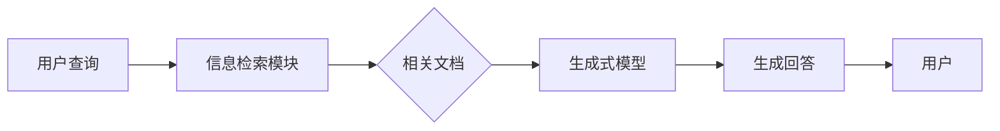

# 【LangChain编程：从入门到实践】RAG技术概述

## 1. 背景介绍
### 1.1 问题的由来
在自然语言处理和信息检索领域，我们经常面临着如何从海量的非结构化文本数据中快速、准确地找到与用户查询相关的信息的挑战。传统的方法通常是先对文本数据进行索引，然后使用关键词匹配或语义相似度计算等技术来检索相关文档。然而，这些方法存在着一些局限性，例如无法处理复杂的自然语言查询，检索结果的相关性和准确性有待提高等。

### 1.2 研究现状
近年来，随着深度学习技术的发展，一种新的检索方法——RAG(Retrieval-Augmented Generation)受到了广泛关注。RAG是一种将信息检索与生成式模型相结合的技术，它利用检索到的相关文档来增强生成式模型的上下文信息，从而生成更加准确、相关的回答。目前，RAG已经在开放域问答、对话生成等任务中取得了优异的性能，展现出了广阔的应用前景。

### 1.3 研究意义
深入研究RAG技术，对于推动自然语言处理和信息检索领域的发展具有重要意义。一方面，RAG为解决复杂自然语言查询和提高检索准确性提供了新的思路和方法；另一方面，RAG技术的应用可以极大地提升各种智能问答系统、对话系统的性能，为用户提供更加智能、高效的信息获取服务。此外，探索RAG技术的原理和实现，也有助于我们更好地理解深度学习在信息检索中的应用，促进人工智能领域的理论研究与技术创新。

### 1.4 本文结构
本文将全面介绍RAG技术的原理、实现和应用。首先，我们将阐述RAG的核心概念和基本架构。然后，重点讲解RAG的核心算法，包括检索模块和生成模块的设计与实现。接下来，我们将通过数学建模和案例分析，深入探讨RAG的内在机制和优化策略。在实践部分，我们将提供RAG的代码实例，并详细解释其实现细节。最后，我们将讨论RAG技术的实际应用场景、未来发展趋势与挑战，为读者提供全面的认识和思考。

## 2. 核心概念与联系
RAG的核心思想是将信息检索与生成式模型相结合，利用检索到的相关文档来增强生成式模型的上下文信息，从而生成更加准确、相关的回答。它主要包括以下几个核心概念：

1. 信息检索(Information Retrieval)：从海量文本数据中找到与查询相关的文档或片段的过程。常用的检索模型有向量空间模型、概率检索模型、语言模型等。

2. 生成式模型(Generative Model)：一种基于深度学习的语言模型，可以根据输入的上下文信息生成连贯、相关的文本。常见的生成式模型有GPT、BART、T5等。

3. 检索增强(Retrieval Augmentation)：利用检索到的相关文档来丰富生成式模型的上下文信息，提高生成结果的准确性和相关性。

4. 端到端训练(End-to-end Training)：将检索模块和生成模块整合到一个统一的框架中，通过联合训练优化整个系统的性能。

这些核心概念之间紧密相连，共同构建了RAG技术的基础。信息检索负责从海量数据中找到与查询相关的文档，为生成式模型提供重要的背景信息。生成式模型基于这些背景信息，生成与查询相关的回答。检索增强则是将两者有机结合，利用检索结果来增强生成式模型的上下文理解能力。端到端训练使得检索模块和生成模块能够相互适应、优化，提升整个系统的性能。

下图展示了RAG技术的基本架构和信息流动：

## 3. 核心算法原理 & 具体操作步骤
### 3.1 算法原理概述
RAG的核心算法由两大模块组成：信息检索模块和生成式模型。信息检索模块负责从海量文本数据中找到与用户查询相关的文档或片段，为生成式模型提供重要的背景信息。生成式模型则基于检索到的文档，生成与查询相关的回答。

### 3.2 算法步骤详解
1. 信息检索：
   - 对文本数据进行预处理，如分词、去停用词、建立倒排索引等。
   - 将用户查询转化为向量表示，如TF-IDF、Word2Vec等。
   - 使用相似度计算方法(如余弦相似度)，找到与查询向量最相似的文档或片段。
   - 返回Top-K个最相关的文档。

2. 生成式模型：
   - 将检索到的文档与用户查询拼接，作为生成式模型的输入。
   - 使用预训练的生成式模型(如GPT、BART)，基于输入的上下文信息生成回答。
   - 对生成的回答进行解码，得到最终的自然语言答案。

3. 端到端训练：
   - 构建RAG的端到端训练框架，将检索模块和生成模块整合到一起。
   - 定义损失函数，如交叉熵损失、强化学习目标等。
   - 使用反向传播算法，联合优化检索模块和生成模块的参数。
   - 不断迭代训练，直到模型收敛或达到预设的性能指标。

### 3.3 算法优缺点
优点：
- 通过检索相关文档，为生成式模型提供了丰富的背景信息，提高了生成结果的准确性和相关性。
- 端到端训练使得检索模块和生成模块能够相互适应、优化，提升整个系统的性能。
- 可以处理开放域的问答任务，具有较强的泛化能力。

缺点：
- 依赖于大规模的预训练语言模型和海量的文本数据，训练成本较高。
- 检索质量对最终的生成结果有较大影响，需要设计高效、准确的检索算法。
- 对于一些复杂的推理任务，仍然存在一定的局限性。

### 3.4 算法应用领域
RAG技术可以应用于多个自然语言处理任务，包括：
- 开放域问答：回答用户提出的各种领域的问题。
- 对话生成：根据对话历史生成相关、连贯的回复。
- 知识库问答：从结构化知识库中检索信息，回答用户查询。
- 文本摘要：生成文档的简明摘要。
- 信息检索：提高传统信息检索系统的查准率和查全率。

## 4. 数学模型和公式 & 详细讲解 & 举例说明
### 4.1 数学模型构建
RAG可以用以下数学模型来表示：

给定一个查询$q$和一个文本语料库$C=\{d_1,d_2,...,d_N\}$，RAG的目标是找到一个答案$a$，使得：

$$a = \arg\max_{a'} P(a'|q,C)$$

其中，$P(a'|q,C)$表示在给定查询$q$和语料库$C$的条件下，生成答案$a'$的概率。

这个概率可以进一步分解为：

$$P(a|q,C) = \sum_{d\in C} P(a|q,d)P(d|q,C)$$

其中，$P(a|q,d)$表示在给定查询$q$和文档$d$的条件下，生成答案$a$的概率，由生成式模型计算；$P(d|q,C)$表示在给定查询$q$和语料库$C$的条件下，检索到文档$d$的概率，由检索模型计算。

### 4.2 公式推导过程
1. 生成式模型：

生成式模型的目标是估计$P(a|q,d)$，即在给定查询$q$和文档$d$的条件下，生成答案$a$的概率。这可以通过最大化以下对数似然函数来实现：

$$\log P(a|q,d) = \sum_{t=1}^T \log P(w_t|w_{<t},q,d)$$

其中，$w_t$表示答案$a$中的第$t$个单词，$w_{<t}$表示在$w_t$之前的所有单词。这个概率可以通过生成式模型(如GPT)来计算。

2. 检索模型：

检索模型的目标是估计$P(d|q,C)$，即在给定查询$q$和语料库$C$的条件下，检索到文档$d$的概率。一种常见的方法是使用余弦相似度：

$$P(d|q,C) \propto \cos(q,d) = \frac{q \cdot d}{||q|| \cdot ||d||}$$

其中，$q$和$d$分别表示查询和文档的向量表示，$\cdot$表示向量点积，$||\cdot||$表示向量的L2范数。

### 4.3 案例分析与讲解
考虑以下示例：

查询$q$："What is the capital of France?"

语料库$C$：
- $d_1$: "Paris is the capital and most populous city of France."
- $d_2$: "France is a country in Europe, with a population of over 67 million."
- $d_3$: "The Eiffel Tower is a famous landmark in Paris, France."

RAG的处理步骤如下：
1. 检索模型计算查询$q$与每个文档的相似度，得到$P(d|q,C)$：
   - $P(d_1|q,C) = 0.8$
   - $P(d_2|q,C) = 0.2$
   - $P(d_3|q,C) = 0.5$

2. 生成式模型基于查询$q$和每个文档$d_i$，生成答案$a_i$，并计算$P(a_i|q,d_i)$：
   - $P(a_1|q,d_1) = 0.9$, $a_1$: "The capital of France is Paris."
   - $P(a_2|q,d_2) = 0.1$, $a_2$: "France is a country in Europe."
   - $P(a_3|q,d_3) = 0.3$, $a_3$: "Paris is the capital of France, where the Eiffel Tower is located."

3. 计算每个答案的总概率$P(a_i|q,C)$：
   - $P(a_1|q,C) = P(a_1|q,d_1)P(d_1|q,C) = 0.9 \times 0.8 = 0.72$
   - $P(a_2|q,C) = P(a_2|q,d_2)P(d_2|q,C) = 0.1 \times 0.2 = 0.02$
   - $P(a_3|q,C) = P(a_3|q,d_3)P(d_3|q,C) = 0.3 \times 0.5 = 0.15$

4. 选择总概率最大的答案作为最终输出：
   $a = \arg\max_{a'} P(a'|q,C) = a_1$

因此，RAG输出的答案是："The capital of France is Paris."

### 4.4 常见问题解答
1. RAG与传统的信息检索方法有何不同？
   - RAG将信息检索与生成式模型相结合，不仅可以找到相关文档，还能生成连贯、自然的答案。传统的信息检索方法通常只返回相关文档，无法直接生成答案。

2. RAG的训练需要哪些数据？
   - RAG的训练需要大规模的文本语料库和相应的查询-答案对。文本语料库用于信息检索和生成式模型的预训练，查询-答案对用于端到端的微调和评估。

3. RAG生成的答案质量如何保证？
   - RAG生成答案的质量主要取决于两个因素：检索质量和生成式模型的性能。可以通过优化检索算法、增大语料库规模、使用更强大的预训练模型等方法来提高答案质量。此外，还可以引入答案重排序、过滤等后处理技术，进一步提升答案的可靠性。

## 5. 项目实践：代码实例和详细解释说明
### 5.1 开发环境搭建
本项目使用Python语言和PyTorch深度学习框架。以下是所需的主要依赖库：
- torch：PyTorch深度学习框架
- transformers：