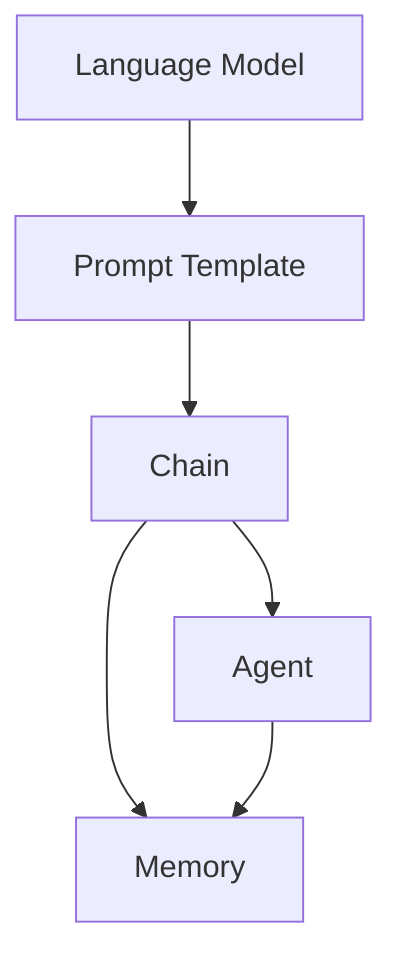

# 【LangChain编程：从入门到实践】stream

## 1. 背景介绍
### 1.1 问题的由来
随着人工智能技术的飞速发展，大语言模型（LLM）在自然语言处理领域取得了突破性进展。然而，如何有效地利用LLM的强大能力来构建实用的应用程序，仍然是一个巨大的挑战。LangChain应运而生，它为开发者提供了一套灵活的工具和框架，用于构建基于LLM的应用程序，极大地简化了开发流程。
### 1.2 研究现状
目前，LangChain已经成为构建LLM应用程序的主流框架之一。越来越多的开发者和研究人员开始关注并使用LangChain进行项目开发和学术研究。然而，由于LangChain是一个相对较新的框架，目前仍缺乏系统性的教程和实践指南，这在一定程度上限制了其推广和应用。
### 1.3 研究意义
深入研究LangChain编程，对于推动LLM技术的应用和发展具有重要意义。通过系统地介绍LangChain的核心概念、算法原理和实践案例，可以帮助更多的开发者快速掌握LangChain编程技能，从而加速LLM应用程序的开发进程。同时，探索LangChain在实际场景中的应用，也有助于发掘LLM技术的新可能性和潜在价值。
### 1.4 本文结构
本文将从以下几个方面对LangChain编程进行深入探讨：
- 介绍LangChain的核心概念与联系
- 详细讲解LangChain的核心算法原理和具体操作步骤
- 构建数学模型并推导相关公式，并通过案例进行分析和讲解
- 提供LangChain项目实践的代码实例和详细解释说明
- 探讨LangChain在实际应用场景中的应用现状和未来展望
- 推荐LangChain相关的学习资源、开发工具和论文
- 总结LangChain的研究成果、未来发展趋势和面临的挑战
- 附录中列出常见问题与解答

## 2. 核心概念与联系
在深入探讨LangChain编程之前，我们需要了解其核心概念及其之间的联系。以下是LangChain的几个关键概念：

- **语言模型（Language Model）**：语言模型是LangChain的核心，它负责对自然语言进行理解和生成。LangChain支持多种主流的语言模型，如GPT-3、BERT等。
- **提示模板（Prompt Template）**：提示模板定义了如何将任务描述转化为语言模型可以理解的输入格式。通过设计合适的提示模板，可以引导语言模型生成所需的输出。
- **链（Chain）**：链是LangChain中的一个重要概念，它将多个组件（如语言模型、提示模板等）组合在一起，形成一个完整的处理流程。链可以是顺序执行的，也可以包含条件判断和循环等控制逻辑。
- **代理（Agent）**：代理是一种特殊的链，它可以根据用户的输入自主决策并执行相应的操作。代理通常包含一个或多个语言模型，以及一组预定义的工具和行动。
- **存储（Memory）**：存储用于在链的不同组件之间传递信息和状态。LangChain提供了多种存储机制，如ConversationBufferMemory、ConversationSummaryMemory等。

下图展示了LangChain核心概念之间的关系：

从图中可以看出，语言模型是LangChain的基础，提示模板将任务描述转化为语言模型的输入。链组合了语言模型、提示模板等组件，形成完整的处理流程。代理是一种特殊的链，具有自主决策和执行能力。存储贯穿于链的各个组件之间，用于信息和状态的传递。

理解这些核心概念之间的联系，对于掌握LangChain编程至关重要。在后续章节中，我们将深入探讨每个概念的原理和应用。

## 3. 核心算法原理 & 具体操作步骤
### 3.1 算法原理概述
LangChain的核心算法主要包括以下几个方面：

1. **语言模型调用**：LangChain通过API调用外部的语言模型服务，如OpenAI的GPT-3，获取生成的自然语言文本。
2. **提示模板渲染**：LangChain使用提示模板将任务描述转化为语言模型可以理解的输入格式。提示模板通常包含固定的文本和变量占位符，变量的值在运行时动态填充。
3. **组件组合与执行**：LangChain将语言模型、提示模板等组件组合成链，并按照预定义的顺序和逻辑执行。链的执行可以是顺序的、条件的或循环的。
4. **代理决策与行动**：对于代理类型的链，LangChain使用语言模型根据用户输入和当前状态进行决策，并选择相应的行动进行执行。行动可以是调用API、访问数据库等。
5. **存储读写**：LangChain在链的执行过程中，通过读写存储来传递和保存状态信息。不同的存储机制适用于不同的场景，如ConversationBufferMemory适用于对话历史的保存。

### 3.2 算法步骤详解
以下是LangChain执行一个典型任务的详细步骤：

1. 定义提示模板：根据任务需求，设计合适的提示模板。提示模板应包含必要的上下文信息和指令，以引导语言模型生成所需的输出。
2. 创建语言模型实例：根据选择的语言模型（如GPT-3），创建相应的API客户端实例，并配置认证信息。
3. 实例化组件：创建提示模板、语言模型等组件的实例，并进行必要的参数配置。
4. 组合组件成链：根据任务的处理流程，将组件组合成一个或多个链。定义链的执行顺序和逻辑。
5. 执行链：将用户输入传递给链，并启动链的执行。链会按照预定义的顺序和逻辑，依次调用语言模型、渲染提示模板、执行行动等。
6. 处理和返回结果：链执行完成后，处理语言模型生成的输出，提取所需的信息，并将结果返回给用户。
7. 更新存储（可选）：如果任务涉及状态的保存和更新，链会在执行过程中读写存储，以维护任务的上下文信息。

### 3.3 算法优缺点
LangChain算法的优点包括：

- 灵活性：LangChain提供了丰富的组件和组合方式，可以灵活地构建各种类型的LLM应用程序。
- 可扩展性：LangChain的组件化设计使得新功能的添加和扩展变得容易。开发者可以根据需求自定义组件和链。
- 易用性：LangChain提供了高层次的抽象和简洁的API，使得开发者可以快速上手并构建应用程序。

LangChain算法的缺点包括：

- 依赖外部服务：LangChain依赖于外部的语言模型服务，如OpenAI的API。这意味着应用程序的性能和可用性受限于外部服务的稳定性和响应速度。
- 成本：调用大型语言模型的API通常需要付费，费用可能会随着应用程序的使用量增加而快速累积。

### 3.4 算法应用领域
LangChain算法可以应用于各种自然语言处理和人工智能领域，包括但不限于：

- 聊天机器人：使用LangChain构建智能聊天机器人，提供个性化的客户服务和支持。
- 内容生成：利用LangChain自动生成文章、新闻摘要、产品描述等各种类型的文本内容。
- 语言翻译：通过LangChain的链式处理，实现高质量的机器翻译系统。
- 知识问答：基于LangChain构建知识库问答系统，回答用户的各种问题。
- 文本分类和情感分析：使用LangChain对文本进行分类和情感分析，用于舆情监测、用户反馈分析等。

## 4. 数学模型和公式 & 详细讲解 & 举例说明
### 4.1 数学模型构建
LangChain中的语言模型通常基于transformer架构，其核心是自注意力机制（self-attention）。自注意力机制允许模型在处理输入序列时，考虑序列中不同位置之间的依赖关系。

给定一个输入序列 $X = (x_1, x_2, ..., x_n)$，自注意力机制的计算过程如下：

1. 将输入序列 $X$ 通过三个线性变换得到查询向量 $Q$、键向量 $K$ 和值向量 $V$：

$$
Q = XW^Q, K = XW^K, V = XW^V
$$

其中，$W^Q, W^K, W^V$ 是可学习的参数矩阵。

2. 计算查询向量 $Q$ 和键向量 $K$ 的注意力分数：

$$
A = \text{softmax}(\frac{QK^T}{\sqrt{d_k}})
$$

其中，$d_k$ 是键向量的维度，用于缩放点积结果。

3. 将注意力分数 $A$ 与值向量 $V$ 相乘，得到加权和：

$$
\text{Attention}(Q, K, V) = AV
$$

通过自注意力机制，模型可以学习输入序列中不同位置之间的相关性，并根据这些相关性对输入进行加权处理。

### 4.2 公式推导过程
下面我们详细推导自注意力机制中的关键公式。

1. 查询向量 $Q$、键向量 $K$ 和值向量 $V$ 的计算：

假设输入序列 $X$ 的维度为 $n \times d$，其中 $n$ 是序列长度，$d$ 是特征维度。线性变换的参数矩阵 $W^Q, W^K, W^V$ 的维度分别为 $d \times d_k, d \times d_k, d \times d_v$，其中 $d_k$ 是查询向量和键向量的维度，$d_v$ 是值向量的维度。

将输入序列 $X$ 与参数矩阵相乘，得到查询向量 $Q$、键向量 $K$ 和值向量 $V$：

$$
Q = XW^Q = \begin{bmatrix}
x_1W^Q \\
x_2W^Q \\
\vdots \\
x_nW^Q
\end{bmatrix}, K = XW^K = \begin{bmatrix}
x_1W^K \\
x_2W^K \\
\vdots \\
x_nW^K
\end{bmatrix}, V = XW^V = \begin{bmatrix}
x_1W^V \\
x_2W^V \\
\vdots \\
x_nW^V
\end{bmatrix}
$$

2. 注意力分数 $A$ 的计算：

查询向量 $Q$ 和键向量 $K$ 的维度都是 $n \times d_k$。将 $Q$ 与 $K$ 的转置相乘，得到 $n \times n$ 的注意力分数矩阵：

$$
QK^T = \begin{bmatrix}
q_1k_1^T & q_1k_2^T & \cdots & q_1k_n^T \\
q_2k_1^T & q_2k_2^T & \cdots & q_2k_n^T \\
\vdots & \vdots & \ddots & \vdots \\
q_nk_1^T & q_nk_2^T & \cdots & q_nk_n^T
\end{bmatrix}
$$

其中，$q_i$ 和 $k_i$ 分别表示 $Q$ 和 $K$ 的第 $i$ 行。

为了缩放点积结果，将 $QK^T$ 除以 $\sqrt{d_k}$，然后应用 softmax 函数得到归一化的注意力分数：

$$
A = \text{softmax}(\frac{QK^T}{\sqrt{d_k}}) = \begin{bmatrix}
a_{11} & a_{12} & \cdots & a_{1n} \\
a_{21} & a_{22} & \cdots & a_{2n} \\
\vdots & \vdots & \ddots & \vdots \\
a_{n1} & a_{n2} & \cdots & a_{nn}
\end{