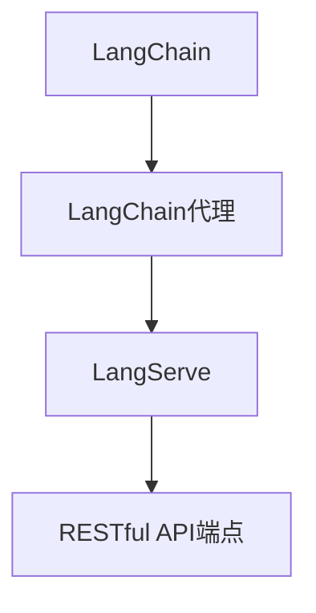

# 【LangChain编程：从入门到实践】使用LangServe提供服务

## 1. 背景介绍

### 1.1 问题的由来

在当今数字化时代，人工智能(AI)和大型语言模型(LLM)的应用越来越广泛。然而,将这些强大的AI模型集成到现有系统和工作流程中仍然是一个挑战。传统的开发方式需要大量的代码和复杂的基础设施,这使得AI集成变得困难和昂贵。

### 1.2 研究现状

为了解决这一问题,LangChain这个Python库应运而生。它提供了一个统一的接口,可以轻松地将各种LLM(如GPT、BERT等)集成到应用程序中。LangChain不仅支持常见的LLM,还支持其他AI服务,如Wolfram Alpha、Wikipedia和Python REPL等。

然而,即使有了LangChain,将AI模型部署到生产环境中仍然是一个挑战。开发人员需要处理服务器配置、负载平衡、监控等复杂的基础设施问题。这就是LangServe的用武之地。

### 1.3 研究意义

LangServe是一个轻量级的服务器,它可以轻松地将LangChain代理(agents)作为RESTful API端点公开。通过LangServe,开发人员可以快速将AI模型部署到生产环境中,而无需担心底层基础设施的复杂性。

LangServe的出现为AI模型的实际应用带来了巨大的便利。它使得将AI集成到现有系统和工作流程中变得前所未有的简单。无论是构建智能助手、自动化任务还是增强现有应用程序,LangServe都可以发挥重要作用。

### 1.4 本文结构

本文将全面介绍如何使用LangServe将LangChain代理作为服务提供。我们将从LangChain和LangServe的基本概念开始,然后深入探讨如何构建和部署LangChain代理。接下来,我们将介绍LangServe的架构和工作原理,并提供实际的代码示例和用例。最后,我们将讨论LangServe的未来发展方向和潜在挑战。

## 2. 核心概念与联系

在深入探讨LangServe之前,让我们先了解一些核心概念。

**LangChain**是一个Python库,它旨在简化大型语言模型(LLM)的应用程序开发。它提供了一个统一的接口,可以轻松地将各种LLM集成到应用程序中。LangChain支持多种LLM,包括GPT、BERT、Claude等,以及其他AI服务,如Wolfram Alpha、Wikipedia和Python REPL。

**LangChain代理(Agent)**是LangChain的核心概念之一。代理是一种特殊的LangChain链,它可以根据给定的目标和工具自主地规划和执行任务。代理可以被视为一个智能助手,它可以理解自然语言指令,并利用各种工具(如搜索引擎、计算器、Python函数等)来完成任务。

**LangServe**是一个轻量级的服务器,它可以将LangChain代理作为RESTful API端点公开。通过LangServe,开发人员可以轻松地将AI模型部署到生产环境中,而无需担心底层基础设施的复杂性。LangServe支持多种部署选项,包括本地部署、Docker容器部署和云部署。

LangChain、LangChain代理和LangServe之间的关系如下所示:

1. LangChain提供了一个统一的接口,用于集成各种LLM和AI服务。
2. LangChain代理是一种特殊的LangChain链,它可以根据给定的目标和工具自主地规划和执行任务。
3. LangServe将LangChain代理作为RESTful API端点公开,使其可以被其他应用程序和系统轻松访问和集成。

通过将LangChain、LangChain代理和LangServe结合起来,开发人员可以轻松地将强大的AI模型集成到应用程序中,并将其部署到生产环境中。

## 3. 核心算法原理 & 具体操作步骤

### 3.1 算法原理概述

LangChain代理的核心算法原理是**基于目标规划(Goal-Oriented Planning)**。目标规划是一种人工智能规划算法,它旨在找到一系列操作(即计划)来实现给定的目标。

在LangChain代理的情况下,目标是用户提供的自然语言指令。代理需要理解这个指令,并规划出一系列操作来完成该任务。这些操作可能涉及调用各种工具,如搜索引擎、计算器、Python函数等。

LangChain代理使用一种称为**决策网络(Decision Network)**的技术来实现目标规划。决策网络是一种基于规则的系统,它由一组规则和一个推理引擎组成。这些规则定义了在给定条件下应该执行哪些操作。

决策网络的工作原理如下:

1. 代理接收用户的自然语言指令作为输入。
2. 推理引擎根据当前状态和规则集,推断出下一步应该执行哪些操作。
3. 代理执行推断出的操作,可能涉及调用各种工具。
4. 代理根据操作的结果更新当前状态。
5. 重复步骤2-4,直到达成目标或无法继续执行。

决策网络的优点是它可以处理复杂的任务,并且具有很好的可解释性。开发人员可以定义自己的规则集,使代理能够执行特定的任务。同时,决策网络也有一些局限性,例如规则集的维护和扩展可能会变得复杂。

### 3.2 算法步骤详解

让我们更详细地了解LangChain代理的目标规划算法是如何工作的。

1. **输入处理**:代理首先需要理解用户的自然语言指令。这通常涉及自然语言处理(NLP)技术,如分词、词性标注、命名实体识别等。LangChain提供了多种NLP工具,如SpaCy、NLTK等,可以帮助代理更好地理解输入。

2. **目标识别**:代理需要从用户的指令中识别出目标。目标可以是一个具体的任务,如"预订一张从纽约到旧金山的机票",也可以是一个更抽象的目标,如"帮助我规划一次旅行"。

3. **工具选择**:代理需要确定哪些工具可以帮助实现目标。LangChain支持各种工具,如搜索引擎(Google、Bing等)、计算器、Python REPL、Wikipedia等。代理可以根据目标和当前状态,选择最合适的工具。

4. **操作规划**:代理需要规划出一系列操作来实现目标。这些操作可能涉及调用选定的工具,也可能只是简单的数据处理或状态更新。操作的规划是基于决策网络的规则集进行的。

5. **操作执行**:代理执行规划出的操作。如果操作涉及调用工具,代理会与相应的工具进行交互,获取结果。

6. **状态更新**:代理根据操作的结果更新当前状态。状态可能包括已完成的子任务、收集到的信息等。

7. **目标检查**:代理检查当前状态是否满足目标。如果满足,则任务完成;否则,回到步骤4,继续规划和执行操作。

8. **输出生成**:如果任务完成,代理需要将结果以自然语言的形式输出给用户。这可能涉及自然语言生成(NLG)技术。

上述步骤可以通过一个简单的示例来说明:

假设用户的指令是"我想预订一张从纽约到旧金山的机票"。

1. 代理理解这个指令,识别出目标是"预订机票"。
2. 代理选择使用航空公司网站和旅行网站作为工具。
3. 代理规划出以下操作:
   a. 搜索航空公司网站,获取从纽约到旧金山的航班信息。
   b. 搜索旅行网站,比较价格和航班时间。
   c. 选择最合适的航班并预订机票。
4. 代理执行规划出的操作,调用相应的工具。
5. 代理根据操作的结果更新状态,例如已获取的航班信息、比较结果等。
6. 代理检查当前状态是否满足目标。如果已成功预订机票,则任务完成。
7. 代理将预订结果以自然语言的形式输出给用户。

通过这个示例,我们可以看到LangChain代理是如何利用目标规划算法来自主完成任务的。决策网络的规则集定义了在不同情况下应该执行哪些操作,而代理则根据这些规则来规划和执行操作。

### 3.3 算法优缺点

LangChain代理的目标规划算法具有以下优点:

1. **灵活性**:代理可以根据不同的目标和工具动态规划操作,具有很强的灵活性。
2. **可解释性**:决策网络的规则集使得代理的决策过程具有很好的可解释性,方便开发人员理解和调试。
3. **可扩展性**:开发人员可以定义自己的规则集,使代理能够执行特定的任务。
4. **复杂任务处理**:算法可以处理复杂的任务,将其分解为多个子任务,并协调执行。

同时,该算法也存在一些缺点:

1. **规则集维护**:随着任务复杂度的增加,规则集的维护和扩展可能会变得困难。
2. **性能瓶颈**:在处理大规模数据或计算密集型任务时,算法可能会遇到性能瓶颈。
3. **知识库依赖**:算法的效果在很大程度上依赖于所使用的工具和知识库的质量和覆盖范围。
4. **上下文理解**:算法可能难以很好地理解和利用上下文信息,导致决策不够准确。

### 3.4 算法应用领域

LangChain代理的目标规划算法可以应用于各种领域,包括但不限于:

1. **智能助手**:代理可以作为智能助手,帮助用户完成各种任务,如预订机票、安排会议、查找信息等。
2. **自动化流程**:代理可以用于自动化各种流程,如数据处理、报告生成、客户服务等。
3. **决策支持系统**:代理可以作为决策支持系统,帮助用户做出明智的决策。
4. **教育和学习**:代理可以用作智能教学助手,为学生提供个性化的学习体验。
5. **科研和发现**:代理可以帮助科学家和研究人员进行文献检索、数据分析和新发现。
6. **创作和内容生成**:代理可以用于辅助创作,如写作、设计、音乐创作等。

总的来说,LangChain代理的目标规划算法为各种AI应用提供了一种灵活和可扩展的解决方案。

## 4. 数学模型和公式 & 详细讲解 & 举例说明

虽然LangChain代理的目标规划算法主要是基于规则和推理,但它也可以与数学模型和公式相结合,以提高决策的准确性和效率。

### 4.1 数学模型构建

在某些情况下,我们可以使用数学模型来描述和优化目标规划过程。例如,我们可以将目标规划问题建模为一个**马尔可夫决策过程(Markov Decision Process, MDP)**。

MDP是一种用于描述序列决策问题的数学框架。它由以下几个要素组成:

- **状态集合 $\mathcal{S}$**:代表系统可能处于的所有状态。
- **动作集合 $\mathcal{A}$**:代表代理可以执行的所有操作。
- **转移概率 $P(s' \mid s, a)$**:代表在状态 $s$ 下执行动作 $a$ 后,转移到状态 $s'$ 的概率。
- **奖励函数 $R(s, a, s')$**:代表在状态 $s$ 下执行动作 $a$ 并转移到状态 $s'$ 时获得的奖励。
- **折扣因子 $\gamma \in [0, 1)$**:用于平衡即时奖励和长期奖励的权重。

在LangChain代理的情况下,我