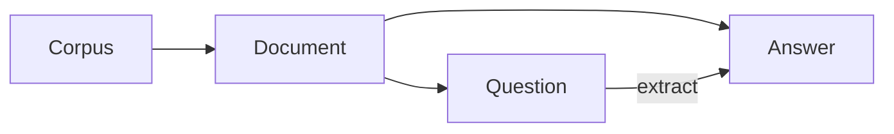

# 【LangChain编程：从入门到实践】基于文档问答场景

## 1. 背景介绍

### 1.1 问题的由来

在当今信息爆炸的时代,我们每天都会接触到海量的文本数据,如何从这些数据中快速、准确地获取我们需要的信息,成为了一个亟待解决的问题。传统的关键词检索方式已经无法满足人们日益增长的信息需求,更加智能、高效的信息获取方式势在必行。

### 1.2 研究现状

近年来,随着人工智能技术的飞速发展,基于深度学习和自然语言处理的问答系统受到了学术界和工业界的广泛关注。一些大型科技公司如谷歌、微软、亚马逊等纷纷推出了自己的智能问答助手,如Google Assistant、Siri、Alexa等。这些系统能够理解用户的自然语言查询,并从海量数据中快速检索出相关信息,极大地提高了人们获取信息的效率。

在学术界,研究者们提出了各种新颖的问答模型和算法,如基于知识图谱的问答[1]、基于阅读理解的问答[2]、基于对话的问答[3]等。这些方法从不同角度提高了问答系统的性能,推动了该领域的发展。

### 1.3 研究意义

尽管目前的问答系统已经取得了长足的进步,但在实际应用中仍然存在一些局限性。比如,大多数系统只能处理通用领域的问题,对于特定领域的专业问题,准确率还有待提高。此外,现有系统大多采用端到端的黑盒模型,可解释性较差,用户难以理解系统给出答案的原因。

因此,本文尝试利用LangChain这一新兴的自然语言处理框架,针对特定领域的文档数据构建问答系统。LangChain提供了一系列灵活的工具和组件,可以帮助开发者快速搭建和定制适合自己需求的应用。本文将详细介绍基于LangChain实现文档问答系统的整个流程,包括数据处理、索引构建、问题理解、答案抽取等关键步骤,力求为该领域的研究和应用提供新的思路。

### 1.4 本文结构

本文后续章节安排如下:第2节介绍文档问答涉及的一些核心概念;第3节重点讲解问答系统的核心算法原理和具体操作步骤;第4节给出算法涉及的数学模型和公式推导过程;第5节通过一个完整的代码实例,演示如何使用LangChain实现一个文档问答系统;第6节讨论该系统的实际应用场景;第7节推荐一些相关的学习资源和开发工具;第8节对全文进行总结,并展望未来的研究方向;第9节的附录部分解答一些常见问题。

## 2. 核心概念与联系

要实现一个文档问答系统,我们首先需要了解几个核心概念:

- 文档(Document):包含答案信息的文本材料,可以是一篇文章、一本书、一份报告等。
- 问题(Question):用户以自然语言形式提出的查询需求。
- 答案(Answer):系统根据问题从文档中抽取出的相关信息,可以是一个词、一句话,也可以是若干句话组成的一个片段。
- 语料库(Corpus):由一系列文档组成的大规模文本集合。

这些概念之间的关系可以用下图表示:



可以看出,文档问答的核心是从语料库中找到包含答案信息的相关文档,然后根据问题从文档中抽取出准确的答案。这个过程涉及文本表示、文本匹配、信息抽取等一系列自然语言处理技术。

## 3. 核心算法原理 & 具体操作步骤

### 3.1 算法原理概述

基于LangChain实现文档问答,主要涉及以下几个步骤:

1. 将原始文档切分成若干段落或句子,构建文档库
2. 对每个段落或句子进行向量化表示
3. 利用向量搜索算法,为用户问题在文档库中找到最相关的若干个段落
4. 对这些相关段落进行进一步的细粒度匹配,定位到最可能包含答案的片段
5. 结合问题和候选片段,利用阅读理解模型抽取出最终答案

下面我们对每个步骤进行更详细的说明。

### 3.2 算法步骤详解

#### 3.2.1 文档库构建

首先,我们需要将原始文档切分成一个个段落或句子,每个段落或句子称为一个文档块(Document Chunk)。文档块的划分需要兼顾信息的完整性和独立性,既不能太长导致包含无关信息,也不能太短导致语义不完整。一般可以利用句号、分段符等标点符号进行切分。

LangChain提供了一些现成的文档加载器(Document Loader),可以方便地将不同格式的文档(如txt、pdf、docx等)转换成文档对象。例如:

```python
from langchain.document_loaders import TextLoader
loader = TextLoader('example.txt')
documents = loader.load()
```

#### 3.2.2 文档块向量化

得到文档块后,需要将它们转换成计算机可以理解的数值形式,即向量。常见的方法是利用预训练的语言模型,如BERT、RoBERTa等,对文档块进行编码。这些语言模型在大规模语料上进行了预训练,可以将文本映射到一个高维语义空间,使得语义相似的文本在该空间中距离更近。

LangChain封装了一些主流的向量化模型,如OpenAI的text-embedding-ada-002。使用方法如下:

```python
from langchain.embeddings import OpenAIEmbeddings
embeddings = OpenAIEmbeddings()
text = "This is a test document."
query_result = embeddings.embed_query(text)
doc_result = embeddings.embed_documents([text])
```

#### 3.2.3 向量搜索

一旦得到了文档块的向量表示,就可以利用向量搜索算法,为用户问题快速找到最相关的文档块。常见的向量搜索算法包括KDTree、Annoy、HNSW等,它们通过构建索引,实现了高效的相似度计算和排序。

LangChain集成了这些常用的向量搜索工具,提供了统一的接口。例如,利用FAISS进行向量搜索:

```python
from langchain.vectorstores import FAISS
db = FAISS.from_documents(documents, embeddings)
docs = db.similarity_search("What is the capital of France?", k=4)
```

#### 3.2.4 细粒度匹配

通过向量搜索得到的文档块包含了问题的相关信息,但一般较长,还需要进一步缩小答案的范围。这里可以利用一些细粒度的文本匹配算法,如TF-IDF、BM25等,对问题和文档块进行更精细的相关性计算,找出最可能包含答案的片段。

以TF-IDF为例,可以用sklearn库快速实现:

```python
from sklearn.feature_extraction.text import TfidfVectorizer
from sklearn.metrics.pairwise import cosine_similarity

vectorizer = TfidfVectorizer()
question = "What is the capital of France?"
paragraphs = [p.page_content for p in docs] 
X = vectorizer.fit_transform(paragraphs + [question])
similarities = cosine_similarity(X[-1], X[:-1])
most_similar_paragraph_index = similarities.argmax()
```

#### 3.2.5 答案抽取

最后一步是从匹配到的片段中抽取出精准的答案。这里可以利用一些阅读理解模型,如BERT-QA、DistilBERT-QA等。这些模型接受问题和上下文片段作为输入,通过在片段中定位答案的起始位置和结束位置,直接给出自然语言形式的答案。

LangChain同样集成了一些主流的阅读理解模型,使用起来非常方便:

```python
from langchain.chains.question_answering import load_qa_chain
from langchain.llms import OpenAI

chain = load_qa_chain(OpenAI(temperature=0), chain_type="stuff")
query = "What is the capital of France?"
docs = [Document(page_content=paragraphs[most_similar_paragraph_index])]
result = chain({"input_documents": docs, "question": query}, return_only_outputs=True)
print(result['output_text'])
```

以上就是利用LangChain实现文档问答系统的主要步骤。LangChain提供的各种工具和模块,极大地降低了开发难度,使得我们可以快速搭建一个强大的问答系统。

### 3.3 算法优缺点

基于LangChain的文档问答算法具有以下优点:

- 借助预训练语言模型,可以处理海量异构文档,不受文档格式限制。
- 利用向量搜索和文本匹配技术,在速度和精度上达到了很好的平衡。
- 通过阅读理解模型直接生成自然语言答案,无需人工定义复杂的规则和模板。
- 使用LangChain框架,开发流程简洁、模块化,适合快速迭代和定制。

同时,该算法也存在一些局限性:

- 对于一些复杂的推理型问题,仍然难以给出令人满意的答案。
- 语言模型和阅读理解模型的训练需要大量计算资源,对硬件要求较高。
- 模型生成的答案可能存在事实性错误,需要人工审核。
- 对于一些私有领域的专业文档,缺乏高质量的预训练模型,需要额外的领域适应。

### 3.4 算法应用领域

基于文档的问答系统在很多领域都有广泛应用,比如:

- 智能客服:用户可以直接用自然语言提问,系统自动给出答案,减少人工服务成本。
- 个人助理:根据用户的问题,从个人笔记、文档、邮件等资料中找到所需信息。
- 医疗助手:医生可以快速查询病例、药品说明书、诊疗指南等医学文献。
- 法律顾问:律师可以方便地从海量法律文件中找到相关案例和法条。
- 教育助手:学生可以通过提问从教科书、讲义、笔记等学习资料中获取知识点。

随着技术的不断发展,文档问答系统必将在更多领域发挥重要作用,成为人们获取知识的得力助手。

## 4. 数学模型和公式 & 详细讲解 & 举例说明

### 4.1 数学模型构建

文档问答系统涉及的核心数学模型主要包括:

1. 向量空间模型(Vector Space Model):将文本表示成向量形式,通过向量之间的距离(如余弦相似度)来度量文本相似性。
2. TF-IDF模型(Term Frequency-Inverse Document Frequency):一种经典的文本表示方法,综合考虑了词语在文档中的频率和在语料库中的稀疏程度。
3. BM25模型(Best Match 25):一种改进的文本相关性计算模型,在TF-IDF的基础上引入了文档长度因子和调优参数。
4. Transformer模型:一种基于自注意力机制的深度学习模型,被广泛用于各种自然语言处理任务。

下面我们重点介绍TF-IDF模型和Transformer模型的数学原理。

### 4.2 公式推导过程

#### 4.2.1 TF-IDF模型

TF-IDF是一种用于评估词语在文档中重要性的统计方法。它由两部分组成:

- TF(Term Frequency):衡量词语t在文档d中出现的频率。

$$
TF(t,d) = \frac{f_{t,d}}{\sum_{t'\in d} f_{t',d}}
$$

其中,$f_{t,d}$表示词语t在文档d中出现的次数,$\sum_{t'\in d} f_{t',d}$表示文档d中所有词语出现的次数之和。

- IDF(Inverse Document Frequency):衡量词语t在整个语料库中的稀疏程度。

$$
IDF(t) = \log \frac{N}{n_t+1}
$$

其中,N表示语料库中文档的总数,n_t表示包含词语t的文档数。

将TF和IDF相乘,就得到了词语t在文档d中的TF-IDF权重:

$$
TFIDF(t,d) = TF(t,d) \times IDF(t)
$$

直观地理解,TF-IDF的含