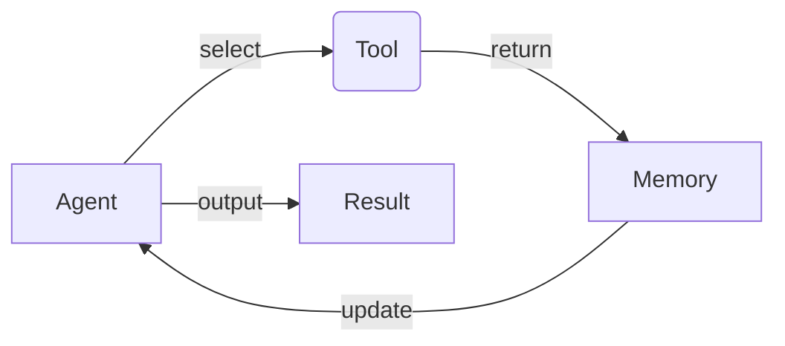

下面是以《LangChain编程：从入门到实践》为标题的技术博客文章正文内容：

# 【LangChain编程：从入门到实践】基于文档问答场景

## 1. 背景介绍

### 1.1 问题的由来

在当今信息时代,海量的非结构化文本数据随处可见,如新闻报道、技术文档、法律合同等。对这些文本数据进行智能化处理和分析,提取有价值的信息,一直是人工智能领域的重要挑战。传统的信息检索方法往往需要用户精确地输入查询关键词,且只能返回匹配的文档片段,无法直接回答用户的具体问题。因此,构建一个智能问答系统,能够理解自然语言的问题,在文档中精确定位相关信息,并生成人类可读的答复,具有重要的理论和应用价值。

### 1.2 研究现状  

近年来,benefiting from the rapid development of大模型(large language model, LLM)和自然语言处理(NLP)技术,智能问答系统取得了长足进展。LLM模型通过在海量语料上预训练,掌握了丰富的语义知识和推理能力,能够生成高质量的自然语言回复。同时,一些优秀的开源项目如Haystack、FARM等,提供了构建问答系统的工具集。但这些系统通常需要大量的数据标注、模型微调等工作,对普通开发者来说门槛较高。

### 1.3 研究意义

LangChain是一个新兴的开源框架,旨在简化LLM模型在各种下游任务中的应用开发。它将LLM视为"constituentent part",通过链式调用的方式,将LLM无缝集成到数据处理、知识检索等流程中,大大降低了开发难度。基于LangChain构建问答系统,可以充分利用LLM的语义理解和生成能力,同时避免了繁琐的数据标注和模型训练过程,是一种高效的解决方案。本文将全面介绍如何使用LangChain框架,快速构建一个面向文档的智能问答系统。

### 1.4 本文结构 

本文首先介绍LangChain的核心概念,如Agent、Tool、Memory等,并解释它们在问答系统中的作用。接下来,详细阐述问答系统的核心算法思路,包括文档分块、相关性计算、问题解码、答案生成等环节。然后通过数学建模,对算法的关键步骤进行理论分析。在此基础上,给出了一个基于Python和LangChain的代码实现示例,并对关键模块进行了解读。最后,讨论了该系统在实际场景中的应用前景,以及未来可能的发展方向和挑战。

## 2. 核心概念与联系

LangChain的核心思想是将LLM视为一个"智能代理"(Agent),通过与各种外部工具(Tool)交互,完成复杂的任务。这里的"工具"可以是文档数据、知识库、Web API等。Agent根据当前状态和记忆(Memory),选择合适的Tool调用,获取所需信息,并由LLM生成最终输出。

在文档问答场景中:
- Agent即LLM模型,如GPT
- Tool包括文档数据加载器、文本分块器、相关性评分器等
- Memory则用于存储中间结果和上下文信息

Agent通过与这些Tool交互,从文档中提取相关信息,并最终生成对问题的答复。在这个过程中,LangChain提供了诸多开箱即用的Tool,大大简化了系统的构建过程。

## 3. 核心算法原理与具体操作步骤

### 3.1 算法原理概述

基于LangChain的文档问答系统的核心算法流程如下:

1. 文档分块(Document Chunking): 将长文档拆分为多个小块,以适应LLM的输入限制
2. 相关性计算(Relevance Scoring): 对每个文档块与问题的相关性打分
3. 问题解码(Question Decoding): 分析问题的语义,确定所需的答复形式
4. 答案生成(Answer Generation): LLM根据相关文档块生成最终答复

这种分而治之的方法,使得LLM只需关注局部文本,从而降低了计算复杂度,提高了效率。同时,LangChain提供了多种内置的分块策略、相关性评分器和LLM模型,用户可以根据实际需求进行组合和配置。

### 3.2 算法步骤详解

1. **文档分块**

长文档无法直接输入LLM,因此需要先进行分块。常用的分块策略有:

- 长度分块(Length-based Chunking): 根据字符数或Token数将文档切分为长度相等的块
- 语义分块(Semantic Chunking): 利用NLP工具(如句子边界检测)将文档切分为语义相对完整的段落
- 层次分块(Hierarchical Chunking): 先按长度切分为大块,再对每个大块进行语义分块

不同策略的效果会有所差异,需要根据具体数据特点选择合适的方法。

2. **相关性计算**

对于每个文档块,需要计算其与问题的相关程度,作为后续答案生成的重要参考。常用的相关性评分方法有:

- 词袋模型(Bag-of-Words): 统计问题与文档块中词语的重叠程度
- 词嵌入相似度(Word Embedding Similarity): 计算问题与文档块的词嵌入向量之间的相似性(如余弦相似度)  
- LLM语义打分(LLM Semantic Scoring): 利用LLM模型直接对问题-文档块对的语义相关性打分

其中,LLM语义打分虽然计算代价较高,但精度最佳。LangChain支持以上所有评分器,并提供了无缝切换的接口。

3. **问题解码**

不同的问题对应需要不同形式的答复,如:

- 抽取式(Extractive): 直接从文档中抽取一个片段作为答案
- 生成式(Generative): 根据文档内容,由LLM生成一个新的自然语言答复  
- 反事实(Counterfactual): 推理一个与文档不同的答案
- ...

LangChain中的`QuestionAnswerPrompt`模块能够分析问题的语义,确定所需的答复形式,并相应地调整LLM的Prompt,以获得更准确的输出。

4. **答案生成**

在前面步骤的基础上,LLM将问题、相关文档块以及所需答复形式作为输入,生成最终的答复。这里可以使用LangChain提供的各种LLM模型,如GPT、PALM、ChatGPT等。

值得注意的是,LangChain支持在答案生成过程中引入人类反馈(Human Feedback),以进一步提高LLM输出的质量和一致性。

### 3.3 算法优缺点

优点:

- 模块化设计,高度可扩展
- 开箱即用,降低了开发难度  
- 充分利用了LLM的语义理解和生成能力
- 支持人机交互,可持续提高输出质量

缺点:  

- 依赖LLM模型,计算成本较高
- 对长文档的处理效率有待提高  
- 答复的一致性和可靠性仍是挑战
- 缺乏对因果推理等复杂任务的支持

### 3.4 算法应用领域

基于LangChain的文档问答系统可以广泛应用于:

- 智能客服: 快速响应用户提问
- 企业知识库: 支持内部知识检索和问答
- 法律研究: 从大量案例文书中查找证据线索
- 新闻智能: 自动生成时事新闻摘要和解读
- 教育辅助: 根据教材内容解答学生提问
- ...

总的来说,任何涉及大量非结构化文本的领域,都可以考虑引入该类问答系统,以提高信息获取和知识利用的效率。

## 4. 数学模型和公式详细讲解举例说明

在文档问答系统的核心算法中,相关性计算是一个关键环节。我们将使用向量空间模型(Vector Space Model)对其进行理论建模和分析。

### 4.1 数学模型构建  

令$q$表示问题的词袋向量(bag-of-words vector), $d_i$表示第$i$个文档块的词袋向量,则它们的相关性打分可以定义为:

$$\text{score}(q, d_i) = \cos(q, d_i) = \frac{q \cdot d_i}{\|q\| \|d_i\|}$$

其中$\cos(\cdot)$表示余弦相似度。

为了克服词袋模型的缺陷(如词义丢失),我们可以使用词嵌入向量(word embedding vector)替代词袋向量:

$$\begin{aligned}
\vec{q} &= \sum_{w \in q} \vec{w} \\
\vec{d_i} &= \sum_{w \in d_i} \vec{w}
\end{aligned}$$

其中$\vec{w}$表示词$w$的词嵌入向量。相关性打分公式保持不变:

$$\text{score}(q, d_i) = \cos(\vec{q}, \vec{d_i})$$

进一步地,我们可以使用LLM模型直接对问题-文档块对的语义相关性打分,这种方法的精度最高,但计算代价也最大。

### 4.2 公式推导过程

我们将推导词嵌入向量的相关性打分公式。首先定义词袋向量:

$$\begin{aligned}
q &= (q_1, q_2, \ldots, q_V) \\
d_i &= (d_{i1}, d_{i2}, \ldots, d_{iV})
\end{aligned}$$

其中$V$是词汇表大小,$q_j$和$d_{ij}$分别表示词$j$在问题和文档块$i$中的词频。

根据向量空间模型,相关性打分可以表示为:

$$\begin{aligned}
\text{score}(q, d_i) &= \sum_{j=1}^V q_j \cdot d_{ij} \\
&= \sum_{j=1}^V \left( \sum_{w \in q} \mathbb{1}_{w=j} \right) \left( \sum_{w \in d_i} \mathbb{1}_{w=j} \right) \\
&= \sum_{w \in q} \sum_{w' \in d_i} \mathbb{1}_{w=w'} \\
&= \vec{q} \cdot \vec{d_i}
\end{aligned}$$

其中$\mathbb{1}_{w=j}$是指示函数,当$w=j$时值为1,否则为0。$\vec{q}$和$\vec{d_i}$即为词嵌入向量的定义形式。

将其代入余弦相似度公式,我们得到了词嵌入向量的相关性打分公式。

### 4.3 案例分析与讲解

现在让我们用一个具体的例子来分析上述公式。假设:

- 问题为"什么是机器学习?",词袋向量为$q = (1, 1, 0, \ldots)$
- 文档块1为"机器学习是一种数据分析方法...",$d_1 = (1, 1, 1, \ldots)$ 
- 文档块2为"深度学习是机器学习的一个分支...",$d_2 = (1, 1, 0, \ldots)$

我们计算各向量的模长:

$$\begin{aligned}
\|q\| &= \sqrt{1^2 + 1^2} = \sqrt{2} \\
\|d_1\| &= \sqrt{1^2 + 1^2 + 1^2 + \cdots} = \sqrt{3} \\  
\|d_2\| &= \sqrt{1^2 + 1^2} = \sqrt{2}
\end{aligned}$$

则相关性打分为:

$$\begin{aligned}
\text{score}(q, d_1) &= \frac{q \cdot d_1}{\|q\| \|d_1\|} = \frac{1 \times 1 + 1 \times 1}{\sqrt{2} \sqrt{3}} \approx 0.63 \\
\text{score}(q, d_2) &= \frac{q \cdot d_2}{\|q\| \|d_2\|} = \frac{1 \times 1 + 1 \times 1}{\sqrt{2} \sqrt{2}} = 1
\end{aligned}$$

可以看出,文档块2与问题的相关性更高,这是因为它不仅包含了"机器学习"这个词,还提到了"深度学习"这个相关概念。

### 4.4 常见问题解答