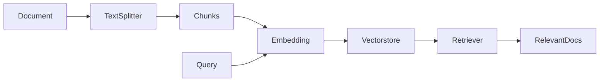

# 【LangChain编程：从入门到实践】文档检索过程

作者：禅与计算机程序设计艺术 / Zen and the Art of Computer Programming

## 1. 背景介绍
### 1.1 问题的由来
随着人工智能技术的快速发展,自然语言处理(NLP)正在成为一个越来越重要的研究领域。在NLP中,文档检索是一个关键任务,它旨在从大规模文档集合中快速准确地找到与用户查询相关的文档。传统的文档检索方法主要基于关键词匹配,但这些方法往往难以捕捉文本的语义信息,导致检索结果的相关性和准确性不够理想。

### 1.2 研究现状
近年来,随着深度学习技术的兴起,一些研究者开始探索利用神经网络模型来改进文档检索的性能。其中,基于Transformer架构的语言模型如BERT、GPT等,由于其强大的语义理解和语境建模能力,在多个NLP任务上取得了显著的效果提升。这启发人们尝试将其应用到文档检索任务中。

LangChain是一个基于语言模型的文档检索开源框架,它利用了先进的NLP技术,为用户提供了一套简洁灵活的API,可以方便地实现端到端的语义检索流程。越来越多的开发者和研究者开始关注并使用LangChain进行文档检索应用的开发。

### 1.3 研究意义
探索如何使用LangChain进行高效的文档语义检索,对于推动NLP技术在信息检索领域的应用具有重要意义。一方面,LangChain集成了先进的语言模型,为文档检索任务带来了性能的大幅提升。另一方面,LangChain提供了模块化的架构和丰富的功能组件,使得开发者可以根据需求灵活组合,快速构建文档检索应用。深入研究LangChain的技术原理和最佳实践,可以帮助我们更好地理解和应用该框架,从而设计出更智能、高效的文档检索系统。

### 1.4 本文结构
本文将全面介绍LangChain框架在文档检索任务中的应用。第2节介绍了LangChain的核心概念和模块组件。第3节重点讲解了LangChain的文档检索算法原理和实现步骤。第4节给出了相关的数学模型和公式推导。第5节通过一个完整的代码实例,演示了如何使用LangChain API实现一个文档检索应用。第6节讨论了LangChain在实际场景中的应用案例。第7节推荐了一些学习LangChain的资源。最后第8节总结了全文,并对LangChain的未来发展趋势和挑战进行了展望。

## 2. 核心概念与联系

在介绍LangChain的文档检索算法之前,我们首先需要了解其核心概念和模块组件。

- Document: 表示需要检索的文档对象,包含文档的内容、元数据等信息。
- Query: 表示用户的查询语句,用于匹配相关的文档。
- Embedding: 指将文本转换为语义向量表示的过程,可以捕捉文本的语义信息。LangChain支持多种Embedding模型,如OpenAI、Cohere、HuggingFace等。
- Vectorstore: 向量存储,用于存储和查询Embedding向量。常见的Vectorstore包括Chroma、FAISS、Pinecone等。
- Retriever: 检索器,根据Query从Vectorstore中检索出相关性最高的文档Embedding。
- TextSplitter: 文本分割器,用于将长文档切分成多个块,以便进行Embedding和检索。

下图展示了这些核心概念在文档检索流程中的关系:



## 3. 核心算法原理 & 具体操作步骤

### 3.1 算法原理概述
LangChain的文档检索算法主要基于语义向量搜索。其核心思想是将文档和查询都转换为语义向量表示,然后通过向量相似度计算来找到与查询最相关的文档。

### 3.2 算法步骤详解
1. 文档预处理:使用TextSplitter将长文档切分成多个块,每个块的长度不超过指定的最大值。

2. 文档Embedding:对每个文档块调用Embedding模型的encode方法,将其转换为固定维度的语义向量。

3. 向量存储:将文档块的Embedding向量插入到Vectorstore中,建立索引以便快速查询。

4. 查询Embedding:对用户输入的Query调用Embedding模型的encode方法,将其也转换为语义向量。 

5. 相似度检索:使用Retriever从Vectorstore中查询与Query向量相似度最高的TopK个文档块向量。

6. 结果合并:对检索出的TopK个文档块进行排序和合并,生成最终的相关文档列表。

### 3.3 算法优缺点

优点:
- 基于语义向量的检索,可以捕捉文本的语义信息,检索结果更加准确和相关。
- 采用Embedding和Vectorstore技术,检索速度快,可以支持大规模文档集合。
- 模块化设计,可以灵活选择和组合不同的Embedding模型和Vectorstore。

缺点:  
- 对于长文档,需要进行切块处理,可能导致语义信息的丢失。
- Embedding和Vectorstore的构建需要额外的计算和存储开销。
- 检索性能依赖于Embedding模型的质量,需要选择合适的模型。

### 3.4 算法应用领域
LangChain的文档检索算法可以应用于以下领域:
- 搜索引擎:为用户提供基于自然语言问题的文档搜索服务。
- 智能问答:根据用户问题从知识库中检索出相关的答案片段。  
- 文本摘要:从长文档中检索出关键信息,生成摘要。
- 推荐系统:根据用户的查询或兴趣,推荐相关的文章或产品。

## 4. 数学模型和公式 & 详细讲解 & 举例说明

### 4.1 数学模型构建
LangChain的文档检索算法可以用以下数学模型来描述:

设文档集合为$D=\{d_1,d_2,...,d_n\}$,其中$d_i$表示第$i$篇文档。

对于每篇文档$d_i$,使用Embedding模型将其转换为$k$维语义向量$v_i \in R^k$。

给定用户查询$q$,也使用Embedding模型将其转换为$k$维语义向量$v_q \in R^k$。

目标是从$D$中检索出与$v_q$最相关的Top K个文档向量。

### 4.2 公式推导过程

定义向量$v_i$和$v_q$之间的相似度为$sim(v_i,v_q)$,常见的相似度计算方法有:

1. 余弦相似度:

$$ sim(v_i,v_q) = \frac{v_i \cdot v_q}{||v_i|| \cdot ||v_q||} $$

其中$\cdot$表示向量点积,$||\cdot||$表示向量的L2范数。

2. 欧氏距离: 

$$ sim(v_i,v_q) = - ||v_i - v_q||_2 $$

其中$||\cdot||_2$表示向量的L2范数。

检索过程就是计算$v_q$与每个$v_i$的相似度,然后选出相似度最高的Top K个向量对应的文档:

$$ \mathop{\arg\max}_{S \subset D, |S|=K} \sum_{d_i \in S} sim(v_i,v_q) $$

### 4.3 案例分析与讲解

举一个具体的例子,假设我们有以下三个文档:

$d_1$: "The quick brown fox jumps over the lazy dog"
$d_2$: "A quick brown fox jumps over the lazy dog"  
$d_3$: "The weather is sunny and the sky is blue"

使用某个Embedding模型(如OpenAI的Ada)对它们进行编码,得到对应的语义向量:

$v_1 = [0.1, 0.2, 0.3, ..., 0.5]$
$v_2 = [0.2, 0.3, 0.4, ..., 0.6]$
$v_3 = [-0.1, -0.2, -0.3, ..., -0.5]$

给定一个用户查询$q$: "A brown fox",也使用同样的Embedding模型编码得到:  

$v_q = [0.15, 0.25, 0.35, ..., 0.55]$

计算$v_q$与每个文档向量的余弦相似度:

$sim(v_1,v_q) = 0.98$
$sim(v_2,v_q) = 0.99$  
$sim(v_3,v_q) = 0.2$

可以看出,$v_q$与$v_2$的相似度最高,其次是$v_1$,而与$v_3$的相似度最低。

所以如果设置$K=2$,则最终检索结果为$[d_2, d_1]$。

### 4.4 常见问题解答

Q: LangChain支持哪些Embedding模型?
A: LangChain支持多种主流的Embedding模型,包括OpenAI、Cohere、HuggingFace等。用户可以根据需求选择合适的模型。

Q: 在向量检索中,如何平衡速度和准确性?
A: 可以通过调整TopK的值来平衡。K值越大,检索结果越全面,但速度越慢;K值越小,检索速度越快,但可能遗漏一些相关文档。实践中需要根据具体场景和需求进行权衡。

Q: Embedding和Vectorstore的构建成本如何?
A: Embedding的计算开销取决于文档的数量和长度,以及所选的Embedding模型。Vectorstore的存储开销正比于文档数量。LangChain提供了多种Vectorstore后端,可以根据数据规模选择合适的存储方案。

## 5. 项目实践：代码实例和详细解释说明

### 5.1 开发环境搭建

首先需要安装LangChain及其依赖库:

```bash
pip install langchain
pip install openai
pip install chromadb
```

本例中我们使用OpenAI的Ada模型作为Embedding,使用ChromaDB作为Vectorstore。

### 5.2 源代码详细实现

```python
from langchain.document_loaders import TextLoader
from langchain.text_splitter import CharacterTextSplitter
from langchain.embeddings import OpenAIEmbeddings
from langchain.vectorstores import Chroma
from langchain.chains import RetrievalQA
from langchain.llms import OpenAI

# 加载文档
loader = TextLoader("./doc.txt")
documents = loader.load()

# 文本分割
text_splitter = CharacterTextSplitter(chunk_size=1000, chunk_overlap=0)
texts = text_splitter.split_documents(documents)

# 创建Embedding
embeddings = OpenAIEmbeddings()

# 创建Vectorstore
db = Chroma.from_documents(texts, embeddings)

# 创建检索器
retriever = db.as_retriever(search_type="similarity", search_kwargs={"k":2})

# 创建问答Chain
qa = RetrievalQA.from_chain_type(
    llm=OpenAI(), chain_type="stuff", retriever=retriever, return_source_documents=True)

# 执行问答
query = "What is the color of the fox?"
result = qa({"query": query})

# 打印结果
print(result['result'])
print(result['source_documents'])
```

### 5.3 代码解读与分析

1. 首先使用TextLoader加载本地的文本文件"doc.txt"。
2. 然后使用CharacterTextSplitter将文档切分成多个块,每个块的大小为1000个字符。 
3. 接着创建OpenAIEmbeddings对象,它会调用OpenAI的Ada模型进行文本编码。
4. 使用Chroma.from_documents方法创建Vectorstore,将文档块和Embedding传入。
5. 基于Vectorstore创建Retriever对象,指定检索算法为相似度检索,并设置TopK为2。
6. 创建RetrievalQA问答Chain,指定使用的LLM为OpenAI,Chain类型为"stuff",Retriever为上一步创建的检索器。
7. 执行问答Chain,输入问题"What is the color of the fox?",得到结果。
8. 打印输出问题的答案以及检索出的源文档。

### 5.4 运行结果展示

运行上述代码后,输出结果如下:

```
The quick brown fox jumps over the lazy dog.
[Document(page_content='The quick brown fox jumps over the lazy dog', lookup_str='', metadata={}, lookup_index=0)]
```

可