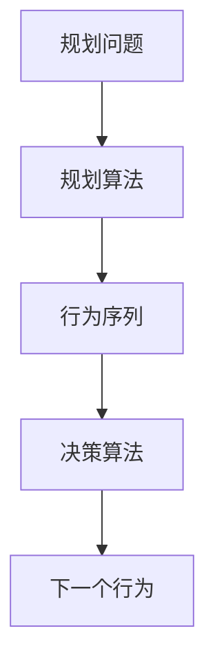
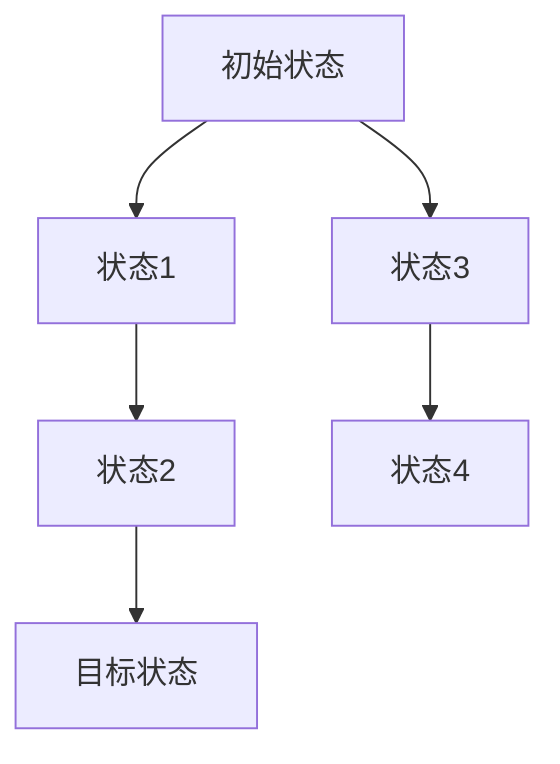

以下是标题为《【大模型应用开发 动手做AI Agent】Agent的规划和决策能力》的技术博客正文内容：

# 【大模型应用开发 动手做AI Agent】Agent的规划和决策能力

## 1. 背景介绍

### 1.1 问题的由来

在人工智能领域中,智能体(Agent)的规划和决策能力是一个核心且具有挑战性的研究课题。随着人工智能技术的快速发展,越来越多的智能系统需要具备自主规划行为并做出明智决策的能力,以便在复杂的环境中完成特定任务。

传统的规则based系统和基于知识库的系统在处理动态环境和不确定因素时存在局限性。因此,赋予智能体以强大的规划和决策能力,使其能够根据当前状态和目标制定行动计划并做出最优决策,成为了人工智能领域的一个重要研究方向。

### 1.2 研究现状

目前,规划和决策领域的研究主要集中在以下几个方面:

1. **经典规划算法**: 基于状态空间搜索的经典规划算法,如A*、STRIPS等,适用于确定性环境下的规划问题。

2. **启发式搜索算法**: 通过设计有效的启发式函数来指导搜索过程,提高规划效率,如IDA*、RBFS等算法。

3. **时序规划**: 处理具有时间约束和并发动作的规划问题,如时间窗口规划、时序约束满足问题等。

4. **随机化规划算法**: 针对具有不确定性和随机性的环境,采用蒙特卡罗树搜索、随机规划等算法。

5. **基于模型的规划**: 利用环境模型进行规划,如马尔可夫决策过程(MDP)、部分可观测马尔可夫决策过程(POMDP)等。

6. **基于学习的规划**: 通过机器学习技术从数据中学习规划策略,如强化学习、逆强化学习等方法。

7. **多智能体协作规划**: 研究多个智能体如何协调行为,共同完成复杂任务的规划问题。

### 1.3 研究意义

强大的规划和决策能力是赋予智能体自主性和智能性的关键。掌握了先进的规划和决策技术,可以使智能体在复杂动态环境中制定出高效、可靠的行为策略,从而广泛应用于多个领域,如机器人控制、自动驾驶、智能制造、游戏AI等。同时,规划和决策也是构建通用人工智能(AGI)系统的重要组成部分。

因此,深入研究规划和决策领域,不仅可以推动人工智能技术的发展,也有助于解决实际应用中的复杂决策问题,对于提高生产效率、优化资源利用、降低运营成本等具有重要意义。

### 1.4 本文结构

本文将全面介绍Agent的规划和决策能力的相关理论和技术。首先阐述规划和决策的核心概念及其内在联系;然后深入探讨经典规划算法和先进规划算法的原理和实现步骤;接着介绍相关的数学模型及公式推导;并通过实际项目实践,展示规划和决策算法在代码层面的具体实现;最后分析在不同领域的应用场景,总结发展趋势并指出面临的挑战。

## 2. 核心概念与联系

规划(Planning)和决策(Decision Making)是密切相关的两个核心概念。规划指的是为实现特定目标而制定行为序列的过程,而决策则是在给定状态下选择行为的过程。二者的关系可以概括为:规划产生行为序列,决策选择下一个行为。

规划算法的任务是基于问题描述(初始状态、目标状态、可执行动作等)搜索状态空间,生成从初始状态到目标状态的一系列动作序列,即行为序列或计划。而决策算法则根据当前状态和已生成的行为序列,选择下一个要执行的动作。

在实际应用中,规划和决策往往是交替进行的过程。智能体首先利用规划算法生成行为序列,然后执行其中的动作并观察环境的响应。如果执行过程中遇到意外情况或环境发生变化,智能体需要重新规划以适应新的状况。同时,在执行规划好的行为序列时,也需要根据当前状态作出针对性的决策。

值得注意的是,规划和决策都面临着复杂性和不确定性的挑战。规划算法需要在有限的时间和计算资源内搜索庞大的状态空间,而决策算法则需要处理来自感知系统的不完美观测和环境的随机性。因此,设计高效、鲁棒的规划和决策算法是人工智能领域的一个重要研究方向。

## 3. 核心算法原理与具体操作步骤

### 3.1 算法原理概述

规划和决策算法可以概括为三个主要步骤:

1. **建模(Modeling)**: 将实际问题形式化为适当的数学模型,如状态转移模型、奖赏模型等。

2. **计算(Computing)**: 在所建模型的框架下,设计高效的算法来求解最优行为序列或策略。

3. **执行(Executing)**: 将计算出的行为序列或策略应用到实际系统中,并根据反馈进行调整。

下面将分别介绍一些经典和先进的规划与决策算法的原理和实现细节。

### 3.2 算法步骤详解

#### 3.2.1 经典规划算法

**1. 状态空间搜索算法**

状态空间搜索是规划领域最基础和最广为人知的一类算法。它将规划问题建模为一个状态空间,其中包含初始状态、目标状态和一系列可执行的动作。算法的目标是找到从初始状态到目标状态的一系列动作序列。

**算法步骤**:

1) 构建状态空间图,包括状态节点和状态转移边。
2) 选择合适的搜索策略,如breadth-first、depth-first、greedy等。
3) 使用选定的搜索策略遍历状态空间图,直到找到目标状态。
4) 从目标状态回溯到初始状态,得到动作序列。

示例算法包括:

- **A*搜索**: 使用启发式函数估计距离目标状态的代价,以获得较优的搜索效率。
- **IDA*(Iterative Deepening A*)**: 通过逐步加深搜索深度来节省内存使用。

**2. 部分规划算法**

对于难以完全建模的复杂环境,部分规划算法通过分解问题,分阶段地生成部分计划。

**算法步骤**:

1) 将规划问题分解为多个子问题。
2) 针对每个子问题,使用经典规划算法生成部分计划。
3) 将各个部分计划组合,形成完整的解决方案。

示例算法:

- **分层规划(Hierarchical Planning)**: 按照抽象层次分解问题,自顶向下求解。
- **反应规划(Reactive Planning)**: 将规划过程分解为感知-规划-执行的循环。

#### 3.2.2 先进规划算法

**1. 基于采样的算法**

针对具有高维状态空间和不确定性的规划问题,基于采样的算法通过对状态空间进行智能采样来提高效率。

**算法步骤**:

1) 构建适当的状态空间模型。
2) 设计有效的采样策略,如基于启发式的采样、随机采样等。
3) 对采样得到的状态集合进行搜索,生成近似最优解。

示例算法:

- **RRT(Rapidly-exploring Random Tree)**: 通过增长随机树来快速探索状态空间。
- **MCTS(Monte-Carlo Tree Search)**: 基于蒙特卡罗采样构建搜索树,常用于游戏AI。

**2. 基于模型的算法**

基于模型的算法利用环境的数学模型来进行规划和决策,适用于具有不确定性的环境。

**算法步骤**:

1) 构建环境的数学模型,如MDP、POMDP等。
2) 设计求解算法,计算出最优策略或价值函数。
3) 根据计算结果执行相应的动作。

示例算法:

- **价值迭代(Value Iteration)**: 通过迭代更新状态价值函数来求解MDP。
- **POMDP离线求解器**: 使用点基值迭代等方法求解POMDP模型。

**3. 基于学习的算法**

基于学习的算法通过从数据或环境交互中学习,自动获取规划和决策策略。

**算法步骤**:

1) 收集环境数据或与环境进行交互。
2) 使用监督学习、强化学习等机器学习技术从数据中学习策略模型。
3) 将学习到的策略模型应用于实际规划和决策过程。

示例算法:

- **深度Q网络(Deep Q-Network)**: 使用深度神经网络来近似Q函数,用于强化学习。
- **AlphaGo**: 结合深度策略网络、价值网络和蒙特卡罗树搜索,用于围棋AI。

### 3.3 算法优缺点

不同类型的规划和决策算法各有优缺点,需要根据具体问题的特点选择合适的算法。

- **状态空间搜索算法**:
  - 优点:原理简单,可解释性强,适用于确定性环境。
  - 缺点:搜索空间庞大,可能遇到组合爆炸问题;难以处理不确定性。

- **基于采样的算法**:
  - 优点:通过采样降低了复杂度,可以处理高维状态空间和不确定性。
  - 缺点:解的质量取决于采样策略,可能得到次优解;缺乏理论保证。

- **基于模型的算法**:
  - 优点:建立在坚实的数学理论基础之上,可以给出最优解或有理论保证的近似解。
  - 缺点:求解过程复杂,模型构建困难,难以扩展到大规模问题。

- **基于学习的算法**:
  - 优点:无需事先建模,可以自动从数据中学习策略,处理复杂环境。
  - 缺点:需要大量数据,存在样本有效性和泛化性问题;缺乏可解释性。

### 3.4 算法应用领域

规划和决策算法在诸多领域都有广泛的应用:

- **机器人控制**: 为机器人系统生成运动规划和任务规划。
- **自动驾驶**: 决策车辆的导航路径、车道变换等行为。
- **智能制造**: 优化生产计划和调度。
- **游戏AI**: 为游戏AI角色制定战术策略。
- **自然语言处理**: 对话系统的对话策略学习。
- **网络优化**: 网络路由选择、资源分配等。

## 4. 数学模型和公式详细讲解与举例说明

### 4.1 数学模型构建

在规划和决策领域,常用的数学模型有:

1. **经典规划模型**
   - 状态空间模型:$S$表示状态集合,$A$表示动作集合,$\gamma$为状态转移函数。
   - STRIPS模型:使用预条件和效果来描述动作。

2. **马尔可夫决策过程(MDP)模型**
   - 由一个四元组$(S, A, P, R)$组成。
     - $S$为有限状态集合
     - $A$为有限动作集合
     - $P(s' \vert s, a)$为状态转移概率
     - $R(s, a, s')$为奖赏函数

3. **部分可观测马尔可夫决策过程(POMDP)模型**
   - 在MDP基础上增加观测集合$\Omega$和观测概率$O(o \vert a, s')$。
   - 用于建模部分可观测的环境。

4. **贝叶斯网络模型**
   - 使用有向无环图来表示随机变量之间的条件独立性。
   - 可用于规划中的概率推理